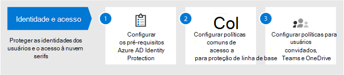
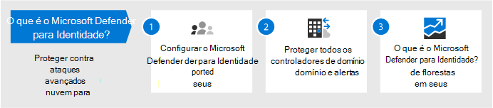
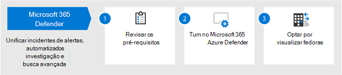
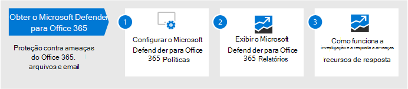
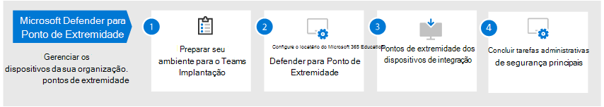
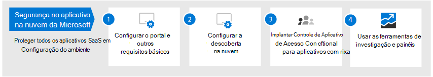
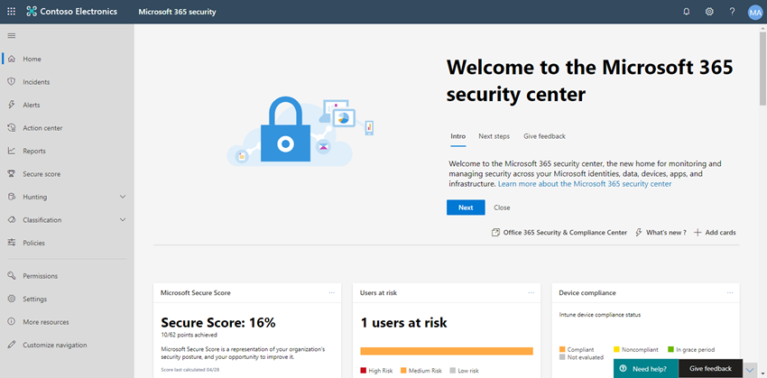

# Configurar recursos de proteção contra ameaças no Microsoft 365

Siga estas etapas para configurar a proteção contra ameaças no Microsoft 365.

## Etapa 1: Configurar a autenticação multifacional e políticas de Acesso Condicional

[A autenticação multifafatório](/azure/active-directory/authentication/concept-mfa-howitworks) (MFA) requer que os usuários verifiquem sua identidade com uma chamada telefônica ou um aplicativo autenticador. [As políticas de acesso condicional](/azure/active-directory/conditional-access/overview) definem determinados requisitos que devem ser atendidos para que os usuários acessem aplicativos e dados no Microsoft 365. As políticas de Acesso Condicional e MFA trabalham juntas para proteger sua organização. Por exemplo, se alguém tentar entrar em um dispositivo móvel usando uma conta que não está habilitada para MFA e uma política de Acesso Condicional exigir que o MFA entre em vigor, esse usuário será impedido de entrar.  

A Microsoft testou e recomenda um conjunto específico de Acesso Condicional e políticas relacionadas para proteger o acesso a todos os seus aplicativos SaaS, especialmente o Microsoft 365. As políticas são recomendadas para proteção de linha de base, sensível e altamente regulamentada. Comece implementando as políticas de proteção de linha de base. 

 
 [a dispositivos Consulte uma versão maior dessa imagem](https://github.com/MicrosoftDocs/microsoft-365-docs/raw/public/microsoft-365/media/microsoft-365-policies-configurations/Identity_device_access_policies_byplan.png)

### Para implementar a proteção de linha de base do Microsoft 365

 

1. [Configure os pré-requisitos, incluindo a Proteção de Identidade do Azure AD.](../security/office-365-security/identity-access-prerequisites.md)
2. [Configure políticas comuns de identidade e acesso a dispositivos](../security/office-365-security/identity-access-policies.md) para proteção de linha de base.
3. Configurar políticas para [usuários convidados,](../security/office-365-security/identity-access-policies-guest-access.md) [Microsoft Teams,](../security/office-365-security/teams-access-policies.md) [Exchange Online](../security/office-365-security/secure-email-recommended-policies.md)e [SharePoint Online e OneDrive](../security/office-365-security/sharepoint-file-access-policies.md).

### Mais informações sobre como proteger identidades

- [Configurações de identidade e acesso a dispositivos](../security/office-365-security/microsoft-365-policies-configurations.md)
- [Diretrizes de segurança para o Azure MFA](/azure/active-directory/authentication/multi-factor-authentication-security-best-practices)

## Etapa 2: Configurar o Microsoft Defender para Identidade

O [Microsoft Defender for Identity](/azure-advanced-threat-protection/what-is-atp) é uma solução de segurança baseada em nuvem que funciona com seus sinais locais dos Serviços de Domínio do Active Directory (AD DS) para identificar, detectar e investigar ameaças avançadas, identidades comprometidas e ações internas mal-intencionadas direcionadas à sua organização.

O Microsoft Defender for Identity habilita analistas de operações de segurança (SecOps) e profissionais de segurança com dificuldades para detectar ataques avançados em ambientes híbridos para:
- Monitore usuários, comportamento da entidade e atividades com análises baseadas em aprendizado.
- Proteger as identidades e credenciais do usuário armazenadas no Active Directory.
- Identificar e investigar atividades suspeitas do usuário e ataques avançados em toda a cadeia de extermínio.
- Fornecer informações claras sobre incidentes em uma linha do tempo simples para triagem rápida.

### Para configurar o Microsoft Defender para Identidade

 

1. [Configurar o Microsoft Defender para Identidade](/azure-advanced-threat-protection/install-atp-step1) para proteger seus ambientes principais.
2. Proteja todos os [controladores de domínio e](/azure-advanced-threat-protection/atp-sensor-monitoring) [florestas.](/azure-advanced-threat-protection/atp-multi-forest)
3. Integre [alertas do Microsoft Defender para Identidade](/azure-advanced-threat-protection/suspicious-activity-guide?tabs=external) ao fluxo de trabalho de operações de segurança (SecOps).

### Mais informações sobre o Microsoft Defender for Identity

- [O que é o Microsoft Defender para Identidade?](/azure-advanced-threat-protection/what-is-atp)
- [Vídeo: Introdução ao Microsoft Defender para Identidade](https://www.youtube.com/watch?reload=9&v=EGY2m8yU_KE)
- [Implantação do Microsoft Defender para Identidade](/azure-advanced-threat-protection/what-is-atp#whats-next)

## Etapa 3: Ativar o Microsoft 365 Defender

[O Microsoft 365 Defender](../security/defender/microsoft-365-defender.md) combina sinais e recursos de orquestração em uma única solução. Com a solução integrada do Microsoft 365 Defender, os profissionais de segurança podem unir os sinais de ameaça que cada um desses produtos recebe e determinar o escopo completo e o impacto da ameaça; como ele entrou no ambiente, o que ele é afetado e como ele está afetando a organização no momento. O Microsoft 365 Defender toma medidas automáticas para impedir ou interromper o ataque e a auto-recuperação de caixas de correio afetadas, pontos de extremidade e identidades de usuário.

O Microsoft 365 Defender unifica alertas, incidentes, investigação e resposta automatizadas e busca avançada entre cargas de trabalho (Microsoft Defender para Identidade, Microsoft Defender para Office 365, Microsoft Defender para Ponto de Extremidade e Microsoft Cloud App Security) em um único painel de experiência de vidro. Depois de configurar um ou mais de seus serviços do Defender para Office 365, a ligue o Microsoft 365 Defender. Novos recursos são adicionados continuamente ao Microsoft 365 Defender; considere optar por receber recursos de visualização.

### Para configurar o Microsoft 365 Defender

 

1. [Revise os pré-requisitos](../security/defender/prerequisites.md).
2. [A turn on Microsoft 365 Defender](../security/defender/m365d-enable.md).
3. [Optar por recursos de visualização](../security/defender/preview.md).

### Mais informações sobre o Microsoft 365 Defender

- [O que é o Microsoft 365 Defender?](../security/defender/microsoft-365-defender.md)
- [Novidades no Microsoft 365 Defender](../security/defender/whats-new.md)

## Etapa 4: Configurar o Microsoft Defender para Office 365

[O Microsoft Defender para Office 365](../security/office-365-security/defender-for-office-365.md) protege sua organização contra ameaças mal-intencionadas em mensagens de email (anexos e URLs), documentos do Office e ferramentas de colaboração. A tabela a seguir lista recursos e recursos do Microsoft Defender para Office 365 incluídos no Microsoft 365 E5:

|Recursos de configuração, proteção e detecção|Recursos de automação, investigação, correção e educação|
|---|---|
|[Anexos Seguros](../security/office-365-security/safe-attachments.md) [Links Seguros](../security/office-365-security/safe-links.md) [Documentos Seguros](../security/office-365-security/safe-docs.md) [ATP para SharePoint, OneDrive e Microsoft Teams](../security/office-365-security/mdo-for-spo-odb-and-teams.md) [Anti-phishing no Defender para proteção do Office 365](../security/office-365-security/set-up-anti-phishing-policies.md#Exclusive-settings-in-anti-phishing-policies-in Microsoft-Defender-for-Office-365)|[Controladores de Ameaças](../security/office-365-security/threat-trackers.md) [Explorador de Ameaças](../security/office-365-security/threat-explorer.md) [Resposta e investigação automatizadas](../security/office-365-security/office-365-air.md) [Simulador de Ataque](../security/office-365-security/attack-simulator.md)|
|

Com o Microsoft Defender para Office 365, as pessoas em toda a sua organização podem se comunicar e colaborar com mais segurança, com proteção contra ameaças para o conteúdo de email e documentos do Office.

### Para configurar o Microsoft Defender para Office 365

 

1. [Configure e configure suas políticas do Microsoft Defender para Office 365.](../security/office-365-security/protect-against-threats.md)
2. [Exibir e usar seus relatórios do Microsoft Defender para Office 365.](../security/office-365-security/view-reports-for-mdo.md)
3. [Use recursos de investigação e resposta contra ameaças.](../security/office-365-security/office-365-ti.md)

### Mais informações sobre o Microsoft Defender para Office 365

- [Visão geral do Microsoft Defender para Office 365](../security/office-365-security/defender-for-office-365.md)
- [Novidades no Microsoft Defender para Office 365](../security/office-365-security/whats-new-in-defender-for-office-365.md)

## Etapa 5: Configurar o Microsoft Defender para Ponto de Extremidade

[O Microsoft Defender for Endpoint](/windows/security/threat-protection) protege seus dispositivos de organizações (também chamados de pontos de extremidade) contra ameaças cibernéticas, ataques avançados e violações de dados. As equipes de segurança podem ser mais eficientes no gerenciamento da segurança de seus pontos de extremidade. As ferramentas robustas ajudam as organizações a manterem os sistemas nãopatados usando a detecção de vulnerabilidades com o gerenciamento de ameaças [e vulnerabilidades.](/windows/security/threat-protection/microsoft-defender-atp/next-gen-threat-and-vuln-mgt) Recursos automatizados de detecção e correção, como redução de superfície de [ataque,](/windows/security/threat-protection/microsoft-defender-atp/overview-attack-surface-reduction)proteção de próxima [geração,](/windows/security/threat-protection/windows-defender-antivirus/windows-defender-antivirus-in-windows-10)detecção e resposta do ponto de extremidade [e](/windows/security/threat-protection/microsoft-defender-atp/overview-endpoint-detection-response)investigação e [correção](/windows/security/threat-protection/microsoft-defender-atp/automated-investigations) automatizadas ajudam a manter seus dispositivos seguros contra malware. Além desses recursos, os clientes podem receber notificações proativas e consultar os Especialistas em Ameaças da Microsoft sob demanda, como parte do serviço de busca gerenciada de aceitação. 

### Configurar o Microsoft Defender para Ponto de Extremidade

 

1. [Prepare seu ambiente para a implantação do Microsoft Defender para o Ponto de Extremidade.](/windows/security/threat-protection/microsoft-defender-atp/deployment-phases)
2. [Configurar o Microsoft Defender para implantação do Ponto de Extremidade.](/windows/security/threat-protection/micros.oft-defender-atp/production-deployment)
3. [Onboard to the Microsoft Defender for Endpoint service](/windows/security/threat-protection/microsoft-defender-atp/onboarding).
4. [Conclua suas principais tarefas administrativas de segurança.](/windows/security/threat-protection/microsoft-defender-atp/tvm-security-recommendation)

### Mais informações sobre o Microsoft Defender para Ponto de Extremidade

- [Saiba mais sobre o Microsoft Defender para Ponto de Extremidade](/windows/security/threat-protection).
- [Experimente o laboratório de avaliação do Microsoft Defender para Ponto de Extremidade.](/windows/security/threat-protection/microsoft-defender-atp/evaluation-lab)

## Etapa 6: Configurar a Segurança do Microsoft Cloud App

[O Microsoft Cloud App Security é](/cloud-app-security) um Agente de Segurança do Cloud Access que oferece suporte a conjunto de log, conectores de API e proxy reverso. O Microsoft Cloud App Security fornece visibilidade avançada, controle sobre a viagem de dados e análises sofisticadas para identificar e combater ameaças cibernéticas em todos os seus serviços de nuvem. Com o Microsoft Cloud App Security, suas operações de segurança podem proteger as informações confidenciais da sua organização, proteger contra ameaças cibernéticas e anomalias, descobrir e monitorar aplicativos que acessam os dados da sua organização e ajudar a garantir que os aplicativos de nuvem da sua organização atendem aos requisitos de conformidade.

### Configurar o Microsoft Cloud App Security

 

1. [Configurar o portal e outros requisitos básicos.](/cloud-app-security/general-setup)
2. [Configurar a descoberta na nuvem](/cloud-app-security/set-up-cloud-discovery) e [conectar aplicativos](/cloud-app-security/enable-instant-visibility-protection-and-governance-actions-for-your-apps).
3. [Implantar o Controle de Aplicativo de Acesso Condicional para aplicativos em destaque.](/cloud-app-security/proxy-deployment-aad)
4. [Use as ferramentas de investigação e painéis](/cloud-app-security/investigate).

### Mais informações sobre o Microsoft Cloud App Security

- [Revise novos recursos e recursos.](/cloud-app-security/release-notes)
- [Saiba mais sobre o Microsoft Cloud App Security](/cloud-app-security/what-is-cloud-app-security).

## Etapa 7: monitorar o status e tomar ações

Depois de configurar e implantar seus serviços e recursos de proteção contra ameaças, a próxima etapa é monitorar detecções de ameaças e tomar as ações apropriadas. Seu melhor ponto de partida é o Centro de segurança do Microsoft 365 ( ), onde você pode monitorar e gerenciar a segurança em suas [https://security.microsoft.com](https://security.microsoft.com) identidades, dados, dispositivos, aplicativos e infraestrutura da Microsoft. 

O Centro de segurança do Microsoft 365 destina-se especificamente a administradores de segurança e equipes de operações de segurança. No centro de segurança do Microsoft 365, você pode:
- Exibir a saúde geral da segurança da sua organização com [a Pontuação Segura.](https://docs.microsoft.com/microsoft-365/security/defender/microsoft-secure-score)
- [Monitore e veja relatórios](https://docs.microsoft.com/microsoft-365/security/defender/monitoring-and-reporting) sobre o status de suas identidades, dados, dispositivos, aplicativos e infraestrutura.
- Conecte os pontos em alertas por [meio de incidentes.](https://docs.microsoft.com/microsoft-365/security/defender/incident-queue)
- Use [investigação e correção automatizadas para](https://docs.microsoft.com/microsoft-365/security/defender/mtp-autoir) lidar com ameaças.
- [Busca proativamente por ameaças](https://docs.microsoft.com/microsoft-365/security/defender/advanced-hunting-overview), como tentativas de invasão ou atividades de violação que afetam seus emails, dados, dispositivos e identidades.
- [Entenda as campanhas e](https://docs.microsoft.com/microsoft-365/security/defender/latest-attack-campaigns) técnicas de ataque mais recentes com análise de ameaças.
- ... e muito mais!

### Mais informações sobre o centro de segurança do Microsoft 365

- Começar com o centro de segurança do [Microsoft 365.](../security/defender/overview-security-center.md)
- [Monitorar e exibir relatórios](../security/defender/overview-security-center.md).
- [Consulte os portais de segurança no Microsoft 365](../security/defender/portals.md).

## Etapa 8: treinar usuários

Os usuários de treinamento podem salvar seus usuários e a equipe de operações de segurança por muito tempo e frustração. Os usuários experientes têm menos probabilidade de abrir anexos ou clicar em links em mensagens de email questionáveis, e é mais provável que eles evitem sites suspeitos. 

O Manual de Campanha de [Segurança](https://go.microsoft.com/fwlink/?linkid=2015598&amp;clcid=0x409) Cibernética da Escola De Harvard Kennedy fornece excelentes diretrizes sobre como estabelecer uma forte cultura de reconhecimento de segurança em sua organização, incluindo treinamento para que os usuários identifiquem ataques de phishing. 

O Microsoft 365 fornece os seguintes recursos para ajudar a informar os usuários em sua organização:

|Conceito  |Recursos  |
|---------|---------|
|Microsoft 365     |[Caminhos de aprendizado personalizáveis](/office365/customlearning/) 
Esses recursos podem ajudá-lo a montar o treinamento para usuários finais em sua organização        |
|Segurança do Microsoft 365 |[Módulo de aprendizagem: proteja sua organização com segurança interna e inteligente do Microsoft 365](/learn/modules/security-with-microsoft-365) 
Este módulo permite descrever como os recursos de segurança do Microsoft 365 funcionam em conjunto e articular os benefícios desses recursos de segurança. |
|Multi-factor Authentication     | [Verificação em duas etapas: Qual é a página de verificação adicional?](/azure/active-directory/user-help/multi-factor-authentication-end-user-first-time) 
Este artigo ajuda os usuários finais a entender o que é a autenticação multifatar e por que ela está sendo usada em sua organização.    |

Além dessas orientações, a Microsoft recomenda que seus usuários tomem as ações descritas neste artigo: Proteger sua conta e dispositivos [contra hackers e malware.](https://support.office.com/article/066d6216-a56b-4f90-9af3-b3a1e9a327d6.aspx) Essas ações incluem:
- Usando senhas fortes
- Protegendo dispositivos 
- Habilitando recursos de segurança em computadores Com Windows 10 e Mac (para dispositivos não operacionais)
    
A Microsoft também recomenda que os usuários protejam suas contas de email pessoais, seguindo as ações recomendadas nos seguintes artigos:
- [Ajudar a proteger sua conta Outlook.com email](https://support.microsoft.com/office/help-protect-your-outlook-com-email-account-a4f20fc5-4307-4ece-8231-6d4d4bd8a9ba)
- [Proteger sua conta do Gmail com verificação em duas etapas](https://go.microsoft.com/fwlink/?linkid=2015688&amp;clcid=0x409)
