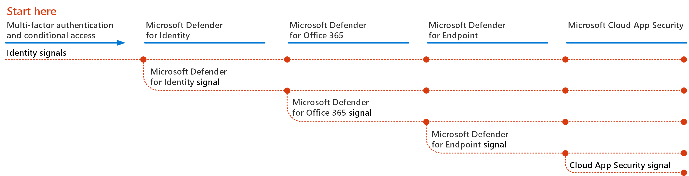

# Implantar recursos de proteção contra ameaças no Microsoft 365

[Malware](/windows/security/threat-protection/intelligence/understanding-malware)e ataques cibernéticos sofisticados, como ameaças [sem arquivo,](/windows/security/threat-protection/intelligence/fileless-threats)são uma ocorrência comum. As empresas precisam proteger a si mesmos e seus clientes com recursos eficazes de segurança de IT. Os ataques cibernéticos podem causar grandes problemas para sua organização, desde perda de confiança até problemas financeiros, tempo de inatividade que ameaçam os negócios e muito mais. Proteger contra ameaças é importante, mas pode ser um desafio determinar onde concentrar o tempo, o esforço e os recursos da sua organização. 

As soluções de segurança da Microsoft são integradas aos nossos produtos e serviços. Os recursos de automação e aprendizado de máquina reduzem a carga em suas equipes de segurança para garantir que os itens certos sejam abordados. E a força das soluções de segurança da Microsoft é construída em trilhões de sinais que processam todos os dias em nosso [Gráfico de Segurança Inteligente.](https://cloud-platform-assets.azurewebsites.net/intelligent-security-graph) As soluções de segurança do Microsoft 365 incluem o [Microsoft 365 Defender](../security/defender/microsoft-365-defender.md), uma solução que reúne sinais em seus emails, dados, dispositivos e identidades para pintar uma imagem de ameaças avançadas contra sua organização.

Assista a esse vídeo para obter uma visão geral do processo de implementação.
  
> [!VIDEO https://www.microsoft.com/videoplayer/embed/RE4vsI7]

Use este artigo como um guia para implementar sua solução de proteção contra ameaças.

## Proteção contra ameaças no Microsoft 365 E5

[O Microsoft 365 E5](https://www.microsoft.com/microsoft-365/enterprise-e5-business-software?activetab=pivot%3aoverviewtab) permite proteger sua organização com inteligência adaptável e integrado. Com os recursos de proteção contra ameaças no Microsoft 365 E5, você pode detectar e investigar ameaças avançadas, identidades comprometidas e ações mal-intencionadas em seu ambiente local e na nuvem.

No Microsoft 365 E5, os recursos de proteção contra ameaças são integrados por padrão. Os sinais de cada recurso adicionam força à capacidade geral de detectar e responder a ameaças. O conjunto combinado de recursos oferece a melhor proteção para organizações, especialmente organizações multinacionais, em comparação com a execução de produtos que não são da Microsoft. A imagem a seguir mostra os serviços e recursos de proteção contra ameaças no Microsoft 365 E5 descritos neste artigo.

Assim que você implantar qualquer um dos recursos do Defender para Office 365, poderá ativar o Microsoft 365 Defender, que reúne os sinais e os dados em um só lugar. 

A ilustração a seguir mostra um caminho recomendado para implantar esses recursos individuais. 

|Solução/recursos  |Descrição  |
|---------|---------|
|Autenticação multifacional e Acesso Condicional     |Proteger contra identidades e dispositivos comprometidos. Comece com essa proteção porque ela é fundamental. A configuração recomendada nesta orientação inclui a Proteção de Identidade do Azure AD como um pré-requisito.     |
|Microsoft Defender para Identidade?     |  Uma solução de segurança baseada em nuvem que aproveita seus sinais locais do AD DS (Serviços de Domínio do Active Directory) para identificar, detectar e investigar ameaças avançadas, identidades comprometidas e ações internas mal-intencionadas direcionadas à sua organização. Concentre-se no Microsoft Defender for Identity em seguida porque protege sua infraestrutura local e de nuvem, não tem dependências ou pré-requisitos e pode fornecer benefícios imediatos de segurança. | 
|Microsoft Defender para Office 365     | Protege sua organização contra ameaças mal-intencionadas colocadas por mensagens de email, links (URLs) e ferramentas de colaboração. Proteções para malware, phishing, spoofing e outros tipos de ataque. A configuração do Microsoft Defender para Office 365 é recomendada em seguida, pois alterar o controle, migrar configurações do sistema em questão e outras considerações pode levar mais tempo para implantar.   Observação: configure os recursos de proteção contra ameaças incluídos em todas as assinaturas do Office 365 (Proteção do Exchange Online).       |
|Microsoft Defender para Ponto de Extremidade    | Uma plataforma de proteção de ponto de extremidade que ajuda a evitar, detectar, investigar e responder a ameaças avançadas.  O Defender para Ponto de Extremidade pode levar algum tempo para implantar, mas a configuração pode ser feita em paralelo com outros recursos.   |
|Microsoft Cloud App Security     |   Um agente de segurança de acesso à nuvem para descoberta, investigação e governança. Você pode habilitar o Microsoft Cloud App Security mais cedo para começar a coletar dados e insights. Implementar informações e outra proteção direcionada em seus aplicativos SaaS envolve planejamento e pode levar mais tempo.       | 

> [!TIP]
> Organizações com várias equipes de segurança podem implementar esses recursos em paralelo.

## Implantar sua solução de proteção contra ameaças

Para garantir que sua organização tenha a melhor proteção possível, configurar e implantar sua solução de segurança para incluir as seguintes etapas:

1. [Configurar a autenticação multifacional e políticas de Acesso Condicional](deploy-threat-protection-configure.md#step-1-set-up-multi-factor-authentication-and-conditional-access-policies)
2. [Configurar o Microsoft Defender para Identidade](deploy-threat-protection-configure.md#step-2-configure-microsoft-defender-for-identity)
3. [Ativar o Microsoft 365 Defender](deploy-threat-protection-configure.md#step-3-turn-on-microsoft-365-defender)
4. [Configurar o Defender para Office 365](deploy-threat-protection-configure.md#step-4-configure-microsoft-defender-for-office-365)
5. [Configurar o Microsoft Defender para Ponto de Extremidade](deploy-threat-protection-configure.md#step-5-configure-microsoft-defender-for-endpoint)
6. [Configurar o Microsoft Cloud App Security](deploy-threat-protection-configure.md#step-6-configure-microsoft-cloud-app-security)
7. [Monitorar status e tomar ações](deploy-threat-protection-configure.md#step-7-monitor-status-and-take-actions)
8. [Treinar usuários](deploy-threat-protection-configure.md#step-8-train-users)

Seus recursos de proteção contra ameaças podem ser configurados em paralelo, portanto, se você tiver várias equipes de segurança de rede responsáveis por serviços diferentes, eles poderão configurar os recursos de proteção da sua organização ao mesmo tempo. O diagrama a seguir ilustra o processo de alto nível para implantar recursos de proteção contra ameaças. 

