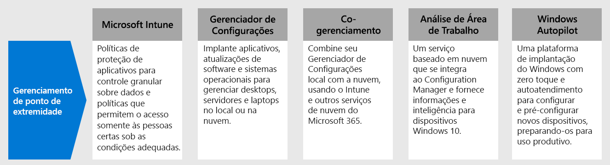

# Etapa 4. Implantar o gerenciamento de pontos de extremidade em seus dispositivos, PCs e outros pontos de extremidade

Com funcionários remotos, é necessário oferecer suporte a um número crescente de dispositivos pessoais. O gerenciamento de pontos de extremidade é uma abordagem de segurança baseada em políticas que exige que os dispositivos obedeçam a critérios específicos antes de receberem acesso aos recursos. O Microsoft Endpoint Manager oferece um ambiente de trabalho e recursos de gerenciamento modernos para manter seus dados seguros na nuvem e no local. 

O Endpoint Manager fornece serviços e ferramentas para gerenciar dispositivos móveis, computadores desktop, máquinas virtuais, dispositivos incorporados e servidores combinando os seguintes serviços que você já deve conhecer e estar usando.

## Microsoft Intune

O Microsoft Intune é um serviço baseado em nuvem com foco no gerenciamento de dispositivos móveis (MDM) e no gerenciamento de aplicativos móveis (MAM) que vem incluído no Microsoft 365. 

- **MDM:** Para os dispositivos pertencentes à organização, você pode exercer um controle total, que inclui as configurações, os recursos e a segurança. Os dispositivos serão “matriculados” no Intune sempre que utilizarem políticas do Intune referentes a regras e configurações. Por exemplo, você pode configurar exigências de senha e PIN, criar uma conexão de VPN, configurar a proteção contra ameaças e muito mais.

- **MAM:** As pessoas que trabalham remotamente podem não querer que você tenha um controle total de seus dispositivos pessoais, também conhecidos como dispositivos “BYOD”, do inglês “traga seu próprio dispositivo”. Você pode oferecer opções aos seus funcionários remotos e ainda assim proteger a sua organização. Por exemplo, os funcionários remotos podem matricular seus dispositivos se desejarem ter acesso total aos recursos da sua organização. Alternativamente, se esses usuários desejarem acesso somente ao email ou ao Microsoft Teams,poderão optar por aplicar políticas de proteção de aplicativos que exigem uma autenticação multifator (MFA) para o uso desses aplicativos.

Para obter mais informações, confira a [visão geral do Microsoft Intune](https://docs.microsoft.com/intune/fundamentals/what-is-intune).

## Gerenciador de Configurações

O Gerenciador de Configurações é uma solução de gerenciamento local para gerenciar desktops, servidores e laptops que estão na sua rede ou baseada na Internet. Use o Gerenciador de Configurações para implantar aplicativos, atualizações de software e sistemas operacionais. Você também pode monitorar a conformidade, consultar e agir sobre os clientes em tempo real e muito mais. Você pode habilitá-lo na nuvem para integrar-se ao Intune, Azure AD, Microsoft Defender ATP e outros serviços de nuvem. 

Para obter mais informações, confira a [visão geral do Gerenciador de Configurações](https://docs.microsoft.com/mem/configmgr/core/understand/introduction).

## Co-gerenciamento

O co-gerenciamento combina seu investimento existente no Gerenciador de Configurações no local com a nuvem, usando o Intune e outros serviços de nuvem do Microsoft 365. Você decide se a autoridade de gerenciamento para diferentes cargas de trabalho será o Gerenciador de Configurações ou o Intune. 

O gerenciamento compartilhado utiliza recursos na nuvem baseados no Intune, entre eles o acesso condicional e a aplicação da conformidade de dispositivos.  Algumas tarefas são mantidas no local e outras são executadas na nuvem.

Para mais informações, confira esta [visão geral do co-gerenciamento](https://docs.microsoft.com/mem/configmgr/comanage/overview).

## Análise de Área de Trabalho

A Análise de Área de Trabalho é um serviço baseado em nuvem que se integra ao Gerenciador de Configurações e fornece informações e inteligência para que você possa tomar decisões informadas sobre seus clientes Windows. Ela combina dados da sua organização com dados agregados de milhões de dispositivos conectados aos serviços de nuvem da Microsoft. 

Com a Análise de Área de Trabalho, você pode:

- Criar um inventário das aplicações executadas na sua organização.
- Avaliar a compatibilidade de aplicativos com as atualizações mais recentes dos recursos do Windows 10.
- Identificar problemas de compatibilidade e receber sugestões de atenuação baseadas em insights de dados habilitados para a nuvem.
- Criar grupos piloto que representem todo o aplicativo e o estado do driver em um conjunto mínimo de dispositivos.
- Implantar o Windows 10 em dispositivos piloto e gerenciados em ambiente de produção.

Para obter mais informações, confira a [visão geral da Análise de Área de Trabalho](https://docs.microsoft.com/mem/configmgr/desktop-analytics/overview).

## Windows Autopilot

O Windows Autopilot é uma plataforma de implantação do Windows de autoatendimento e sem intervenções. Inclui um conjunto de tecnologias usadas para instalar e pré-configurar novos dispositivos, preparando-os para uso produtivo. Você também pode usar o Windows Autopilot para redefinir, redirecionar e recuperar dispositivos. 

O Windows Autopilot permite que o departamento de Ti pré-configure dispositivos com pouca ou nenhuma infraestrutura para gerenciar, por meio de um processo simples e fácil. 

- Da perspectiva do usuário, são necessárias apenas algumas operações simples para deixar seu dispositivo pronto para uso. 
- Da perspectiva do profissional de TI, a única interação necessária do usuário final é conectar-se a uma rede e verificar suas credenciais.

Para obter mais informações, confira a [visão geral do Windows Autopilot](https://docs.microsoft.com/windows/deployment/windows-autopilot/windows-autopilot).

## Recursos técnicos de administração para o gerenciamento de pontos de extremidade

- [Vídeo da parte 3 sobre o gerenciamento de dispositivos Windows 10 para funcionários remotos](https://resources.techcommunity.microsoft.com/enabling-remote-work/#security)
- [Vídeo da parte 5 sobre o gerenciamento de áreas de trabalho e navegadores do usuário para funcionários remotos](https://resources.techcommunity.microsoft.com/enabling-remote-work/#security)
- [Implantar uma infraestrutura de mobilidade para o Microsoft 365](https://docs.microsoft.com/microsoft-365/enterprise/mobility-infrastructure)
- [Como registrar diferentes tipos de dispositivos para gerenciamento de dispositivos móveis (MDM)](https://docs.microsoft.com/mem/intune/enrollment/device-enrollment)
- [Como educar seus usuários finais sobre o Microsoft Intune](https://docs.microsoft.com/mem/intune/fundamentals/end-user-educate)
 
## Resultados da Etapa 3

Você está usando o conjunto de recursos e funcionalidades do Endpoint Manager para gerenciar dispositivos móveis, computadores desktop, máquinas virtuais, dispositivos incorporados e servidores.

## Próxima etapa

Prossiga para a [Etapa 5](empower-people-to-work-remotely-teams-productivity-apps.md) para fazer com que seus funcionários remotos usem os aplicativos de produtividade do Microsoft 365, como o Microsoft Teams.
