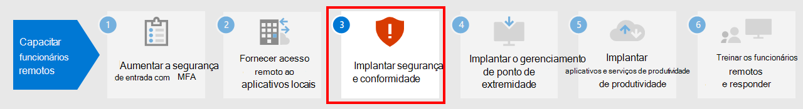

# Etapa 2.Step 2. Fornecer acesso remoto a aplicativos e serviços locaisProvide remote access to on-premises apps and services

Se sua organização usa uma solução VPN de acesso remoto, geralmente com servidores VPN na borda da rede e clientes VPN instalados nos dispositivos dos usuários, os usuários podem usar conexões VPN de acesso remoto para acessar aplicativos e servidores locais.If your organization uses a remote access VPN solution, typically with VPN servers on the edge of your network and VPN clients installed on your users' devices, your users can use remote access VPN connections to access on-premises apps and servers. Mas pode ser necessário otimizar o tráfego para os serviços baseados na nuvem do Microsoft 365.But you may need to optimize traffic to Microsoft 365 cloud-based services.

Se os seus usuários não usarem uma solução VPN, você poderá usar o Proxy de Aplicativo do Microsoft Azure Active Directory e a VPN Ponto a Site (P2S) do Azure para fornecer acesso, dependendo de todos os aplicativos serem baseados na Web.If your users do not use a VPN solution, you can use Azure Active Directory (Azure AD) Application Proxy and Azure Point-to-Site (P2S) VPN to provide access, depending on whether all your apps are web-based.

Aqui estão as configurações primárias para o acesso remoto:Here are the primary configurations for remote access:

- Você já está usando uma solução VPN de acesso remoto.You are already using a remote access VPN solution.
- Você não está utilizando uma solução VPN de acesso remoto e deseja que seus funcionários remotos utilizem seus computadores pessoais.You are not using a remote access VPN solution and you want your remote workers to use their personal computers.
- Você não está usando uma solução VPN de acesso remoto, você possui identidade híbrida e precisa de acesso remoto apenas a aplicativos locais baseados na Web.You are not using a remote access VPN solution, you have hybrid identity, and you need remote access only to on-premises web-based apps.
- Você não está usando uma solução VPN de acesso remoto e precisa acessar aplicativos locais, alguns dos quais não são baseados na Web.You are not using a remote access VPN solution and you need access to on-premises apps, some of which are not web-based.

Confira este fluxograma para obter as opções de configuração de acesso remoto abordadas neste artigo.See this flowchart for the remote access configuration options discussed in this article.

Com as conexões de acesso remoto, você também pode usar a [Área de Trabalho Remota](https://support.microsoft.com/help/4028379/windows-10-how-to-use-remote-desktop) para conectar os usuários a um computador local.With remote access connections, you can also use [Remote Desktop](https://support.microsoft.com/help/4028379/windows-10-how-to-use-remote-desktop) to connect your users to an on-premises PC. Por exemplo, um trabalhador remoto pode utilizar a Área de Trabalho Remota para se conectar ao Computador do seu escritório a partir o seu dispositivo Windows, iOS ou Android.For example, a remote worker can use Remote Desktop to connect to the PC in their office from their Windows, iOS, or Android device. Uma vez conectados remotamente, eles podem usá-la como se estivessem sentados na frente dela.Once they are remotely connected, they can use it as if they were sitting in front of it.

## Otimize o desempenho dos clientes VPN de acesso remoto aos serviços de nuvem do Microsoft 365Optimize performance for remote access VPN clients to Microsoft 365 cloud services

Se os seus funcionários remotos estiverem usando um cliente VPN tradicional para obter acesso remoto à rede da organização, verifique se o cliente VPN possui suporte para túnel dividido.If your remote workers are using a traditional VPN client to obtain remote access to your organization network, verify that the VPN client has split tunneling support.

Sem o túnel dividido, todo o seu tráfego de trabalho remoto é enviado pela conexão VPN, onde deve ser encaminhado para os dispositivos de borda da sua organização, processado e enviado na Internet.Without split tunneling, all of your remote work traffic gets sent across the VPN connection, where it must be forwarded to your organization’s edge devices, get processed, and then sent on the Internet.

O tráfego do Microsoft 365 deve seguir uma rota indireta através da sua organização, que pode ser encaminhada para um ponto de entrada da rede Microsoft longe da localização física do cliente VPN.Microsoft 365 traffic must take an indirect route through your organization, which could be forwarded to a Microsoft network entry point far away from the VPN client’s physical location. Esse caminho indireto adiciona latência ao tráfego da rede e diminui o desempenho geral.This indirect path adds latency to the network traffic and decreases overall performance. 

Com o túnel dividido, você pode configurar seu cliente VPN para impedir que tipos específicos de tráfego sejam enviados à rede da organização pela conexão VPN.With split tunneling, you can configure your VPN client to exclude specific types of traffic from being sent over the VPN connection to the organization network.

Para otimizar o acesso aos recursos de nuvem do Microsoft 365, configure seus clientes VPN de túnel dividido para excluir o tráfego nos pontos de extremidade do Microsoft 365 da categoria **Otimizar** pela conexão VPN.To optimize access to Microsoft 365 cloud resources, configure your split tunneling VPN clients to exclude traffic to the **Optimize** category Microsoft 365 endpoints over the VPN connection. Para obter mais informações, confira [Categorias de ponto de extremidade do Office 365](https://docs.microsoft.com/microsoft-365/enterprise/microsoft-365-network-connectivity-principles#new-office-365-endpoint-categories).For more information, see [Office 365 endpoint categories](https://docs.microsoft.com/microsoft-365/enterprise/microsoft-365-network-connectivity-principles#new-office-365-endpoint-categories). Consulte [esta lista](https://docs.microsoft.com/microsoft-365/enterprise/urls-and-ip-address-ranges) de terminais da categoria Otimizar.See [this list](https://docs.microsoft.com/microsoft-365/enterprise/urls-and-ip-address-ranges) of Optimize category endpoints.

Aqui está o fluxo de tráfego resultante, no qual a maior parte do tráfego para aplicativos em nuvem do Microsoft 365 ignora a conexão VPN.Here is the resulting traffic flow, in which most of the traffic to Microsoft 365 cloud apps bypass the VPN connection.

Isso permite que o cliente VPN envie e receba o tráfego crucial do serviço em nuvem do Microsoft 365 diretamente pela Internet e para o ponto de entrada mais próximo da rede Microsoft.This allows the VPN client to send and receive crucial Microsoft 365 cloud service traffic directly over the Internet and to the nearest entry point into the Microsoft network.

Para obter mais informações e orientações, confira [Otimizar a conectividade do Office 365 para usuários remotos usando o túnel dividido da VPN](https://docs.microsoft.com/microsoft-365/enterprise/microsoft-365-vpn-split-tunnel??).For more information and guidance, see [Optimize Office 365 connectivity for remote users using VPN split tunneling](https://docs.microsoft.com/microsoft-365/enterprise/microsoft-365-vpn-split-tunnel??).

## Implantar o acesso remoto quando todos os seus aplicativos são aplicativos Web e você tem identidade híbridaDeploy remote access when all your apps are web apps and you have hybrid identity

Se seus trabalhadores remotos não estiverem utilizando um cliente VPN tradicional e suas contas de usuário e grupos locais estiverem sincronizados com o Azure AD, você poderá utilizar o Aplicativo de Proxy do Microsoft Azure AD para fornecer acesso remoto seguro para aplicativos baseados na web hospedados em servidores locais.If your remote workers are not using a traditional VPN client and your on-premises user accounts and groups are synchronized with Azure AD, you can use Azure AD Application Proxy to provide secure remote access for web-based applications hosted on on-premises servers. Os aplicativos baseados na web incluem sites do SharePoint Server, servidores Outlook Web Access ou qualquer outro aplicativo da linha de negócios baseado na web.Web-based applications include SharePoint Server sites, Outlook Web Access servers, or any other web-based line of business applications. 

Estes são os componentes do Proxy de Aplicativo do Microsoft Azure Active Directory.Here are the components of Azure AD Application Proxy.

Para obter mais informações, confira esta [visão geral do Proxy de Aplicativo do Microsoft Azure Active Directory](https://docs.microsoft.com/azure/active-directory/manage-apps/application-proxy).For more information, see this [overview of Azure AD Application Proxy](https://docs.microsoft.com/azure/active-directory/manage-apps/application-proxy).

>[!Note]
>O Proxy do aplicativo Azure Active Directory não está incluído na assinatura do Microsoft 365.Azure AD Application Proxy is not included with a Microsoft 365 subscription. Você deve pagar por uso com uma assinatura separada do Azure.You must pay for usage with a separate Azure subscription.
>

## Implantar o acesso remoto quando nem todos os seus aplicativos são aplicativos WebDeploy remote access when not all your apps are web apps

Se seus trabalhadores remotos não estiverem utilizando um cliente VPN tradicional e você tiver aplicativos que não sejam baseados na web, você pode utilizar uma VPN ponto a site (P2S) do Azure.If your remote workers are not using a traditional VPN client and you have apps that are not web-based, you can use an Azure Point-to-Site (P2S) VPN.

Uma conexão VPN P2S cria uma conexão segura do dispositivo de um trabalhador remoto à rede da sua organização por meio de uma rede virtual do Azure.A P2S VPN connection creates a secure connection from a remote worker’s device to your organization network through an Azure virtual network. 

Para mais informações, confira esta [visão geral da VPN P2S](https://docs.microsoft.com/azure/vpn-gateway/point-to-site-about).For more information, see this [overview of P2S VPN](https://docs.microsoft.com/azure/vpn-gateway/point-to-site-about).

>[!Note]
>O Azure P2P VPN não está incluído na assinatura do Microsoft 365.Azure P2S VPN is not included with a Microsoft 365 subscription. Você deve pagar por uso com uma assinatura separada do Azure.You must pay for usage with a separate Azure subscription.
>

## Implantar a Área de Trabalho Virtual do Windows para fornecer acesso remoto a trabalhadores remotos usando dispositivos pessoaisDeploy Windows Virtual Desktop to provide remote access for remote workers using personal devices 

Para oferecer suporte a trabalhadores remotos que podem usar somente dispositivos pessoais e não gerenciados, use a Área de Trabalho Virtual do Windows no Azure para criar e alocar áreas de trabalho virtuais para seus usuários usarem em casa.To support remote workers who can only use their personal and unmanaged devices, use Windows Virtual Desktop in Azure to create and allocate virtual desktops for your users to use from home. Os computadores virtualizados podem funcionar da mesma forma que os computadores conectados à sua organização.Virtualized PCs can act just like PCs connected to your organization network.

Para obter mais informações, consulte esta [visão geral da Área de Trabalho Virtual do Windows](https://docs.microsoft.com/azure/virtual-desktop/overview).For more information, see this [overview of Windows Virtual Desktop](https://docs.microsoft.com/azure/virtual-desktop/overview). 

>[!Note]
>A Área de Trabalho Virtual do Windows não está incluída na assinatura do Microsoft 365.Windows Virtual Desktop is not included with a Microsoft 365 subscription. Você deve pagar por uso com uma assinatura separada do Azure.You must pay for usage with a separate Azure subscription.
>

## Proteja seus serviços de Área de trabalho remota com o Gateway dos serviços de área de trabalho remota.Protect your Remote Desktop Services connections with the Remote Desktop Services Gateway

Se você estiver usando os Serviços de Área de Trabalho Remota da Microsoft (RDS) para permitir que os funcionários se conectem a computadores baseados no Windows em sua rede local, você deve usar um Gateway dos serviços de área de trabalho remota da Microsoft em sua rede Microsoft Edge.If you are using Remote Desktop Services (RDS) to allow employees to connect into Windows-based computers on your on-premises network, you should use a Microsoft Remote Desktop Services gateway in your edge network. O gateway usa a Segurança da Camada de Transporte (TLS) para criptografar o tráfego e impede que o computador local que hospeda o RDS seja exposto diretamente à Internet.The gateway uses Transport Layer Security (TLS) to encrypt traffic and prevents the on-premises computer hosting RDS from being directly exposed to the Internet.

Confira [este artigo](https://www.microsoft.com/security/blog/2020/04/16/security-guidance-remote-desktop-adoption/) para saber mais.See [this article](https://www.microsoft.com/security/blog/2020/04/16/security-guidance-remote-desktop-adoption/) for more information.

## Recursos técnicos do administrador para acesso remotoAdmin technical resources for remote access

- [Como otimizar rapidamente o tráfego do Office 365 para funcionários remotos e reduzir a carga em sua infraestruturaHow to quickly optimize Office 365 traffic for remote staff & reduce the load on your infrastructure](https://techcommunity.microsoft.com/t5/office-365-blog/how-to-quickly-optimize-office-365-traffic-for-remote-staff-amp/ba-p/1214571)
- [Otimize a conectividade do Office 365 dos usuários remotos usando o túnel dividido da VPNOptimize Office 365 connectivity for remote users using VPN split tunneling](https://docs.microsoft.com/microsoft-365/enterprise/microsoft-365-vpn-split-tunnel?)

## Resultados da Etapa 2Results of Step 2

Após a implantação de uma solução de acesso remoto para seus trabalhadores remotos:After deployment of a remote access solution for your remote workers:

| Configuração de acesso remotoRemote access configuration | ResultadosResults |
|:-------|:-----|
| Existe uma solução VPN de acesso remoto instaladaA remote access VPN solution is in place | Você configurou seu cliente VPN de acesso remoto para o túnel dividido e para a categoria Otimizar dos pontos de extremidade do Microsoft 365.You have configured your remote access VPN client for split tunneling and for the Optimize category of Microsoft 365 endpoints. |
| Não existe uma solução VPN de acesso remoto instalada e você precisa de acesso remoto somente a aplicativos locais baseados na WebNo remote access VPN solution and you need remote access only to on-premises web-based apps | Você configurou o Proxy de Aplicativo do Azure.You have configured Azure Application Proxy. |
| Não existe uma solução VPN de acesso remoto instalada e você precisa acessar aplicativos locais, alguns dos quais não são baseados na WebNo remote access VPN solution and you need access to on-premises apps, some of which are not web-based | Você configurou a VPN P2S do Azure.You have configured Azure P2S VPN. |
| Trabalhadores remotos estão usando seus dispositivos pessoais em casaRemote workers are using their personal devices from home | Você configurou a Área de Trabalho Virtual do Windows.You have configured Windows Virtual Desktop. |
| Os funcionários remotos estão usando as conexões de RDS para os sistemas locaisRemote workers are using RDS connections to on-premises systems | Você implantou um Gateway dos Serviços de área de trabalho remota na rede Microsoft Edge.You have deployed a Remote Desktop Services gateway in your edge network. |
|||

## Próxima etapaNext step

Prossiga com a [etapa 3](empower-people-to-work-remotely-security-compliance.md) para implantar o Centro de segurança do Microsoft 365 e serviços de conformidade para proteger seus aplicativos, dados e dispositivos.Continue with [Step 3](empower-people-to-work-remotely-security-compliance.md) to deploy Microsoft 365 security and compliance services to protect your apps, data, and devices.

