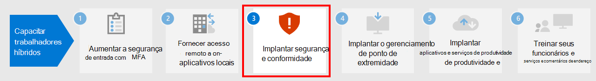

# Etapa 2. Fornecer acesso remoto a aplicativos e serviços locais

Se sua organização usa uma solução VPN de acesso remoto, geralmente com servidores VPN na borda da rede e clientes VPN instalados nos dispositivos dos usuários, os usuários podem usar conexões VPN de acesso remoto para acessar aplicativos e servidores locais. Mas pode ser necessário otimizar o tráfego para os serviços baseados na nuvem do Microsoft 365.

Se os seus usuários não usarem uma solução VPN, você poderá usar o Proxy de Aplicativo do Microsoft Azure Active Directory e a VPN Ponto a Site (P2S) do Azure para fornecer acesso, dependendo de todos os aplicativos serem baseados na Web.

Aqui estão as configurações primárias para o acesso remoto:

- Você já está usando uma solução VPN de acesso remoto.
- Você não está utilizando uma solução VPN de acesso remoto e deseja que seus funcionários remotos utilizem seus computadores pessoais.
- Você não está usando uma solução VPN de acesso remoto, você possui identidade híbrida e precisa de acesso remoto apenas a aplicativos locais baseados na Web.
- Você não está usando uma solução VPN de acesso remoto e precisa acessar aplicativos locais, alguns dos quais não são baseados na Web.

Confira este fluxograma para obter as opções de configuração de acesso remoto abordadas neste artigo.

Com as conexões de acesso remoto, você também pode usar a [Área de Trabalho Remota](https://support.microsoft.com/help/4028379/windows-10-how-to-use-remote-desktop) para conectar os usuários a um computador local. Por exemplo, um trabalhador remoto pode utilizar a Área de Trabalho Remota para se conectar ao Computador do seu escritório a partir o seu dispositivo Windows, iOS ou Android. Uma vez conectados remotamente, eles podem usá-la como se estivessem sentados na frente dela.

## Otimize o desempenho dos clientes VPN de acesso remoto aos serviços de nuvem do Microsoft 365

Se os seus funcionários remotos estiverem usando um cliente VPN tradicional para obter acesso remoto à rede da organização, verifique se o cliente VPN possui suporte para túnel dividido.

Sem o túnel dividido, todo o seu tráfego de trabalho remoto é enviado pela conexão VPN, onde deve ser encaminhado para os dispositivos de borda da sua organização, processado e enviado na Internet.

O tráfego do Microsoft 365 deve seguir uma rota indireta pela organização, que pode ser encaminhada para um ponto de entrada da rede Microsoft longe do local físico do cliente VPN. Esse caminho indireto adiciona latência ao tráfego da rede e diminui o desempenho geral. 

Com o túnel dividido, você pode configurar seu cliente VPN para impedir que tipos específicos de tráfego sejam enviados à rede da organização pela conexão VPN.

Para otimizar o acesso aos recursos de nuvem do Microsoft 365, configure seus clientes VPN de túnel dividido para excluir o tráfego nos pontos de extremidade do Microsoft 365 da categoria **Otimizar** pela conexão VPN. Para obter mais informações, confira [Categorias de ponto de extremidade do Office 365](https://docs.microsoft.com/microsoft-365/enterprise/microsoft-365-network-connectivity-principles#new-office-365-endpoint-categories). Consulte [esta lista](https://docs.microsoft.com/microsoft-365/enterprise/urls-and-ip-address-ranges) de terminais da categoria Otimizar.

Aqui está o fluxo de tráfego resultante, no qual a maior parte do tráfego para aplicativos em nuvem do Microsoft 365 ignora a conexão VPN.

Isso permite que o cliente VPN envie e receba o tráfego crucial do serviço em nuvem do Microsoft 365 diretamente pela Internet e para o ponto de entrada mais próximo da rede Microsoft.

Para obter mais informações e orientações, confira [Otimizar a conectividade do Office 365 para usuários remotos usando o túnel dividido da VPN](https://docs.microsoft.com/microsoft-365/enterprise/microsoft-365-vpn-split-tunnel??).

## Implantar o acesso remoto quando todos os seus aplicativos são aplicativos Web e você tem identidade híbrida

Se seus trabalhadores remotos não estiverem utilizando um cliente VPN tradicional e suas contas de usuário e grupos locais estiverem sincronizados com o Azure AD, você poderá utilizar o Aplicativo de Proxy do Microsoft Azure AD para fornecer acesso remoto seguro para aplicativos baseados na web hospedados em servidores locais. Os aplicativos baseados na web incluem sites do SharePoint Server, servidores Outlook Web Access ou qualquer outro aplicativo da linha de negócios baseado na web. 

Estes são os componentes do Proxy de Aplicativo do Microsoft Azure Active Directory.

Para obter mais informações, confira esta [visão geral do Proxy de Aplicativo do Microsoft Azure Active Directory](https://docs.microsoft.com/azure/active-directory/manage-apps/application-proxy).

>[!Note]
>O Proxy do aplicativo Azure Active Directory não está incluído na assinatura do Microsoft 365. Você deve pagar por uso com uma assinatura separada do Azure.
>

## Implantar o acesso remoto quando nem todos os seus aplicativos são aplicativos Web

Se seus trabalhadores remotos não estiverem utilizando um cliente VPN tradicional e você tiver aplicativos que não sejam baseados na web, você pode utilizar uma VPN ponto a site (P2S) do Azure.

Uma conexão VPN P2S cria uma conexão segura do dispositivo de um trabalhador remoto à rede da sua organização por meio de uma rede virtual do Azure. 

Para mais informações, confira esta [visão geral da VPN P2S](https://docs.microsoft.com/azure/vpn-gateway/point-to-site-about).

>[!Note]
>O Azure P2P VPN não está incluído na assinatura do Microsoft 365. Você deve pagar por uso com uma assinatura separada do Azure.
>

## Implantar a Área de Trabalho Virtual do Windows para fornecer acesso remoto a trabalhadores remotos usando dispositivos pessoais 

Para oferecer suporte a trabalhadores remotos que podem usar somente dispositivos pessoais e não gerenciados, use a Área de Trabalho Virtual do Windows no Azure para criar e alocar áreas de trabalho virtuais para seus usuários usarem em casa. Os computadores virtualizados podem funcionar da mesma forma que os computadores conectados à sua organização.

Para obter mais informações, consulte esta [visão geral da Área de Trabalho Virtual do Windows](https://docs.microsoft.com/azure/virtual-desktop/overview). 

>[!Note]
>A Área de Trabalho Virtual do Windows não está incluída na assinatura do Microsoft 365. Você deve pagar por uso com uma assinatura separada do Azure.
>

## Proteja seus serviços de Área de trabalho remota com o Gateway dos serviços de área de trabalho remota.

Se você estiver usando os Serviços de Área de Trabalho Remota da Microsoft (RDS) para permitir que os funcionários se conectem a computadores baseados no Windows em sua rede local, você deve usar um Gateway dos serviços de área de trabalho remota da Microsoft em sua rede Microsoft Edge. O gateway utiliza SSL (Secure Sockets Layer) para criptografar as comunicações e impede que o computador local que hospeda o RDS seja exposto diretamente à Internet.

Confira [este artigo](https://www.microsoft.com/security/blog/2020/04/16/security-guidance-remote-desktop-adoption/) para saber mais.

## Recursos técnicos do administrador para acesso remoto

- [Como otimizar rapidamente o tráfego do Office 365 para funcionários remotos e reduzir a carga em sua infraestrutura](https://techcommunity.microsoft.com/t5/office-365-blog/how-to-quickly-optimize-office-365-traffic-for-remote-staff-amp/ba-p/1214571)
- [Otimize a conectividade do Office 365 dos usuários remotos usando o túnel dividido da VPN](https://docs.microsoft.com/microsoft-365/enterprise/microsoft-365-vpn-split-tunnel?)

## Resultados da Etapa 2

Após a implantação de uma solução de acesso remoto para seus trabalhadores remotos:

| Configuração de acesso remoto | Resultados |
|:-------|:-----|
| Existe uma solução VPN de acesso remoto instalada | Você configurou seu cliente VPN de acesso remoto para o túnel dividido e para a categoria Otimizar dos pontos de extremidade do Microsoft 365. |
| Não existe uma solução VPN de acesso remoto instalada e você precisa de acesso remoto somente a aplicativos locais baseados na Web | Você configurou o Proxy de Aplicativo do Azure. |
| Não existe uma solução VPN de acesso remoto instalada e você precisa acessar aplicativos locais, alguns dos quais não são baseados na Web | Você configurou a VPN P2S do Azure. |
| Trabalhadores remotos estão usando seus dispositivos pessoais em casa | Você configurou a Área de Trabalho Virtual do Windows. |
| Os funcionários remotos estão usando as conexões de RDS para os sistemas locais | Você implantou um Gateway dos Serviços de área de trabalho remota na rede Microsoft Edge. |
|||

## Próxima etapa

Prossiga com a [etapa 3](empower-people-to-work-remotely-security-compliance.md) para implantar o Centro de segurança do Microsoft 365 e serviços de conformidade para proteger seus aplicativos, dados e dispositivos.

