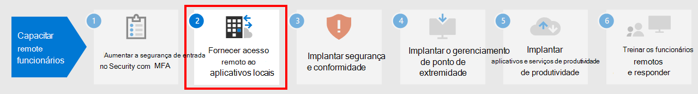

# Etapa 1. Aumentar a segurança de entrada para funcionários remotos com a MFA

Para aumentar a segurança das entradas dos seus trabalhadores remotos, use a autenticação multifator (MFA). A MFA exige que as entradas do usuário estejam sujeitas a uma verificação adicional, além da senha da conta do usuário. Mesmo que um usuário mal-intencionado determine uma senha de conta de usuário, ele também deverá responder a uma verificação adicional, como uma mensagem de texto enviada a um smartphone antes do acesso ser concedido.

Para todos os usuários, incluindo trabalhadores remotos e especialmente administradores, a Microsoft recomenda a MFA.

Há três maneiras de exigir que seus usuários usem a MFA com base no seu plano do Microsoft 365.

|Plano  |Recomendação  |
|---------|---------|
|Planos do Microsoft 365 (sem licenças do Microsoft Azure AD Premium P1 ou P2)     |[Habilitar os padrões de segurança no Microsoft Azure Active Directory](https://docs.microsoft.com/azure/active-directory/fundamentals/concept-fundamentals-security-defaults). Os padrões de segurança no Microsoft Azure Active Directory incluem a MFA para usuários e administradores.   |
|Microsoft 365 E3 (inclui licenças do Azure AD Premium P1)     | Use [políticas de Acesso Condicional Comuns](https://docs.microsoft.com/azure/active-directory/conditional-access/concept-conditional-access-policy-common) para configurar as seguintes políticas:  - [Exigir MFA para administradores](https://docs.microsoft.com/azure/active-directory/conditional-access/howto-conditional-access-policy-admin-mfa)  - [Exigir MFA para todos os usuários](https://docs.microsoft.com/azure/active-directory/conditional-access/howto-conditional-access-policy-all-users-mfa)   - [Bloquear autenticação herdada](https://docs.microsoft.com/azure/active-directory/conditional-access/howto-conditional-access-policy-block-legacy)       |
|Microsoft 365 E5 (inclui licenças do Azure AD Premium P2)     | Aproveitando as vantagens do Azure AD Identity Protection, comece a implementar o [conjunto recomendado de acesso condicional e políticas relacionadas](../security/office-365-security/identity-access-policies.md) da Microsoft criando estas duas políticas:  - [Exigir MFA quando o risco de entrada for médio ou alto](../security/office-365-security/identity-access-policies.md#require-mfa-based-on-sign-in-risk)  - [Bloquear clientes sem suporte para a autenticação moderna](../security/office-365-security/identity-access-policies.md#block-clients-that-dont-support-modern-authentication) - [Usuários de alto risco devem alterar a senha](../security/office-365-security/identity-access-policies.md#high-risk-users-must-change-password)       |
| | |

## Padrões de segurança

Os padrões de segurança são um novo recurso para assinaturas pagas ou de avaliação do Microsoft 365 e Office 365 criadas após 21 de outubro de 2019. Essas assinaturas têm padrões de segurança ativados, o que ***exige que todos os seus usuários usem a MFA com o aplicativo Microsoft Authenticator***.
 
Os usuários têm 14 dias para se registrar na MFA com o aplicativo Microsoft Authenticator em seus smartphones, que começa na primeira vez em que eles entram depois de os padrões de segurança terem sido habilitados. Após 14 dias, o usuário não poderá entrar até que o registro da MFA seja concluído.

Os padrões de segurança garantem que todas as organizações tenham um nível básico de segurança para a entrada do usuário, que é habilitado por padrão. Você pode desativar os padrões de segurança em favor da MFA com políticas de Acesso Condicional ou para contas individuais.

Para obter mais informações, confira esta [visão geral dos padrões de segurança](https://docs.microsoft.com/azure/active-directory/fundamentals/concept-fundamentals-security-defaults).

## Políticas de Acesso Condicional

As políticas de acesso condicional são um conjunto de regras que especificam as condições sob as quais as entradas são avaliadas e permitidas. Por exemplo, você pode criar uma política de acesso condicional que declare:

- Se o nome da conta de usuário for membro de um grupo para usuários a quem são atribuídas as funções de administrador do Exchange, de usuário, de senha, de segurança, do SharePoint ou global, exija a MFA antes de permitir o acesso.

Essa política permite exigir a MFA com base na associação ao grupo, em vez de tentar configurar contas de usuário individuais para a MFA quando elas são atribuídas ou não a essas funções de administrador.

Você também pode usar políticas de Acesso Condicional para recursos mais avançados, como exigir que a entrada seja feita a partir de um dispositivo compatível, como o seu laptop executando o Windows 10.

O Acesso Condicional requer as licenças do Microsoft Azure AD Premium P1, incluídas no Microsoft 365 E3 e E5.

Para mais informações, confira esta [visão geral do Acesso Condicional](https://docs.microsoft.com/azure/active-directory/conditional-access/overview).

## Suporte ao Azure AD Identity Protection

Com o Azure AD Identity Protection, é possível criar uma política de acesso condicional adicional que declara:

- Se o risco de entrada for determinado como médio ou alto, exija a MFA.

A Azure Active Directory Identity Protection requer as licenças do Microsoft Azure AD Premium P2, incluídas no Microsoft 365 E5.

Para mais informações, confira [Acesso Condicional com base no risco](https://docs.microsoft.com/azure/active-directory/conditional-access/howto-conditional-access-policy-risk#require-mfa-medium-or-high-sign-in-risk-users).

## Usando esses métodos juntos

Lembre-se do seguinte:

- Você não pode habilitar os padrões de segurança se tiver alguma política de Acesso Condicional ativada.
- Você não pode habilitar nenhuma política de Acesso Condicional se tiver os padrões de segurança habilitados.

Se os padrões de segurança estiverem ativados, todos os novos usuários serão solicitados a fazer o registro da MFA e usar o aplicativo Microsoft Authenticator. 

Esta tabela mostra os resultados da habilitação da MFA com padrões de segurança e políticas de Acesso Condicional.

| Método | Habilitado | Desabilitado | Método de autenticação adicional |
|:-------|:-----|:-------|:-------|
| **Padrões de segurança**  | Não é possível usar políticas de Acesso Condicional | Pode usar políticas de Acesso Condicional | Aplicativo Microsoft Authenticator |
| **Políticas de Acesso Condicional** | Se alguma delas estiver habilitada, você não poderá habilitar os padrões de segurança | Se todas estiverem desabilitadas, você poderá habilitar os padrões de segurança  | Especificado pelo usuário durante o registro da MFA  |
||||

## Permitir que os usuários redefinam suas próprias senhas

O Autoatendimento de Redefinição de Senha (SSPR) permite que os usuários redefinam suas próprias senhas, sem afetar a equipe de TI. Os usuários podem redefinir suas senhas rapidamente a qualquer momento e em qualquer lugar. Assista [este vídeo](https://go.microsoft.com/fwlink/?linkid=2128524) para configurar o SSPR.

## Entrar em aplicativos SaaS com o Azure AD

Além de fornecer autenticação na nuvem aos usuários, o Azure AD também pode ser a maneira central de proteger todos os seus aplicativos, seja no local, na nuvem da Microsoft ou em outra nuvem. Ao [integrar seus aplicativos no Azure AD](https://docs.microsoft.com/azure/active-directory/manage-apps/plan-an-application-integration), você pode fazer com que funcionários remotos descubram os aplicativos de que precisam e se conectarem com segurança.

## Treinamento de administrador e recursos técnicos para MFA e identidade

- [MFA para o Microsoft 365](https://docs.microsoft.com/microsoft-365/admin/security-and-compliance/multi-factor-authentication-microsoft-365)
- [As 5 principais formas como o Microsoft Azure Active Directory pode ajudar você a habilitar o trabalho remoto](https://techcommunity.microsoft.com/t5/azure-active-directory-identity/top-5-ways-your-azure-ad-can-help-you-enable-remote-work/ba-p/1144691)
- [Mapa da identidade do Microsoft 365](../enterprise/identity-roadmap-microsoft-365.md)
- [Vídeos de treinamento do Microsoft Azure Active Directory da Azure Academy](https://www.youtube.com/watch?v=pN8o0owHfI0&list=PL-V4YVm6AmwUFpC3rXr2i2piRQ708q_ia)
- [Configurar a política de registro da Autenticação Multifator do Azure](https://docs.microsoft.com/azure/active-directory/identity-protection/howto-identity-protection-configure-mfa-policy)
- [Planejar a implantação de uma senha de autoatendimento do Azure AD](https://docs.microsoft.com/azure/active-directory/authentication/howto-sspr-deployment)

## Resultados da Etapa 1

Após a implantação da MFA, seus usuários:

- Necessitam usar a MFA para entradas.
- Concluíram o processo de registro da MFA e estão usando a MFA para todas as entradas.
- Pode usar SSPR para redefinir suas próprias senhas.

## Próxima etapa

Continue com a [Etapa 2](empower-people-to-work-remotely-remote-access.md) para fornecer acesso remoto a aplicativos e serviços locais.
