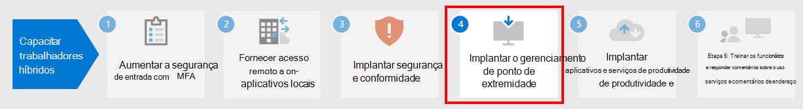

# Etapa 3: implantar segurança e conformidade para funcionários híbridos

Para funcionários híbridos, alguns dos quais nunca vão ao escritório ou vão raramente, a segurança e a conformidade são uma parte importante da solução. Todas as comunicações ocorrem pela Internet, em vez de serem confinadas a uma intranet organizacional. 

Há algo que você e seus funcionários podem fazer para se manterem produtivos, ao mesmo tempo que reduz o risco de segurança cibernética e mantém a conformidade com suas políticas internas e normas de dados.

O trabalho remoto precisa desses elementos de segurança e conformidade:

- Acesso controlado aos aplicativos de produtividade que os funcionários híbridos usam, como o Microsoft Teams 
- Acesso controlado e proteção dos dados que os funcionários híbridos criam e usam, como conversas de chat ou arquivos compartilhados
- Proteção de dispositivos com Windows 10 contra malware e outros tipos de ataques cibernéticos
- Proteção de emails, arquivos e sites com rótulos consistentes para níveis de confidencialidade e proteção
- Prevenção contra o vazamento de informações
- Aderência a regulamentações de dados regionais

Aqui estão os recursos do Microsoft 365 que fornecem serviços de segurança e conformidade para os funcionários híbridos.

## Segurança

Proteja seus aplicativos e dados com estes recursos de segurança do Microsoft 365.

| Capcidade ou recurso | Por que eu preciso disso | Licenciamento |
|:-------|:-----|:-------|
| Microsoft Defender para Office 365 | Proteja seus aplicativos e dados da Microsoft 365— como mensagens de email, documentos do Office e ferramentas de colaboração—de um ataque.    O Microsoft Defender para Office 365 coleta e analisa sinais dos aplicativos para detecção, investigação e correção de riscos de segurança e protege a organização contra ameaças maliciosas representadas por mensagens de email, links (URLs) e ferramentas de colaboração. Ele também fornece avaliação de configuração de locatário automatizada e ferramentas de configuração para posturas de segurança padrão e estritas. | Microsoft 365 E3 ou E5 | 
| Proteção contra malware | O Windows Defender Antivirus e o Windows Device Guard fornecem proteção contra malware baseada em dispositivo.    O SharePoint online examina automaticamente os carregamentos de arquivos para malwares conhecidos.   A proteção do Exchange Online (EOP) protege as caixas de correio na nuvem. | Microsoft 365 E3 ou E5 |
| Proteção Avançada contra Ameaças do Microsoft Defender | Proteja os dispositivos da organização contra ameaças cibernéticas e violações de dados e detecte, investigue e responda a ameaças avançadas. | Microsoft 365 E5 |
| Microsoft Cloud App Security | Proteja seus serviços baseados em nuvem - Microsoft 365 e outros aplicativos SaaS - contra ataques. | Licença do Microsoft 365 E5 ou licença individual do Microsoft Cloud App Security |
| Proteção de Identidade do Azure AD  | Automatize a detecção e correção de riscos baseados em identidade.   Crie políticas de acesso condicional com base em risco para exigir a autenticação multifator (MFA) para entradas arriscadas. | Microsoft 365 E5 ou E3 com as licenças do Azure AD Premium P2 |
||||

Sua primeira etapa deve ser obter informações e usar o [Microsoft Secure Score](/microsoft-365/security/defender/microsoft-secure-score).

Consulte as [12 Principais tarefas das equipes de segurança para apoiar o trabalho em casa](../security/top-security-tasks-for-remote-work.md) para obter mais informações.

Para obter mais informações sobre a segurança no Microsoft 365, consulte [Documentação de segurança do Microsoft 365](/microsoft-365/security).

## Conformidade

Cumpra os requisitos normativos ou políticas internas com estes recursos de conformidade do Microsoft 365.

| Capcidade ou recurso | Por que eu preciso disso | Licenças |
|:-------|:-----|:-------|
| Rótulos de confidencialidade | Classifique e proteja os dados da organização sem atrapalhar a produtividade e a capacidade de colaboração dos usuários, colocando rótulos com vários níveis de proteção em emails, arquivos ou sites. | Microsoft 365 E3 ou E5 |
| Proteção contra Perda de Dados (DLP)  | Detectar, avisar e bloquear compartilhamento arriscado, inadvertido ou impróprio, como o compartilhamento de dados com informações pessoais, interna e externamente. | Microsoft 365 E3 ou E5 | 
| Controle de Aplicativos de Acesso Condicional | Impeça que dados confidenciais sejam baixados em dispositivos pessoais dos usuários. | Microsoft 365 E3 ou E5 |
| Rótulos e políticas de retenção de dados | Implemente controles de governança de informações, como por quanto tempo manter os dados e os requisitos sobre o armazenamento de dados pessoais dos clientes, para estar em conformidade com as políticas da sua organização ou com as regulamentações de dados. | Microsoft 365 E3 ou E5 |
| Criptografia de Mensagem do Office (OME) | Envie e receba mensagens de email criptografadas entre as pessoas dentro e fora da sua organização que contenham dados regulados, como dados pessoais de clientes. | Microsoft 365 E3 ou E5 |
| Gerente de Conformidade | Gerencie as atividades de conformidade regulatória relacionadas aos serviços de nuvem da Microsoft com esta ferramenta de avaliação de risco baseada em fluxo de trabalho no Portal de Confiança do Serviço da Microsoft. | Microsoft 365 E3 ou E5 |
| Gerente de Conformidade | Veja uma pontuação geral da configuração de conformidade atual e recomendações para melhorá-la no Centro de Conformidade do Microsoft 365. | Microsoft 365 E3 ou E5 |
| Conformidade em comunicações  | Detecte, capture e execute ações de correção para mensagens inadequadas em sua organização. | Microsoft 365 E5 ou Microsoft 365 E3 com os complementos de conformidade e gerenciamento de risco interno do Office Insider |
| Gerenciamento de riscos internos |  Detectar, investigar e agir nos riscos maliciosos e inadvertidos em sua organização. O Microsoft 365 pode detectar esses tipos de riscos mesmo quando um trabalhador está usando um dispositivo não gerenciado. | Microsoft 365 E5 ou Microsoft 365 E3 com os complementos de conformidade e gerenciamento de risco interno do Office Insider |
||||

Consulte [Tarefas rápidas de introdução à Conformidade do Microsoft 365](../compliance/compliance-quick-tasks.md) para obter mais informações.

## Resultados da Etapa 3

Para seus funcionários híbridos, você implementou:

- Segurança
  - Acesso controlado a aplicativos e dados que funcionários híbridos usam para se comunicar e colaborar
  - Proteção contra malware para dados de serviço de nuvem, email e dispositivos com Windows 10 
- Conformidade
  - Rotulamento consistente para níveis de confidencialidade e proteção
  - Políticas de prevenção contra o vazamento de informações
  - Aderência a regulamentações de dados regionais

## Próxima etapa

Continue na [Etapa 4](empower-people-to-work-remotely-manage-endpoints.md) para gerenciar seus dispositivos, PCs e outros pontos de extremidade.
