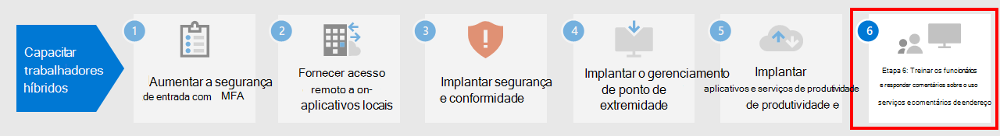

# Etapa 5.Step 5. Implantar aplicativos e serviços de produtividade de trabalhador remotoDeploy remote worker productivity apps and services

Para serem produtivas, as pessoas precisam se comunicar e colaborar umas com as outras.To be productive, people need to communicate and collaborate with one another. Elas precisam se reunir, conversar por voz e texto, criar novos conteúdos e compartilhar informações e arquivos, trocar emails e gerenciar calendários e tarefas.They need to meet, chat by voice and text, create new content and share information and files, exchange email, and manage calendars and tasks. O Microsoft 365 fornece serviços baseados em nuvem para todas estas funções importantes:Microsoft 365 provides cloud-based services for all of these key functions:

- Para manter as pessoas conectadas enquanto trabalham separadas, use o Microsoft Teams, que fornece um hub comum de comunicação para reuniões, chats e armazenamento de arquivos para a organização, departamentos e pequenas equipes e indivíduos.To keep people connected while they work apart, use Microsoft Teams, which provides a common hub of communication for meetings, chats, and file storage for the organization, departments, and for small teams and individuals. 
- Para trocar emails e gerenciar calendários, contatos e tarefas, use o Exchange Online e o cliente Outlook.For exchanging email and managing calendars, contacts, and tasks, use Exchange Online and the Outlook client.
- Para armazenar e colaborar em arquivos, use o Microsoft Office SharePoint Online e o OneDrive.For storing and collaborating on files, use SharePoint and OneDrive. Você pode usá-los com um navegador da Web ou no Teams.You can use them with a web browser or within Teams.
- Para criar novos conteúdos ou colaborar em conteúdos existentes, os Aplicativos do Microsoft 365 são versões do Word, PowerPoint, Excel e Outlook instaladas no computador local e recebem atualizações contínuas de recursos e segurança.For creating new content or collaborating on existing content, Microsoft 365 Apps are versions of Word, PowerPoint, Excel, and Outlook that are installed on your local computer and receive ongoing feature and security updates.

## Manter as pessoas conectadas ao Microsoft TeamsKeep people connected with Microsoft Teams

O Teams permite que você converse, reúna-se, faça chamadas e colabore em um único local.Teams allows you to chat, meet, call, and collaborate all in one place. Milhões de pessoas realizam seu trabalho diariamente no Teams, porque ele reúne tudo o que é necessário para trabalhar remotamente em um hub de trabalho em equipe.Millions of people get their work done in Teams every day because it brings together everything you need to work remotely into a hub for teamwork. 

Você pode usar [este artigo](https://docs.microsoft.com/microsoftteams/support-remote-work-with-teams) para obter orientações sobre como oferecer suporte aos seus trabalhadores remotos com o Teams.Use [this article](https://docs.microsoft.com/microsoftteams/support-remote-work-with-teams) for guidance on supporting your remote workers with Teams. 

Assista à [Parte 1 do vídeo](https://resources.techcommunity.microsoft.com/enabling-remote-work/#productivity) para obter orientação e demonstrações sobre como usar o Teams para trabalho remoto.Watch the [Part 1 video](https://resources.techcommunity.microsoft.com/enabling-remote-work/#productivity) for guidance and demos on using Teams for remote work.

### Chats e conversasChat and conversations

Os chats e as conversas encadeadas desempenham um papel fundamental no Teams, com suporte para chats entre duas pessoas e chats e conversas em grupo.Chat and threaded conversations are at the center of Teams with support for individual 1:1 chats and group chats and conversations. Os trabalhadores remotos podem compartilhar informações, opiniões e sua personalidade usando gifs, adesivos e emojis em chats de grupo ou mensagens entre duas pessoas.Remote workers can share information, opinions, and personality by using gifs, stickers, and emojis in group chats or one-to-one messages.

### Reuniões e conferênciasMeetings and conferencing 

O Teams certamente pode ajudar a manter o compartilhamento de informações e comunicações com trabalhadores remotos, especialmente em reuniões com suporte para até 250 pessoas.Teams can certainly help maintain communications and information sharing with remote workers, especially with meetings that support up to 250 people. As reuniões do Teams permitem reuniões interativas e colaborativas com pessoas dentro e fora da organização.Teams meetings enable interactive, collaborative meetings with people inside and outside your organization. Os trabalhadores remotos podem usar reuniões do Teams para as atividades diárias, incluindo pontos de verificação recorrentes do projeto, conversar com colegas, sessões de debate e facilitar conversas com os clientes.Remote workers can use Teams meetings for day-to-day activities including recurring project checkpoints, catching-up with colleagues, brainstorming sessions, and facilitating conversations with customers. 

### ChamadasCalling

O Teams tem suporte para chamadas VoIP diretas entre usuários e até outras organizações que usam federação.Teams supports direct VoIP calling between users and even other organizations using federation. Ele usa os mesmos codecs das reuniões e fornece áudio excelente em todo o mundo, sem custos adicionais de PSTN.It uses the same codecs as meetings and provide great audio world-wide without additional PSTN charges. No entanto, alguns usuários podem precisar de um número de telefone dedicado para atender chamadas externas ao trabalhar remotamente.However, some users may need a dedicated phone number to take external calls when working remotely. O Teams pode fornecer rapidamente um serviço de telefone em nuvem para que esses usuários façam e recebam chamadas telefônicas.Teams can quickly provide cloud phone service for these users to make and receive phone calls.

### Aplicativos e fluxos de trabalhoApps and workflows

O Teams fornece uma plataforma para aplicativos e fluxos de trabalho que podem ser acessados nas versões para área de trabalho, Web e móvel do Teams.Teams provides a platform for apps and workflows that can be accessed from the desktop, web, and mobile versions of Teams. O Teams fornece centenas de aplicativos publicados pela Microsoft e por terceiros para envolver os usuários, dar suporte à produtividade e integrar serviços de negócios comumente usados ao Teams.Teams provides hundreds of apps published by Microsoft and by third parties to engage users, support productivity, and integrate commonly used business services into Teams. Usuários e administradores também podem criar aplicativos personalizados e fluxos de trabalho automatizados para o Teams, usando as ferramentas de desenvolvimento Power Apps e Power Automate, que usam pouco código.Users and Admins can also create custom apps and automated workflows for Teams using the low-code Power Apps and Power Automate development tools.

Aplicativos e fluxos de trabalho permitem que os trabalhadores remotos sejam mais produtivos no Teams, coletando e compartilhando informações importantes, automatizando tarefas repetitivas e permitindo que eles conversem com um bot interativo.Apps and workflows let remote workers be more productive in Teams, by collecting and sharing critical information, automating repetitive tasks, and allowing them to chat with interactive bot. Fixar aplicativos em um canal ou na barra de aplicativos Teams é uma ótima maneira de os usuários tornarem esses aplicativos facilmente acessíveis em um espaço relevante, e os administradores podem fixar aplicativos para aumentar o reconhecimento e a adoção dos aplicativos que todos deveriam usar.Pinning apps to a channel or the Teams app bar is a great way for users to make these apps easily accessible in a relevant space, and admins can pin apps to drive awareness and adoption of the apps that everyone should be using.

## Troque emails e gerencie calendários, contatos e tarefas com o Exchange Online e o OutlookExchange email and manage calendars, contacts, and tasks with Exchange Online and Outlook

Com o Outlook, os trabalhadores remotos podem permanecer conectados e organizados com email, calendários, contatos, tarefas e muito mais – em um só lugar.With Outlook, remote workers can stay connected and organized with email, calendars, contacts, tasks, and more—together in one place. O Outlook ajuda você a manter o foco e priorizar seu dia com base no que é relevante para você.Outlook helps you stay on track and prioritize your day based on what’s relevant to you. O Outlook permite que você compartilhe anexos diretamente a partir do OneDrive, planeje e participe de reuniões do Teams, exiba e compartilhe calendários e forneça permissões de representante a outras pessoas.Outlook enables you to share attachments right from OneDrive, plan and join Teams meetings, view and share calendars, and provide delegate permissions to others. Saber o que está por vir nos compromissos pessoais e profissionais e o que precisa de atenção pode ajudar os trabalhadores remotos a se concentrarem no que realmente importa.Knowing what’s coming up next across both work and personal commitments and what needs attention can help remote workers focus on what matters. O Outlook fornece maneiras úteis para os trabalhadores remotos gerenciarem seu tempo e encontrarem o que precisam com facilidade, incluindo arquivos, pessoas na organização e muito mais.Outlook provides helpful ways for remote workers to manage their time and to find what they need easily, including files, people in the organization, and more. 

Confira [este artigo](../security/office-365-security/secure-email-recommended-policies.md) para conhecer as políticas de acesso de dispositivo e de identidades recomendadas para proteger e-mails e clientes e corporativos que oferecem suporte à autenticação moderna e Acesso Condicional.See [this article](../security/office-365-security/secure-email-recommended-policies.md) for the recommended identity and device access policies to protect organizational email and email clients that support modern authentication and Conditional Access.

## Armazenar e colaborar em arquivos com o SharePoint e o OneDriveStore and collaborate on files with SharePoint and OneDrive

Para colaboração de conteúdo, os funcionários remotos podem usar as pastas do SharePoint e do OneDrive como um local central na nuvem para armazenar e compartilhar arquivos, trabalhar em coautoria, comunicar-se e colaborar.For content collaboration, remote workers can use SharePoint and OneDrive folders as a central place in the cloud to store and share files, co-author, communicate, and collaborate. Os trabalhadores remotos podem trabalhar com segurança em praticamente qualquer lugar, a partir de um navegador da Web, do Teams e de aplicativos do Office.Remote workers can securely work from anywhere from a web browser, from Teams, and from Office apps.

Pode ser necessário migrar para o SharePoint e o OneDrive seus documentos dos seguintes locais:You might have to migrate your documents to SharePoint or OneDrive from:

- [Sites de Equipes do SharePoint ServerSharePoint Server Team Sites](https://docs.microsoft.com/sharepointmigration/sp-teams-sites-migration-guide)
- [MySitesMySites](https://docs.microsoft.com/sharepointmigration/mysites-to-onedrive-migration-guide)
- [Compartilhamentos de arquivosFile shares](https://docs.microsoft.com/sharepointmigration/fileshare-to-odsp-migration-guide)
- [BoxBox](https://docs.microsoft.com/sharepointmigration/box-to-onedrive-and-sharepoint-migration-guide)

Para proteger o SharePoint e o OneDrive, confira esse [artigo](../security/office-365-security/sharepoint-file-access-policies.md) sobre identidades recomendadas e políticas de acesso a dispositivos.To protect SharePoint and OneDrive, see [this article](../security/office-365-security/sharepoint-file-access-policies.md) for the recommended identity and device access policies.

## Criar e colabore em conteúdos com os Aplicativos do Microsoft 365Create and collaborate on content with Microsoft 365 Apps

Os Aplicativos do Microsoft 365 são a experiência do Office mais produtiva e mais segura para as empresas, permitindo que as pessoas trabalhem juntas sem interrupções em praticamente qualquer lugar e a qualquer hora.Microsoft 365 Apps is the most productive and most secure Office experience for enterprises, allowing people to work together seamlessly from anywhere, anytime. Os trabalhadores remotos podem colaborar em um documento com várias pessoas simultaneamente, ver edições e alterações em tempo real e colaborar com outras pessoas em qualquer laptop, computador ou dispositivo móvel.Remote workers can collaborate on a document with multiple people simultaneously, see edits and changes in real time, and coauthor with others on any laptop, PC, or mobile device.

Confira [este artigo](https://docs.microsoft.com/deployoffice/deployment-guide-microsoft-365-apps) para planejar, implantar e gerenciar aplicativos do Microsoft 365 Apps em seu ambiente corporativo.See [this article](https://docs.microsoft.com/deployoffice/deployment-guide-microsoft-365-apps) to plan, deploy, and manage Microsoft 365 Apps in your enterprise environment.

## Recursos técnicos de administração para aplicativos e serviços de produtividadeAdmin technical resources for productivity apps and services

- [Suporte a trabalhadores remotos com o Microsoft TeamsSupport remote workers using Microsoft Teams](https://docs.microsoft.com/microsoftteams/support-remote-work-with-teams)
- [Parte 1 do vídeo sobre o Teams para funcionários remotosPart 1 video on Teams for remote workers](https://resources.techcommunity.microsoft.com/enabling-remote-work/#productivity)
- [Download do Kit de Sucesso do Cliente do TeamsTeams Customer Success Kit download](https://www.microsoft.com/download/details.aspx?id=54244)
- [Ferramentas para impulsionar a adoção do TeamsTools for driving Teams adoption](https://docs.microsoft.com/microsoftteams/adopt-tools-and-downloads) 
- [Criar uma estratégia de gerenciamento de alterações para o Microsoft TeamsCreate a change management strategy for Microsoft Teams](https://docs.microsoft.com/MicrosoftTeams/change-management-strategy)
- [Teams com três camadas de proteçãoTeams with three tiers of protection](configure-teams-three-tiers-protection.md)

## Recursos de treinamento de usuários para aplicativos e serviços de produtividadeUser training resources for productivity apps and services

- [Treinar seus usuários no Office e Microsoft 365Train your users on Office and Microsoft 365](https://support.microsoft.com/office/train-your-users-on-office-and-microsoft-365-7cba3c97-7f19-46ed-a1c6-763971a26c27)
- [Usar o Office para a WebUse Office for the web](https://support.microsoft.com/office/get-started-with-office-for-the-web-in-microsoft-365-5622c7c9-721d-4b3d-8cb9-a7276c2470e5)

## Próxima etapaNext step

Prossiga para a [Etapa 6](empower-people-to-work-remotely-train-monitor-usage.md) para treinar seus usuários e monitorar o sucesso deles.Continue with [Step 6](empower-people-to-work-remotely-train-monitor-usage.md) to train your users and monitor their success.
