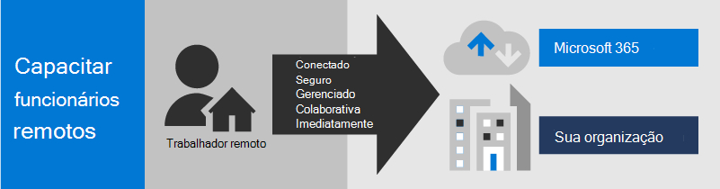
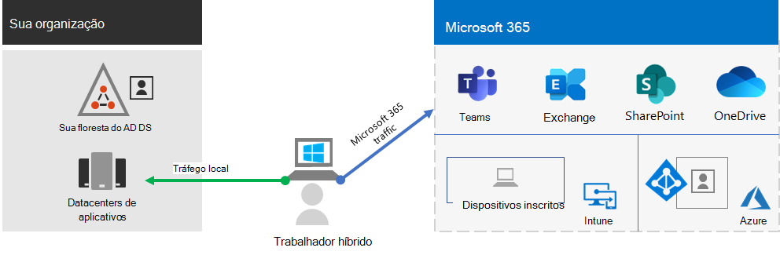
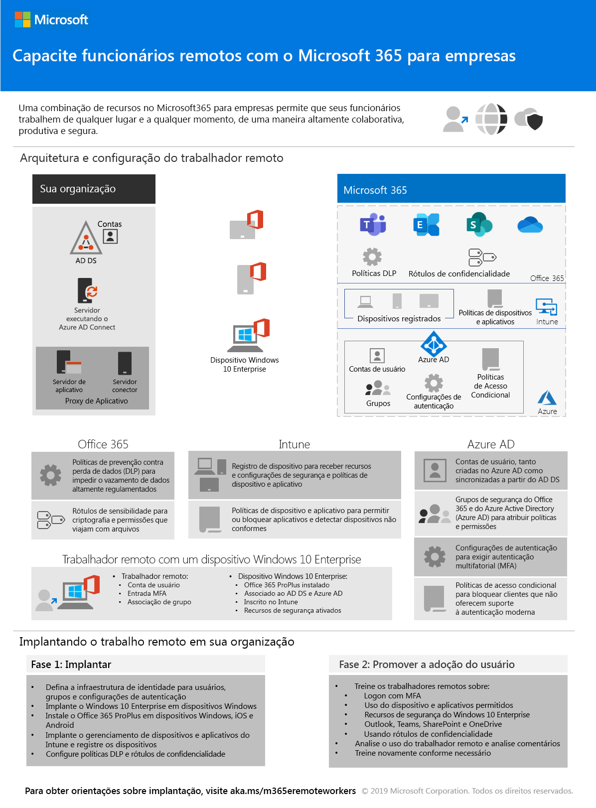
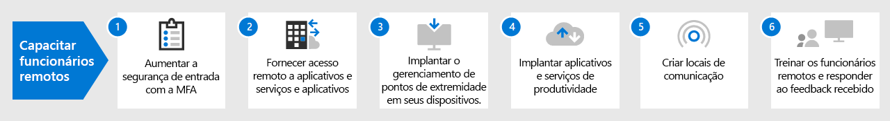

# Capacite funcionários remotos com o Microsoft 365Empower remote workers with Microsoft 365

Sua empresa talvez precise habilitar seus funcionários a ter acesso seguro às informações, ferramentas e recursos da organização, no local e na nuvem de sua organização, a partir de suas casas.Your business may need to enable your workers to have secure access to your organization's on-premises and cloud-based information, tools, and resources from their homes. Permitir que os funcionários trabalhem fora do escritório é importante para várias organizações para:Allowing workers to work away from the office is important for many organizations to:

- Economizar espaço no escritório.Save on office space.
- Contratar e reter funcionários que não estão dispostos a ser realocados.Hire and retain workers who are unwilling to relocate.
- Reduza o deslocamento dos funcionários, deixando-os com mais tempo para serem produtivos e para atividades de redução de estresse fora do trabalho.Reduce worker commuting, leaving them with more time to be productive and for stress-reducing activities outside of work.

O Microsoft 365 tem os recursos para permitir que seus funcionários trabalhem remotamente.Microsoft 365 has the capabilities to empower your workers to work remotely.

| | |
|:-------|:-----|
| ConectadoConnected | De qualquer lugar do mundo e a qualquer momento, os funcionários remotos podem acessar:From anywhere in the world and at any time, remote workers are able to access: <ul><li>Serviços e dados baseados em nuvem na sua assinatura do Microsoft 365.Cloud-based services and data in your Microsoft 365 subscription. </li><li>Recursos da organização, como os oferecidos por centros de dados de aplicativos locais.Organization resources, such those offered by on-premises application datacenters.</li></ul> |
| SeguroSecure | Os logins são protegidos com autenticação multifator (MFA) e os recursos de segurança internos do Microsoft 365 e do Windows 10 protegem contra malwares, ataques maliciosos e perda de dados.Sign-ins are secured with multi-factor authentication (MFA) and built-in security features of Microsoft 365 and Windows 10 protect against malware, malicious attacks, and data loss. |
| GerenciadoManaged | Os dispositivos dos seus trabalhadores remotos podem ser gerenciados na nuvem com configurações de segurança, aplicativos permitidos e exigir conformidade com a integridade do sistema.Your remote worker's devices can be managed from the cloud with security settings, allowed apps, and to require compliance with system health. |
| Colaborativo e produtivoCollaborative and productive | Seus funcionários remotos podem ser tão produtivos quanto locais, de uma maneira altamente colaborativa com:Your remote workers can be as productive as on-premises in a highly collaborative way with: <ul><li>Reuniões on-line e sessões de bate-papo com o Teams.Online meetings and chat sessions with Teams. </li><li>Áreas de trabalho compartilhadas para armazenamento de arquivos baseados em nuvem com acessibilidade global e colaboração em tempo real com o SharePoint e o OneDrive.Shared workspaces for cloud-based file storage with global accessibility and real-time collaboration with SharePoint and OneDrive. </li><li>Tarefas e fluxos de trabalho compartilhados para dividir o trabalho e realizar as tarefas.Shared tasks and workflows to divide up the work and get things done. </li></ul> |
|||

Para uma experiência perfeita de entrada, suas contas de usuário dos Serviços de domínio do Active Directory (AD DS) locais devem ser sincronizadas com o Azure Active Directory (Azure AD).For a seamless sign-in experience, your on-premises Active Directory Domain Services (AD DS) user accounts should be synchronized with Azure Active Directory (Azure AD). Para proteger os dispositivos com Windows 10, eles devem ser registrados no Intune.To protect your Windows 10 devices, they should be enrolled in Intune. Veja a seguir uma visão geral da infraestrutura.Here is a high-level view of the infrastructure.

Para atender aos critérios para trabalhadores remotos, use esses recursos e funcionalidades do Microsoft 365.To meet the criteria for remote workers, use these Microsoft 365 capabilities and features.

| Capcidade ou recursoCapability or feature | DescriçãoDescription | LicençasLicensing |
|:-------|:-----|:-------|
| MFA imposta com padrões de segurançaMFA enforced with security defaults   | Proteja-se contra os dispositivos e identidades comprometidos exigindo uma segunda forma de autenticação para as entradas. O padrão de segurança exige MFA para todas as contas de usuário.Protect against compromised identities and devices by requiring a second form of authentication for sign-ins. Security defaults requires MFA for all user accounts.   | Microsoft 365 E3 e e5Microsoft 365 E3 and E5 |
| MFA imposta com Acesso CondicionalMFA enforced with Conditional Access| Exija MFA com base nas propriedades da entrada com políticas de Acesso Condicional.Require MFA based on the properties of the sign-in with Conditional Access policies.    | Microsoft 365 E3 e e5Microsoft 365 E3 and E5 | 
| MFA imposta com Acesso Condicional baseado em riscoMFA enforced with risk-based Conditional Access   | Exija a MFA com base no risco do logon do usuário com a Proteção Avançada contra Ameaças do Azure.Require MFA based on the risk of the user sign-in with Azure Advanced Threat Protection. | Microsoft 365 E5 ou E3 com as licenças do Azure AD Premium P2Microsoft 365 E5 or E3 with Azure AD Premium P2 licenses | 
| Redefinição de Senha por autoatendimento (SSPR)Self-Service Password Reset (SSPR)    | Permita que os usuários redefinam ou desbloqueiem suas contas ou senhas.Allow your users to reset or unlock their passwords or accounts.  | Microsoft 365 E3 e e5Microsoft 365 E3 and E5 |
| Proxy do Aplicativo Azure ADAzure AD Application Proxy    | Forneça acesso remoto seguro para aplicativos baseados na web hospedados em servidores da intranet.Provide secure remote access for web-based applications hosted on intranet servers.   | Exige uma assinatura paga do Azure pagaRequires separate paid Azure subscription |
| VPN de Ponto a Site do AzureAzure Point-to-Site VPN   | Criar uma conexão segura do dispositivo de um trabalhador remoto para sua intranet por meio de uma rede virtual do Azure.Create a secure connection from a remote worker’s device to your intranet through an Azure virtual network.   | Exige uma assinatura paga do Azure pagaRequires separate paid Azure subscription |
| Área de Trabalho Virtual do WindowsWindows Virtual Desktop   | Suporte a funcionários remotos que só podem usar seus dispositivos pessoais e não gerenciados com as áreas de trabalho virtuais que estão sendo executadas no Azure.Support remote workers who can only use their personal and unmanaged devices with virtual desktops running in Azure. | Exige uma assinatura paga do Azure pagaRequires separate paid Azure subscription |
| Serviços de Área de Trabalho Remota (RDS)Remote Desktop Services (RDS) | Permitir que os funcionários se conectem a computadores baseados no Windows na intranet.Allow employees to connect into Windows-based computers on your intranet. | Microsoft 365 E3 e e5Microsoft 365 E3 and E5 | 
| Gateway dos Serviços de Área de Trabalho RemotaRemote Desktop Services Gateway   | Criptografe comunicações e impeça que os hosts RDS sejam expostos diretamente à Internet.Encrypt communications and prevent the RDS hosts from being directly exposed to the Internet. | Exige licenças separadas do Windows ServerRequires separate Windows Server licenses |
| Microsoft IntuneMicrosoft Intune | Gerenciar dispositivos e aplicativos.Manage devices and applications.   | Microsoft 365 E3 e e5Microsoft 365 E3 and E5 | 
| Gerenciador de ConfiguraçõesConfiguration Manager | Gerenciar instalações, atualizações e configurações de software em seus dispositivosManage software installations, updates, and settings on your devices | Exige licenças separadas do Configuration ManagerRequires separate Configuration Manager licenses |
| Análise de Área de TrabalhoDesktop Analytics | Determine a prontidão de atualização dos seus clientes Windows.Determine the update readiness of your Windows clients.   | Exige licenças separadas do Configuration ManagerRequires separate Configuration Manager licenses |
| Windows AutopilotWindows Autopilot | Configure e configure novamente os novos dispositivos com Windows 10 para uso produtivo.Set up and pre-configure new Windows 10 devices for productive use.   | Microsoft 365 E3 e e5Microsoft 365 E3 and E5 |
| Microsoft Teams, Exchange Online, SharePoint Online e OneDrive, Microsoft 365 Apps, Microsoft Power Platform, Yammer, Power AppsMicrosoft Teams, Exchange Online, SharePoint Online and OneDrive, Microsoft 365 Apps, Microsoft Power Platform, Yammer, Power Apps | Criar, comunicar e colaborar.Create, communicate, and collaborate. | Microsoft 365 E3 e E5Microsoft 365 E3 and E5 |
||||

 Para obter um resumo de 2 páginas desse cenário, consulte o pôster [Capacitar trabalhadores remotos](../downloads/empower-remote-workers.pdf).For a 2-page summary of this scenario, see the [Empower remote workers poster](../downloads/empower-remote-workers.pdf).

Também é possível descarregar este pôster nos formatos [PDF](https://github.com/MicrosoftDocs/microsoft-365-docs/raw/public/microsoft-365/downloads/empower-remote-workers.pdf) ou [PowerPoint](https://github.com/MicrosoftDocs/microsoft-365-docs/raw/public/microsoft-365/downloads/empower-remote-workers.pptx) e imprimi-lo em papel tamanho carta, legal, ou tabloide (11 x 17).You can also download this poster in [PDF](https://github.com/MicrosoftDocs/microsoft-365-docs/raw/public/microsoft-365/downloads/empower-remote-workers.pdf) or [PowerPoint](https://github.com/MicrosoftDocs/microsoft-365-docs/raw/public/microsoft-365/downloads/empower-remote-workers.pptx) formats and print it on letter, legal, or tabloid (11 x 17) size paper.

Use estas etapas para proteger e otimizar o acesso aos servidores, dados e serviços na nuvem da sua organização e habilitar a produtividade máxima do trabalho.Use these steps to secure and optimize access to your organization's servers, data, and cloud services and enable maximum worker productivity.

1. [Aumentar a segurança de entrada com a MFAIncrease sign-in security with MFA](empower-people-to-work-remotely-secure-sign-in.md)
2. [Fornecer acesso remoto a aplicativos e serviços e aplicativos locaisProvide remote access to on-premises apps and services](empower-people-to-work-remotely-remote-access.md)
3. [Implantar serviços de segurança e conformidadeDeploy security and compliance services](empower-people-to-work-remotely-security-compliance.md)
4. [Implantar o gerenciamento de pontos de extremidade em seus dispositivos, PCs e outros pontos de extremidadeDeploy endpoint management for your devices, PCs, and other endpoints](empower-people-to-work-remotely-manage-endpoints.md)
5. [Implantar aplicativos e serviços de produtividade de trabalhador remotoDeploy remote worker productivity apps and services](empower-people-to-work-remotely-teams-productivity-apps.md)
6. [Treinar os funcionários remotos e responder a questões sobre o usoTrain remote workers and address usage feedback](empower-people-to-work-remotely-train-monitor-usage.md)

Para obter as informações mais recentes da Microsoft sobre como oferecer suporte a funcionários remotos, confira [Habilitação do site de comunidade técnica de trabalho remoto](https://resources.techcommunity.microsoft.com/enabling-remote-work/).For the latest information from Microsoft about supporting remote workers, see the [Enabling remote work Tech Community site](https://resources.techcommunity.microsoft.com/enabling-remote-work/).
