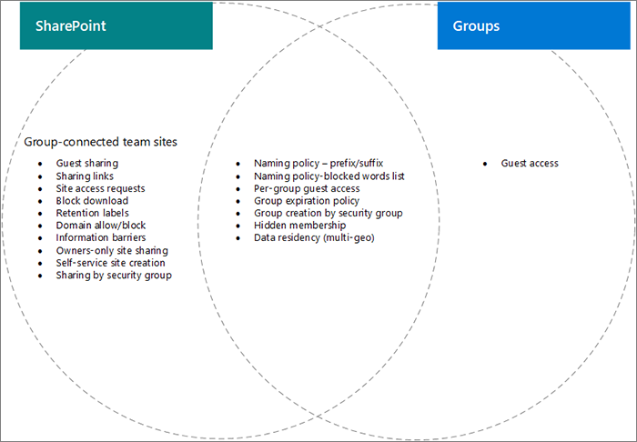

# Configurações interações entre grupos do Microsoft 365 e SharePointSettings interactions between Microsoft 365 Groups and SharePoint

Algumas configurações para Grupos do Microsoft 365 e SharePoint no Microsoft 365, particularmente relacionadas ao compartilhamento e criação de sites de grupo e equipe, se sobrepõem entre si.Some settings for Microsoft 365 Groups and SharePoint in Microsoft 365, particularly related to sharing and group and team site creation, overlap with each other. Este artigo fornece descrições dessas interações e práticas recomendadas para como trabalhar com essas configurações.This article provides descriptions of these interactions and best practices for how to work with these settings.

## Os efeitos das configurações do SharePoint nos grupos do Microsoft 365The effects of SharePoint settings on Microsoft 365 groups

|Configuração do SharePointSharePoint setting|DescriçãoDescription|Efeito nos grupos do Microsoft 365Effect on Microsoft 365 groups|RecomendaçãoRecommendation|
|:-----------------|:----------|:-----------------------------|:-------------|
|Compartilhamento externo para organização e siteExternal sharing for organization and site|Determina se sites, arquivos e pastas podem ser compartilhados com pessoas de fora da organização.Determines if sites, files, and folders can be shared with people outside the organization.|Se as configurações do SharePoint e grupos não corresponderem, os convidados no grupo poderão ser impedidos de acessar o site ou o acesso externo poderá estar disponível no site, mas não no grupo.If SharePoint and groups settings don't match, guests in the group may be blocked from accessing the site, or external access may be available in the site but not the group.|Ao alterar as configurações de compartilhamento, verifique as configurações de grupos e as configurações do site do SharePoint para sites de equipe conectados a grupos.When changing sharing settings, check both Groups settings and SharePoint site settings for group-connected team sites.  Consulte [Colaborar com convidados em um site](./collaborate-in-site.md).See [Collaborate with guests in a site](./collaborate-in-site.md).|
|Domínio allow/blockDomain allow/block|Permite ou impede que o conteúdo seja compartilhado com domínios especificados.Allows or prevents content being shared with specified domains.|Os grupos não reconhecem listas de permitir ou bloquear o SharePoint.Groups does not recognize SharePoint allow or block lists. Os usuários de domínios não permitidos no SharePoint podem obter acesso ao SharePoint por meio de um grupo.Users from domains disallowed in SharePoint could gain access to SharePoint through a group.|Gerenciar listas de permitir/bloquear domínios para o Azure AD e o SharePoint juntos.Manage domain allow/block lists for Azure AD and SharePoint together. Crie um processo de governança em toda a organização para permitir e bloquear domínios.Create an org-wide governance process for allowing and blocking domains.  Consulte [Configurações de domínio do SharePoint](/sharepoint/restricted-domains-sharing) e configurações de domínio [do Azure AD](/azure/active-directory/b2b/allow-deny-list)See [SharePoint domain settings](/sharepoint/restricted-domains-sharing) and [Azure AD domain settings](/azure/active-directory/b2b/allow-deny-list)|
|Permitir que somente os usuários de grupos específicos de segurança compartilhem externamenteAllow only users in specific security groups to share externally|Especifica grupos de segurança que podem compartilhar sites, pastas e arquivos externamente.Specifies security groups who can share sites, folders, and files externally.|Essa configuração não afeta os proprietários de grupos que compartilham grupos externamente.This setting does not affect group owners sharing groups externally. Os convidados do grupo têm acesso ao site do SharePoint associado.Group guests have access to the associated SharePoint site.||
|Configurações de compartilhamento de site do SharePointSharePoint site sharing settings|Determina quem pode compartilhar o site diretamente fora da associação ao grupo.Determines who can share the site directly outside of group membership. Isso é configurado pelo grupo ou proprietário do site.This is configured by the group or site owner.|Essa configuração não afeta diretamente o grupo, mas pode permitir que os usuários sejam adicionados a um site e não tenham acesso a outros recursos de grupoThis setting does not affect the group directly, but it can allow users to be added to a site and not have access to other group resources|Considere usar essa configuração para limitar o compartilhamento do site diretamente e gerenciar o acesso ao site por meio do grupo.Consider using this setting to limit sharing of the site directly and manage site access through the group.|
|Permitir que os usuários criem sites da página inicial do SharePoint e do OneDriveLet users create sites from the SharePoint start page and OneDrive|Especifica se os usuários podem criar novos sites do SharePoint.Specifies if users can create new SharePoint sites.|Se essa configuração estiver desligada, os usuários ainda poderão criar sites de equipe conectados a grupos criando um grupo.If this setting is turned off, users can still create group-connected team sites by creating a group.||

## Os efeitos da configuração de grupos do Microsoft 365 no SharePointThe effects of Microsoft 365 groups setting on SharePoint

|Configuração de grupos do Microsoft 365Microsoft 365 groups setting|DescriçãoDescription|Efeito no SharePointEffect on SharePoint|RecomendaçãoRecommendation|
|:---------------------------|:----------|:-------------------|:-------------|
|Políticas de nomenclaturaNaming policies|Especifica prefixos e sufixos de nome de grupo e palavras bloqueadas para criação de grupoSpecifies group name prefixes and suffixes, and blocked words for group creation|As políticas são impostas aos usuários que criam sites de equipe conectados a grupos, mas não sites de comunicação ou sites com outros modelos.Policies are enforced for users creating group-connected team sites, but not communication sites or sites with other templates.|Crie diretrizes de nomenização separadas para sites de comunicação, se necessário.Create separate naming guidance for communication sites if needed.|
|Acesso de convidados de grupoGroup guest access|Especifica se pessoas de fora da organização podem ser adicionadas a grupos.Specifies if people outside the organization can be added to groups.|Se as configurações do SharePoint e grupos não corresponderem, os convidados no grupo poderão ser impedidos de acessar o site ou o acesso externo poderá estar disponível no site, mas não no grupo.If SharePoint and groups settings don't match, guests in the group may be blocked from accessing the site, or external access may be available in the site but not the group.|Ao alterar as configurações de compartilhamento, verifique as configurações de grupos e as configurações do site do SharePoint para sites de equipe conectados a grupos.When changing sharing settings, check both Groups settings and SharePoint site settings for group-connected team sites.  Consulte [Colaborar com convidados em um site](./collaborate-in-site.md)See [Collaborate with guests in a site](./collaborate-in-site.md)|
|Criação de grupo por grupo de segurançaGroup creation by security group|Os grupos só podem ser criados por membros de um grupo de segurança específico.Groups can only be created by members of a specific security group.|Os usuários que não são membros do grupo de segurança não poderão criar um site de equipe conectado ao grupo.Users who are not members of the security group will not be able to create a group-connected team site.|Certifique-se de que o processo de solicitação de um grupo inclua instruções para solicitar um site.Be sure your process for requesting a group includes instructions for requesting a site.|
|Política de expiração de grupoGroup expiration policy|Especifica um período de tempo após o qual os grupos que não são usados ativamente serão excluídos automaticamente.Specifies a time period after which groups that are not actively used will be automatically deleted.|Quando o grupo é excluído, o site do SharePoint associado também é excluído.When the group is deleted, the associated SharePoint site is also deleted. O conteúdo protegido por políticas de retenção é mantido.Content protected by retention policies is retained.|Use políticas de expiração para evitar a expansão de grupos e sites não usado.Use expiration policies to avoid sprawl of unused groups and sites.|

## Tópicos relacionadosRelated topics

[Planejamento de governança de colaboração passo a passoCollaboration governance planning step-by-step](collaboration-governance-overview.md#collaboration-governance-planning-step-by-step)

[Criar seu plano de governança de colaboraçãoCreate your collaboration governance plan](collaboration-governance-first.md)

[Colaborar com pessoas de fora da sua organizaçãoCollaborating with people outside your organization](./collaborate-with-people-outside-your-organization.md)

[Gerenciar a criação de sites no SharePointManage site creation in SharePoint](/sharepoint/manage-site-creation)