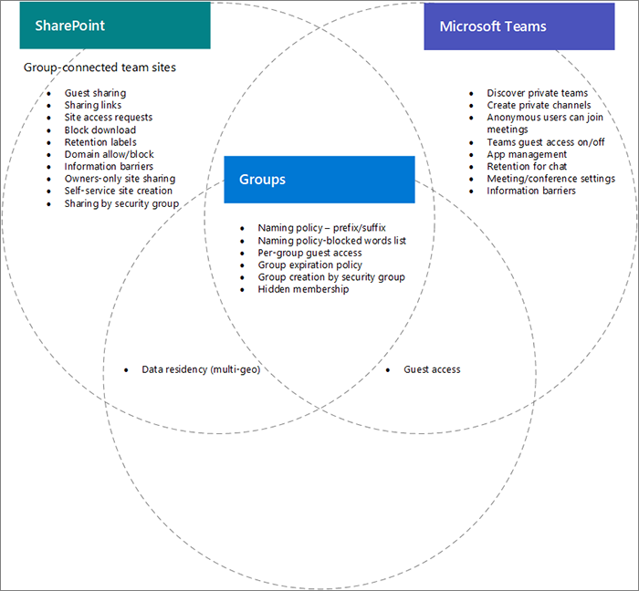

# Configurações interações entre o Microsoft 365 grupos, o Teams e o SharePoint

Algumas configurações de grupos do Microsoft 365, Microsoft Teams e SharePoint no Microsoft 365, especialmente relacionadas ao compartilhamento, ao grupo/equipe e à criação de sites do SharePoint, se sobrepõem. Este artigo fornece descrições dessas interações e práticas recomendadas sobre como trabalhar com essas configurações.

## Os efeitos das configurações do SharePoint em grupos e equipes

|Configuração do SharePoint|Descrição|Efeito sobre grupos e equipes do Microsoft 365|Recomendação|
|:-----------------|:----------|:---------------------------------------|:-------------|
|Compartilhamento externo para organização e site|Determina se sites, arquivos e pastas podem ser compartilhados com pessoas de fora da organização.|Se as configurações do SharePoint, grupos e equipes não forem correspondentes, os convidados da equipe poderão ser impedidos de acessar o site ou poderão ocorrer acesso externo inesperado.|Ao alterar as configurações de compartilhamento, verifique as configurações de grupos, configurações de equipe e configurações de site do SharePoint para sites de equipe conectados ao grupo.   Confira [colaborar com convidados em uma equipe](https://docs.microsoft.com/microsoft-365/solutions/collaborate-as-team)|
|Permissão/bloqueio de domínio|Permite ou impede que o conteúdo seja compartilhado com domínios especificados.|Grupos e equipes não reconhecem listas de permissões ou bloqueios do SharePoint. Os usuários de domínios despermitidos no SharePoint podem obter acesso a sites ou conteúdo do SharePoint por meio de uma equipe.|Gerenciar listas de permissões/bloqueios de domínio para o Azure AD e o SharePoint juntos. Criar um processo de governança de toda a organização para permitir e bloquear domínios.  Confira configurações de [domínio do SharePoint](https://docs.microsoft.com/sharepoint/restricted-domains-sharing) e [configurações de domínio do Azure ad](https://docs.microsoft.com/azure/active-directory/b2b/allow-deny-list)|
|Permitir que somente usuários em grupos de segurança específicos compartilhem externamente|Especifica grupos de segurança que podem compartilhar sites, pastas e arquivos do SharePoint externamente.|Essa configuração não impede que os proprietários de equipe compartilhem o Microsoft Teams externamente. Os convidados da equipe têm acesso ao site associado do SharePoint.||
|Configurações de compartilhamento de site do SharePoint|Determina quem pode compartilhar o site diretamente fora da associação da equipe. Isso é configurado pelo proprietário do site ou da equipe.|Essa configuração não afeta diretamente a equipe, mas pode permitir que os usuários sejam adicionados a um site e não tenham acesso à própria equipe ou a outros recursos do teams|Considere usar essa configuração para limitar o compartilhamento do site diretamente e gerenciar o acesso ao site por meio da equipe.|
|Permitir que os usuários criem sites da página inicial do SharePoint e do OneDrive|Especifica se os usuários podem criar novos sites do SharePoint.|Se essa configuração estiver desativada, os usuários ainda poderão criar sites de equipe conectados ao grupo criando uma equipe.||

## Os efeitos das configurações de grupos no Teams

|Configuração de grupos do Microsoft 365|Descrição|Efeito no Teams|Recomendação|
|:---------------------------|:----------|:--------------|:-------------|
|Políticas de nomenclatura|Especifica prefixos e sufixos de nome de grupo e palavras bloqueadas para a criação de grupo|As políticas são aplicadas aos usuários que criam o Microsoft Teams.||
|Acesso de convidado de grupo|Especifica se pessoas de fora da organização podem ser adicionadas a grupos.|Se as configurações de compartilhamento de convidados de grupos ou equipes estiverem desativadas, a equipe não poderá ser compartilhada com convidados.|Ao alterar as configurações de compartilhamento de convidados, verifique as configurações de equipes, grupos e o site do SharePoint associado à equipe.   Confira [colaborar com convidados em uma equipe](https://docs.microsoft.com/microsoft-365/solutions/collaborate-as-team)|
|Criação de grupo por grupo de segurança|Os grupos só podem ser criados por membros de um grupo de segurança específico.|Os usuários que não são membros do grupo de segurança não poderão criar uma equipe.|Certifique-se de que o processo de solicitação de um grupo inclua instruções para solicitar uma equipe ou um site do SharePoint.|
|Política de expiração de grupo|Especifica um período de tempo após o qual os grupos que não são ativamente usados serão excluídos automaticamente.|Quando o grupo é excluído, a equipe e o site associado do SharePoint também são excluídos. O conteúdo protegido por políticas de retenção é mantido.|Use as políticas de expiração para evitar a desorganização de equipes, grupos e sites não usados.|

## Tópicos relacionados

[Colaborar com pessoas de fora da sua organização](https://docs.microsoft.com/microsoft-365/solutions/collaborate-with-people-outside-your-organization)

[Gerenciar a criação de sites no SharePoint](https://docs.microsoft.com/sharepoint/manage-site-creation)
