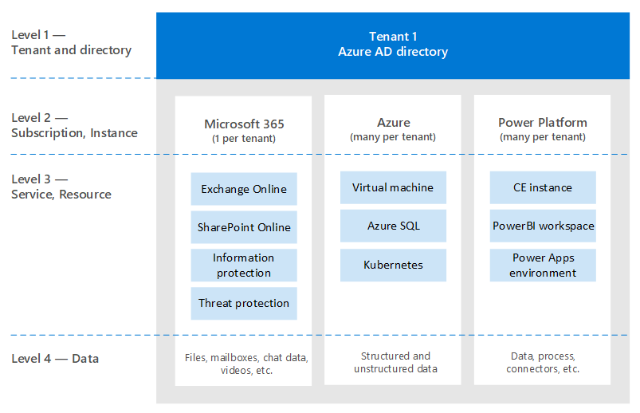
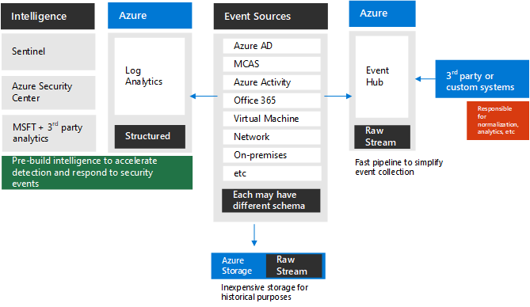
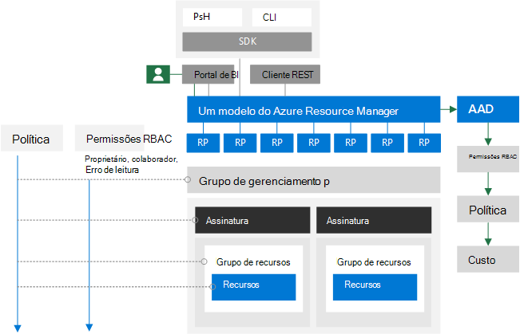

# Para identificar e além disso: o ponto de vista de um arquitetoTo identity and beyond — One architect's viewpoint

Neste artigo, [Alex Shteynberg](https://www.linkedin.com/in/alex-shteynberg/), arquiteto técnico principal da Microsoft, discute as principais estratégias de design para organizações empresariais que adotam o Microsoft 365 e outros serviços de nuvem da Microsoft.In this article, [Alex Shteynberg](https://www.linkedin.com/in/alex-shteynberg/), Principal Technical Architect at Microsoft, discusses top design strategies for enterprise organizations adopting Microsoft 365 and other Microsoft cloud services.

## Sobre o autorAbout the author

Sou um arquiteto técnico principal no centro de tecnologia da [Microsoft](https://www.microsoft.com/mtc?rtc=1)Nova York.I am a Principal Technical Architect at the New York [Microsoft Technology Center](https://www.microsoft.com/mtc?rtc=1). Na maioria dos casos, eu trabalho com grandes clientes e requisitos complexos.I mostly work with large customers and complex requirements. Meu ponto de vista e opiniões são baseados nessas interações e podem não se aplicar a todas as situações.My viewpoint and opinions are based on these interactions and may not apply to every situation. No entanto, caso possamos ajudar os clientes com os desafios mais complexos, podemos ajudar todos os clientes.However, in my experience, if we can help customers with the most complex challenges, we can help all customers. 

Geralmente eu trabalho com mais de 100 clientes por ano.I typically work with 100+ customers each year. Embora cada organização tenha características exclusivas, é interessante ver tendências e commonalities.While every organization has unique characteristics, it's interesting to see trends and commonalities. Por exemplo, uma tendência é o interesse entre setores de vários clientes.For example, one trend is cross-industry interest for a lot of customers. Afinal, uma ramificação do banco também pode ser uma lanchonete e um centro comunitário.After all, a bank branch can also be a coffee shop and a community center. 

Em minha função, me depara ajudar os clientes a chegar na melhor solução técnica para lidar com seu conjunto exclusivo de objetivos de negócios.In my role, I focus on helping customers arrive at the best technical solution to address their unique set of business goals. Oficialmente, quero me concentrar na identidade, segurança, privacidade e conformidade.Officially, I focus on Identity, Security, Privacy, and Compliance. Adoro o fato de que esses toques fazem tudo o que fazemos.I love the fact that these touch everything we do. Isso me dá a oportunidade de ser envolvida com a maioria dos projetos.It gives me an opportunity to be involved with most projects. Isso me mantém muito ocupado e aproveita essa função.This keeps me quite busy and enjoying this role. 

Vivemos em Nova York City (o melhor!) e realmente aproveita a diversidade de sua cultura, comida e pessoas (não tráfego).I live in New York City (the best!) and really enjoy the diversity of its culture, food, and people (not traffic). Adoro viajar quando posso e espero ver a maior parte do mundo em minha vida útil.I love to travel when I can and hope to see most of the world in my lifetime. Estou atualmente procurando uma viagem para saber mais sobre o Wildlife.I'm currently researching a trip to Africa to learn about wildlife.

## Princípios de orientaçãoGuiding principles 

- **Simples geralmente é melhor** : você pode fazer (quase) qualquer coisa com tecnologia.**Simple is often better** — You can do (almost) anything with technology. Não significa que você deve.It does not mean you should. Especialmente no espaço de segurança, vários clientes soluções de supermecanismoes.Especially in the security space, many customers overengineer solutions. Gosto [deste vídeo](https://www.youtube.com/watch?v=SOQgABDSYZE) da conferência de faixa do Google para enfatizar esse ponto.I like [this video](https://www.youtube.com/watch?v=SOQgABDSYZE) from Google’s Stripe conference to underscore this point.
- **Pessoas, processos, tecnologia** — [design para pessoas](https://en.wikipedia.org/wiki/Human-centered_design) para melhorar o processo, não o técnico primeiro.**People, process, technology** — [Design for people](https://en.wikipedia.org/wiki/Human-centered_design) to enhance process, not tech first. Não há soluções "perfeitos".There are no "perfect" solutions. Precisamos equilibrar vários fatores de risco e as decisões serão diferentes para cada empresa.We need to balance various risk factors and decisions will be different for each business. Muitos clientes projetam uma abordagem que seus usuários posteriormente evitam.Too many customers design an approach which their users later avoid.
- **Concentre-se em ' por quê ' primeiro e ' como ' mais tarde** — seja o velho infantil de 7 anos com um milhão de perguntas.**Focus on 'why' first and 'how' later** — Be the annoying 7 yr old kid with a million questions. Não podemos chegar à resposta certa se não soubermos as perguntas certas a fazer.We can't arrive at the right answer if we don't know the right questions to ask. Muitos clientes fazem suposições sobre como as coisas precisam funcionar em vez de definir o problema de negócios.Lots of customers make assumptions on how things need to work instead of defining the business problem. Há sempre vários caminhos que podem ser realizados.There are always multiple paths that can be taken.
- **Cauda longa das práticas recomendadas anteriores** , reconhecemos que as práticas recomendadas estão mudando à velocidade da luz.**Long tail of past best practices** — Recognize that best practices are changing at light speed. Se você observou o Azure AD há mais de 3 meses, provavelmente está desatualizado.If you have looked at Azure AD more than 3 month ago, you are likely out of date. Tudo aqui está sujeito a alterações após a publicação.Everything here is subject to change after publication. A opção "melhor" hoje pode não ser a mesma de seis meses a partir de agora.“Best” option today may be not be the same 6 months from now.

## Conceitos da linha de baseBaseline concepts

Não ignore esta seção.Don't skip this section. Muitas vezes, acho que eu deve voltar para esses tópicos, mesmo para clientes que estão usando serviços em nuvem por anos.I often find that I must step-back to these topics, even for customers who have been using cloud services for years.
Infelizmente, o idioma não é uma ferramenta precisa.Alas, language is not a precise tool. Muitas vezes, usamos a mesma palavra para significar diferentes conceitos ou palavras diferentes para significar o mesmo conceito.We quite often use the same word to mean different concepts or different words to mean the same concept. Costumo usar este diagrama abaixo para estabelecer uma terminologia de linha de base e "modelo de hierarquia".I often use this diagram below to establish some baseline terminology and "hierarchy model."
  

  

 

Quando você aprender a recomeçar, é melhor começar no pool e não no meio do oceano.When you learn to swim it's better to start in the pool and not in the middle of the ocean. Não estou tentando ser tecnicamente preciso com este diagrama.I am not trying to be technically accurate with this diagram. É um modelo para discutir alguns conceitos básicos.It's a model to discuss some basic concepts. 

No diagrama:In the diagram:
- Locatário = uma instância do Azure AD.Tenant = an instance of Azure AD. Ele está no "topo" de uma hierarquia ou no nível 1 do diagrama.It is at the "top" of a hierarchy, or Level 1 in the diagram. Podemos considerar que esse é o "[limite](https://docs.microsoft.com/azure/active-directory/users-groups-roles/licensing-directory-independence)", onde tudo o mais ocorre (o[Azure ad B2B](https://docs.microsoft.com/azure/active-directory/b2b/what-is-b2b) ).We can consider this to be the "[boundary](https://docs.microsoft.com/azure/active-directory/users-groups-roles/licensing-directory-independence)" where everything else occurs ([Azure AD B2B](https://docs.microsoft.com/azure/active-directory/b2b/what-is-b2b) aside). Todos os serviços de nuvem corporativa da Microsoft fazem parte de um desses locatários.All Microsoft enterprise cloud services are part of one of these tenants. Os serviços de consumidor são separados.Consumer services are separate. "Locatário" aparece na documentação como locatário do Office 365, locatário do Azure, locatário do WVD, etc. Muitas vezes, acho que essas variações causam confusão para os clientes."Tenant" appears in documentation as Office 365 tenant, Azure tenant, WVD tenant, etc. I often find these variations cause confusion for customers.
- Serviços/assinaturas, nível 2 no diagrama, pertencem a um e apenas um locatário.Services/subscriptions, Level 2 in the diagram, belong to one and only one tenant. A maioria dos serviços de SaaS é 1:1 e não pode ser movido sem migração.Most SaaS services are 1:1 and can't move without migration. O Azure é diferente, você pode [mover a cobrança](https://docs.microsoft.com/azure/cost-management-billing/manage/billing-subscription-transfer) e/ou uma [assinatura](https://docs.microsoft.com/azure/active-directory/fundamentals/active-directory-how-subscriptions-associated-directory) para outro locatário.Azure is different, you can [move billing](https://docs.microsoft.com/azure/cost-management-billing/manage/billing-subscription-transfer) and/or a [subscription](https://docs.microsoft.com/azure/active-directory/fundamentals/active-directory-how-subscriptions-associated-directory) to another tenant. Há muitos clientes que precisam migrar assinaturas do Azure.There are many customers that need to move Azure subscriptions. Isso tem várias implicações.This has various implication. Os objetos que existem fora da assinatura (por exemplo, objetos RBAC e AD do Azure, incluindo grupos, aplicativos, políticas, etc.) não são movidos.Objects that exist outside of the subscription (for example, RBAC and Azure AD objects including groups, apps, policies, etc.) do not move. Além disso, alguns serviços (Azure Key Vault, tijolos de dados, etc.) são movidos em um estado não funcional.Also, some services (Azure Key Vault, Data Bricks, etc.) move in a non-functional state. Não migre serviços sem uma boa necessidade de negócios.Don't migrate services without a good business need. Alguns scripts que podem ser úteis para a migração são [compartilhados no GitHub](https://github.com/lwajswaj/azure-tenant-migration).Some scripts that can be helpful for migration are [shared on GitHub](https://github.com/lwajswaj/azure-tenant-migration). 
- Um determinado serviço geralmente tem algum tipo de limite de "subnível" ou nível 3 (L3).A given service usually has some sort of "sub-level" boundary, or Level 3 (L3). Isso é útil para entender a diferenciação de segurança, políticas, governança, etc. Infelizmente, não há um nome uniforme que eu sei.This is useful to understand for segregation of security, policies, governance, etc. Unfortunately, there is no uniform name that I know of. Alguns exemplos de nomes para L3 são: Azure Subscription = [Resource](https://docs.microsoft.com/azure/azure-resource-manager/management/manage-resources-portal); Dynamics 365 CE = [instância](https://docs.microsoft.com/dynamics365/admin/new-instance-management); Power BI = [espaço de trabalho](https://docs.microsoft.com/power-bi/service-create-the-new-workspaces); Aplicativos de energia = [ambiente](https://docs.microsoft.com/power-platform/admin/environments-overview); etc.Some examples names for L3 are: Azure Subscription = [resource](https://docs.microsoft.com/azure/azure-resource-manager/management/manage-resources-portal); Dynamics 365 CE = [instance](https://docs.microsoft.com/dynamics365/admin/new-instance-management); Power BI = [workspace](https://docs.microsoft.com/power-bi/service-create-the-new-workspaces); Power Apps = [environment](https://docs.microsoft.com/power-platform/admin/environments-overview); etc.
- O nível 4 é onde residem os dados reais.Level 4 is where the actual data lives. Este ' plano de dados ' é um tópico complexo.This 'data plane' is a complex topic. Alguns serviços estão usando o Azure AD para RBAC, outros não.Some services are using Azure AD for RBAC, others are not. Falarei um pouco quando chegarmos nos tópicos de delegação.I'll discuss it a bit when we get to delegation topics.

Alguns conceitos adicionais que encontrei muitos clientes (e funcionários da Microsoft) são confusos ou têm dúvidas sobre como incluir o seguinte:Some additional concepts that I find many customers (and Microsoft employees) are confused about or have questions about include the following:

- Qualquer pessoa pode [criar](https://docs.microsoft.com/azure/active-directory/fundamentals/active-directory-access-create-new-tenant) muitos locatários [sem nenhum custo](https://azure.microsoft.com/pricing/details/active-directory/).Anyone can [create](https://docs.microsoft.com/azure/active-directory/fundamentals/active-directory-access-create-new-tenant) many tenants at [no cost](https://azure.microsoft.com/pricing/details/active-directory/). Você não precisa de um serviço provisionado nele.You do not need a service provisioned within it. Tenho dezenas.I have dozens. Cada nome de locatário é exclusivo no serviço de nuvem Mundial da Microsoft (ou seja, dois locatários podem ter o mesmo nome).Each Tenant name is unique in Microsoft's worldwide cloud service (i.e. no two tenants can have the same name). Todos eles estão no formato de TenantName.onmicrosoft.com.They all are in the format of TenantName.onmicrosoft.com. Também há processos que criam locatários automaticamente ([locatários não gerenciados](https://docs.microsoft.com/azure/active-directory/users-groups-roles/directory-self-service-signup)).There are also processes that create Tenants automatically ([unmanaged tenants](https://docs.microsoft.com/azure/active-directory/users-groups-roles/directory-self-service-signup)). Por exemplo, isso pode ocorrer quando um usuário se inscreve para um serviço corporativo com um domínio de email que não existe em nenhum outro locatário.For example, this can occur when a user signs-up for an enterprise service with an email domain which does not exist in any other tenant. 
- Em um locatário gerenciado, vários [domínios DNS](https://docs.microsoft.com/azure/active-directory/fundamentals/add-custom-domain) podem ser registrados nele.In a managed tenant, many [DNS domains](https://docs.microsoft.com/azure/active-directory/fundamentals/add-custom-domain) can be registered in it. Isso não altera o nome original do locatário.This does not change the original tenant name. No momento, não há uma maneira fácil de renomear um locatário (diferente de migração).There is currently no easy way to rename a tenant (other than migration). Embora o nome do locatário tecnicamente não seja crítico para esses dias, alguns podem achar que isso deve ser limitado.Although the tenant name is technically not critical these days, some may find this to be limiting.
- Você deve reservar um nome de locatário para sua organização mesmo se ainda não estiver planejando implantar qualquer serviço.You should reserve a tenant name for your organization even if you are not yet planning to deploy any services. Caso contrário, alguém pode fazê-lo de você e não há um processo simples para refazê-lo (mesmo problema que os nomes DNS).Otherwise somebody can take it from you and there is no simple process to take it back (same problem as DNS names). Ouço essa forma com muita frequência dos clientes.I hear this way too often from customers. O que o nome do seu locatário deve ser também é um tópico de debate.What your tenant name should be is a debate topic as well.
- Se você possuir namespaces de DNS, deverá adicionar todos eles ao (s) locatários.If you own DNS namespace(s), you should add all of these to your tenant(s). Caso contrário, um pode criar um [locatário não gerenciado](https://docs.microsoft.com/azure/active-directory/users-groups-roles/directory-self-service-signup) com esse nome, que causará a interrupção para [torná-lo gerenciado](https://docs.microsoft.com/azure/active-directory/users-groups-roles/domains-admin-takeover).Otherwise one could create an [unmanaged tenant](https://docs.microsoft.com/azure/active-directory/users-groups-roles/directory-self-service-signup) with this name which then causes disruption to [make it managed](https://docs.microsoft.com/azure/active-directory/users-groups-roles/domains-admin-takeover).
- O namespace DNS (por exemplo, contoso.com) pode pertencer a um e apenas um locatário.DNS namespace (e.g. contoso.com) can belong to one and only one Tenant. Isso tem implicação em vários cenários (por exemplo, compartilhar um domínio de email durante uma fusão ou aquisição, etc.) Há uma maneira de registrar um DNS sub (por exemplo, div.contoso.com) em um locatário diferente, mas isso deve ser evitado.This has implication for various scenarios (for example, sharing an email domain during a merger or acquisition, etc.) There is a way to register a DNS sub (e.g. div.contoso.com) in a different tenant, but that should be avoided. Ao registrar um nome de domínio de nível superior, todos os subdomínios são considerados para pertencer ao mesmo locatário.By registering a top-level domain name, all subdomains are assumed to belong to the same tenant. Em cenários de vários locatários (veja abaixo), normalmente recomendo o uso de outro nome de domínio de nível superior (por exemplo, contoso.ch ou ch-contoso.com).In multi-tenant scenarios (see below) I would normally recommend using another top-level domain name (e.g. contoso.ch or ch-contoso.com).
- Quem deve "pertencer" um locatário?Who should "own" a tenant? Costumo ver clientes que não sabem quem atualmente é proprietário de seu locatário.I often see customers that do not know who currently owns their tenant. Este é um grande sinalizador vermelho.This is a big red flag. Ligue para o suporte da Microsoft.Call Microsoft support ASAP. Assim como é problemático quando um proprietário de serviço (geralmente, um administrador do Exchange) é designado para gerenciar um locatário.Just as problematic is when a service owner (often an Exchange administrator) is designated to manage a tenant. O locatário conterá todos os serviços que você pode querer no futuro.The tenant will contain all services that you may want in the future. O proprietário do locatário deve ser um grupo que pode tomar decisão para a habilitação de todos os serviços em nuvem em uma organização.The tenant owner should be a group which can make decision for enablement of all cloud services in an organization. Outro problema é quando um grupo de proprietário do locatário é solicitado a gerenciar todos os serviços.Another problem is when a tenant owner group is asked to manage all services. Isso não é dimensionado para grandes organizações.This does not scale for large organizations.
- Não há nenhum conceito de um locatário de subconjunto/super.There is no concept of a sub/super tenant. Por algum motivo, esse Myth continua a ser repetido.For some reason, this myth keeps repeating itself. Isso também se aplica aos locatários [do Azure ad B2C](https://docs.microsoft.com/azure/active-directory-b2c/) .This applies to [Azure AD B2C](https://docs.microsoft.com/azure/active-directory-b2c/) tenants as well. Ouço muitas vezes, "meu ambiente B2C está no meu locatário XYZ" ou "como faço para mover meu locatário do Azure para o meu locatário do Office 365?"I hear too many times, "My B2C environment is in my XYZ Tenant," or "How do I move my Azure tenant into my Office 365 tenant?"
- Este documento se concentra principalmente na nuvem mundial comercial, pois é isso o que a maioria dos clientes está usando.This document mostly focuses on the commercial worldwide cloud as this is what most customers are using. Algumas vezes é útil saber sobre [nuvens soberana](https://docs.microsoft.com/azure/active-directory/develop/authentication-national-cloud).It sometimes useful to know about [sovereign clouds](https://docs.microsoft.com/azure/active-directory/develop/authentication-national-cloud). As nuvens soberana têm implicações adicionais para discutir que estão fora do escopo para esta discussão.Sovereign clouds have additional implications to discuss which are out of scope for this discussion.

## Tópicos de identidade da linha de baseBaseline identity topics

Há muita documentação sobre a plataforma de identidade da Microsoft – Azure Active Directory (Azure AD).There is a lot of documentation about Microsoft's identity platform – Azure Active Directory (Azure AD). Para aqueles que começam a ser iniciados, geralmente fica mais difícil.For those who are just starting, it often feels overwhelming. Mesmo depois de aprender, acompanhar a inovação e a mudança constantes podem ser desafiadores.Even after you learn about it, keeping up with constant innovation and change can be challenging. Em minhas interações com o cliente, muitas vezes acho que servem como "Tradutor" entre as metas de negócios e as abordagens "boa, melhor, melhores" para lidar com elas (bem como "observações do Cliff") para estes tópicos.In my customer interactions I often find myself serving as "translator" between business goals and "Good, Better, Best" approaches to address these (as well as human "cliff notes" for these topics). Raramente há uma resposta perfeita e a decisão "certa" é um equilíbrio de vários fatores de risco.There is rarely a perfect answer and the "right" decision is a balance of various risk factors. Veja a seguir algumas das áreas comuns de perguntas e confusão que eu tenho para discutir com os clientes.Below are some of the common questions and confusion areas I tend to discuss with customers.

### ProvisionamentoProvisioning
O Azure AD não resolve a falta de governança no seu mundo de identidade!Azure AD does not solve for lack of governance in your identity world! A [governança de identidade](https://docs.microsoft.com/azure/active-directory/governance/identity-governance-overview) deve ser um elemento crítico independente de qualquer decisão na nuvem.[Identity governance](https://docs.microsoft.com/azure/active-directory/governance/identity-governance-overview) should be a critical element independent of any cloud decisions. Os requisitos de governança mudam com o tempo, por que ele é um programa e não uma ferramenta.Governance requirements change over time which is why it is a program and not a tool. 

[Azure ad Connect](https://docs.microsoft.com/azure/active-directory/hybrid/whatis-azure-ad-connect) vs. [Microsoft Identity Manager](https://docs.microsoft.com/microsoft-identity-manager/microsoft-identity-manager-2016) (mim) vs. outro (terceiro ou personalizado)?[Azure AD Connect](https://docs.microsoft.com/azure/active-directory/hybrid/whatis-azure-ad-connect) vs. [Microsoft Identity Manager](https://docs.microsoft.com/microsoft-identity-manager/microsoft-identity-manager-2016) (MIM) vs. something else (3rd party or custom)? Economize muita dor de problemas agora e no futuro e vá para o Azure AD Connect.Save yourself a lot of headache now and in the future and go with Azure AD Connect. Há todos os tipos de Smarts nesta ferramenta para lidar com as configurações do cliente peculiar e inovações contínuas.There are all kinds of smarts in this tool to address peculiar customer configurations and ongoing innovations. 

Alguns casos de borda que podem levar em direção a uma arquitetura mais complexa:Some edge cases which may drive towards a more complex architecture:
- Tenho várias florestas do AD sem conectividade de rede entre elas.I have multiple AD forests without network connectivity between these. Há uma nova opção chamada [provisionamento em nuvem](https://docs.microsoft.com/azure/active-directory/cloud-provisioning/what-is-cloud-provisioning).There is a new option called [Cloud Provisioning](https://docs.microsoft.com/azure/active-directory/cloud-provisioning/what-is-cloud-provisioning).
- Não tenho o Active Directory, nem quero instalá-lo.I don't have Active Directory, nor do I want to install it. O Azure AD Connect pode ser configurados para [sincronizar de LDAP](https://docs.microsoft.com/azure/active-directory/hybrid/plan-hybrid-identity-design-considerations-tools-comparison) (pode ser necessário um parceiro).Azure AD Connect can be configures to [sync from LDAP](https://docs.microsoft.com/azure/active-directory/hybrid/plan-hybrid-identity-design-considerations-tools-comparison) (partner may be required).
- Preciso provisionar os mesmos objetos para vários locatários.I need to provision the same objects to multiple tenants. Isso não é tecnicamente suportado, mas depende da definição de "mesmo".This is not technically supported but depends on definition of "same."

Devo personalizar as regras de sincronização padrão ([objetos Filter](https://docs.microsoft.com/azure/active-directory/hybrid/how-to-connect-sync-configure-filtering), [Change Attributes](https://docs.microsoft.com/azure/active-directory/hybrid/reference-connect-sync-attributes-synchronized), [Alternate ID de logon](https://docs.microsoft.com/azure/active-directory/hybrid/plan-connect-userprincipalname), etc.)?Should I customize default synchronization rules ([filter objects](https://docs.microsoft.com/azure/active-directory/hybrid/how-to-connect-sync-configure-filtering), [change attributes](https://docs.microsoft.com/azure/active-directory/hybrid/reference-connect-sync-attributes-synchronized), [alternate login ID](https://docs.microsoft.com/azure/active-directory/hybrid/plan-connect-userprincipalname), etc.)? Evitar!Avoid it! Uma plataforma de identidade é apenas tão valiosa quanto os serviços que o utilizam.An identity platform is only as valuable as the services that use it. Embora seja possível fazer todos os tipos de configurações do Nutty, para responder a essa pergunta, você precisa examinar o impacto sobre os aplicativos.While you can do all kinds of nutty configurations, to answer this question you need to look at the impact on applications. Se você filtrar objetos habilitados para email, a GAL para serviços online estará incompleta; Se o aplicativo depender de atributos específicos, a filtragem deles terá um impacto imprevisível; etc. Não é uma decisão da equipe de identidade.If you filter mail-enabled objects, then the GAL for online services will be incomplete; if the application relies on specific attributes, filtering these will have unpredictable impact; etc. It is not an identity team decision.

O SaaS XYZ oferece suporte ao provisionamento just-in-time (JIT), por que você está solicitando a sincronização?XYZ SaaS supports Just-in-Time (JIT) provisioning, why are you requiring me to synchronize? Veja acima.See above. Muitos aplicativos precisam de informações de "perfil" para a funcionalidade.Many applications need "profile" information for functionality. Você não pode ter uma GAL se todos os objetos habilitados para email não estiverem disponíveis.You can't have a GAL if all mail-enabled objects are not available. O mesmo se aplica ao [provisionamento de usuário](https://docs.microsoft.com/azure/active-directory/app-provisioning/user-provisioning) em aplicativos integrados ao Azure AD.Same applies to [user provisioning](https://docs.microsoft.com/azure/active-directory/app-provisioning/user-provisioning) in applications integrated with Azure AD.

### AutenticaçãoAuthentication

[Sincronização de hash de senha](https://docs.microsoft.com/azure/active-directory/hybrid/how-to-connect-password-hash-synchronization) (PHS) vs. [autenticação de passagem](https://docs.microsoft.com/azure/active-directory/hybrid/how-to-connect-pta-how-it-works) (PTA) vs. [Federation](https://docs.microsoft.com/azure/active-directory/hybrid/how-to-connect-fed-compatibility).[Password hash sync](https://docs.microsoft.com/azure/active-directory/hybrid/how-to-connect-password-hash-synchronization) (PHS) vs. [pass-through authentication](https://docs.microsoft.com/azure/active-directory/hybrid/how-to-connect-pta-how-it-works) (PTA) vs. [federation](https://docs.microsoft.com/azure/active-directory/hybrid/how-to-connect-fed-compatibility).

Normalmente, há um [debate](https://docs.microsoft.com/azure/active-directory/hybrid/choose-ad-authn) apaixonado em relação à Federação.Usually there is a passionate [debate](https://docs.microsoft.com/azure/active-directory/hybrid/choose-ad-authn) around federation. Normalmente, é mais simples e usa o PHS, a menos que você tenha uma boa razão para não fazer isso.Simpler is usually better and therefore use PHS unless you have a good reason not to. Também é possível configurar diferentes métodos de autenticação para domínios DNS diferentes no mesmo locatário.It is also possible to configure different authentication methods for different DNS domains in the same tenant. 

Alguns clientes habilitam a Federação + PHS principalmente para:Some customers enable federation + PHS mainly for:
- Uma opção de retorno (para [recuperação de desastre](https://docs.microsoft.com/azure/active-directory/hybrid/plan-migrate-adfs-password-hash-sync) ) se o serviço de Federação não estiver disponível.An option to [fall back](https://docs.microsoft.com/azure/active-directory/hybrid/plan-migrate-adfs-password-hash-sync) to (for disaster recovery) if the federation service is not available.
- Recursos adicionais (ex.: [Azure AD DS](https://docs.microsoft.com/azure/active-directory-domain-services/tutorial-configure-password-hash-sync)) e serviços de segurança (ex.: [credenciais vazadas](https://docs.microsoft.com/azure/active-directory/reports-monitoring/concept-risk-events#leaked-credentials))Additional capabilities (ex.: [Azure AD DS](https://docs.microsoft.com/azure/active-directory-domain-services/tutorial-configure-password-hash-sync)) and security services (ex.: [leaked credentials](https://docs.microsoft.com/azure/active-directory/reports-monitoring/concept-risk-events#leaked-credentials))
- Suporte para serviços no Azure que não entendem a autenticação federada (ex.: [arquivos do Microsoft Azure](https://docs.microsoft.com/azure/storage/files/storage-files-active-directory-overview)).Support for services in Azure which do not understand federated authentication (ex.: [Azure Files](https://docs.microsoft.com/azure/storage/files/storage-files-active-directory-overview)).

Muitas vezes, eu passo os clientes por meio do fluxo de autenticação de cliente para esclarecer algumas concepções erradas.I often walk customers through client authentication flow to clarify some misconceptions. O resultado se parece com a imagem abaixo, que não é tão boa quanto o processo interativo de chegar lá.The result looks like the picture below, which is not as good as the interactive process of getting there.

Esse tipo de desenho de quadro de comunicações ilustra onde as políticas de segurança são aplicadas no fluxo de uma solicitação de autenticação.This type of whiteboard drawing illustrates where security policies are applied within the flow of an authentication request. Neste exemplo, as políticas impostas pelo serviço de Federação do Active Directory (AD FS) são aplicadas à primeira solicitação de serviço, mas não às solicitações de serviço subsequentes.In this example, policies enforced through Active Directory Federation Service (AD FS) are applied to the first service request, but not subsequent service requests. Esse é pelo menos um motivo para mover os controles de segurança para a nuvem o máximo possível.This is at least one reason to move security controls to the cloud as much as possible.

Estamos diante do sonho de [logon único](https://docs.microsoft.com/azure/active-directory/manage-apps/what-is-single-sign-on) (SSO), contanto que eu possa me lembrar.We've been chasing the dream of [single sign-on](https://docs.microsoft.com/azure/active-directory/manage-apps/what-is-single-sign-on) (SSO) for as long as I can remember. Alguns clientes acreditam que podem conseguir isso, escolhendo o provedor de Federação (STS) "à direita".Some customers believe they can achieve this by choosing the "right" federation (STS) provider. O Azure AD pode ajudar significativamente a habilitar recursos de [SSO](https://docs.microsoft.com/azure/active-directory/manage-apps/plan-sso-deployment) , mas nenhum STS é Magical.Azure AD can help significantly to [enable SSO](https://docs.microsoft.com/azure/active-directory/manage-apps/plan-sso-deployment) capabilities, but no STS is magical. Há muitos métodos de autenticação "herdados" que ainda são usados para aplicativos críticos.There are too many "legacy" authentication methods which are still used for critical applications. Estender o Azure AD com [soluções de parceiros](https://docs.microsoft.com/azure/active-directory/saas-apps/tutorial-list) pode resolver muitos desses cenários.Extending Azure AD with [partner solutions](https://docs.microsoft.com/azure/active-directory/saas-apps/tutorial-list) can address many of these scenarios. SSO é uma estratégia e uma jornada.SSO is a strategy and a journey. Você não pode fazer isso sem mudar [de volta para os padrões de aplicativos](https://docs.microsoft.com/azure/active-directory/develop/v2-app-types).You can't get there without moving towards [standards for applications](https://docs.microsoft.com/azure/active-directory/develop/v2-app-types). Relacionado a este tópico é uma jornada para autenticação sem [senha](https://docs.microsoft.com/azure/active-directory/authentication/concept-authentication-passwordless) que também não tem uma resposta Magical.Related to this topic is a journey to [passwordless](https://docs.microsoft.com/azure/active-directory/authentication/concept-authentication-passwordless) authentication which also does not have a magical answer. 

[A MFA (autenticação multifator](https://docs.microsoft.com/azure/active-directory/authentication/concept-mfa-howitworks) ) é essencial atualmente ([aqui](https://techcommunity.microsoft.com/t5/azure-active-directory-identity/your-pa-word-doesn-t-matter/ba-p/731984) para mais).[Multi-factor authentication](https://docs.microsoft.com/azure/active-directory/authentication/concept-mfa-howitworks) (MFA) is essential today ([here](https://techcommunity.microsoft.com/t5/azure-active-directory-identity/your-pa-word-doesn-t-matter/ba-p/731984) for more). Adicione à [análise de comportamento do usuário](https://docs.microsoft.com/azure/active-directory/authentication/tutorial-risk-based-sspr-mfa) de ti e você tem uma solução que impede a maioria dos ataques comuns à CyberSource.Add to it [user behavior analytics](https://docs.microsoft.com/azure/active-directory/authentication/tutorial-risk-based-sspr-mfa) and you have a solution which prevents the majority of common cyber-attacks. Até mesmo os serviços de consumidor estão mudando para a solicitação de MFA.Even consumer services are moving to require MFA. Ainda assim, ainda encontro com muitos clientes que não querem migrar para as abordagens de [autenticação modernas](https://docs.microsoft.com/microsoft-365/enterprise/hybrid-modern-auth-overview) .Yet, I still meet with many customers who do not want to move to [modern authentication](https://docs.microsoft.com/microsoft-365/enterprise/hybrid-modern-auth-overview) approaches. O maior argumento que ouço é que afetará os usuários e os aplicativos herdados.The biggest argument I hear is that it will impact users and legacy applications. Às vezes, um bom ponto de partida pode ajudar os clientes a mudar de acordo com [as alterações](https://techcommunity.microsoft.com/t5/exchange-team-blog/basic-auth-and-exchange-online-february-2020-update/ba-p/1191282)do Exchange Online.Sometimes a good kick might help customers move along - Exchange Online [announced changes](https://techcommunity.microsoft.com/t5/exchange-team-blog/basic-auth-and-exchange-online-february-2020-update/ba-p/1191282). Muitos [relatórios](https://docs.microsoft.com/azure/active-directory/fundamentals/concept-fundamentals-block-legacy-authentication) do Azure ad agora estão disponíveis para ajudar os clientes nessa transição.Lots of Azure AD [reports](https://docs.microsoft.com/azure/active-directory/fundamentals/concept-fundamentals-block-legacy-authentication) are now available to help customers with this transition.

### AutorizaçãoAuthorization

Por [Wikipédia](https://en.wikipedia.org/wiki/Authorization), "para autorizar" é definir uma política de acesso.Per [Wikipedia](https://en.wikipedia.org/wiki/Authorization), "to authorize" is to define an access policy. Muitas pessoas o examinam como a capacidade de definir controles de acesso a um objeto (arquivo, serviço, etc.).Many people look at it as the ability to define access controls to an object (file, service, etc.). No mundo atual das ameaças de cyber, esse conceito está evoluindo rapidamente para uma política dinâmica que pode reagir a vários vetores de ameaça e ajustar rapidamente os controles de acesso em resposta a eles.In the current world of cyber threats, this concept is rapidly evolving to a dynamic policy which can react to various threat vectors and quickly adjust access controls in response to these. Por exemplo, se eu acessar minha conta bancária de um local incomum, obtenho etapas de confirmação adicionais.For example, if I access my bank account from an unusual location, I get additional confirmation steps. Para abordar isso, precisamos considerar não só a política em si, mas o ecossistema das metodologias de detecção de ameaças e de correlação de sinais.To approach this, we need to consider not just the policy itself but the ecosystem of threat detection and signal correlation methodologies.

O mecanismo de política do Azure AD é implementado usando [políticas de acesso condicional](https://docs.microsoft.com/azure/active-directory/conditional-access/overview).The policy engine of Azure AD is implemented using [Conditional Access policies](https://docs.microsoft.com/azure/active-directory/conditional-access/overview). Esse sistema depende das informações de vários outros sistemas de detecção de ameaças para tomar decisões dinâmicas.This system depends on information from a variety of other threat detection systems to make dynamic decisions. Um modo de exibição simples seria algo semelhante à ilustração a seguir.A simple view would be something like the following illustration.

Combinar todos esses sinais juntos permite políticas dinâmicas como estas:Combining all these signals together allows for dynamic policies like these:
- Se uma ameaça for detectada no dispositivo, seu acesso aos dados será reduzido apenas para Web, sem a capacidade de baixar.If a threat is detected on your device, your access to data will be reduced to web only without the ability to download.
- Se você estiver baixando um volume excepcionalmente alto de dados, tudo o que baixar será criptografado e restringido.If you are downloading an unusually high volume of data, anything you download will be encrypted and restricted.
- Se você acessar um serviço de um dispositivo não gerenciado, você será bloqueado de dados altamente confidenciais, mas com permissão para acessar dados não restritos sem a capacidade de copiá-los para outro local.If you access a service from an unmanaged device, you will be blocked from highly sensitive data but allowed to access non-restricted data without the ability to copy it to another location.

Se você concordar com essa definição expandida de autorização, precisará implementar soluções adicionais.If you agree with this expanded definition of authorization, then you need to implement additional solutions. As soluções que você implementar dependerão de como dinâmica você deseja que a política seja e quais ameaças você deseja priorizar.Which solutions you implement will depend on how dynamic you want the policy to be and which threats you want to prioritize. Alguns exemplos desses sistemas são:Some examples of such systems are:
- [Azure AD Identity ProtectionAzure AD Identity Protection](https://docs.microsoft.com/azure/active-directory/identity-protection/) 
- [Microsoft Defender para IdentidadeMicrosoft Defender for Identity](https://docs.microsoft.com/azure-advanced-threat-protection/)
- [Microsoft Defender para Ponto de ExtremidadeMicrosoft Defender for Endpoint](https://docs.microsoft.com/windows/security/threat-protection/microsoft-defender-atp/microsoft-defender-advanced-threat-protection)
- [Microsoft defender para Office 365Microsoft Defender for Office 365](https://docs.microsoft.com/microsoft-365/security/office-365-security/office-365-atp?view=o365-worldwide)
- MCAS ( [Microsoft Cloud app Security](https://docs.microsoft.com/cloud-app-security/) )[Microsoft Cloud App Security](https://docs.microsoft.com/cloud-app-security/) (MCAS)
- [Microsoft 365 defenderMicrosoft 365 Defender](https://docs.microsoft.com/microsoft-365/security/mtp/microsoft-threat-protection?view=o365-worldwide)
- [Microsoft IntuneMicrosoft Intune](https://docs.microsoft.com/mem/intune/)
- [Proteção de informações da Microsoft](https://docs.microsoft.com/microsoft-365/compliance/protect-information?view=o365-worldwide) (MIP)[Microsoft Information Protection](https://docs.microsoft.com/microsoft-365/compliance/protect-information?view=o365-worldwide) (MIP)
- [Azure SentinelAzure Sentinel](https://docs.microsoft.com/azure/sentinel/) 

Obviamente, além do Azure AD, vários serviços e aplicativos têm seus próprios modelos de autorização específicos.Of course, in addition to Azure AD, various services and applications have their own specific authorization models. Algumas delas serão discutidas posteriormente na seção delegação.Some of these are discussed later in the delegation section.

### AuditoriaAudit
O Azure AD tem recursos detalhados [de auditoria e relatórios](https://docs.microsoft.com/azure/active-directory/reports-monitoring/) .Azure AD has detailed [audit and reporting](https://docs.microsoft.com/azure/active-directory/reports-monitoring/) capabilities. No entanto, geralmente não é a única fonte de informações necessárias para tomar decisões de segurança.However, this is usually not the only source of information needed to make security decisions. Veja mais discussões sobre isso na seção Delegation.See more discussion on this in the delegation section.

## Não há um ExchangeThere is no Exchange

Não se assuste!Don't Panic! Isso não significa que o Exchange está sendo preterido (ou o SharePoint etc.) Ele ainda é um serviço principal.This does not mean Exchange is being deprecated (or SharePoint, etc.) It is still a core service. O que eu quis dizer é, por muito tempo, os fornecedores de tecnologia fizeram a transição da experiência do usuário (UX) para englobar componentes de vários serviços.What I mean is, for quite some time now, technology providers have been transitioning user experiences (UX) to encompass components of multiple services. No Microsoft 365, um exemplo simples é "[anexos modernos](https://support.office.com/article/Attach-files-or-insert-pictures-in-Outlook-email-messages-BDFAFEF5-792A-42B1-9A7B-84512D7DE7FC)", onde os anexos de email são armazenados no SharePoint Online ou no onedrive for Business.In Microsoft 365, a simple example is "[modern attachments](https://support.office.com/article/Attach-files-or-insert-pictures-in-Outlook-email-messages-BDFAFEF5-792A-42B1-9A7B-84512D7DE7FC)" where attachments to email are stored in SharePoint Online or OneDrive for Business. 

Olhando para o cliente do Outlook, você pode ver vários serviços que estão "conectados" como parte dessa experiência, e não apenas o Exchange.Looking at the Outlook client you can see many services that are "connected" as part of this experience, not just Exchange. Isso inclui o Azure AD, o Microsoft Search, aplicativos, perfil, conformidade e grupos do Office 365.This includes Azure AD, Microsoft Search, Apps, Profile, compliance, and Office 365 groups. 

Leia sobre a [estrutura fluida da Microsoft](https://techcommunity.microsoft.com/t5/microsoft-365-blog/microsoft-ignite-blog-microsoft-fluid-framework-preview/ba-p/978268) para visualização dos recursos futuros.Read about [Microsoft Fluid Framework](https://techcommunity.microsoft.com/t5/microsoft-365-blog/microsoft-ignite-blog-microsoft-fluid-framework-preview/ba-p/978268) for preview of upcoming capabilities. Na visualização agora, posso ler e responder às conversas do Microsoft Teams diretamente no Outlook.In preview now, I can read and reply to Teams conversations directly in Outlook. Na verdade, o [cliente do teams](https://products.office.com/microsoft-teams/download-app) é um dos exemplos mais proeminentes dessa estratégia.In fact, the [Teams client](https://products.office.com/microsoft-teams/download-app) is one of the more prominent examples of this strategy. 

Em geral, está se tornando mais difícil desenhar uma linha clara entre o Office 365 e outros serviços em nuvens da Microsoft.Overall, it is becoming harder to draw a clear line between Office 365 and other services in Microsoft clouds. Posso visualizá-lo como um grande benefício para os clientes, uma vez que eles podem se beneficiar da inovação total em tudo o que fazemos, mesmo que usem um componente.I view it as a great benefit to customers since they can benefit from total innovation across everything we do even if they use one component. Muito legal e tem implicações muito distantes para muitos clientes.Pretty cool and has far reaching implications for many customers.

Hoje, acho que muitos grupos de ti de clientes estão estruturados em torno de "produtos".Today, I find many customer IT groups are structured around "products." É lógico para um mundo local, pois você precisa de um especialista para cada produto específico.It's logical for an on-premises world since you need an expert for each specific product. No entanto, estou totalmente satisfeito por não ter que depurar um banco de dados do Active Directory ou do Exchange já que esses serviços foram movidos para a nuvem.However, I am totally happy that I don't have to debug an Active Directory or Exchange database ever again as these services have moved to the cloud. Automação (o tipo de nuvem de is) remove certos trabalhos manuais repetitivos (Observe o que aconteceu com as fábricas).Automation (which cloud kind of is) removes certain repetitive manual jobs (look what happened to factories). No entanto, eles são substituídos por requisitos mais complexos para entender a interação entre serviços, impacto, necessidades comerciais, etc. Se você estiver disposto a [aprender](https://docs.microsoft.com/learn/), há excelentes oportunidades habilitadas pela transformação em nuvem.However, these are replaced with more complex requirements to understand cross-services interaction, impact, business needs, etc. If you are willing to [learn](https://docs.microsoft.com/learn/), there are great opportunities enabled by cloud transformation. Antes de entrar em tecnologia, costumo falar com clientes sobre o gerenciamento de mudanças nas habilidades de ti e estruturas de equipe.Before jumping into technology, I often talk to customers about managing change in IT skills and team structures.

Para todas as pessoas e desenvolvedores do SharePoint, pare de perguntar "como faço para fazer a XYZ no SharePoint Online?"To all SharePoint fan-people and developers, please stop asking "How can I do XYZ in SharePoint online?" Use a [automatização de energia](https://docs.microsoft.com/power-automate/) (com o fluxo de forma conhecida) para fluxo de trabalho, é uma plataforma muito mais poderosa.Use [Power Automate](https://docs.microsoft.com/power-automate/) (aka Flow) for workflow, it is a much more powerful platform. Use o [Azure bot Framework](https://docs.microsoft.com/azure/bot-service/?view=azure-bot-service-4.0) para criar uma experiência melhor para a sua lista de itens do com 500 mil.Use [Azure Bot Framework](https://docs.microsoft.com/azure/bot-service/?view=azure-bot-service-4.0) to create a better UX for your 500K item list. Comece a usar [o Microsoft Graph](https://developer.microsoft.com/graph/) em vez de CSOM.Start using [Microsoft Graph](https://developer.microsoft.com/graph/) instead of CSOM. [O Microsoft Teams](https://docs.microsoft.com/MicrosoftTeams/Teams-overview) inclui o SharePoint, mas também um mundo mais.[Microsoft Teams](https://docs.microsoft.com/MicrosoftTeams/Teams-overview) includes SharePoint but also a world more. Há muitos outros exemplos que posso listar.There are many other examples I can list. Há um universo vasto e maravilhosa lá.There is a vast and wonderful universe out there. Abra a porta e [comece a explorar](https://docs.microsoft.com).Open the door and [start exploring](https://docs.microsoft.com).

O outro impacto comum está na área de conformidade.The other common impact is in the compliance area. Essa abordagem entre serviços parece totalmente confundir muitas políticas de conformidade.This cross-services approach seems to completely confuse many compliance policies. Continuo vendo as organizações que estado, "Preciso registrar todas as comunicações de email em um sistema de descoberta eletrônica".I keep seeing organizations that state, "I need to journal all email communications to an eDiscovery system." O que isso realmente significa quando o email não está mais enviando emails, mas uma janela para outros serviços?What does this really mean when email is no longer just email but a window into other services? O Office 365 tem uma abordagem abrangente para [conformidade](https://docs.microsoft.com/microsoft-365/compliance/), mas alterar pessoas e processos costuma ser muito mais difícil do que a tecnologia.Office 365 has a comprehensive approach for [compliance](https://docs.microsoft.com/microsoft-365/compliance/), but changing people and processes are often much more difficult than technology.

Há muitas outras implicações de pessoas e processos.There are many other people and process implications. Em minha opinião, esta é uma área crítica e indiscutida.In my opinion, this is a critical and under-discussed area. Talvez mais em outro artigo.Perhaps more in another article.

## Opções de estrutura do locatárioTenant structure options

### Locatário único vs. multilocatárioSingle tenant vs. multi-tenant

Em geral, a maioria dos clientes deve ter apenas um locatário de produção.In general, most customers should have only one production tenant. Há muitas razões pelas quais vários locatários são desafiadores (dê a ele uma [pesquisa do Bing](https://www.bing.com/search?q=office%20365%20multiple%20tenants)) ou leia este [White Paper](https://aka.ms/multi-tenant-user).There are many reasons why multiple tenants are challenging (give it a [Bing search](https://www.bing.com/search?q=office%20365%20multiple%20tenants)) or read this [whitepaper](https://aka.ms/multi-tenant-user). Ao mesmo tempo, muitos clientes corporativos com os quais eu trabalhar têm outro locatário (pequeno) locatário para aprendizado de ti, teste e experimentação.At the same time, many enterprise customers I work with have another (small) tenant for IT learning, testing, and experimentation. O acesso ao Azure entre locatários é simplificado com o [Azure Lighthouse](https://azure.microsoft.com/services/azure-lighthouse/).Cross-tenant Azure access is made easier with [Azure Lighthouse](https://azure.microsoft.com/services/azure-lighthouse/). O Office 365 e muitos outros serviços de SaaS têm limites para cenários de vários locatários.Office 365 and many other SaaS services have limits for cross-tenant scenarios. Há muito o que considerar nos cenários [B2B do Azure ad](https://docs.microsoft.com/azure/active-directory/b2b/what-is-b2b) .There is a lot to consider in [Azure AD B2B](https://docs.microsoft.com/azure/active-directory/b2b/what-is-b2b) scenarios.

Muitos clientes terminam com vários locatários de produção após uma fusão e aquisição (M&A) e querem consolidar.Many customers end-up with multiple production tenants after a merger and acquisition (M&A) and want to consolidate. Hoje, isso não é simples e exigiria o MCS (serviços de consultoria da Microsoft) ou um software de terceiros.Today that's not simple and would require Microsoft Consulting Services (MCS) or a partner plus 3rd party software. Há um trabalho contínuo de engenharia para lidar com vários cenários com clientes de vários locatários no futuro.There is an ongoing engineering work to address various scenarios with multi-tenant customers in the future. 

Alguns clientes optam por usar mais de um locatário.Some customers choose to go with more than one tenant. Isso deve ser uma decisão muito cuidadosa e, quase sempre, motivos comerciais orientados!This should be a very careful decision and almost always business reason driven! Alguns exemplos incluem o seguinte:Some examples include the following:
- Uma estrutura de empresa de tipo de retenção onde A colaboração fácil entre diferentes entidades não é necessária e há necessidades administrativas e de isolamento fortes.A holding type company structure where easy collaboration between different entities is not required and there is strong administrative and other isolation needs.
- Após uma aquisição, é feita uma decisão de negócios para manter duas entidades separadas.After an acquisition, a business decision is made to keep two entities separate.
- Simulação do ambiente de um cliente que não altera o ambiente de produção do cliente.Simulation of a customer's environment which does not change the customer's production environment. 
- Desenvolvimento de software para clientes.Development of software for customers.

Nesses cenários de vários locatários, os clientes freqüentemente querem manter algumas configurações iguais em locatários ou relatar alterações de configuração e descompassos.In these multi-tenant scenarios, customers often want to keep some configuration the same across tenants, or report on configuration changes and drifts. Isso geralmente significa mover de alterações manuais para a configuração como código.This often means moving from manual changes to configuration as code. O suporte do Microsoft Premiere oferece um workshop para esses tipos de requisitos com base neste IP público: [https://Microsoft365dsc.com](https://Microsoft365dsc.com) .Microsoft Premiere support offers a workshop for these types of requirements based on this public IP: [https://Microsoft365dsc.com](https://Microsoft365dsc.com).

### Multi-GeoMulti-Geo 

Para [várias geografias](https://docs.microsoft.com/microsoft-365/enterprise/microsoft-365-multi-geo) ou não para várias geografias, essa é a pergunta.To [Multi-Geo](https://docs.microsoft.com/microsoft-365/enterprise/microsoft-365-multi-geo) or not to Multi-Geo, that is the question. Com o Office 365 multigeográfico, você pode provisionar e armazenar dados em repouso nos locais geográficos que você escolheu para atender aos requisitos de [residência de dados](https://docs.microsoft.com/microsoft-365/enterprise/o365-data-locations) .With Office 365 Multi-Geo, you can provision and store data at rest in the geo locations that you've chosen to meet [data residency](https://docs.microsoft.com/microsoft-365/enterprise/o365-data-locations) requirements. Há muitas concepções erradas sobre esse recurso.There are many misconceptions about this capability. Lembre-se do seguinte:Keep the following in mind: 
- Ele não fornece benefícios de desempenho.It does not to provide performance benefits. Isso pode tornar o desempenho pior se o [design de rede](https://aka.ms/office365networking) não estiver correto.It could make performance worse if the [network design](https://aka.ms/office365networking) is not correct. Obtenha os dispositivos "Close" para a rede da Microsoft, não necessariamente aos seus dados.Get devices "close" to the Microsoft network, not necessarily to your data.
- Não é uma solução para conformidade com o [rgpd](https://www.microsoft.com/trust-center/privacy/gdpr-overview).It is not a solution for [GDPR compliance](https://www.microsoft.com/trust-center/privacy/gdpr-overview). O RGPD não se concentra nos locais da soberania ou de armazenamento de dados.GDPR does not focus on data sovereignty or storage locations. Há outras estruturas de conformidade para isso.There are other compliance frameworks for that.
- Ele não resolve a delegação de administração (veja abaixo) ou [as barreiras de informação](https://docs.microsoft.com/microsoft-365/compliance/information-barriers).It does not solve delegation of administration (see below) or [information barriers](https://docs.microsoft.com/microsoft-365/compliance/information-barriers).
- Não é o mesmo que multilocatário e requer fluxos de trabalho adicionais de [provisionamento do usuário](https:/docs.microsoft.com/azure/active-directory/hybrid/how-to-connect-sync-feature-preferreddatalocation) .It is not the same as multi-tenant and requires additional [user provisioning](https:/docs.microsoft.com/azure/active-directory/hybrid/how-to-connect-sync-feature-preferreddatalocation) workflows.
- Ele não [move seu locatário](https://docs.microsoft.com/microsoft-365/enterprise/moving-data-to-new-datacenter-geos) (seu Azure AD) para outra geografia.It does not [move your tenant](https://docs.microsoft.com/microsoft-365/enterprise/moving-data-to-new-datacenter-geos) (your Azure AD) to another geography. 

## Delegação de administraçãoDelegation of administration

Na maioria das grandes organizações, a separação entre as obrigações e o controle de acesso baseado em função (RBAC) é uma realidade necessária.In most large organizations, separation of duties and role-based access control (RBAC) is a necessary reality. Estou em desculpas antes do tempo.I am going to apologize ahead of time. Isso não é tão simples quanto alguns clientes querem ser.This is not as simple as some customers want it to be. Os requisitos de cliente, legal, conformidade e outros são diferentes e, às vezes, estão em conflito em todo o mundo.Customer, legal, compliance, and other requirements are different and sometimes conflicting around the world. Simplicidade e flexibilidade geralmente estão nos lados opostos uns dos outros.Simplicity and flexibility are often on opposite sides of each other. Não me preocupe, podemos fazer um trabalho melhor para isso.Don't get me wrong, we can do a better job at this. Há (e serão) melhorias significativas ao longo do tempo.There have been (and will be) significant improvements over time. Visite seu [centro de tecnologia](https://www.microsoft.com/mtc) local da Microsoft para solucionar o modelo que atende às suas necessidades de negócios sem ler 379230 documentos!Visit your local [Microsoft Technology Center](https://www.microsoft.com/mtc) to work out the model that fits your business requirements without reading 379230 docs! Aqui, me concentrarei no que você deve pensar e por que ela é dessa forma.Here, I'll focus on what you should think about and not why it is this way. Veja a seguir cinco áreas diferentes para planejar e algumas das dúvidas comuns que eu encontrei.Below are five different areas to plan for and some of the common questions I've encountered.

### Centros de administração do Azure AD e do Microsoft 365Azure AD and Microsoft 365 admin centers

Há uma longa e crescente lista de [funções internas](https://docs.microsoft.com/azure/active-directory/users-groups-roles/directory-assign-admin-roles).There is a long and growing list of [built-in roles](https://docs.microsoft.com/azure/active-directory/users-groups-roles/directory-assign-admin-roles). Cada função consiste em uma lista de permissões de função agrupadas para permitir que ações específicas sejam executadas.Each role consists of a list of role permissions grouped together to allow specific actions to be performed. Você pode ver essas permissões na guia "Descrição" dentro de cada função.You can see these permissions in the "Description" tab inside each role. Como alternativa, você pode ver uma versão mais legível dessas pessoas no centro de administração do Microsoft 365.Alternatively you can see a more human readable version of these in the Microsoft 365 Admin Center. As definições para funções internas não podem ser modificadas.The definitions for built-in roles cannot be modified. Geralmente, agrupe-as em três categorias:I generally, group these into three categories:

- **Administrador global** — essa função "tudo poderoso" deve ser [altamente protegida](https://docs.microsoft.com/microsoft-365/enterprise/protect-your-global-administrator-accounts) da mesma forma que faria em outros sistemas.**Global administrator** — This "all powerful" role should be [highly protected](https://docs.microsoft.com/microsoft-365/enterprise/protect-your-global-administrator-accounts) just like you would in other systems. As recomendações típicas incluem: nenhuma atribuição permanente e usar o gerenciamento de identidade privilegiado (PIM) do Azure AD; autenticação forte; etc. Curiosamente, essa função não lhe dá acesso a tudo por padrão.Typical recommendations include: no permanent assignment and use Azure AD Privileged Identity Management (PIM); strong authentication; etc. Interestingly, this role does not give you access to everything by default. Normalmente, vejo confusão sobre acesso de conformidade e acesso do Azure, discutidas mais tarde.Typically, I see confusion about compliance access and Azure access, discussed later. No entanto, essa função sempre pode atribuir acesso a outros serviços no locatário.However, this role can always assign access to other services in the tenant. 
- **Administradores de serviço específicos** — alguns serviços (Exchange, SharePoint, Power bi etc.) consomem funções de administração de alto nível do Azure AD.**Specific service admins** — Some services (Exchange, SharePoint, Power BI, etc.) consume high-level administration roles from Azure AD. Isso não é consistente em todos os serviços e há mais funções específicas de serviço discutidas posteriormente.This is not consistent across all services and there are more service specific roles discussed later.
- **Funcional** — há uma longa (e crescente) lista de funções voltadas para operações específicas (convidado convidados, etc.).**Functional** — There is a long (and growing) list of roles focused on specific operations (guest inviter, etc.). Periodicamente, mais delas são adicionadas com base nas necessidades do cliente.Periodically, more of these are added based on customer needs.

Não é possível delegar tudo (embora a lacuna esteja decrescente), o que significa que a função de administrador global precisaria ser usada às vezes.It is not possible to delegate everything (although the gap is decreasing), which means the Global admin role would need to be used sometimes. O código de configuração e a automação devem ser considerados em vez da Associação de pessoas dessa função.Configuration-as-code and automation should be considered instead of people membership of this role.

**Observação** : o centro de administração do Microsoft 365 tem uma interface mais amigável, mas tem subconjunto de recursos em comparação com a experiência de administração do Azure AD.**Note** : The Microsoft 365 admin center has a more user-friendly interface but has subset of capabilities compared to the Azure AD admin experience. Ambos os portais usam as mesmas funções do Azure AD, portanto, as alterações estão ocorrendo no mesmo local.Both portals use the same Azure AD roles, so changes are occurring in the same place. Dica: se você quiser uma interface do usuário de administração focada no gerenciamento de identidades sem toda a organização do Azure, use [https://aad.portal.azure.com](https://aad.portal.azure.com) .Tip: if you want an identity-management focused admin UI without all the Azure clutter, use [https://aad.portal.azure.com](https://aad.portal.azure.com). 

O que há no nome?What's in the name? Não faça suposições com o nome da função.Don't make assumptions from the name of the role. O idioma não é uma ferramenta muito precisa.Language is not a very precise tool. O objetivo deve ser definir operações que precisam ser delegadas antes de examinar quais funções são necessárias.The goal should be to define operations that need to be delegated before looking at what roles are needed. A adição de alguém à função "leitor de segurança" não faz com que eles vejam as configurações de segurança em todos os itens.Adding somebody to the "Security Reader" role does not make them see security settings across everything. 

A capacidade de criar [funções personalizadas](https://docs.microsoft.com/azure/active-directory/users-groups-roles/roles-custom-overview) é uma pergunta comum.The ability to create [custom roles](https://docs.microsoft.com/azure/active-directory/users-groups-roles/roles-custom-overview) is a common question. Isso é limitado no Azure AD atualmente (veja abaixo), mas aumentará os recursos com o tempo.This is limited in Azure AD today (see below) but will grow in capabilities over time. Acho que isso se aplica a funções no Azure AD e que não pode abranger o modelo de hierarquia (discutido acima).I think of these as applicable to functions in Azure AD and may not span "down" the hierarchy model (discussed above). Sempre que eu estiver lidando com "personalizado", eu tendem a voltar para a minha entidade de segurança "é melhor."Whenever I deal with "custom," I tend to go back to my principal of "simple is better."

Outra pergunta comum é a capacidade de escopo de funções em um subconjunto de um diretório.Another common question is ability to scope roles to a subset of a directory. Um exemplo é algo como "administrador de assistência técnica para usuários somente na União Européia".One example is something like "Helpdesk Administrator for users in EU only." As [unidades administrativas](https://docs.microsoft.com/azure/active-directory/users-groups-roles/directory-administrative-units) (au) se destinam a lidar com isso.[Administrative Units](https://docs.microsoft.com/azure/active-directory/users-groups-roles/directory-administrative-units) (AU) are intended to address this. Como acima, acho que isso se aplica a funções no Azure AD e que não pode se estender "para baixo".Like above, I think of these as applicable to functions in Azure AD and may not span "down." Obviamente, determinadas funções não fazem sentido para o escopo (administradores globais, administradores de serviços, etc.)Of course, certain roles do not make sense to scope (global admins, service admins, etc.)

Atualmente, todas essas funções exigem associação direta (ou atribuição dinâmica se você usar o [PIM do Azure ad](https://docs.microsoft.com/azure/active-directory/privileged-identity-management/)).Today, all these roles require direct membership (or dynamic assignment if you use [Azure AD PIM](https://docs.microsoft.com/azure/active-directory/privileged-identity-management/)). Isso significa que os clientes devem gerenciá-los diretamente no Azure AD, e eles não podem ser baseados em uma associação de grupo de segurança.This means customers must manage these directly in Azure AD and these cannot be based on a security group membership. Não sou um fã de criar scripts para gerenciá-los como seria necessário executar com direitos elevados.I am not a fan of creating scripts to manage these as it would need to run with elevated rights. Geralmente, recomendo a integração da API com sistemas de processo como o ServiceNow ou usando ferramentas de governança de parceiros como o Saviynt.I generally recommend API integration with process systems like ServiceNow or using partner governance tools like Saviynt. Há trabalho de engenharia em andamento para lidar com o tempo.There is engineering work going on to address this over time.

Mencionei algumas vezes o [PIM AD do Azure](https://docs.microsoft.com/azure/active-directory/privileged-identity-management/) .I mentioned [Azure AD PIM](https://docs.microsoft.com/azure/active-directory/privileged-identity-management/) a few times. Há uma solução de [Gerenciamento de acesso privilegiado](https://docs.microsoft.com/microsoft-identity-manager/pam/privileged-identity-management-for-active-directory-domain-services) (do mim) do Microsoft Identity Manager (PAM) para controles no local.There is a corresponding Microsoft Identity Manager (MIM) [Privileged Access Management](https://docs.microsoft.com/microsoft-identity-manager/pam/privileged-identity-management-for-active-directory-domain-services) (PAM) solution for on-premises controls. Você também pode querer examinar as [estações de trabalho privilegiadas](https://docs.microsoft.com/windows-server/identity/securing-privileged-access/privileged-access-workstations) (PAWs) e o [controle de identidade do Azure ad](https://docs.microsoft.com/azure/active-directory/governance/identity-governance-overview).You might also want to look at [Privileged Access Workstations](https://docs.microsoft.com/windows-server/identity/securing-privileged-access/privileged-access-workstations) (PAWs) and [Azure AD Identity Governance](https://docs.microsoft.com/azure/active-directory/governance/identity-governance-overview). Há uma variedade de ferramentas de terceiros, bem como que pode habilitar a elevação just-in-time, apenas o suficiente e a função dinâmica.There are a variety of 3rd party tools as well which can enable just-in-time, just-enough, and dynamic role elevation. Isso geralmente faz parte de uma discussão maior para proteger um ambiente.This is usually part of a larger discussion for securing an environment. 

Às vezes, os cenários chamam a adição de um usuário externo a uma função (consulte a seção multilocatário, acima).Sometimes scenarios call for adding an external user to a role (see the multi-tenant section, above). Isso funciona bem.This works just fine. O [Azure ad B2B](https://docs.microsoft.com/azure/active-directory/b2b/) é outro tópico grande e divertido para movimentar os clientes, talvez em outro artigo.[Azure AD B2B](https://docs.microsoft.com/azure/active-directory/b2b/) is another large and fun topic to walk customers through, perhaps in another article.

### Centro de segurança e conformidade (SCC)Security and Compliance Center (SCC)

[Permissões no centro de conformidade & segurança do Office 365](https://docs.microsoft.com/microsoft-365/security/office-365-security/permissions-in-the-security-and-compliance-center) são uma coleção de "grupos de função" que são separados e diferentes das funções do Azure AD.[Permissions in the Office 365 Security & Compliance Center](https://docs.microsoft.com/microsoft-365/security/office-365-security/permissions-in-the-security-and-compliance-center) are a collection of "role groups" which are separate and distinct from Azure AD roles. Isso pode ser confuso, pois alguns desses grupos de função têm o mesmo nome que as funções do Azure AD (por exemplo, leitor de segurança), ainda que possam ter associações diferentes.This can be confusing because some of these role groups have the same name as Azure AD roles (for example, Security Reader), yet they can have different membership. Prefiro o uso de funções do Azure AD.I prefer the use of Azure AD roles. Cada grupo de função consiste em uma ou mais "funções" (Veja o que eu quero dizer de reutilizar o mesmo Word?) e ter membros do Azure AD que são objetos habilitados para email.Each role group consists of one or more "roles" (see what I mean about reusing the same word?) and have members from Azure AD which are email enabled objects. Além disso, você pode criar um grupo de função com o mesmo nome de uma função que pode ou não conter essa função (Evite esta confusão).Also, you can create a role group with the same name as a role which may or may not contain that role (avoid this confusion).

De certa forma, essas são uma evolução do modelo de grupos de função do Exchange.In a sense, these are an evolution of the Exchange role groups model. No entanto, o Exchange Online tem sua própria interface de [Gerenciamento de grupo de função](https://docs.microsoft.com/exchange/permissions-exo) .However, Exchange Online has its own [role group management](https://docs.microsoft.com/exchange/permissions-exo) interface. Alguns grupos de função no Exchange Online são bloqueados e gerenciados do Azure AD ou do centro de conformidade & segurança, mas outros podem ter nomes iguais ou semelhantes e são gerenciados no Exchange Online (adicionando à confusão).Some role groups in Exchange Online are locked and managed from Azure AD or the Security & Compliance Center, but others might have the same or similar names and are managed in Exchange Online (adding to the confusion). Recomendo que você evite usar a interface do usuário do Exchange Online, a menos que precise de escopos para o gerenciamento do Exchange.I recommend you avoid using the Exchange Online user interface unless you need scopes for Exchange management.

Você não pode criar funções personalizadas.You cannot create custom roles. As funções são definidas por serviços criados pela Microsoft e serão expandidas à medida que novos serviços forem introduzidos.Roles are defined by services created by Microsoft and will grow as new services are introduced. Isso é semelhante em conceito a [funções definidas por aplicativos](https://docs.microsoft.com/azure/active-directory/develop/howto-add-app-roles-in-azure-ad-apps) no Azure AD.This is similar in concept to [roles defined by applications](https://docs.microsoft.com/azure/active-directory/develop/howto-add-app-roles-in-azure-ad-apps) in Azure AD. Quando novos serviços estão habilitados, geralmente novos grupos de função precisam ser criados para conceder ou delegar o acesso a eles (por exemplo, [Gerenciamento de risco do insider](https://docs.microsoft.com/microsoft-365/compliance/insider-risk-management-configure?view=o365-worldwide#step-1-required-enable-permissions-for-insider-risk-management)).When new services are enabled, often new role groups need to be created in order to grant or delegate access to these (for example, [insider risk management](https://docs.microsoft.com/microsoft-365/compliance/insider-risk-management-configure?view=o365-worldwide#step-1-required-enable-permissions-for-insider-risk-management)).

Esses grupos de função também exigem associação direta e não podem conter grupos do Azure AD.These role groups also require direct membership and cannot contain Azure AD groups. Infelizmente, hoje não há suporte para esses grupos de função no PIM AD do Azure.Unfortunately, today these role groups are not supported by Azure AD PIM. Assim como as funções do Azure AD, é recomendável que você recomende o gerenciamento desses recursos por meio de APIs ou de um produto de governança de parceiros como o Saviynt ou outros.Like Azure AD roles, I tend to recommend management of these through APIs or a partner governance product like Saviynt, or others.

As funções do centro de conformidade do & de segurança abrangem o Microsoft 365 e não é possível escopor esses grupos de função para um subconjunto do ambiente (como você pode ter unidades administrativas no Azure AD).Security & Compliance Center roles span Microsoft 365 and you can't scope these role groups to a subset of the environment (like you can with administrative units in Azure AD). Muitos clientes perguntam como eles podem subdelegar.Many customers ask how they can sub-delegate. Por exemplo, "criar uma política de DLP somente para usuários da UE".For example, "create a DLP policy only for EU users." Hoje, se você tiver direitos para uma função específica no centro de conformidade com segurança &, terá direitos para todos os itens cobertos por essa função no locatário.Today, if you have rights to a specific function in the Security & Compliance Center, you have rights to everything covered by this function in the tenant. No entanto, muitas políticas têm recursos para direcionar um subconjunto do ambiente (por exemplo, "tornar esses [Rótulos](https://docs.microsoft.com/microsoft-365/compliance/create-sensitivity-labels#publish-sensitivity-labels-by-creating-a-label-policy) disponíveis apenas para estes usuários").However, many policies have capabilities to target a subset of the environment (for example, "make these [labels](https://docs.microsoft.com/microsoft-365/compliance/create-sensitivity-labels#publish-sensitivity-labels-by-creating-a-label-policy) available only to these users"). O controle e a comunicação adequados são um componente essencial para evitar conflitos.Proper governance and communication are a key component to avoid conflicts. Alguns clientes optam por implementar uma abordagem de "configuração como código" para lidar com a subdelegação no centro de conformidade do & de segurança.Some customers choose to implement a "configuration as code" approach to address sub-delegation in the Security & Compliance Center. Alguns serviços específicos oferecem suporte a subdelegação (veja abaixo).Some specific services support sub-delegation (see below). 

Vale a pena observar que os controles gerenciados atualmente por meio do protection.office.com (centro de conformidade do & de segurança) estão em processo de migração para dois portais de administração separados: security.microsoft.com e compliance.microsoft.com.It's worth noting that controls currently managed through the Security & Compliance Center (protection.office.com) are in the process of being migrated to two separate admin portals: security.microsoft.com and compliance.microsoft.com. Change é a única constante!Change is the only constant!

### Específico do serviçoService Specific

Conforme mencionado anteriormente, muitos clientes estão procurando obter um modelo de delegação mais granular.As stated earlier, many customers are looking to achieve a more granular delegation model. Um exemplo comum: "gerenciar o serviço XYZ somente para os usuários e locais de divisão X" (ou outra dimensão).A common example: “Manage XYZ service only for Division X users and locations” (or some other dimension). A capacidade de fazer isso depende de cada serviço e não é consistente entre os serviços e os recursos.The ability to do this depends on each service and is not consistent across services and capabilities. Em adição, cada serviço pode ter um modelo RBAC separado e exclusivo.In-addition, each service may have a separate and unique RBAC model. Em vez de discutir tudo isso (será necessário para sempre), estou adicionando links relevantes para cada serviço.Instead of discussing all of these (it will take forever), I am adding relevant links for each service. Esta não é uma lista completa, mas você começará a usar o.This is not a complete list, but it will get you started.

- **Exchange Online** - [https://docs.microsoft.com/exchange/permissions-exo/permissions-exo](https://docs.microsoft.com/exchange/permissions-exo/permissions-exo)**Exchange Online** - [https://docs.microsoft.com/exchange/permissions-exo/permissions-exo](https://docs.microsoft.com/exchange/permissions-exo/permissions-exo) 
- **SharePoint Online** - [https://docs.microsoft.com/sharepoint/manage-site-collection-administrators](https://docs.microsoft.com/sharepoint/manage-site-collection-administrators)**SharePoint Online** - [https://docs.microsoft.com/sharepoint/manage-site-collection-administrators](https://docs.microsoft.com/sharepoint/manage-site-collection-administrators) 
- **Microsoft Teams**  -  [https://docs.microsoft.com/microsoftteams/itadmin-readiness](https://docs.microsoft.com/microsoftteams/itadmin-readiness )**Microsoft Teams** - [https://docs.microsoft.com/microsoftteams/itadmin-readiness ](https://docs.microsoft.com/microsoftteams/itadmin-readiness )
- **Descobertas** - [https://docs.microsoft.com/microsoft-365/compliance/assign-ediscovery-permissions](https://docs.microsoft.com/microsoft-365/compliance/)**eDiscovery** - [https://docs.microsoft.com/microsoft-365/compliance/assign-ediscovery-permissions](https://docs.microsoft.com/microsoft-365/compliance/) 
  + **Filtragem**  -  de permissão [https://docs.microsoft.com/microsoft-365/compliance/permissions-filtering-for-content-search](https://docs.microsoft.com/microsoft-365/compliance/)**Permission Filtering** - [https://docs.microsoft.com/microsoft-365/compliance/permissions-filtering-for-content-search ](https://docs.microsoft.com/microsoft-365/compliance/)
  + **Limites**  -  de conformidade [https://docs.microsoft.com/microsoft-365/compliance/set-up-compliance-boundaries](https://docs.microsoft.com/microsoft-365/compliance/set-up-compliance-boundaries )**Compliance Boundaries** - [https://docs.microsoft.com/microsoft-365/compliance/set-up-compliance-boundaries ](https://docs.microsoft.com/microsoft-365/compliance/set-up-compliance-boundaries )
  + **Descoberta eletrônica avançada**  -  [https://docs.microsoft.com/microsoft-365/compliance/overview-ediscovery-20](https://docs.microsoft.com/microsoft-365/compliance/overview-ediscovery-20 )**Advanced eDiscovery** - [https://docs.microsoft.com/microsoft-365/compliance/overview-ediscovery-20 ](https://docs.microsoft.com/microsoft-365/compliance/overview-ediscovery-20 )
- **Yammer** - [https://docs.microsoft.com/yammer/manage-yammer-users/manage-yammer-admins](https://docs.microsoft.com/yammer/manage-yammer-users/manage-yammer-admins)**Yammer** - [https://docs.microsoft.com/yammer/manage-yammer-users/manage-yammer-admins](https://docs.microsoft.com/yammer/manage-yammer-users/manage-yammer-admins) 
- **Várias geografias** - [https://docs.microsoft.com/microsoft-365/enterprise/add-a-sharepoint-geo-admin](https://docs.microsoft.com/microsoft-365/enterprise/add-a-sharepoint-geo-admin)**Multi-geo** - [https://docs.microsoft.com/microsoft-365/enterprise/add-a-sharepoint-geo-admin](https://docs.microsoft.com/microsoft-365/enterprise/add-a-sharepoint-geo-admin) 
- **Dynamics 365** – [https://docs.microsoft.com/dynamics365/](https://docs.microsoft.com/dynamics365/)**Dynamics 365** – [https://docs.microsoft.com/dynamics365/](https://docs.microsoft.com/dynamics365/)  
  Observação: este link é para a raiz da documentação.Note: this link is to the root of documentation. Há vários tipos de serviços com variações no modelo de administrador/delegação.There are multiple types of services with variations in the admin/delegation model.
- **Plataforma**  -  de energia [https://docs.microsoft.com/power-platform/admin/admin-documentation](https://docs.microsoft.com/power-platform/admin/admin-documentation )**Power Platform** - [https://docs.microsoft.com/power-platform/admin/admin-documentation ](https://docs.microsoft.com/power-platform/admin/admin-documentation )
  + **Aplicativos**  -  de energia [https://docs.microsoft.com/power-platform/admin/wp-security](https://docs.microsoft.com/power-platform/admin/wp-security )**Power Apps** - [https://docs.microsoft.com/power-platform/admin/wp-security ](https://docs.microsoft.com/power-platform/admin/wp-security )  
    Observação: há vários tipos com variações nos modelos de administrador/delegação.Note: there are multiple types with variations in the admin/delegation models.
  + **Automatização**  -  de energia [https://docs.microsoft.com/power-automate/environments-overview-admin](https://docs.microsoft.com/power-automate/environments-overview-admin )**Power Automate** - [https://docs.microsoft.com/power-automate/environments-overview-admin ](https://docs.microsoft.com/power-automate/environments-overview-admin )
  + **PowerBI**  -  [https://docs.microsoft.com/power-bi/service-admin-governance](https://docs.microsoft.com/power-bi/service-admin-governance )**PowerBI** - [https://docs.microsoft.com/power-bi/service-admin-governance ](https://docs.microsoft.com/power-bi/service-admin-governance )  
Observação: a segurança e a delegação da plataforma de dados (que o Power BI é um componente) é uma área complexa.Note: data platform security and delegation (which Power BI is a component) is a complex area.
- **Mem/Intune**  -  [https://docs.microsoft.com/mem/intune/fundamentals/role-based-access-control](https://docs.microsoft.com/mem/intune/fundamentals/role-based-access-control )**MEM/Intune** - [https://docs.microsoft.com/mem/intune/fundamentals/role-based-access-control ](https://docs.microsoft.com/mem/intune/fundamentals/role-based-access-control )
- **Microsoft defender para ponto de extremidade**  -  [https://docs.microsoft.com/windows/security/threat-protection/microsoft-defender-atp/user-roles](https://docs.microsoft.com/windows/security/threat-protection/microsoft-defender-atp/user-roles )**Microsoft Defender for Endpoint** - [https://docs.microsoft.com/windows/security/threat-protection/microsoft-defender-atp/user-roles ](https://docs.microsoft.com/windows/security/threat-protection/microsoft-defender-atp/user-roles )
- **Microsoft 365 defender** - [https://docs.microsoft.com/microsoft-365/security/mtp/mtp-permissions](https://docs.microsoft.com/microsoft-365/security/mtp/mtp-permissions)**Microsoft 365 Defender** - [https://docs.microsoft.com/microsoft-365/security/mtp/mtp-permissions](https://docs.microsoft.com/microsoft-365/security/mtp/mtp-permissions)
- **Segurança do aplicativo do Microsoft Cloud** - [https://docs.microsoft.com/cloud-app-security/manage-admins](https://docs.microsoft.com/cloud-app-security/manage-admins)**Microsoft Cloud App Security** - [https://docs.microsoft.com/cloud-app-security/manage-admins](https://docs.microsoft.com/cloud-app-security/manage-admins)
- **Stream**  -  [https://docs.microsoft.com/stream/assign-administrator-user-role](https://docs.microsoft.com/stream/assign-administrator-user-role )**Stream** - [https://docs.microsoft.com/stream/assign-administrator-user-role ](https://docs.microsoft.com/stream/assign-administrator-user-role )
- **Barreiras**  -  de informações [https://docs.microsoft.com/microsoft-365/compliance/information-barriers](https://docs.microsoft.com/microsoft-365/compliance/information-barriers )**Information barriers** - [https://docs.microsoft.com/microsoft-365/compliance/information-barriers ](https://docs.microsoft.com/microsoft-365/compliance/information-barriers )

Para o resto, a pesquisa em docs foi realmente boa! [https://docs.microsoft.com/](https://docs.microsoft.com/microsoft-365/compliance/information-barriers)For the rest, search in Docs has been really good lately - [https://docs.microsoft.com/](https://docs.microsoft.com/microsoft-365/compliance/information-barriers). 

### Logs de atividadeActivity Logs
O Office 365 tem um [log de auditoria unificado](https://docs.microsoft.com/microsoft-365/compliance/search-the-audit-log-in-security-and-compliance).Office 365 has a [unified audit log](https://docs.microsoft.com/microsoft-365/compliance/search-the-audit-log-in-security-and-compliance). É um log muito [detalhado](https://docs.microsoft.com/office/office-365-management-api/office-365-management-activity-api-schema), mas não lê muito para o nome.It’s a very [detailed log](https://docs.microsoft.com/office/office-365-management-api/office-365-management-activity-api-schema), but don’t read too much into the name. Ele pode não conter tudo o que você deseja ou precisa para suas necessidades de segurança e conformidade.It may not contain everything you want or need for your security and compliance needs. Além disso, alguns clientes estão realmente interessados na [auditoria avançada](https://docs.microsoft.com/microsoft-365/compliance/advanced-audit).Also, some customers are really interested in [Advanced Audit](https://docs.microsoft.com/microsoft-365/compliance/advanced-audit). 

Exemplos de logs do Microsoft 365 que são acessados por meio de outras APIs incluem o seguinte:Examples of Microsoft 365 logs which are accessed through other API’s include the following:
- [Azure ad](https://docs.microsoft.com/azure/azure-monitor/platform/diagnostic-settings) (atividades não relacionadas ao Office 365)[Azure AD](https://docs.microsoft.com/azure/azure-monitor/platform/diagnostic-settings) (activities not related to Office 365)
- [Rastreamento de mensagens do ExchangeExchange Message Tracking](https://docs.microsoft.com/powershell/module/exchange/get-messagetrace)
- Sistemas de ameaça/UEBA discutidos acima (por exemplo, proteção de identidade do Azure AD, segurança do aplicativo do Microsoft Cloud, Microsoft defender para ponto de extremidade, etc.)Threat/UEBA Systems discussed above (for example, Azure AD Identity Protection, Microsoft Cloud App Security, Microsoft Defender for Endpoint, etc.)
- [Proteção de informações da MicrosoftMicrosoft information protection](https://docs.microsoft.com/microsoft-365/compliance/data-classification-activity-explorer?view=o365-worldwide)
- [Microsoft Defender para Ponto de ExtremidadeMicrosoft Defender for Endpoint](https://docs.microsoft.com/windows/security/threat-protection/microsoft-defender-atp/api-power-bi)
- [Microsoft GraphMicrosoft Graph](https://graph.microsoft.com)

É importante primeiro identificar todas as fontes de log necessárias para um programa de segurança e conformidade.It is important to first identify all log sources needed for a security and compliance program. Observe também que diferentes logs têm limites de retenção online diferentes.Also note that different logs have different on-line retention limits. 

Da perspectiva da delegação de administrador, a maioria dos logs de atividades do Microsoft 365 não tem um modelo RBAC interno.From the admin delegation perspective, most Microsoft 365 activity logs do not have a built-in RBAC model. Se você tiver permissão para ver um log, poderá ver tudo nele.If you have permission to see a log, then you can see everything in it. Um exemplo comum de um requisito do cliente é: "desejo ser capaz de consultar a atividade somente para usuários da UE" (ou outra dimensão).A common example of a customer requirement is: “I want to be able to query activity only for EU users” (or some other dimension). Para atender a esse requisito, precisamos transferir logs para outro serviço.To achieve this requirement, we need to transfer logs to another service. Na nuvem da Microsoft, recomendamos transferi-la para o [Azure Sentinel](https://docs.microsoft.com/azure/sentinel/overview) ou para a [análise de logs](https://docs.microsoft.com/azure/azure-monitor/learn/quick-create-workspace).In the Microsoft cloud, we recommend transferring it to either [Azure Sentinel](https://docs.microsoft.com/azure/sentinel/overview) or [Log Analytics](https://docs.microsoft.com/azure/azure-monitor/learn/quick-create-workspace). 

Diagrama de alto nível:High level diagram:

  

O diagrama acima representa recursos internos para enviar logs para o Hub de eventos e/ou o armazenamento do Azure e/ou a análise de logs do Azure.The diagram above represents built-in capabilities to send logs to Event Hub and/or Azure Storage and/or Azure Log Analytics. Nem todos os sistemas incluem essa opção pronta para uso.Not all systems include this out-of-the-box yet. Mas há outras abordagens para enviar esses logs para o mesmo repositório.But there are other approaches to send these logs to the same repository. Por exemplo, confira [protegendo suas equipes com o Azure Sentinel](https://techcommunity.microsoft.com/t5/azure-sentinel/protecting-your-teams-with-azure-sentinel/ba-p/1265761).For example, see [Protecting your Teams with Azure Sentinel](https://techcommunity.microsoft.com/t5/azure-sentinel/protecting-your-teams-with-azure-sentinel/ba-p/1265761).

A combinação de todos os logs em um local de armazenamento inclui benefícios adicionais, como correlações entre diferentes, tempos de retenção personalizados, aumento dos dados necessários para dar suporte ao modelo RBAC, etc. Depois que os dados estiverem neste sistema de armazenamento, você poderá criar um painel do PowerBI (ou outro tipo de visualização) com um modelo RBAC apropriado.Combining all the logs into one storage location includes added benefit, such as cross-correlations, custom retention times, augmenting with data needed to support RBAC model, etc. Once data is in this storage system, you can create a PowerBI dashboard (or another type of visualization) with an appropriate RBAC model.

Os logs não precisam ser direcionados para apenas um local.Logs do not have to be directed to one place only. Também pode ser benéfico para integrar [logs do Office 365 com o Microsoft Cloud app Security](https://docs.microsoft.com/cloud-app-security/connect-office-365-to-microsoft-cloud-app-security) ou um modelo RBAC personalizado no [Power bi](https://docs.microsoft.com/microsoft-365/admin/usage-analytics/usage-analytics?view=o365-worldwide).It might also be beneficial to integrate [Office 365 Logs with Microsoft Cloud App Security](https://docs.microsoft.com/cloud-app-security/connect-office-365-to-microsoft-cloud-app-security) or a custom RBAC model in [Power BI](https://docs.microsoft.com/microsoft-365/admin/usage-analytics/usage-analytics?view=o365-worldwide). Repositórios diferentes têm diferentes benefícios e audiências.Different repositories have different benefits and audiences.

Vale a pena mencionar que há um sistema de análise incorporado muito avançado para segurança, ameaças, vulnerabilidades, etc. em um serviço chamado [Microsoft 365 defender](https://docs.microsoft.com/microsoft-365/security/mtp/microsoft-threat-protection?view=o365-worldwide).It's worth mentioning that there is a very rich built-in analytics system for security, threats, vulnerabilities, etc. in a service called [Microsoft 365 Defender](https://docs.microsoft.com/microsoft-365/security/mtp/microsoft-threat-protection?view=o365-worldwide).

Muitos clientes grandes desejam transferir esses dados de log para um sistema de terceiros (por exemplo, SIEM).Many large customers want to transfer this log data to a 3rd party system (for example, SIEM). Há diferentes abordagens para isso, mas, no geral, o [Hub de eventos do Azure](https://docs.microsoft.com/azure/azure-monitor/platform/stream-monitoring-data-event-hubs) e o [Graph](https://docs.microsoft.com/graph/security-integration) são bons pontos de partida.There are different approaches for this, but in-general [Azure Event Hub](https://docs.microsoft.com/azure/azure-monitor/platform/stream-monitoring-data-event-hubs) and [Graph](https://docs.microsoft.com/graph/security-integration) are good starting points.

### AzureAzure 
Costumo ser perguntado se há uma maneira de separar as funções de alto privilégio entre o Azure AD, o Azure e o SaaS (ex.: administrador global do Office 365, mas não o Azure).I am often asked if there is a way to separate high-privilege roles between Azure AD, Azure, and SaaS (ex.: Global Administrator for Office 365 but not Azure).  Não realmente.Not really.  A arquitetura de vários locatários é necessária se for necessária a separação administrativa completa, mas isso adiciona uma [complexidade](https://aka.ms/multi-tenant-user) significativa (veja acima).Multi-tenant architecture is needed if complete administrative separation is required, but that adds significant [complexity](https://aka.ms/multi-tenant-user) (see above). Todos esses serviços fazem parte do mesmo limite de segurança/identidade (examine o modelo hierárquico acima).All these services are part of the same security/identity boundary (look at the hierarchy model above).  

É importante entender as relações entre vários serviços no mesmo locatário.It is important to understand relationships between various services in the same tenant. Estou trabalhando com muitos clientes que estão criando soluções de negócios que abrangem o Azure, o Office 365 e a plataforma de energia (e geralmente também locais e serviços em nuvem de terceiros).I am working with many customers which are building business solutions which span Azure, Office 365, and Power Platform (and often also on-premises and 3rd party cloud services). Um exemplo comum:One common example: 
-   Eu quero colaborar em um conjunto de documentos/imagens/etc (Office 365)I want to collaborate on a set of documents/images/etc (Office 365)
-   enviar cada um deles por meio de um processo de aprovação (plataforma de energia)send each one of them through an approval process (Power Platform)
-   Depois que todos os componentes são aprovados, reúna-os em uma API de entrega (s) unificada (Azure) do [Microsoft Graph](https://docs.microsoft.com/azure/active-directory/develop/microsoft-graph-intro) é seu melhor amigo para eles.once all components are approved, assemble these into a unified deliverable(s) (Azure) [Microsoft Graph API](https://docs.microsoft.com/azure/active-directory/develop/microsoft-graph-intro) is your best friend for these.  Não é impossível, mas é significativamente mais complexo criar uma solução que abrange [vários locatários](https://docs.microsoft.com/azure/active-directory/develop/single-and-multi-tenant-apps).Not impossible, but significantly more complex to design a solution spanning [multiple tenants](https://docs.microsoft.com/azure/active-directory/develop/single-and-multi-tenant-apps).

O controle de acesso do Azure Role-Based (RBAC) permite o gerenciamento de acesso refinado para o Azure.Azure Role-Based Access Control (RBAC) enables fine-grained access management for Azure. Usando o RBAC, você pode gerenciar o acesso a recursos, concedendo aos usuários as permissões mais baixas necessárias para executar seus trabalhos.Using RBAC, you can manage access to resources by granting users the fewest permissions needed to perform their jobs. Os detalhes estão fora do escopo deste documento, mas para obter mais informações sobre o RBAC, confira [o que é controle de acesso baseado em função (RBAC) no Azure?](https://docs.microsoft.com/azure/role-based-access-control/overview)Details are out of scope for this document, but for more information on RBAC, see [What is role-based access control (RBAC) in Azure?](https://docs.microsoft.com/azure/role-based-access-control/overview) O RBAC é importante, mas apenas parte das considerações de governança para o Azure.RBAC is important but only part of the governance considerations for Azure. A [estrutura de adoção em nuvem](https://docs.microsoft.com/azure/cloud-adoption-framework/govern/) é um bom ponto de partida para saber mais.[Cloud Adoption Framework](https://docs.microsoft.com/azure/cloud-adoption-framework/govern/) is a great starting point to learn more. Eu gosto de como meu amigo, Andres Ravinet orienta os clientes passo a passo por meio de vários componentes para decidir sobre a abordagem.I like how my friend, Andres Ravinet walks customers step-by-step though various components to decide on the approach. O modo de exibição de alto nível para vários elementos (não tão bons quanto o processo de acessar o modelo de cliente real) é algo assim:High-level view for various elements (not as good as the process to get to actual customer model) is something like this:

Como você pode ver na imagem acima, muitos outros serviços devem ser considerados como parte do design (ex.: [políticas do Azure](https://docs.microsoft.com/azure/governance/policy/overview), [plantas do Azure](https://docs.microsoft.com/azure/governance/blueprints/overview), [grupos de gerenciamento](https://docs.microsoft.com/azure/governance/management-groups/), etc.)As you can see from above picture, many other services should be considered as part of the design (ex.: [Azure Policies](https://docs.microsoft.com/azure/governance/policy/overview), [Azure Blueprints](https://docs.microsoft.com/azure/governance/blueprints/overview), [Management Groups](https://docs.microsoft.com/azure/governance/management-groups/), etc.)

## ConclusãoConclusion
Iniciado como um pequeno resumo, concluído mais tempo do que o esperado.Started as a short summary, ended-up longer than I expected.  Espero que você esteja pronto para se aventurar em uma visualização detalhada da criação do modelo de delegação para sua organização.I hope you are now ready to venture into a deep see of creating delegation model for your organization.  Essa conversa é muito comum com os clientes.This conversation is very common with customers. Não há um modelo que funcione para todos.There is no one model that works for everyone. Aguardar alguns aprimoramentos planejados da engenharia da Microsoft antes de documentar os padrões comuns que vemos entre os clientes.Waiting for a few planned improvements from Microsoft engineering before documenting common patterns we see across customers. Enquanto isso, você pode trabalhar com sua equipe de conta da Microsoft para organizar uma visita ao centro de [tecnologia da Microsoft](https://www.microsoft.com/mtc)mais próximo.In the meantime, you can work with your Microsoft account team to arrange a visit to the nearest [Microsoft Technology Center](https://www.microsoft.com/mtc).  Veja você lá!See you there!

