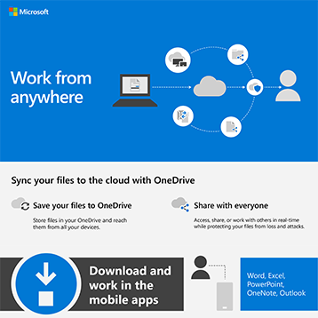

# Infográficos do Microsoft 365 para seus usuáriosMicrosoft 365 infographics for your users

Esses infográficos representam as práticas recomendadas para trabalhar e colaborar no Microsoft 365.These infographics represent best practices for working and collaborating in Microsoft 365. Compartilhe-os com seus usuários para ajudar a garantir que eles aproveitem o armazenamento seguro e o compartilhamento de arquivos, a realização de reuniões colaborativas e muito mais.Share them with your users to help ensure that they are taking advantage of secure storage and sharing for files, holding collaborative meetings, and more.

Encontre mais [infográficos do Office baixáveis](https://support.microsoft.com/office/great-ways-to-work-with-office-6fe70269-b9a4-4ef0-a96e-7a5858b3bd5a) no site de treinamento [do Microsoft 365.](https://support.microsoft.com/training)Find more [downloadable Office infographics](https://support.microsoft.com/office/great-ways-to-work-with-office-6fe70269-b9a4-4ef0-a96e-7a5858b3bd5a) on the [Microsoft 365 training](https://support.microsoft.com/training) site.

## Dicas de segurançaSecurity tips

Baixe este infográfico com dicas de segurança para os membros da sua equipe - se sua equipe é uma organização empresarial ou sem fins lucrativos, como uma campanha política:Download this infographic with security tips for the members of your team - whether your team is a business or nonprofit organization, such as a political campaign:

| ItemItem | DescriçãoDescription |
|:-----|:-----|
|   [Baixar como um PDF](../campaigns/downloads/M365CampaignsWhatCanUsersDoToSecure.pdf)  \  [Baixar como um PowerPoint](../campaigns/downloads/M365CampaignsWhatCanUsersDoToSecure.pptx)[Download as a PDF](../campaigns/downloads/M365CampaignsWhatCanUsersDoToSecure.pdf) \ [Download as a PowerPoint](../campaigns/downloads/M365CampaignsWhatCanUsersDoToSecure.pptx)| Compartilhe essas práticas recomendadas para manter as informações da sua organização seguras.Share these best practices for keeping your organization's information secure. Esse infográfico foi criado para dar suporte à equipe de campanhas políticas porque eles são direcionados por hackers sofisticados.This infographic was created to support the staff of political campaigns because these are targeted by sophisticated hackers. Você pode usar o PowerPoint para personalizar esse infográfico para sua própria organização.You are welcome to use the PowerPoint to customize this infographic for your own organization. Artigo relacionado: [como as recomendações de segurança para o Microsoft 365 afetam seus usuários](../campaigns/m365-campaigns-users.md)Related article: [How the security recommendations for Microsoft 365 affect your users](../campaigns/m365-campaigns-users.md)|

## Compartilhar seus arquivos de negóciosShare your business files

Baixe um infográfico para obter uma visão geral rápida das maneiras de compartilhar seus arquivos de negócios:Download an infographic to get a quick overview of ways to share your business files:
  
| ItemItem | DescriçãoDescription |
|:-----|:-----|
|   [Baixar como um PDF](https://go.microsoft.com/fwlink/?linkid=2079435)  \  [Baixar como um PowerPoint](https://go.microsoft.com/fwlink/?linkid=2079438)[Download as a PDF](https://go.microsoft.com/fwlink/?linkid=2079435) \ [Download as a PowerPoint](https://go.microsoft.com/fwlink/?linkid=2079438) | Use essas práticas recomendadas ao compartilhar e colaborar em arquivos de negócios para que você possa manter suas informações seguras e protegidas.Use these best practices when you share and collaborate on business files so you can keep your information secure and protected. Artigo relacionado: [Visão geral do compartilhamento de arquivos de negócios](../business-video/overview-file-sharing.md)Related article: [Overview of sharing business files](../business-video/overview-file-sharing.md)|

## Hospedar reuniões onlineHost online meetings

Baixe um infográfico para obter uma visão geral rápida de como ingressar ou hospedar uma reunião online com o Microsoft Teams:Download an infographic to get a quick overview of how to join or host an online meeting with Microsoft Teams:

| ItemItem | DescriçãoDescription |
|:-----|:-----|
|   [Baixar como um PDF](https://go.microsoft.com/fwlink/?linkid=2078712)  \  [Baixar como um PowerPoint](https://go.microsoft.com/fwlink/?linkid=2079515)[Download as a PDF](https://go.microsoft.com/fwlink/?linkid=2078712) \ [Download as a PowerPoint](https://go.microsoft.com/fwlink/?linkid=2079515) | Uma introdução rápida sobre como hospedar ou ingressar em uma reunião online com o Microsoft Teams.A quick introduction to how to host or join an online meeting with Microsoft Teams. Artigo relacionado: [Hospedar reuniões online para sua empresa](../business-video/overview-online-meetings.md)Related article: [Host online meetings for your business](../business-video/overview-online-meetings.md)|

## Trabalhe em praticamente qualquer lugarWork from anywhere

Baixe um infográfico para obter dicas para trabalhar em qualquer lugar:Download an infographic to get tips for working from anywhere:

| ItemItem | DescriçãoDescription |
|:-----|:-----|
|   [Baixar como um PDF](https://go.microsoft.com/fwlink/?linkid=2079451)  \  [Baixar como um PowerPoint](https://go.microsoft.com/fwlink/?linkid=2079455)[Download as a PDF](https://go.microsoft.com/fwlink/?linkid=2079451) \ [Download as a PowerPoint](https://go.microsoft.com/fwlink/?linkid=2079455) | Confira dicas de como configurar seus dispositivos móveis para permitir que você trabalhe em qualquer lugar.See tips for how to set up your mobile devices to allow you to work from anywhere. Artigo relacionado: [Trabalhar de qualquer lugar](../business-video/work-from-anywhere.md)Related article: [Work from anywhere](../business-video/work-from-anywhere.md)|

## Pesquisar clientes com FormuláriosSurvey customers with Forms

Baixe um infográfico para descobrir como sondar clientes (internos ou externos) com o Microsoft Forms:Download an infographic to find out how to survey customers (internal or external) with Microsoft Forms:

| ItemItem | DescriçãoDescription |
|:-----|:-----|
|   [Baixar como um PDF](https://go.microsoft.com/fwlink/?linkid=2079526)  \  [Baixar como um PowerPoint](https://go.microsoft.com/fwlink/?linkid=2079446)[Download as a PDF](https://go.microsoft.com/fwlink/?linkid=2079526) \ [Download as a PowerPoint](https://go.microsoft.com/fwlink/?linkid=2079446) | Use o Microsoft Forms para descobrir o que seus clientes pensam.Use Microsoft Forms to find out what your customers think. Artigo relacionado: [Coletar informações com o Microsoft Forms](https://support.microsoft.com/topic/collect-information-with-microsoft-forms-a55d6e0d-04f6-45b8-b05f-b141b8ecb4d5)Related article: [Collect information with Microsoft Forms](https://support.microsoft.com/topic/collect-information-with-microsoft-forms-a55d6e0d-04f6-45b8-b05f-b141b8ecb4d5)|
