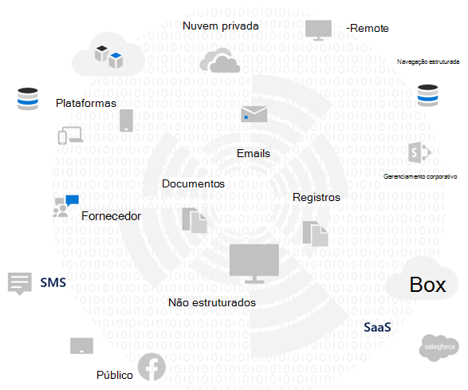
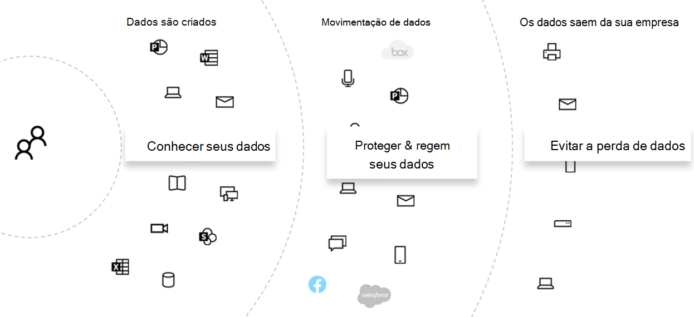
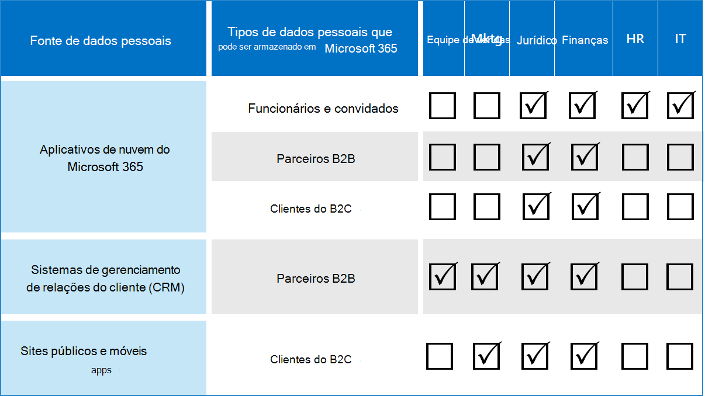

# Avaliar os riscos de privacidade de dados e identificar itens confidenciais com o Microsoft 365

Avaliar os regulamentos e os riscos de privacidade de dados aos quais sua organização está sujeita é uma primeira etapa importante antes de implementar qualquer ação de melhoria relacionada, incluindo aquelas que podem ser alcançadas com os recursos e serviços do Microsoft 365. 

## Regulamentos de privacidade de dados potencialmente aplicáveis

Para uma boa referência sobre a estrutura regulatória mais ampla para regulamentos de privacidade de dados, consulte o Portal de Confiança dos Serviços [microsoft](https://servicetrust.microsoft.com/) e a série de artigos sobre a regulamentação RGPD (Regulamento Geral sobre a Proteção de [Dados),](../compliance/gdpr.md)bem como outros materiais sobre os regulamentos aos quais você pode estar sujeito em seu setor ou região.

### RGPD

O RGPD, a mais conhecida e citada das regulamentações de privacidade de dados, regula a coleta, o armazenamento, o processamento e o compartilhamento de todos os dados pessoais relacionados a uma pessoa física identificada ou identificável residente da União Europeia (UE). 

De acordo com o Artigo 4 do RGPD: 

- "dados pessoais" significa qualquer informação relacionada a uma pessoa natural identificada ou identificável ('assunto dos dados'); uma pessoa natural identificável é aquela que pode ser identificada, direta ou indiretamente, em particular por referência a um identificador como um nome, um número de identificação, dados de localização, um identificador online ou um ou mais fatores específicos da identidade física, fisiológica, genética, mental, econômica, cultural ou social dessa pessoa natural.

### ISO 27001

A adesão a outros padrões, como a ISO 27001, também foi reconhecida por várias autoridades de supervisão europeias como um proxy válido de intenção em todo o espectro de pessoas, processos e tecnologias. Os padrões que especifica sobreposição e adesão a mecanismos de proteção orientados à ISO-27001 podem ser considerados um proxy que cumpre algumas obrigações de privacidade em determinadas circunstâncias.

### Outras regulamentações de privacidade de dados

Outros regulamentos de privacidade de dados proeminentes também especificam requisitos para o tratamento de dados pessoais.

Nos Estados Unidos, eles incluem o[CCPA](../compliance/ccpa-faq.md)(Ato de Proteção do Consumidor da Califórnia), HIPAA-HITECH (lei de privacidade de serviços de saúde dos Estados Unidos) e o Ato de Proteção do Consumidor da Califórnia (GLBA). Regulamentos adicionais específicos do estado também estão em vigor ou em desenvolvimento. 

Em todo o mundo, outros exemplos incluem a Lei Nacional de Implementação do RGPD (BDSG) da Alemanha, a LGPD (Lei de Proteção de Dados do Brasil) e muitos outros.

## Mapeamento de regulamentação para categorias de controle técnico do Microsoft 365

Muitos dos regulamentos relacionados à privacidade de dados têm requisitos sobrepostos, portanto, você deve compreender a quais regulamentações elas estão sujeitas antes de desenvolver qualquer esquema de controle técnico. 

Para referência posterior nos artigos desta solução geral, esta tabela fornece trechos de uma amostragem das regulamentações de privacidade de dados. 

| Regulamentação | Artigo/seção | Excerpt | Categorias de controle técnico aplicáveis |
|:-------|:-----|:-------|:-------|
| RGPD | Artigo 5(1)(f) | Os dados pessoais devem ser processados de maneira a garantir a segurança adequada dos dados pessoais, incluindo proteção contra processamento não autorizado ou ilegal e contra perda, destruição ou danos acidentais, usando medidas técnicas ou organizacionais apropriadas ('integridade e confidencialidade'.  |  (Tudo)   Identidade   Dispositivo   Proteção contra Ameaças   Proteger informações   Govern information   Descobrir e responder |
|  | Artigo (32)(1)(a) | Levando em conta o estado da arte, os custos de implementação e a natureza, o escopo, o contexto e as finalidades do processamento, bem como o risco de variação de probabilidade e gravidade para os direitos e liberdades das pessoas naturais, o controlador e o processador devem implementar medidas técnicas e organizacionais apropriadas para garantir um nível de segurança apropriado ao risco , incluindo, entre outras coisas, conforme apropriado: (a) a pseudonimização e a criptografia de dados pessoais. | Proteger informações |
|  | Artigo (13)(2)(a) | "... o controlador deve, no momento em que os dados pessoais são obtidos, fornecer ao assunto dos dados as seguintes informações adicionais necessárias para garantir o processamento justo e transparente: (a) o período para o qual os dados pessoais serão armazenados ou, se isso não for possível, os critérios usados para determinar esse período. | Govern information |
|  | Artigo (15)(1)(e) | O assunto dos dados deve ter o direito de obter do controlador a confirmação de que os dados pessoais relativos a ele estão ou não sendo processados, e se for esse o caso, o acesso aos dados pessoais e às seguintes informações: (e) a existência do direito de solicitar ao controlador a retificação ou eliminação de dados pessoais ou a restrição de processamento de dados pessoais referentes ao assunto dos dados ou a objeção a esse processamento | Descobrir e responder |
| LGPD | Artigo 46 | Os agentes de processamento devem adotar medidas de segurança, técnicas e administrativas capazes de proteger dados pessoais contra acessos não autorizados e situações acidentais ou ilegais de destruição, perda, alteração, comunicação ou qualquer tipo de processamento impróprio ou ilegal. | Proteger informações   Govern information   Descobrir e responder|
|  | Artigo 48 | O controlador deve se comunicar à autoridade nacional e ao titular dos dados a ocorrência de um incidente de segurança, que pode criar riscos ou danos relevantes aos titulares de dados. | Descobrir e responder |
| HIPPA-HITECH | 45 CFR 164.312 (e) (1) | Implementar medidas técnicas de segurança para se proteger contra o acesso não autorizado às informações de saúde eletrônicas protegidas que estão sendo transmitidas por uma rede de comunicações eletrônicas. | Proteger informações |
|  | 45 C.F.R. 164.312(e)(2)(ii) | Implementar um mecanismo para criptografar as informações de saúde eletrônicas protegidas sempre que se julgar apropriado. | Proteger informações |
|  | 45 CFR 164.312(c)(2) | Implementar mecanismos eletrônicos para corroborar se as informações de saúde eletrônicas protegidas não foram alteradas nem destruídas de maneira não autorizada. | Govern information |
|  | 45 CFR 164.316(b)(1)(i) | Se uma ação, atividade ou avaliação for exigida por essa subparte para ser documentada, mantenha um registro escrito (que pode ser eletrônico) da ação, atividade ou avaliação | Govern information |
|  | 45 CFR 164.316(b)(1)(ii) | Reter a documentação exigida pelo parágrafo (b)(1) desta seção por seis (6) anos a partir da data de criação ou da data em que esteve em vigor pela última vez, o que tiver ocorrido por último. | Govern information |
|  | 45 C.F.R. 164.308(a)(1)(ii)(D) | Implementar procedimentos para revisar regularmente registros de atividades do sistema de informações, como logs de auditoria, relatórios de acesso e relatórios de rastreamento de incidentes de segurança | Descobrir e responder |
|  | 45 C.F.R. 164.308(a)(6)(ii) | Identificar e responder a incidentes de segurança suspeitos ou conhecidos; atenuar, na medida do possível, os efeitos nocivos dos incidentes de segurança conhecidos pela entidade coberta ou parceiro comercial; e documentar incidentes de segurança e seus resultados. | Descobrir e responder |
|  | 45 C.F.R. 164.312(b) | Implemente mecanismos de hardware, software e procedimentos que registram e examinam a atividade em sistemas de informações que contenham ou usem informações de saúde eletrônicas protegidas. | Descobrir e responder |
| CCPA | 1798.105(c) | Uma empresa que recebe uma solicitação verificável de um consumidor para excluir as informações pessoais do consumidor de acordo com a subdivisão (a) desta seção deve excluir as informações pessoais do consumidor de seus registros e direcionar quaisquer provedores de serviços para excluir as informações pessoais do consumidor de seus registros | Descobrir e responder |
|  | 1798.105(d) | (exceções a 1798.105(c)   Uma empresa ou um provedor de serviços não deve ser obrigado a atender à solicitação de um consumidor para excluir as informações pessoais do consumidor, se for necessário que a empresa ou o provedor de serviços mantenha as informações pessoais do consumidor para: (consulte a regulamentação atual para obter informações adicionais). | Descobrir e responder |
|||||

>[!Important]
>Essa não se destina a ser uma lista exaustiva. Consulte o [Gerenciador de](../compliance/compliance-manager.md) Conformidade ou seu consultor jurídico ou de conformidade para obter mais informações sobre a aplicabilidade das seções citadas às categorias de controle técnico listadas.
>

## Conhecendo seus dados

Independentemente dos regulamentos aos quais você está sujeito, em que diferentes tipos de dados de usuários dentro e fora da sua organização interagem com seus sistemas são fatores importantes que podem afetar sua estratégia geral de proteção de dados pessoais, sujeitos aos regulamentos do setor e do governo que se aplicam à sua organização. Isso inclui onde os dados pessoais são armazenados, qual é o tipo e quanto deles existem e em quais circunstâncias eles foram coletados.
 

### Portabilidade de dados 

Os dados também se movem ao longo do tempo à medida que são processados, refinados e outras versões são derivados dele. Um instantâneo inicial nunca é suficiente. Precisa haver um processo contínuo para conhecer seus dados. Isso representa um dos maiores desafios para grandes organizações que lidam com volumes significativos de dados pessoais. As organizações que não abordam o problema "conheça seus dados" podem acabar com riscos muito altos e possíveis multas de órgãos regulamentadores.

 
### Onde estão os dados pessoais

Para abordar as regulamentações de privacidade de dados, você não pode confiar em noções gerais de onde você acha que os dados pessoais podem existir, agora ou no futuro. Os regulamentos de privacidade de dados exigem que as organizações comprovem que sabem onde os dados pessoais estão continuamente. Isso torna importante obter um instantâneo inicial de todas as suas fontes de dados para um possível armazenamento de informações pessoais, incluindo seu ambiente do Microsoft 365, e estabelecer mecanismos para monitoramento e detecção contínuos.

Se você ainda não tiver avaliado sua prontidão geral e o risco associados às regulamentações de privacidade de dados, use a estrutura de três etapas a seguir para começar. 

>[!Note]
>Este artigo e seu conteúdo não devem assumir o lugar de serviços de consultoria legal. Ele fornece apenas algumas diretrizes básicas e links para ferramentas que podem ser úteis nos estágios iniciais da sua avaliação.
>
 
## Etapa 1: Desenvolver uma compreensão fundamental dos cenários de dados pessoais da sua organização 

Você precisa avaliar a exposição ao risco de privacidade de dados com base no tipo de dados pessoais que ele gerencia atualmente, onde eles estão armazenados, quais controles de proteção são colocados nele, como seu ciclo de vida é gerenciado e quem tem acesso a eles. 

Como ponto de partida, é importante inventariá-los em seu ambiente do Microsoft 365. Use estas categorias:

- Dados de funcionários necessários para executar funções diárias de negócios
- Dados que a organização tem sobre seus clientes comerciais, parceiros e outras relações no cenário de negócios para negócios (B2B)
- Dados que a organização tem sobre os consumidores que fornecem informações para serviços online que a organização gerencia no cenário de negócios para cliente (B2C)

Aqui está um exemplo dos diferentes tipos de dados para departamentos típicos de uma organização.

Grande parte dos dados pessoais sujeitos à regulamentação de privacidade de dados geralmente é coletada e armazenada fora do Microsoft 365. Quaisquer dados pessoais de aplicativos móveis ou da Web voltados para o consumidor precisariam ser exportados desses aplicativos para o Microsoft 365 para ficar sujeito à análise da privacidade de dados no Microsoft 365. 

Sua exposição à privacidade de dados no Microsoft 365 pode ser mais limitada em relação aos seus aplicativos Web e sistemas CRM, que essa solução não aborda.

Também é importante pensar nos seguintes desafios comuns de conformidade de privacidade de dados ao avaliar seu perfil de risco:

 - **Distribuição de dados pessoais.** Qual é a dispersão de informações sobre um determinado assunto? É conhecido o suficiente para convencer órgãos reguladores de que os controles adequados estão em funcionamento? Pode ser investigado e remediado, se necessário?
- **Proteção contra exfiltração.** Como você protege os dados pessoais de um determinado tipo ou fonte de serem comprometidos e como responder se foram?
- **Proteção versus risco.** Quais mecanismos de proteção de informações são apropriados em relação ao risco e como manter a continuidade e a produtividade dos negócios e minimizar o impacto do usuário final se a intervenção do usuário final for necessária? Por exemplo, a classificação manual ou a criptografia devem ser usadas?
- **Retenção de dados pessoais.** Por quanto tempo as informações que contêm dados pessoais precisam ser mantidas por motivos comerciais válidos e como evitar práticas de manter para sempre, balanceadas com as necessidades de retenção para a continuidade dos negócios?
- **Manipulação de solicitações de assunto de dados.** Quais mecanismos serão necessários para lidar com solicitações de assunto de dados (DSRs) e quaisquer ações corretivas, como anonimato, redação e exclusão?
- **Monitoramento e relatórios contínuos.** Que tipo de técnicas diárias de monitoramento, investigação e relatório estão disponíveis para os diferentes tipos e fontes de dados?
- **Limitações do processamento de dados.** Há limitações no uso de dados para informações coletadas ou armazenadas por meio desses métodos que a organização deve refletir nos controles de privacidade? Por exemplo, os compromissos de que os dados pessoais não serão usados pela equipe de vendas podem exigir que sua organização coloque mecanismos no local para impedir a transferência ou armazenamento dessas informações em sistemas associados à organização de vendas.

### Dados de funcionários necessários para executar funções diárias de negócios

As organizações, por natureza, precisam coletar dados sobre funcionários para fins de identidade eletrônica e RH, sujeitos ao que eles concordam em seus contratos de funcionários. Desde que uma pessoa trabalhe em uma empresa, isso normalmente não é um problema. A organização pode querer colocar mecanismos no lugar para evitar que atores mal-intencionados exfiltram ou vazamento de dados pessoais de funcionários. 

Se uma pessoa sair de uma empresa, as organizações geralmente têm agendas de processos, procedimentos e retenção e exclusão para remover contas de usuário, descomissionar caixas de correio e unidades pessoais e alterar o status do funcionário em coisas como sistemas de recursos humanos. Para situações em que o litígio está envolvido, um funcionário ou outra parte de uma investigação legal pode ter motivos válidos para obter informações sobre dados pessoais armazenados nos sistemas da organização. Em algumas ocasiões, essa parte pode solicitar que esses dados sejam removidos ou anonimizados. 

Para atender a essas necessidades, as organizações devem ter processos e procedimentos no local que a fim de atender às necessidades preventivas, descontantes e corretivas para facilitar essas solicitações, notando que algumas informações sobre um funcionário podem ser razoavelmente consideradas cruciais para a continuidade dos negócios. Por exemplo, informações de que um indivíduo escreveu um arquivo ou realizou uma função. 

>[!Note]
>Para técnicas de investigação e correção de dados pessoais no Microsoft 365, consulte o [monitor e responda ao artigo.](information-protection-deploy-monitor-respond.md) Você também pode querer empregar esquemas automatizados de classificação e proteção para garantir que os dados pessoais são controlados enquanto estão dentro da organização, bem como impedir que eles deixam a organização em situações de ator mal-intencionado. Consulte o [artigo sobre proteção de informações](information-protection-deploy-protect-information.md) para obter mais informações.
>
 
### Dados que a organização tem sobre seus clientes comerciais no cenário B2B

A coleção de informações B2B também é um desafio porque sua organização pode precisar manter registros de nomes de clientes e transações em seus diversos sistemas para fins de continuidade de negócios e ainda proteger essas informações contra exfiltração inadvertida ou mal-intencionada. Assim como os dados dos funcionários, as organizações devem ter políticas, procedimentos e controles técnicos para proteger esses dados, bem como age-los de acordo com os agendamentos definidos de retenção e exclusão. 

Normalmente, os contratos com clientes externos, parceiros e outras entidades com as quais a organização faz negócios terão idioma para lidar com a manipulação desses dados, incluindo proteção, retenção e exclusão durante e após a entidade ter um relacionamento com a organização. 

### Dados que a organização tem sobre os consumidores que fornecem informações para serviços online que a organização gerencia no cenário B2C

Essa categoria é a que mais pessoas pensa em relação à privacidade de dados, devido a muitas instâncias públicas de vazamento de dados do cliente. Isso pode ser intencional, como um terceiro sob contrato com o provedor, ou não intencional, como exfiltração por um ator mal-intencionado. A proteção de dados do consumidor é um dos principais motivos pelos quais a UE e outros regulamentos foram aprovados. Os regulamentos de privacidade de dados, como o RGPD e o CCPA, exigem que você faça o planejamento para:

- [Planos de ação](../compliance/gdpr-action-plan.md) e [listas de verificação de preparação de responsabilidade](../compliance/gdpr-arc-office365.md)
- [Avaliações do Impacto sobre a Proteção dos Dados](../compliance/gdpr-data-protection-impact-assessments.md)
- [Notificações de violação](../compliance/gdpr-breach-office365.md)
- [Solicitações de entidades de dados](../compliance/gdpr-dsr-office365.md)

Se sua organização não faz muitas coletas diretas de dados do consumidor, essa categoria pode ser menos um problema. No entanto, talvez você ainda precise passar pelos processos descritos nestes artigos para obter conformidade.

### Resumo da etapa 1

Compreender sua exposição a riscos e à regulamentação de privacidade de dados é uma primeira etapa importante e baseada em uma compreensão básica dos cenários de dados pessoais da sua organização.

Se você não tiver dados pessoais de consumidores em seu ambiente do Microsoft 365 ou se ele estiver confinado a determinadas partes do ambiente e a necessidade de um controle técnico estiver predicado em que haja exposição de dados do tipo consumidor, esse controle técnico talvez só precise ser empregado em partes de alto risco do ambiente, não em todos os lugares.

Embora uma organização externa ou uma recomendação padrão do conjunto de controles, como o Gerenciador de Conformidade no Microsoft 365, possa ajudar a informar sua estratégia de controle, sua escolha de implementação deve ser orientada pelo reconhecimento do inventário de dados para quantificar sua exposição real a riscos.

A maioria das organizações terá alguma exposição a um dos cenários acima. É importante ter uma abordagem holística para a avaliação.

## Etapa 2: Avalie sua preparação para estar em conformidade com as regulamentações de privacidade de dados

Embora específica para o RGPD, as perguntas colocadas na ferramenta gratuita de avaliação de [RGPD](https://www.microsoft.com/cyberassessment/en/gdpr/uso365) da Microsoft fornecem um bom começo para entender sua preparação geral de privacidade de dados. 

As organizações sujeitas a outras regulamentações de privacidade de dados, como CCPA nos Estados Unidos ou LGPD do Brasil, também podem se beneficiar do inventário de preparação dessa ferramenta devido a provisões sobrepostas com o RGPD.

A avaliação de RGPD consiste nestas seções:

| Seção | Descrição |
|:-------|:-----|
| Governança | <ol><li>Sua política de privacidade informa explicitamente quais informações de dados estão sendo processadas? </li><li>Você executar regularmente as Avaliações de Impacto de Privacidade (PIAs)? </li><li> Você usa uma ferramenta para gerenciar informações pessoais (PI)? </li><li> Você tem autoridade legal para conduzir negócios usando dados de PI em um determinado indivíduo? Você rastreia o consentimento de dados? </li><li> Você rastreia, implementa e gerencia controles de auditoria? Você monitora se há vazamentos de dados? </li></ol>|
| Exclusão e notificação | <ol><li>Você dá instruções explícitas sobre como os dados dos usuários podem ser acessados? </li><li> Você tem processos documentados em andamento para lidar com a aceitação de consentimento? </li><li> Você tem um processo de Exclusão Automatizada para dados? </li><li>   Você tem um processo para validar a identidade ao interagir com um cliente? </li></ol>|
| Mitigação de riscos e segurança de informações | <ol><li>Você usa ferramentas para verificar dados não estruturados? </li><li>Todos os servidores estão atualizados e você aproveita os firewalls para protegê-los? </li><li>Você executar backups regulares de seus servidores? </li><li>Você monitora ativamente se há vazamentos de dados? </li><li>Você criptografa seus dados em repouso e em transmissão? </li></ol>|
| Gerenciamento de políticas | <ol><li>Como você gerencia suas Regras Corporativas vinculativas (BCRs)? </li><li>Você rastreia o consentimento de dados? </li><li> Em uma escala de 1 a 5, sendo 5 completamente cobertos, seus contratos abrangem as classificações de dados e os requisitos de tratamento? </li><li>Você tem e testa regularmente um plano de resposta a incidentes? </li><li>Qual política você usa para gerenciar o acesso? </li></ol>|
|||
 
## Etapa 3: identifique os tipos de informações confidenciais que ocorrem em seu ambiente do Microsoft 365. 

Esta etapa envolve a identificação de determinados tipos de informações confidenciais que estão sujeitos a controles regulamentar específicos, bem como a ocorrência deles em seu ambiente do Microsoft 365. 

Localizar conteúdo em seu ambiente que contenha pessoal pode ser uma tarefa complexa, anteriormente envolvendo uma combinação de uso da Pesquisa de Conformidade, Descobertas e Descobertas, Descobertas Avançadas, DLP e auditoria. 

Com a  nova solução de Classificação de Dados no Centro  de administração de Conformidade da Microsoft, isso ficou muito mais fácil com o recurso Explorador de Conteúdo, que funciona com tipos de informações confidenciais integrados ou personalizados, incluindo aqueles relacionados a dados pessoais.
 
### Tipos de informações confidenciais

O Centro de administração de Conformidade da Microsoft vem pré-carregado com mais de 100 tipos de informações confidenciais, a maioria deles relacionados à identificação e localização de dados pessoais. Esses tipos de informações confidenciais integrados podem ajudar a identificar e proteger números de cartão de crédito, números de contas bancárias, números de passaporte e muito mais, com base em padrões definidos por uma expressão regular (regex) ou uma função. Para saber mais, consulte [O que os tipos de informações confidenciais procuram](../compliance/what-the-sensitive-information-types-look-for.md).

Se você precisar identificar e proteger um tipo específico da organização ou regional de itens confidenciais, como um formato personalizado para IDs de funcionários ou outras informações pessoais ainda não cobertas por um tipo de informação sensível integrado, você pode criar um tipo personalizado de informação sensível com estes métodos: 

- PowerShell
- Regras personalizadas com EDM (exact data match)
- Por meio da interface do usuário do administrador do Centro de Conformidade, conforme realçado no artigo [Usar Pontuação de](information-protection-deploy-compliance.md) Conformidade e Gerenciador de Conformidade

Você também pode personalizar um tipo de informação confidenciais existente e integrado.

Confira estes artigos para obter mais informações:

- [Personalizar um tipo de informação confidencial interno](../compliance/customize-a-built-in-sensitive-information-type.md)
- [Saiba mais sobre os tipos de informações confidenciais](../compliance/sensitive-information-type-learn-about.md)
- [Criar um tipo personalizado de informação confidencial no Centro de Conformidade e Segurança](../compliance/create-a-custom-sensitive-information-type.md)
- [Crie um tipo personalizado de informação confidencial no PowerShell do Centro de Conformidade e Segurança](../compliance/create-a-custom-sensitive-information-type-in-scc-powershell.md)
- [Criar tipos personalizados de informações confidenciais com classificação baseada em Exact Data Match](../compliance/create-custom-sensitive-information-types-with-exact-data-match-based-classification.md)

### Explorador de Conteúdo

Uma ferramenta importante para determinar a ocorrência de itens  confidenciais em seu ambiente é o novo Explorador de Conteúdo no Centro de administração de Conformidade do Microsoft 365. É uma ferramenta automatizada para verificação inicial e contínua de toda a sua assinatura do Microsoft 365 para a ocorrência de tipos de informações confidenciais e exibição dos resultados.
 
A nova ferramenta Explorador de Conteúdo permite identificar rapidamente os locais de itens confidenciais em seu ambiente, usando tipos de informações confidenciais integrados ou personalizados. Isso pode envolver o estabelecimento de um processo e a responsabilidade atribuída para investigar regularmente a presença e o local de itens confidenciais.

Juntamente com as outras etapas destacadas neste artigo, isso fornece um ponto de partida para identificar a exposição, a preparação e o local geral de itens confidenciais a serem protegidos por meio de configuração e monitoramento planejados do Microsoft 365. 

### Outros métodos para identificar dados pessoais em seu ambiente

Além do Explorador de Conteúdo, as organizações têm acesso ao recurso pesquisa de conteúdo para produzir pesquisas personalizadas para encontrar dados pessoais em seu ambiente, usando critérios de pesquisa avançados e filtros personalizados.

Orientações detalhadas sobre o uso da Pesquisa de Conteúdo para descoberta de dados pessoais são fornecidas [neste artigo.](../compliance/search-for-and-find-personal-data.md) A Pesquisa de Conteúdo e outras técnicas de descoberta também são exploradas [em DSRs para o RGPD e CCPA.](../compliance/gdpr-dsr-office365.md#introduction-to-dsrs)

Informações adicionais sobre técnicas de investigação e correção para dados pessoais no Microsoft 365 são fornecidas no monitor e [no artigo de resposta.](information-protection-deploy-monitor-respond.md)
