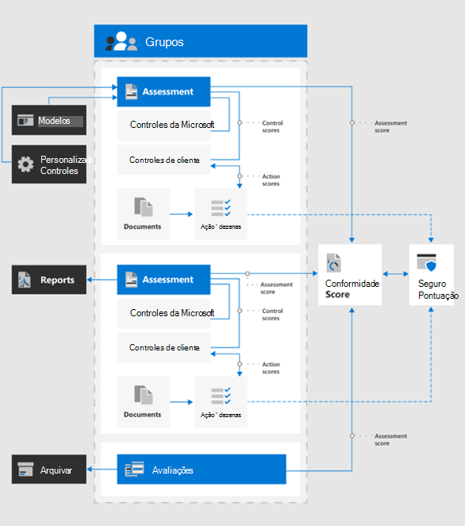
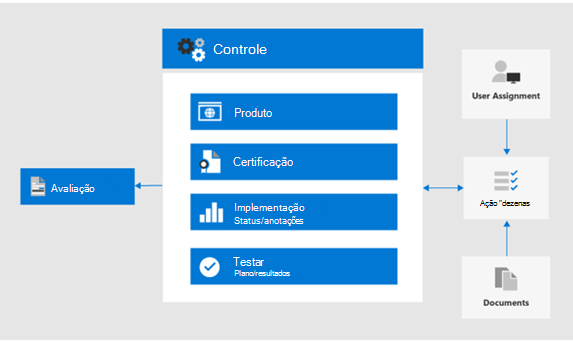

# Usar Pontuação de conformidade e gerente de conformidade para gerenciar ações de melhoria

A pontuação de conformidade da Microsoft e o gerente de conformidade podem ser usados em conjunto para gerenciar melhorias relacionadas a regulamentações de privacidade de dados, como a regulamentação geral de proteção de dados da União Européia [(rgpd)](../compliance/gdpr.md), a [Califórnia Consumer Protection Act CCPA)](../compliance/ccpa-faq.md), HIPAA-alta (lei de privacidade do atendimento aos EUA) e o LGPD (lei de proteção de dados) do Brasil. 

Este artigo fornece orientações sobre o uso dessas ferramentas para fins de privacidade de dados.

>[!Note]
>As ações do cliente fornecidas no gerente de conformidade são recomendações. Você pode avaliar a eficácia dessas recomendações em seus ambientes regulatórios antes da implementação. As recomendações do Gerenciador de conformidade não devem ser interpretadas como garantia de conformidade.
>

## Atualizações planejadas para Pontuação de conformidade e gerente de conformidade

A [Pontuação de conformidade](../compliance/compliance-score.md) (atualmente em visualização) requer a adição de avaliações de destino para uma regulamentação (como rgpd) a partir do Gerenciador de [conformidade](../compliance/compliance-manager-overview.md). Em uma versão futura, grande parte da funcionalidade no gerente de conformidade será mesclada em uma experiência de Pontuação de conformidade unificada, reduzindo a necessidade de várias ferramentas.

Aqui estão as ferramentas para sua assinatura, que exigem a entrada:

- [Pontuação de conformidade no centro de administração de conformidade da Microsoft](https://compliance.microsoft.com/compliancescore)
- [Gerenciador de conformidade no portal de confiança dos serviços da Microsoft](https://servicetrust.microsoft.com/ComplianceManager/V3)

## Introdução ao Gerenciador de conformidade 

O [Gerenciador de conformidade](../compliance/working-with-compliance-manager.md) (atualmente em versão prévia) é uma ferramenta de avaliação de riscos baseada em fluxo de trabalho gratuita no portal de confiança do serviço Microsoft para gerenciar atividades de conformidade regulatória relacionadas aos serviços em nuvem da Microsoft. Como parte da sua assinatura do Microsoft 365 ou do Azure Active Directory (Azure AD), o Gerenciador de conformidade ajuda a gerenciar a conformidade normativa no modelo de responsabilidade compartilhada para os serviços de nuvem da Microsoft.

Embora você possa exibir sua pontuação de conformidade geral e realizar várias outras funções na página de **Pontuação de conformidade** do centro de conformidade, é necessário usar o Gerenciador de conformidade por meio do portal de confiança de serviços para configurar primeiro as avaliações para suas regulamentações de privacidade de dados. Os dados dessas avaliações serão mostrados na pontuação de conformidade para visualização e filtragem posteriores. 

Usando a interface do Gerenciador de conformidade, você pode selecionar um ou mais modelos de regulamentação relacionados à privacidade de dados e agrupá-los para avaliar e acompanhar as ações de melhorias necessárias no conjunto. Você também pode exibir informações sobre os controles que cada regulamentação chama para específico para o serviço de destino, separado por Microsoft vs. controles gerenciados pelo cliente.

As avaliações e o status de melhorias selecionados aqui também aparecem na pontuação de conformidade no centro de conformidade da Microsoft, que enfatiza a importância da configuração inicial no Gerenciador de conformidade. Essas relações são mostradas nesta figura.
 

Aqui estão as principais etapas para ajudá-lo a começar.

### 1. modelos de avaliação

A partir do Gerenciador de conformidade, a primeira etapa é adicionar avaliações específicas às leis de privacidade de dados de interesse e incluí-las em um grupo de "regulamentações de privacidade de dados" definido.

Os [grupos](../compliance/working-with-compliance-manager.md#groups) são contêineres que permitem organizar as avaliações e compartilhar informações comuns e tarefas de fluxo de trabalho entre avaliações que têm o mesmo ou controles relacionados gerenciados pelo cliente. Quando duas avaliações diferentes no mesmo grupo compartilham o controle gerenciado pelo cliente, a conclusão dos detalhes da implementação, teste e status do controle são automaticamente sincronizadas com o mesmo controle em qualquer outra avaliação no grupo. Isso unifica os itens de ação atribuídos para cada controle no grupo e reduz o trabalho de duplicação. 

Você também pode optar por usar grupos para organizar. Avaliações por ano, área, padrão de conformidade ou outros agrupamentos para ajudar a organizar seu trabalho de conformidade.

### 2. itens de ação

Depois que as avaliações forem adicionadas, você poderá exibir itens de ação específicos para cada grupo ou regulamentação individual:

- **Lista de ações de melhoria.** Navegue até a lista itens de ação e exiba as ações de melhoria associadas às regulamentações incluídas no grupo. Várias regras de extensão de ações para um único item de lista pode representar várias regulamentações. 
 
- **Filtragem de ação de melhoria.** Para muitas normas e grupos de privacidade de dados, a lista de ações de melhoria pode ser muito grande, portanto, considere filtrar a lista usando a menu suspenso de filtro. Por exemplo, se você selecionar "controles técnicos", a lista será reduzida a apenas aqueles que têm uma implementação técnica na organização, pois muitas das ações estão relacionadas a operações administrativas em vários aspectos da empresa que também estão documentados no Gerenciador de conformidade. Neste artigo, vamos nos concentrar nos controles técnicos, portanto, essa abordagem de filtragem é recomendada.
 
- **Informações adicionais e revisão.** Para cada ação, você pode clicar no link para **ler mais**, que informa mais sobre a atividade recomendada ou **revisão**, que abre um formulário permitindo que você faça o seguinte:
 
   - Atribua a ação a uma pessoa em sua organização para gerenciar
   - Gerenciar documentos relacionados ao endereçamento da ação
   - Especificar o status do item
   - Especificar datas de implementação e teste
   - Registre informações adicionais, notas de implementação e observações do plano de teste para a ação de assunto
  
- **Itens não aplicáveis como fora do escopo.** Algumas ações de aperfeiçoamento incluídas na lista de itens de ação podem não se aplicar à sua implementação planejada. Você pode especificar que eles estão fora do escopo no Gerenciador de conformidade e remover a ação e suas evidências do cálculo do valor da Pontuação de conformidade. 

Por exemplo, se sua organização tiver optado por usar a chave gerenciada da Microsoft ", uma recomendação para usar a chave do cliente não será aplicável à sua implantação. Nesse caso, sua organização deve marcá-la como **não no escopo** nas **ações de controle** para o modelo normativo aplicável.
 
### 3. informações de controles

Para um modo de exibição específico de avaliação, exiba as [informações de controles](../compliance/compliance-manager-overview.md#controls) de cada grupo de avaliação. Isso fornece um modo de exibição específico de avaliação, que é diferença da lista de itens de ação, que fornece um modo de exibição específico do controle técnico.
 

Navegue até a lista de **informações de controles** e exiba a lista de serviços no escopo para a regulamentação em questão. 
 
Grupos de controle específicos da regulamentação listam as ações fornecidas pela área de controle para cada área de serviço. Para cada conjunto de ações, o gerente de conformidade oferece mais informações sobre a ação e pode sugerir ou fornecer opções de revisão para ajudar a organização a escolher uma abordagem de controle.
 
Observe que essa interface fornece a capacidade de exibir detalhes específicos da ação técnica, juntamente com o status de ações relacionadas ao controle e o contexto suplementar sobre as normas às quais a ação está relacionada.

### 4. download de modelo

Para aqueles mais familiarizados com a análise normativa baseada em planilha, outra abordagem é baixar o modelo para cada avaliação usando a lista de modelos. Os modelos baixados listam as informações normativas e de controle técnico para cada modelo e podem ser mais fácil para determinadas funções de navegar/filtrar e gerar modos de exibição específicos de negócios.
 
Você também pode adicionar um novo modelo personalizado para sua organização com base em um modelo existente, usando **Adicionar modelo**. Isso exige que você baixe um modelo de escolha (como HIPAA/alta tecnologia)) e, em seguida, modifique-o para seus objetivos e carregue-o novamente na ferramenta Gerenciador de conformidade, em que agora ele conduzirá avaliações e pontuações semelhantes a outros modelos e avaliações como parte do conjunto de ferramentas do Gerenciador de conformidade geral e da Pontuação de conformidade.
 
>[!Tip]
>Se estiver lidando com um grande número de regulamentos ou ações de melhoria sobrepostas, considere baixar cada modelo e combinar os conjuntos de dados, remover ações de melhoria ou tipos de controle que não se aplicam à sua organização e recarregar. Isso pode ser mais fácil do que navegar a cada seção de informações de controle e marcá-la como fora do escopo.
>

## Pontuação de Conformidade

Depois que as especificações de avaliação e análise são realizadas no gerente de conformidade, agora você pode ir para a ferramenta [Pontuação de conformidade](../compliance/working-with-compliance-score.md) e examinar a pontuação e os dados mais detalhadamente, incluindo a área de controle.

A ferramenta de Pontuação de conformidade no centro de administração de conformidade da Microsoft 365 fornece várias abordagens para analisar e filtrar os dados de conformidade obtidos do Gerenciador de conformidade e vários serviços da Microsoft 365. Essa ferramenta é atualizada automaticamente quando várias definições de configuração são implementadas e compartilha sinais com a pontuação segura da Microsoft para que várias ações de melhorias sejam exibidas em ambas as pontuações. 
 
A pontuação de conformidade fornece:

- Uma pontuação coletada, dividida pela Microsoft e pelos controles gerenciados pelo cliente
- Um acúmulo de ações de melhoria e status de conclusão
- Uma lista das soluções 365 da Microsoft que impactam a sua pontuação

### Como a pontuação de conformidade é calculada

Em suma, a pontuação é calculada com base em uma combinação de implementações de controle da Microsoft e gerenciadas pelo cliente, conforme explicado em mais detalhes no [artigo de cálculo de Pontuação de conformidade da Microsoft](../compliance/compliance-score-methodology.md).

Os controles recebem um valor de pontuação com base no fato de serem obrigatórios ou discricionários, e se são preventivos, de detecção ou corretivas. Eles representam coletivamente o risco de não implementá-lo em relação a outros controles.

Conforme apresentado no artigo de cálculo de Pontuação de conformidade da Microsoft, os controles preventivos recebem uma pontuação maior do que a detecção e correções, e os controles obrigatórios recebem uma pontuação maior do que aqueles discricionários.
 
Observe que o administrador da Pontuação de conformidade não lista esses parâmetros, nem oferece a capacidade de filtrá-los. No entanto, se você baixar o modelo associado da ferramenta Gerenciador de conformidade, o conjunto de dados resultante listará esses parâmetros para a maioria das regulamentações.

Para controles técnicos, a pontuação de conformidade atualizará automaticamente a pontuação de ação de melhoria após a ativação do recurso relacionado. Outras ações de controle não-técnicos, como &mdash; as que são operacionais ou relacionadas à documentação &mdash; precisam ser registradas manualmente na ferramenta Gerenciador de conformidade no portal de confiança de serviços. 

Você também pode implementar algumas ações de aperfeiçoamento para outros fins &mdash; , por exemplo, usando os rótulos de retenção por razões diferentes da conformidade com a regulamentação de privacidade de dados &mdash; , para que você possa obter o crédito de usar esse recurso, mesmo que ele esteja sendo usado para outros fins, e não faça parte de uma ação de conformidade deliberada.

A pontuação de conformidade deve ser considerada uma medida relativa para acompanhar a melhoria em uma escala ampla. Você não deve buscar uma pontuação perfeita. 

### Orientações adicionais

Aqui estão algumas dicas importantes para o uso da Pontuação de conformidade e do gerente de conformidade para obter conformidade com as normas de privacidade de dados:

- Cada regulamentação de privacidade de dados tem uma combinação de controles técnicos, especificações de documentação e requisitos operacionais, de processo e de relatórios. Todos eles aparecem nas ações de melhoria. 

- Este artigo se concentra em um subconjunto dos controles técnicos especificados para a privacidade dos dados no gerente de conformidade e na pontuação de conformidade. Consulte a ferramenta e a [documentação](../compliance/working-with-compliance-score.md) do Gerenciador de conformidade para obter mais informações sobre controles administrativos não técnicos.

- Para focalizar o modo de exibição de ações de aperfeiçoamento para a sua área de interesse, você pode filtrar por tipo de ação na guia **soluções** no administrador de Pontuação de conformidade.

- A importância relativa e a prioridade das ações de melhoria identificadas na pontuação de conformidade devem ser consideradas como parte de uma análise de risco mais ampla, juntamente com o risco de privacidade dos dados que você determinou que sua organização precisa gerenciar. 

- Se você é uma organização global e adiciona vários modelos de regulamentação de privacidade de dados ao gerente de conformidade como avaliações, a pontuação de conformidade combinará cada um em uma lista de campos para cada ação de aprimoramento.
 
- Mesmo com a agregação de ações de melhoria em vários requisitos regulatórios, se os modelos de avaliação da regulamentação para RGPD, LGPD, CCPA e HIPAA-alta são selecionados, por exemplo, quase 400 ações de melhoria serão listadas na pontuação de conformidade. Para resolver melhor essa lista extensa, use o filtro ação de melhoria para reduzir o conjunto de resultados para uma lista mais gerenciável.

- O filtro de categorias fornece um meio para filtrar ações de aperfeiçoamento por agrupamento lógico, que os artigos rastrear, evitar, proteger, reter e investigar nesta solução geral alinham-se a. 

- Alguns dos controles listados nas ações de melhoria podem ser considerados mais diretamente vinculados a um artigo normativo específico, enquanto outros controles podem ser mais indiretamente associados ao espírito de uma regulamentação e, muitas vezes, apenas coisas que você deve considerar.

