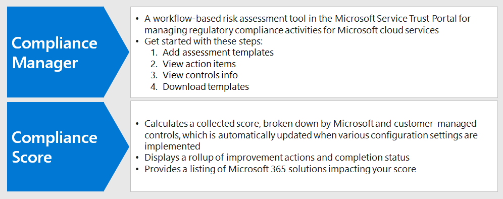

# Usar Pontuação de conformidade e gerente de conformidade para gerenciar ações de melhoriaUse Compliance Score and Compliance Manager to manage improvement actions

A pontuação de conformidade da Microsoft e o gerente de conformidade podem ser usados em conjunto para gerenciar melhorias relacionadas a regulamentações de privacidade de dados, como a regulamentação geral de proteção de dados da União Européia [(rgpd)](../compliance/gdpr.md), a [Califórnia Consumer Protection Act CCPA)](../compliance/ccpa-faq.md), HIPAA-alta (lei de privacidade do atendimento aos EUA) e o LGPD (lei de proteção de dados) do Brasil.Microsoft Compliance Score and Compliance Manager can be used together to manage improvements related to data privacy regulations such as the European Union [General Data Protection Regulation (GDPR)](../compliance/gdpr.md), [California Consumer Protection Act CCPA)](../compliance/ccpa-faq.md), HIPAA-HITECH (US health care privacy act), and the Brazil Data Protection Act (LGPD). 

Este artigo fornece orientações sobre o uso dessas ferramentas para fins de privacidade de dados.This article provides guidance on the use of these tools for data privacy purposes.

>[!Note]
>As ações do cliente fornecidas no gerente de conformidade são recomendações.The customer actions provided in Compliance Manager are recommendations. Você pode avaliar a eficácia dessas recomendações em seus ambientes regulatórios antes da implementação.It is up to you to evaluate the effectiveness of these recommendations in your regulatory environments prior to implementation. As recomendações do Gerenciador de conformidade não devem ser interpretadas como garantia de conformidade.Compliance Manager recommendations should not be interpreted as a guarantee of compliance.
>

## Atualizações planejadas para Pontuação de conformidade e gerente de conformidadePlanned updates for Compliance Score and Compliance Manager

A [Pontuação de conformidade](../compliance/compliance-score.md) (atualmente em visualização) requer a adição de avaliações de destino para uma regulamentação (como rgpd) a partir do Gerenciador de [conformidade](../compliance/compliance-manager-overview.md).[Compliance Score](../compliance/compliance-score.md) (currently in preview) requires adding your target assessments for a regulation (such as GDPR) from the [Compliance Manager](../compliance/compliance-manager-overview.md). Em uma versão futura, grande parte da funcionalidade no gerente de conformidade será mesclada em uma experiência de Pontuação de conformidade unificada, reduzindo a necessidade de várias ferramentas.In a future release, much of the functionality in Compliance Manager will be merged into a unified Compliance Score experience, reducing the need for multiple tools.

Aqui estão as ferramentas para sua assinatura, que exigem a entrada:Here are the tools for your subscription, which require you to sign-in:

- [Pontuação de conformidade no centro de administração de conformidade da MicrosoftCompliance Score in the Microsoft Compliance admin center](https://compliance.microsoft.com/compliancescore)
- [Gerenciador de conformidade no portal de confiança dos serviços da MicrosoftCompliance Manager in the Microsoft Services Trust Portal](https://servicetrust.microsoft.com/ComplianceManager/V3)

## Introdução ao Gerenciador de conformidadeGetting started with Compliance Manager 

O [Gerenciador de conformidade](../compliance/working-with-compliance-manager.md) (atualmente em versão prévia) é uma ferramenta de avaliação de riscos baseada em fluxo de trabalho gratuita no portal de confiança do serviço Microsoft para gerenciar atividades de conformidade regulatória relacionadas aos serviços em nuvem da Microsoft.[Compliance Manager](../compliance/working-with-compliance-manager.md) (currently in preview) is a free workflow-based risk assessment tool in the Microsoft Service Trust Portal for managing regulatory compliance activities related to Microsoft cloud services. Como parte da sua assinatura do Microsoft 365 ou do Azure Active Directory (Azure AD), o Gerenciador de conformidade ajuda a gerenciar a conformidade normativa no modelo de responsabilidade compartilhada para os serviços de nuvem da Microsoft.As part of your Microsoft 365 or Azure Active Directory (Azure AD) subscription, Compliance Manager helps you manage regulatory compliance within the shared responsibility model for Microsoft cloud services.

Embora você possa exibir sua pontuação de conformidade geral e realizar várias outras funções na página de **Pontuação de conformidade** do centro de conformidade, é necessário usar o Gerenciador de conformidade por meio do portal de confiança de serviços para configurar primeiro as avaliações para suas regulamentações de privacidade de dados.While you can view your overall compliance score and perform a number of other functions in the Compliance center's **Compliance Score** page, you need to use Compliance Manager through the Services Trust Portal to first configure assessments for your data privacy regulations. Os dados dessas avaliações serão mostrados na pontuação de conformidade para visualização e filtragem posteriores.Data from these assessments will then show up in Compliance Score for further viewing and filtering. 

Usando a interface do Gerenciador de conformidade, você pode selecionar um ou mais modelos de regulamentação relacionados à privacidade de dados e agrupá-los para avaliar e acompanhar as ações de melhorias necessárias no conjunto.Using the Compliance Manager interface, you can select one or more data privacy-related regulation templates and group them to assess and track required improvement actions across the set. Você também pode exibir informações sobre os controles que cada regulamentação chama para específico para o serviço de destino, separado por Microsoft vs. controles gerenciados pelo cliente.You can also view information about the controls each regulation calls for specific to the target service, separated by Microsoft vs. customer-managed controls.

As avaliações e o status de melhorias selecionados aqui também aparecem na pontuação de conformidade no centro de conformidade da Microsoft, que enfatiza a importância da configuração inicial no Gerenciador de conformidade.Assessments and improvement status selected here also appear in Compliance Score in the Microsoft Compliance Center, which emphasize the importance of your initial setup in Compliance Manager. Essas relações são mostradas nesta figura.These relationships are shown in this figure.
 

Aqui estão as principais etapas para ajudá-lo a começar.Here are the key steps to help you get started.

### 1. modelos de avaliação1. Assessment templates

A partir do Gerenciador de conformidade, a primeira etapa é adicionar avaliações específicas às leis de privacidade de dados de interesse e incluí-las em um grupo de "regulamentações de privacidade de dados" definido.From the Compliance Manager, the first step is to add assessments specific to the data privacy regulations of interest and include them in a defined "Data Privacy Regulations" group.

Os [grupos](../compliance/working-with-compliance-manager.md#groups) são contêineres que permitem organizar as avaliações e compartilhar informações comuns e tarefas de fluxo de trabalho entre avaliações que têm o mesmo ou controles relacionados gerenciados pelo cliente.[Groups](../compliance/working-with-compliance-manager.md#groups) are containers that allow you to organize Assessments and share common information and workflow tasks between Assessments that have the same or related customer-managed controls. Quando duas avaliações diferentes no mesmo grupo compartilham o controle gerenciado pelo cliente, a conclusão dos detalhes da implementação, teste e status do controle são automaticamente sincronizadas com o mesmo controle em qualquer outra avaliação no grupo.When two different Assessments in the same group share customer-managed control, the completion of implementation details, testing, and status for the control automatically synchronize to the same control in any other Assessment in the Group. Isso unifica os itens de ação atribuídos para cada controle no grupo e reduz o trabalho de duplicação.This unifies the assigned Action Items for each control across the group and reduces duplicating work. 

Você também pode optar por usar grupos para organizar.You can also choose to use groups to organize. Avaliações por ano, área, padrão de conformidade ou outros agrupamentos para ajudar a organizar seu trabalho de conformidade.Assessments by year, area, compliance standard, or other groupings to help organize your compliance work.

### 2. itens de ação2. Action items

Depois que as avaliações forem adicionadas, você poderá exibir itens de ação específicos para cada grupo ou regulamentação individual:Once the assessments have been added, you can view Action Items specific to each group or individual regulation:

- **Lista de ações de melhoria.****Improvement action list.** Navegue até a lista itens de ação e exiba as ações de melhoria associadas às regulamentações incluídas no grupo.Navigate to the Action Items list and view the improvement actions associated across the regulations included in the group. Várias regras de extensão de ações para um único item de lista pode representar várias regulamentações.Many actions span regulations so a single list item may represent multiple regulations. 
 
- **Filtragem de ação de melhoria.****Improvement action filtering.** Para muitas normas e grupos de privacidade de dados, a lista de ações de melhoria pode ser muito grande, portanto, considere filtrar a lista usando a menu suspenso de filtro.For many data privacy regulations and groups of regulations, the list of improvement actions can be quite large, so consider filtering the list using the filter drop down. Por exemplo, se você selecionar "controles técnicos", a lista será reduzida a apenas aqueles que têm uma implementação técnica na organização, pois muitas das ações estão relacionadas a operações administrativas em vários aspectos da empresa que também estão documentados no Gerenciador de conformidade.For example, if you select "technical controls", the list will be reduced to just those which have a technical implementation in the organization, as many of the actions are related to administrative operations in various aspects of the business which are also documented in Compliance Manager. Neste artigo, vamos nos concentrar nos controles técnicos, portanto, essa abordagem de filtragem é recomendada.In this article, we will focus on technical controls, so this filtering approach is recommended.
 
- **Informações adicionais e revisão.****Additional information and review.** Para cada ação, você pode clicar no link para **ler mais**, que informa mais sobre a atividade recomendada ou **revisão**, que abre um formulário permitindo que você faça o seguinte:For each action, you can click on the link to **Read More**, which tells you more about the recommended activity, or **Review**, which opens a form allowing you to do the following:
 
   - Atribua a ação a uma pessoa em sua organização para gerenciarAssign the action to a someone in your organization to manage
   - Gerenciar documentos relacionados ao endereçamento da açãoManage documents related to addressing the action
   - Especificar o status do itemSpecify status for the item
   - Especificar datas de implementação e testeSpecify implementation and test dates
   - Registre informações adicionais, notas de implementação e observações do plano de teste para a ação de assuntoRecord additional information, implementation notes, and test plan notes for the subject action
  
- **Itens não aplicáveis como fora do escopo.****Non-applicable items as out-of-scope.** Algumas ações de aperfeiçoamento incluídas na lista de itens de ação podem não se aplicar à sua implementação planejada.Some improvement actions included in the Action Items list might not apply to your planned implementation. Você pode especificar que eles estão fora do escopo no Gerenciador de conformidade e remover a ação e suas evidências do cálculo do valor da Pontuação de conformidade.You can specify that they are out of scope in Compliance Manager and remove the action and its evidence from the calculation of the compliance score value. 

Por exemplo, se sua organização tiver optado por usar a chave gerenciada da Microsoft ", uma recomendação para usar a chave do cliente não será aplicável à sua implantação.For example, if your organization has elected to use Microsoft Managed Key", a recommendation to Use Customer Key is not applicable to your deployment. Nesse caso, sua organização deve marcá-la como **não no escopo** nas **ações de controle** para o modelo normativo aplicável.In this case, your organization would mark it as **Not in scope** in the **Control Actions** for the applicable regulatory template.
 
### 3. informações de controles3. Controls info

Para um modo de exibição específico de avaliação, exiba as [informações de controles](../compliance/compliance-manager-overview.md#controls) de cada grupo de avaliação.For an assessment-specific view, view the [Controls Info](../compliance/compliance-manager-overview.md#controls) for each assessment group. Isso fornece um modo de exibição específico de avaliação, que é diferença da lista de itens de ação, que fornece um modo de exibição específico do controle técnico.This provides an assessment-specific view, which is difference than the Action Items list, which provides a technical control-specific view.
 

Navegue até a lista de **informações de controles** e exiba a lista de serviços no escopo para a regulamentação em questão.Navigate to the **Controls Info** list and view the list of in-scope services for the regulation in question. 
 
Grupos de controle específicos da regulamentação listam as ações fornecidas pela área de controle para cada área de serviço.Regulation-specific control groupings list the actions provided by control area for each service area. Para cada conjunto de ações, o gerente de conformidade oferece mais informações sobre a ação e pode sugerir ou fornecer opções de revisão para ajudar a organização a escolher uma abordagem de controle.For each set of actions, the Compliance Manager provides more information on the action and may suggest or provide review options to assist the organization in choosing a control approach.
 
Observe que essa interface fornece a capacidade de exibir detalhes específicos da ação técnica, juntamente com o status de ações relacionadas ao controle e o contexto suplementar sobre as normas às quais a ação está relacionada.Note that this interface provides the capability to view details specific to the technical action, together with the status of actions related to the control, and supplemental context about the regulations to which the action is related.

### 4. download de modelo4. Template download

Para aqueles mais familiarizados com a análise normativa baseada em planilha, outra abordagem é baixar o modelo para cada avaliação usando a lista de modelos.For those more familiar with spreadsheet-based regulatory analysis, another approach is to download the template for each respective assessment using the Templates listing. Os modelos baixados listam as informações normativas e de controle técnico para cada modelo e podem ser mais fácil para determinadas funções de navegar/filtrar e gerar modos de exibição específicos de negócios.The downloaded templates list both the regulatory as well as technical control information for each template and may be easier for certain roles to navigate/filter and to generate business-specific views.
 
Você também pode adicionar um novo modelo personalizado para sua organização com base em um modelo existente, usando **Adicionar modelo**.You can also add a new template customized for your organization based on an existing template, using **Add Template**. Isso exige que você baixe um modelo de escolha (como HIPAA/alta tecnologia)) e, em seguida, modifique-o para seus objetivos e carregue-o novamente na ferramenta Gerenciador de conformidade, em que agora ele conduzirá avaliações e pontuações semelhantes a outros modelos e avaliações como parte do conjunto de ferramentas do Gerenciador de conformidade geral e da Pontuação de conformidade.This requires that you download a template of choice (such as HIPAA/HITECH)), then modify it for your purposes and upload back into the Compliance Manager tool, where it will now drive assessments and scoring similar to other templates and assessments as part of the overall Compliance Manager and Compliance Score toolset.
 
>[!Tip]
>Se estiver lidando com um grande número de regulamentos ou ações de melhoria sobrepostas, considere baixar cada modelo e combinar os conjuntos de dados, remover ações de melhoria ou tipos de controle que não se aplicam à sua organização e recarregar.if dealing with a large number of regulations or overlapping improvement actions, consider downloading each respective template and combining the data sets, removing improvement actions or control types that do not apply to your organization, and re-uploading. Isso pode ser mais fácil do que navegar a cada seção de informações de controle e marcá-la como fora do escopo.This may be easier than navigating every control info section and marking each as out of scope.
>

## Pontuação de ConformidadeCompliance Score

Depois que as especificações de avaliação e análise são realizadas no gerente de conformidade, agora você pode ir para a ferramenta [Pontuação de conformidade](../compliance/compliance-score.md) e examinar a pontuação e os dados mais detalhadamente, incluindo a área de controle.Once the assessments and review specifications are performed in Compliance Manager, you can now go to the [Compliance Score](../compliance/compliance-score.md) tool and review the score and slice and dice the data further, including by control area.

A ferramenta de Pontuação de conformidade no centro de administração de conformidade da Microsoft 365 fornece várias abordagens para analisar e filtrar os dados de conformidade obtidos do Gerenciador de conformidade e vários serviços da Microsoft 365.The Compliance Score tool in the Microsoft 365 Compliance admin center provides several approaches to review and filter compliance data obtained from Compliance Manager and various Microsoft 365 services. Essa ferramenta é atualizada automaticamente quando várias definições de configuração são implementadas e compartilha sinais com a pontuação segura da Microsoft para que várias ações de melhorias sejam exibidas em ambas as pontuações.This tool is automatically updated when various configuration settings are implemented and shares signals with the Microsoft Secure Score so that many improvement actions will show up in both scores. 
 
A pontuação de conformidade fornece:The Compliance Score provides:

- Uma pontuação coletada, dividida pela Microsoft e pelos controles gerenciados pelo clienteA collected score, broken down by Microsoft and customer-managed controls
- Um acúmulo de ações de melhoria e status de conclusãoA rollup of improvement actions and completion status
- Uma lista das soluções 365 da Microsoft que impactam a sua pontuaçãoA listing of Microsoft 365 solutions impacting your score

### Como a pontuação de conformidade é calculadaHow the compliance score gets calculated

Em suma, a pontuação é calculada com base em uma combinação de implementações de controle da Microsoft e gerenciadas pelo cliente, conforme explicado em mais detalhes no [artigo de cálculo de Pontuação de conformidade da Microsoft](../compliance/compliance-score-methodology.md).In short, the score is calculated based on a combination of Microsoft and customer-managed control implementations, as explained in more detail in the [Microsoft Compliance Score calculation article](../compliance/compliance-score-methodology.md).

Os controles recebem um valor de pontuação com base no fato de serem obrigatórios ou discricionários, e se são preventivos, de detecção ou corretivas.Controls are assigned a score value based on whether they're mandatory or discretionary, and whether they're preventative, detective, or corrective. Eles representam coletivamente o risco de não implementá-lo em relação a outros controles.These collectively represent the risk of not implementing it relative to other controls.

Conforme apresentado no artigo de cálculo de Pontuação de conformidade da Microsoft, os controles preventivos recebem uma pontuação maior do que a detecção e correções, e os controles obrigatórios recebem uma pontuação maior do que aqueles discricionários.As presented in the Microsoft Compliance Score calculation article, preventative controls get a higher score than detective and corrective ones, and mandatory controls get a higher score than discretionary ones.
 
Observe que o administrador da Pontuação de conformidade não lista esses parâmetros, nem oferece a capacidade de filtrá-los.Note that the Compliance Score admin UI does not list these parameters, nor does it provide the ability to filter by them. No entanto, se você baixar o modelo associado da ferramenta Gerenciador de conformidade, o conjunto de dados resultante listará esses parâmetros para a maioria das regulamentações.However, if you download the associated template from the Compliance Manager tool, the resulting data set does list these parameters for most regulations.

Para controles técnicos, a pontuação de conformidade atualizará automaticamente a pontuação de ação de melhoria após a ativação do recurso relacionado.For technical controls, Compliance Score will automatically update the improvement action score once the related feature is activated. Outras ações de controle não-técnicos, como &mdash; as que são operacionais ou relacionadas à documentação &mdash; precisam ser registradas manualmente na ferramenta Gerenciador de conformidade no portal de confiança de serviços.Other, non-technical control actions&mdash;such as those that are operational or related to documentation&mdash;need to be recorded manually in the Compliance Manager tool on the Services Trust Portal. 

Você também pode implementar algumas ações de aperfeiçoamento para outros fins &mdash; , por exemplo, usando os rótulos de retenção por razões diferentes da conformidade com a regulamentação de privacidade de dados &mdash; , para que você possa obter o crédito de usar esse recurso, mesmo que ele esteja sendo usado para outros fins, e não faça parte de uma ação de conformidade deliberada.You many also be implementing certain improvement actions for other purposes&mdash;for example using retention labels for reasons other than data privacy regulation compliance&mdash;so you would get credit for using such a feature even if it is being used for other purposes, and not part of a deliberate compliance action.

A pontuação de conformidade deve ser considerada uma medida relativa para acompanhar a melhoria em uma escala ampla.Your Compliance Score should be considered a relative measure to track improvement on a broad scale. Você não deve buscar uma pontuação perfeita.You should not pursue a perfect score. 

### Orientações adicionaisAdditional guidance

Aqui estão algumas dicas importantes para o uso da Pontuação de conformidade e do gerente de conformidade para obter conformidade com as normas de privacidade de dados:Here are a few important tips for the use of Compliance Score and Compliance Manager for you to achieve data privacy regulation compliance:

- Cada regulamentação de privacidade de dados tem uma combinação de controles técnicos, especificações de documentação e requisitos operacionais, de processo e de relatórios.Each data privacy regulation has a combination of technical controls, documentation specifications, and operational, process, and reporting requirements. Todos eles aparecem nas ações de melhoria.All of these show up in the improvement actions. 

- Este artigo se concentra em um subconjunto dos controles técnicos especificados para a privacidade dos dados no gerente de conformidade e na pontuação de conformidade.This article focuses on a subset of the technical controls specified for data privacy in Compliance Manager and Compliance Score. Consulte a ferramenta e a [documentação](../compliance/compliance-score.md) do Gerenciador de conformidade para obter mais informações sobre controles administrativos não técnicos.Refer to the Compliance Manager tool and [documentation](../compliance/compliance-score.md) for more information on non-technical administrative controls.

- Para focalizar o modo de exibição de ações de aperfeiçoamento para a sua área de interesse, você pode filtrar por tipo de ação na guia **soluções** no administrador de Pontuação de conformidade.To focus the view of improvement actions to your area of interest, you can filter by action type in the **Solutions** tab in the Compliance Score admin.

- A importância relativa e a prioridade das ações de melhoria identificadas na pontuação de conformidade devem ser consideradas como parte de uma análise de risco mais ampla, juntamente com o risco de privacidade dos dados que você determinou que sua organização precisa gerenciar.The relative importance and priority of improvement actions identified in Compliance Score should be considered as part of a broader risk review along with the data privacy risk you've determined your organization needs to manage. 

- Se você é uma organização global e adiciona vários modelos de regulamentação de privacidade de dados ao gerente de conformidade como avaliações, a pontuação de conformidade combinará cada um em uma lista de campos para cada ação de aprimoramento.If you are a global organization and you add multiple data privacy regulation templates into Compliance Manager as Assessments, Compliance Score will combine each applicable one in a field listing for each improvement action.
 
- Mesmo com a agregação de ações de melhoria em vários requisitos regulatórios, se os modelos de avaliação da regulamentação para RGPD, LGPD, CCPA e HIPAA-alta são selecionados, por exemplo, quase 400 ações de melhoria serão listadas na pontuação de conformidade.Even with improvement action aggregation across multiple regulatory requirements, if the regulation assessment templates for GDPR, LGPD, CCPA, and HIPAA-HITECH are selected, for example, almost 400 improvement actions will be listed in Compliance Score. Para resolver melhor essa lista extensa, use o filtro ação de melhoria para reduzir o conjunto de resultados para uma lista mais gerenciável.To better tackle this long list, use the improvement action filter to reduce the result set to a more manageable list.

- O filtro de categorias fornece um meio para filtrar ações de aperfeiçoamento por agrupamento lógico, que os artigos rastrear, evitar, proteger, reter e investigar nesta solução geral alinham-se a.The Categories filter provides a means to filter improvement actions by logical grouping, which the Track, Prevent, Protect, Retain, and Investigate articles in this overall solution align to. 

- Alguns dos controles listados nas ações de melhoria podem ser considerados mais diretamente vinculados a um artigo normativo específico, enquanto outros controles podem ser mais indiretamente associados ao espírito de uma regulamentação e, muitas vezes, apenas coisas que você deve considerar.Some of the controls listed in the improvement actions may be considered more directly tied to a specific regulatory article, while other controls may be more indirectly associated with the spirit of a regulation and are many times just things you should consider doing anyway.

