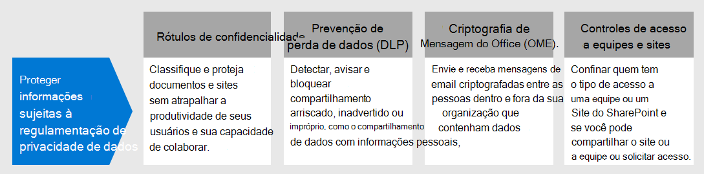
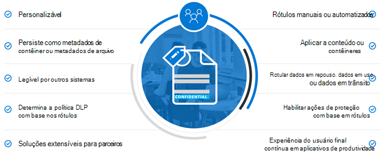
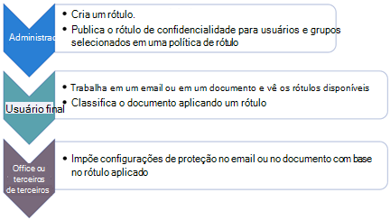
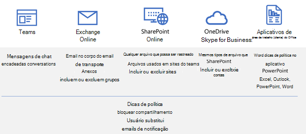
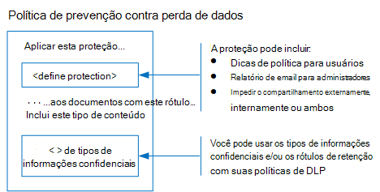
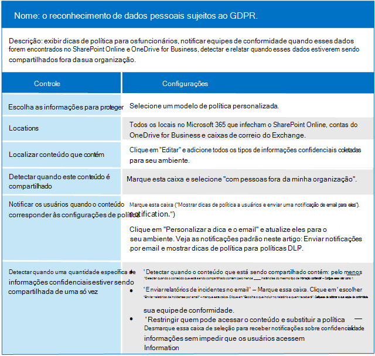
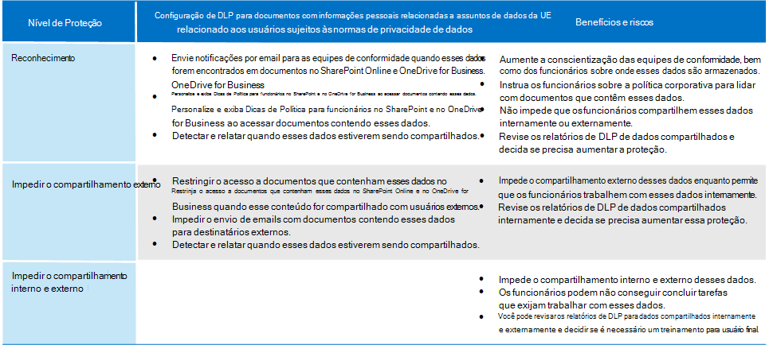
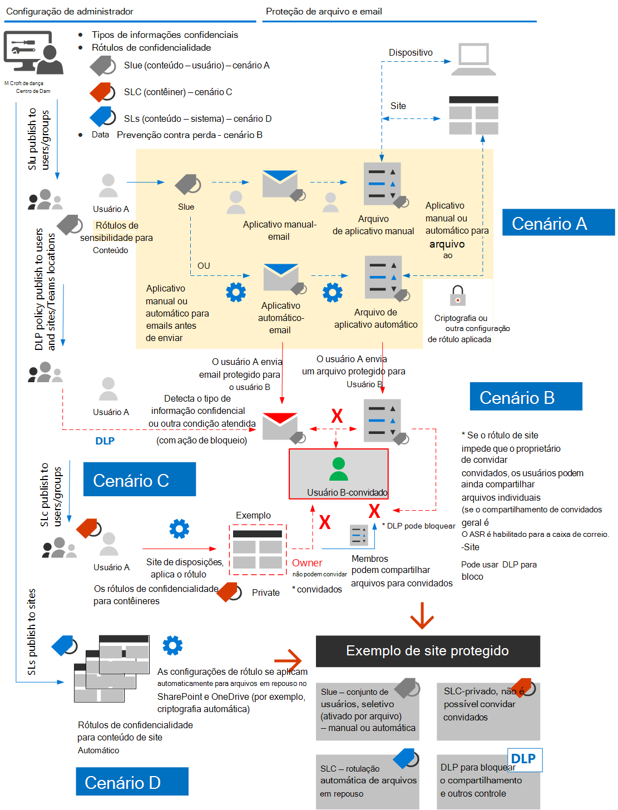

# Proteger informações sujeitas à regulamentação de privacidade de dados

Vários controles de proteção de informações podem ser empregados em sua assinatura para ajudar a lidar com as necessidades e regulamentações de conformidade de privacidade de dados. Eles incluem regulamentação geral de proteção de dados (RGPD), HIPAA-alta (a lei de privacidade do atendimento de saúde dos Estados Unidos), lei de proteção para consumidores da Califórnia (CCPA) e o LGPD (lei de proteção de dados) do Brasil.

Esses controles estão nas seguintes áreas de solução:

- Rótulos de confidencialidade
- Prevenção de perda de dados (DLP)
- Criptografia de Mensagem do Office (OME)
- Controles de acesso a equipes e sites

>[!Note]
>Esta solução descreve os recursos de segurança e conformidade para proteger as informações que estão sujeitas às normas de privacidade dos dados. Para obter uma lista completa dos recursos de segurança no Microsoft 365, consulte a [documentação de segurança do microsoft 365](https://docs.microsoft.com/microsoft-365/security/). Para obter uma lista completa dos recursos de conformidade no Microsoft 365, consulte a [documentação de conformidade da microsoft 365](https://docs.microsoft.com/microsoft-365/compliance/).
>

## Regulamentos de privacidade de dados que causam impacto nos controles de proteção de informações

Veja a seguir uma lista de exemplos de leis de privacidade de dados que podem ser relacionadas aos controles de proteção de informações:

- RGPD artigo 5 (1) (f))
- RGPD artigo (32) (1) (a)
- LGPD artigo 46
- HIPAA-alta (45 CFR 164.312 (e) (1))
- HIPAA-ALTA TECNOLOGIA (45 C.F.R. 164.312 (e) (2) (II))

Confira o [artigo avaliar riscos de privacidade de dados e identificar itens confidenciais](information-protection-deploy-assess.md) para obter mais informações sobre cada uma das opções acima.

Regulamentos de privacidade de dados para proteção de informações recomendam:

- Proteção contra perda ou acesso não autorizado, uso e/ou transmissão.
- Aplicativo baseado em risco de mecanismos de proteção.
- Uso de criptografia quando apropriado.

Sua organização também pode querer proteger o conteúdo do Microsoft 365 para outros fins, como outras necessidades de conformidade ou por motivos de negócios. O estabelecimento do esquema de proteção de informações para privacidade de dados deve ser feito como parte do planejamento, implementação e gerenciamento de proteção de informações gerais.

Para ajudá-lo a começar a usar um esquema de proteção de informações no Microsoft 365, a seguinte seção inclui uma pequena lista de recursos relacionados e ações de melhoria do Microsoft 365. A lista inclui recursos e ações de melhoria que são aplicáveis a regulamentações de privacidade de dados. No entanto, a lista não incluirá tecnologias antigas se houver um recurso mais recente que substitua amplamente o mais antigo. Por exemplo, o gerenciamento de direitos de informação (IRM) para SharePoint e o OneDrive não estão incluídos na lista, mas os rótulos de confidencialidade são incluídos.

## Gerenciando a proteção de informações no Microsoft 365

[As soluções de proteção de informações](../compliance/information-protection.md) da Microsoft incluem vários recursos integrados no Microsoft 365, Microsoft Azure e Microsoft Windows. No Microsoft 365, as soluções de proteção de informações incluem:

- [Criptografia de serviço com a chave do cliente](../compliance/customer-key-overview.md)
- [Tipos de informações confidenciais](../compliance/what-the-sensitive-information-types-look-for.md) (descrito no [artigo avaliar riscos de privacidade de dados e identificar itens confidenciais](information-protection-deploy-assess.md))
- [Rótulos de confidencialidade ](../compliance/sensitivity-labels.md) 
  - Nível de serviço/contêiner
  - No cliente/nível de conteúdo
  - Automatizado para dados em repouso no SharePoint e no OneDrive
- Prevenção de Perda de Dados (DLP)
- [Prevenção de perda de dados de ponto de extremidade da Microsoft 365 (versão prévia)](https://docs.microsoft.com/microsoft-365/compliance/endpoint-dlp-learn-about?view=o365-worldwide)
- [Recursos de criptografia de mensagem do Office 365 novas capacidades (ome)](../compliance/ome.md) e ome de [mensagem avançada](../compliance/ome-advanced-message-encryption.md)

Além disso, a proteção de nível de site e biblioteca são mecanismos importantes para incluir em qualquer esquema de proteção.

Para obter informações sobre outros recursos de proteção de informações fora do Microsoft 365, consulte:

- [MCAS (segurança de aplicativos em nuvem da Microsoft)](https://docs.microsoft.com/cloud-app-security/)
- [Proteção de Informações do Azure](https://docs.microsoft.com/azure/information-protection/what-is-information-protection)
- [Gerenciador de pontos de extremidade da Microsoft](https://www.microsoft.com/microsoft-365/microsoft-endpoint-manager)
- [Proteção de Informações do Windows](https://docs.microsoft.com/windows/security/information-protection/windows-information-protection/protect-enterprise-data-using-wip)

## Rótulos de confidencialidade

Os rótulos de confidencialidade da estrutura de proteção de informações da Microsoft permitem que você classifique e proteja os dados da sua organização sem prejudicar a produtividade dos usuários e sua capacidade de colaborar.

### Pré-requisitos para rótulos de confidencialidade

Conclua essas atividades antes de implementar qualquer um dos recursos baseados em rótulo de confidencialidade realçados abaixo:

1. Compreenda o seguinte:
   - **Requisitos de negócios.** Estabeleça os motivos comerciais para aplicar rótulos de sensibilidade em sua empresa. Por exemplo, seus requisitos de privacidade de dados para proteção de informações.
   - **Recursos de rótulo de confidencialidade.** O rótulo de confidencialidade pode ser complexo, portanto, leia a [documentação dos rótulos de sensibilidade](../compliance/sensitivity-labels.md) antes de começar a usar.
   - **Principais pontos a serem lembrados** Os rótulos de confidencialidade são gerenciados no centro de administração de conformidade da Microsoft, mas as opções de alvo e de aplicativo variam de forma significativa.
      - Há rótulos de confidencialidade para sites, grupos e equipes no nível do contêiner (as configurações não se aplicam ao conteúdo dentro do contêiner). Eles são publicados para usuários e grupos que os aplicam quando um site, grupo ou equipe é provisionado.
      - Há rótulos de confidencialidade para conteúdo ativo. Eles também são publicados em usuários ou grupos, que os aplicam manualmente ou são aplicados automaticamente quando:
        - O arquivo é aberto/editado/salvo, tanto na área de trabalho do usuário quanto em um site do SharePoint.
        - Um email é rascunho e enviado.
      - Há rótulos de sensibilidade para aplicativos automáticos para arquivos em repouso no SharePoint e no OneDrive, além de emails em trânsito pelo Exchange. Eles são direcionados para todos os sites ou específicos e automaticamente se aplicam aos arquivos em repouso nesses ambientes.

2. Racionalizar o rótulo de confidencialidade atual com métodos passados ou alternativos

   - Proteção de Informações do Azure

      O esquema de rótulo de confidencialidade atual pode precisar ser reconciliado com qualquer implementação de rotulação de [proteção de informações do Azure](../compliance/sensitivity-labels.md#sensitivity-labels-and-azure-information-protection) existente.
   - OME

      Se você estiver planejando usar o rótulo de confidencialidade moderna para proteção de email e métodos de criptografia de email existentes, como o OME, eles podem coexistir, mas você deve entender os cenários em que devem ser aplicados. Confira [recursos de criptografia de mensagens do Office 365 (ome)](#office-365-message-encryption-ome-new-capabilities), que inclui uma tabela que comparam a proteção moderna do tipo rótulo rótulo de confidencial com a proteção baseada no ome.

3. Planejar a integração com um esquema mais amplo de proteção de informações. Na parte superior da coexistência com o OME, os rótulos de confidencialidade atuais podem ser usados em recursos do lado do cliente, como o Microsoft 365 Data Loss Prevention (DLP) e o Microsoft Cloud app Security. Consulte [Rótulos de sensibilidade e o Microsoft Cloud app Security](../compliance/sensitivity-labels.md#sensitivity-labels-and-microsoft-cloud-app-security) para atingir seus objetivos de proteção de informações relacionados à privacidade de dados.

4. Desenvolver um esquema de controle e classificação de rótulo de confidencialidade. Consulte [classificação de dados e taxonomia de rótulo de confidencialidade](https://aka.ms/dataclassificationwhitepaper).

### Diretrizes gerais

1. **Definição de esquema.** Antes de usar recursos técnicos para aplicar rótulos e proteção, trabalhe na sua organização para definir um esquema de classificação. Você já pode ter um esquema de classificação, o que facilita a adição de dados pessoais. 
2. **Introdução.** Comece decidindo o número e os nomes dos rótulos a serem implementados. Faça essa atividade sem se preocupar com a tecnologia a ser usada e como os rótulos serão aplicados. Aplique este esquema universalmente em toda a organização, incluindo dados que residem no local e em outros serviços de nuvem.
3. **Recomendações adicionais** Ao projetar e implementar políticas, rótulos e condições, considere seguir estas recomendações:

   - **Use o esquema de classificação existente (se houver).** Muitas organizações já estão usando a classificação de dados em alguma forma. Avalie cuidadosamente o esquema de rótulos existente e, se possível, use-o como está. O uso de rótulos conhecidos que podem ser reconhecidos para os usuários finais levará a adoção.
   - **Comece pequeno.** Praticamente não há limite para o número de rótulos que você pode criar. No entanto, grandes números de rótulos e subrótulos podem reduzir a adoção.
   - **Usar cenários e casos de uso.** Identificar casos de uso comuns dentro da sua organização e usar cenários derivados das leis de privacidade de dados às quais você está sujeito. Verifique se o rótulo ou a configuração de classificação em previsão funcionará na prática.
   - **Question a cada solicitação de um novo rótulo.** Todos os cenários ou casos de uso realmente precisam de um novo rótulo ou podem usar o que você já tem? Manter o número de rótulos a um mínimo melhora a adoção.
   - **Use subrótulos para os principais departamentos.** Alguns departamentos terão necessidades específicas que exijam rótulos específicos. Defina esses rótulos como subrótulos para um rótulo existente e considere o uso de políticas com escopo atribuído a grupos de usuários em vez de globalmente.
   - **Considere as políticas de escopo.** As políticas direcionadas a subconjuntos de usuários impedirão a sobrecarga de rótulo. Uma política com escopo permite atribuir etiquetas ou subrótulos específicos de função ou de departamento a apenas os funcionários que trabalham para esse departamento específico. 
   - **Use nomes de rótulo significativos.** Tente não usar jargão, padrões ou acrônimos como nomes de rótulo. Tente usar nomes que resonate com o usuário final para melhorar a adoção. Em vez de usar rótulos como PII, PCI, HIPAA, bin, MBI e Ain, considere nomes como não comerciais, públicos, gerais, confidenciais e altamente confidenciais.

### Criar e implantar rótulos de sensibilidade para sites, grupos e equipes

Ao criar [Rótulos de confidencialidade](../compliance/sensitivity-labels-teams-groups-sites.md) no centro de conformidade da Microsoft 365, agora você pode aplicá-los a estes contêineres:

- Sites do Microsoft Teams
- Grupos do Microsoft 365 (anteriormente grupos do Office 365)
- Sites do SharePoint

Use as configurações de rótulo a seguir para ajudar a proteger o conteúdo desses contêineres:

- Privacidade (pública ou privada) dos sites do Microsoft 365 Group-Connected Teams
- Acesso de usuários externos
- Acesso de dispositivos não gerenciados

Para privacidade de dados, para impedir o compartilhamento externo para contêineres que serão usados para armazenar conteúdo com dados pessoais confidenciais, marque os arquivos que contêm os dados como privados e exijam dispositivos gerenciados.

### Criar e implantar rótulos de sensibilidade para conteúdo

Os rótulos de confidencialidade aplicados aos arquivos permitem criptografar o conteúdo, a marca d' água do conteúdo e definir outros controles para o conteúdo de aplicativos do Office, incluindo o Outlook e o Office na Web.

Quando você estiver pronto para começar a proteger os dados da sua organização com rótulos de confidencialidade:

1. **Crie os rótulos.** Crie e nomeie seus rótulos de confidencialidade de acordo com a taxonomia de classificação da sua organização para diferentes níveis de confidencialidade de conteúdo. Para obter mais informações sobre como desenvolver uma taxonomia de classificação, consulte o [White Paper taxonomia de classificação de dados e rótulo de confidencialidade](https://aka.ms/dataclassificationwhitepaper).
2. **Defina o que cada rótulo pode fazer.** Defina as configurações de proteção desejadas associadas a cada rótulo. Por exemplo, talvez você queira conteúdo de confidencialidade inferior (como um rótulo "geral") para ter apenas um cabeçalho ou rodapé aplicado, enquanto o conteúdo de confidencialidade maior (como um rótulo "confidencial") deve ter uma marca d' água e ter criptografia habilitada.
3. **Publique os rótulos.** Quando os rótulos de confidencialidade estiverem configurados, publique-os usando uma política de rótulo. Decida quais usuários e grupos devem ter os rótulos e quais configurações de política utilizar. Um único rótulo é reutilizável. Você deve defini-lo uma vez e, em seguida, pode incluí-lo em várias políticas de rótulo atribuídas a diferentes usuários.

Após publicar os rótulos de sensibilidade do centro de conformidade do Microsoft 365, eles começarão a aparecer nos [aplicativos do Office](../compliance/sensitivity-labels-office-apps.md) para que os usuários classifiquem e protejam o conteúdo à medida que ele é criado ou editado.

Para a privacidade dos dados, você aplica manualmente um rótulo de confidencialidade com criptografia e outras regras a email ou conteúdo que contenha informações pessoais confidenciais.

>[!Note]
>Os rótulos de sensibilidade com criptografia habilitada aplicada a emails têm alguma funcionalidade sobreposta com o OME. Veja [comparação de cenários de email seguro com os rótulos ome e sensibilidade](#secure-email-scenarios-comparison-with-ome-and-sensitivity-labels).

### Rotulação automática do lado do cliente quando os usuários editam documentos ou compõem emails

Ao criar um rótulo de confidencialidade, você poderá [atribuir automaticamente esse rótulo](../compliance/apply-sensitivity-label-automatically.md) ao conteúdo, incluindo o email, quando ele corresponder às condições especificadas.

A capacidade de aplicar rótulos de confidencialidade automaticamente ao conteúdo é importante porque:

- Você não precisa treinar seus usuários quando usar cada uma de suas classificações.
- Você não precisa depender dos usuários para classificar corretamente o conteúdo.
- Os usuários não precisam mais conhecer as suas políticas. Em vez disso, eles podem se concentrar no próprio trabalho.

O rotulamento automático oferece suporte à recomendação de um rótulo para os usuários, bem como à aplicação automática de um rótulo. Mas em ambos os casos, o usuário decide se aceita ou rejeita o rótulo, para ajudar a garantir a rotulagem correta do conteúdo.

Essa rotulagem do lado do cliente possui um atraso mínimo para os documentos, pois o rótulo pode ser aplicado mesmo antes de o documento ser salvo. No entanto, nem todos os aplicativos cliente oferecem suporte à rotulagem automática. Esse recurso tem suporte do cliente de rotulação unificada de proteção de informações do Azure e [de algumas versões dos aplicativos do Office](../compliance/sensitivity-labels-office-apps.md#support-for-sensitivity-label-capabilities-in-apps).

Para obter instruções de configuração, consulte [como configurar rotulação automática para aplicativos do Office](../compliance/sensitivity-labels-office-apps.md#support-for-sensitivity-label-capabilities-in-apps).

Para a privacidade dos dados, você aplica automaticamente rótulos de confidencialidade ao conteúdo que contém informações pessoais confidenciais.

### Rotulamento automático do serviço quando o conteúdo já foi salvo

Esse método é chamado de classificação automática com rótulos de confidencialidade. Você também pode ouvi-lo como rótulo automático para dados em repouso (para documentos no SharePoint e no OneDrive) e dados em trânsito (para email que é enviado ou recebido pelo Exchange). Para o Exchange, ele não inclui emails em caixas de correio em repouso.
 
Como esse rótulo é aplicado pelo próprio serviço, e não pelo aplicativo do usuário, você não precisa se preocupar com os aplicativos que os usuários têm e qual versão. Como resultado, esse recurso está imediatamente disponível em toda a organização e apropriado para rotular em escala. As políticas de rotulagem automática não oferecem suporte à rotulagem recomendada porque o usuário não interage com o processo de rotulagem. Em vez disso, o administrador executa as políticas no modo de simulação para ajudar a garantir a rotulagem correta do conteúdo antes de aplicar o rótulo.

Para obter instruções de configuração, consulte [como configurar políticas de rotulação automática para o SharePoint, o onedrive e o Exchange](../compliance/apply-sensitivity-label-automatically.md#how-to-configure-auto-labeling-policies-for-sharepoint-onedrive-and-exchange).

Para privacidade de dados em sites de interesse, envie etiquetas de sensibilidade para a criptografia automática de conteúdo contendo informações pessoais confidenciais.

## Prevenção contra perda de dados 

Você pode usar a [prevenção de perda de dados (DLP)](../compliance/data-loss-prevention-policies.md) no Microsoft 365 para detectar, avisar e bloquear compartilhamento arriscado, inadvertido ou inadequado, como compartilhamento de dados contendo informações pessoais, interna e externamente.

A DLP permite:

- Identificar e monitorar atividades de compartilhamento arriscadas.
- Instrua os usuários com orientações de contexto para tomar as decisões corretas.
- Aplicar políticas de uso de dados no conteúdo sem inibir a produtividade.
- Integre com classificação e rotulação para detectar e proteger dados quando ele é compartilhado.

### Cargas de trabalho com suporte para DLP

Com uma política de DLP no centro de conformidade da Microsoft 365, você pode identificar, monitorar e proteger automaticamente os itens confidenciais em vários locais no Microsoft 365, como Exchange Online, SharePoint, OneDrive e Microsoft Teams.

Por exemplo, você pode identificar qualquer documento que contenha um número de cartão de crédito armazenado em qualquer site do OneDrive ou pode monitorar apenas os sites do OneDrive de pessoas específicas.

Você também pode monitorar e proteger itens confidenciais nas versões instaladas localmente do Excel, PowerPoint e Word, que incluem a capacidade de identificar itens confidenciais e aplicar políticas de DLP. O DLP fornece monitoramento contínuo quando as pessoas compartilham o conteúdo desses aplicativos do Office.

Esta figura mostra um exemplo de proteção de dados pessoais por DLP.

A DLP é usada para identificar um documento ou email contendo um registro de integridade e, em seguida, bloqueia automaticamente o acesso a esse documento ou impede que o email seja enviado. A DLP então notifica o destinatário com uma dica de política e envia um alerta para o usuário final e o administrador.

### Planejamento para DLP

Planejar suas políticas de DLP para: 

- Seus requisitos de negócios.

- Uma avaliação baseada em risco da organização, conforme descrito no [artigo avaliar riscos de privacidade de dados e identificar itens confidenciais](information-protection-deploy-assess.md).

- Outros mecanismos de proteção e governança de informações no local ou em planejamento para a privacidade dos dados.

- Os tipos de informações confidenciais que você identificou para dados pessoais baseados em seu trabalho de avaliação, conforme descrito no artigo sobre como [avaliar riscos de privacidade de dados e identificar itens confidenciais](information-protection-deploy-assess.md). As condições de política de DLP podem ser baseadas em tipos de informações confidenciais e rótulos de retenção.

- Os rótulos de retenção que você precisará para especificar condições de DLP. Confira as [informações governadas sujeitas à regulamentação de privacidade de dados no artigo da sua organização](information-protection-deploy-govern.md) para obter mais informações.

- Gerenciamento de política de DLP contínuo, que requer que alguém na organização opere e ajuste políticas para alterações em tipos de informações confidenciais, rótulos de retenção, regulamentos e políticas de conformidade.

Embora os rótulos de confidencialidade não possam ser usados em condições de política de DLP, determinados cenários de proteção para impedir o acesso podem ser obtidos com apenas rótulos de confidencialidade que podem ser aplicados automaticamente com base em tipos de informações confidenciais. Se houver um rótulo de confidencialidade sólido, considere se o DLP deve ser usado para aumentar a proteção porque:

  - A DLP pode impedir o compartilhamento de arquivos. Os rótulos de confidencialidade podem apenas impedir o acesso.

  - O DLP tem níveis mais granulares de controle em termos de regras, condições e ações.

  - As políticas de DLP podem ser aplicadas às mensagens de chat e de canal do teams. Os rótulos de confidencialidade só podem ser aplicados a documentos e emails.

### Políticas DLP

As políticas de DLP são configuradas no centro de administração de conformidade da Microsoft e especificam o nível de proteção, o tipo de informação confidencial que a política está procurando e as cargas de trabalho de destino. Seus componentes básicos consistem na identificação da proteção e dos tipos de dados.

Veja um exemplo de política de DLP para conscientização do RGPD.

Confira [Este artigo](../compliance/create-test-tune-dlp-policy.md) para obter mais informações sobre como criar e aplicar políticas de DLP.

### Níveis de proteção para privacidade de dados

A tabela a seguir lista três configurações de aumento de proteção usando DLP.

A primeira configuração, conscientização, pode ser usada como ponto de partida e nível mínimo de proteção para lidar com as necessidades de conformidade para regulamentações de privacidade de dados.

>[!Note]
>À medida que os níveis de proteção aumentam, a capacidade dos usuários de compartilhar e acessar as informações diminuirá em alguns casos e poderão impactar potencialmente a sua produtividade ou a capacidade de concluir tarefas diárias.
>

Para ajudar seus funcionários a serem produtivos em um ambiente mais seguro ao aumentar os níveis de proteção, Reserve um tempo para treiná-los e informá-los sobre novas diretivas e procedimentos de segurança.

### Exemplo de uso de rótulos de confidencialidade com DLP

Os rótulos de confidencialidade podem trabalhar em conjunto com a DLP para fornecer privacidade de dados em um ambiente altamente regulamentado. Estas são as principais etapas da implantação integrada:

1. Os requisitos normativos e de negócios de privacidade de dados estão documentados.
2. Fontes de dados de destino, tipos e propriedade são caracterizados em relação às preocupações com privacidade de dados.
3. Uma estratégia geral para lidar com requisitos e proteger e controlar os hotspots de privacidade de dados é estabelecida.
4. Um plano de ação em fases para lidar com a estratégia de controle de privacidade de dados é colocado em vigor.

Depois que esses elementos forem determinados, você poderá usar tipos de informações confidenciais, sua taxonomia de rótulo de confidencialidade e políticas de DLP juntas. Esta figura mostra um exemplo.

[Veja uma versão maior desta imagem](https://github.com/MicrosoftDocs/microsoft-365-docs/raw/public/microsoft-365/media/information-protection-deploy-protect-information/information-protection-deploy-protect-information-sensitivity-lables-dlp.png)

Aqui estão alguns cenários de proteção de dados usando os rótulos de DLP e sensibilidade, conforme mostrado na figura.

| Cenário | Processo |
|:-------|:-----|
| A | <ol><li>Os rótulos de confidencialidade do conteúdo são publicados por um administrador para usuários e grupos para aplicativos manuais ou automáticos para conteúdo e email. </li><li>O usuário A aplica os rótulos manual ou automaticamente ao interagir com o conteúdo, com criptografia ou outras configurações aplicadas. </li><li>O usuário A envia um e-mail ou um arquivo protegido para o usuário B, um usuário convidado. </li></ol> |
| B | A política de DLP publicada por um administrador para o usuário a impede que o usuário a envie o email e/ou arquivo para o usuário B. |
| C |  Rótulo de confidencialidade com a configuração "o proprietário não pode convidar convidados" é publicada para o usuário A, que provisiona uma equipe do teams ou site do SharePoint. Outro usuário do site tenta seletivamente compartilhar um arquivo com o usuário B, mas DLP o bloqueia. |
| D | O rótulo de confidencialidade do aplicativo automático para o conteúdo do site é publicado em um ou mais sites, fornecendo outra camada de proteção, resultando em um site protegido. |
|||

## Recursos de criptografia de mensagem do Office 365 (OME)

As pessoas costumam usar emails para trocar itens confidenciais, como informações de saúde de pacientes ou informações de clientes e funcionários. A criptografia de mensagens de email ajuda a garantir que somente os destinatários pretendidos possam exibir o conteúdo da mensagem.

Com o [ome](../compliance/ome.md), você pode enviar e receber mensagens criptografadas entre pessoas dentro e fora da sua organização. O OME funciona com o Outlook.com, o Yahoo!, o Gmail e outros serviços de email. OME ajuda a garantir que somente os destinatários pretendidos possam exibir o conteúdo da mensagem.

Para a privacidade dos dados, você usa o OME para proteger as mensagens internas que contêm itens confidenciais. A criptografia de mensagem do Office 365 é um serviço online desenvolvido no Microsoft Azure Rights Management (Azure RMS), que faz parte da proteção de informações do Azure. Isso inclui políticas de criptografia, identidade e autorização para ajudar a proteger seu email. Você pode criptografar mensagens usando modelos de gerenciamento de direitos, a opção não encaminhar e a opção somente criptografia.

Você também pode definir regras de fluxo de emails para aplicar essa proteção. Por exemplo, você pode criar uma regra que exija a criptografia de todas as mensagens endereçadas a um destinatário específico ou que contenha palavras-chave específicas na linha de assunto, além de especificar que os destinatários não podem copiar nem imprimir o conteúdo da mensagem.

Além disso, a [criptografia de mensagem avançada](../compliance/ome-advanced-message-encryption.md) do ome ajuda você a cumprir as obrigações de conformidade que exigem controles mais flexíveis sobre destinatários externos e seu acesso a emails criptografados. Com a criptografia de mensagem avançada do OME no Microsoft 365, você pode controlar emails confidenciais compartilhados fora da organização com políticas automáticas que detectam tipos de informações confidenciais. 

Para privacidade de dados, se você precisar compartilhar emails com um participante externo, poderá especificar uma data de validade e revogar mensagens. Você só pode revogar e definir uma data de vencimento para mensagens enviadas a destinatários externos.

### Comparação de cenários de email seguro com o OME e os rótulos de confidencialidade

Os rótulos de OME e sensibilidade aplicados ao email com criptografia têm alguma sobreposição, portanto, é importante entender quais cenários podem ser aplicados, conforme mostrado nesta tabela.

| Cenário | Rótulos de confidencialidade | OME |
|:-------|:-----|:-------|
| Parceiros internos +   Comunicar-se e colaborar com segurança entre usuários internos e parceiros confiáveis | Recomendar – rótulos com classificação e proteção totalmente personalizadas | Sim – criptografar somente ou não encaminhar proteção sem classificação |
| Partes externas   Comunicar-se e colaborar com segurança com qualquer usuário externo/de consumidor | Sim – predefinir destinatários no rótulo | Recomendação – proteção just-in-time baseada em destinatários |
| Parceiros internos +, com validade/revogação   Controlar o acesso de emails e de conteúdo com usuários internos e parceiros confiáveis com expiração e revogação | Recomendável proteção totalmente personalizada com duração de acesso, o usuário pode rastrear e revogar manualmente os arquivos | Não – sem revogação ou expiração para email interno |
| Partes externas com validade/revogação   Controlar o acesso de emails e de conteúdo com usuários externos/do consumidor com expiração e revogação | Sim – o usuário pode rastrear arquivos manualmente | Recomendável (E5) – o administrador pode revogar emails do centro de conformidade & segurança |
| Rotulação automática   A organização deseja proteger automaticamente emails/anexos com conteúdo confidencial específico e/ou destinatários específicos | Recomendável (E5)-rotulamento automático nos clientes do Exchange e do Outlook, aumenta as regras de fluxo de email e a política de DLP | Sim-regras de fluxo de email e política de DLP com somente criptografia ou não encaminhar proteção |
||||

Também haverá diferenças em experiências de usuário final e de administrador entre esses dois métodos.

## O Microsoft Teams com proteção para dados altamente confidenciais

Para organizações que planejam armazenar dados pessoais sujeitos a regulamentações de privacidade de dados no Microsoft Teams, consulte [Configure a Team with Security Isolation](secure-teams-security-isolation.md), que fornece orientações detalhadas e etapas de configuração para:

- Identidade e acesso ao dispositivo
- Criação de uma equipe privada
- Bloqueio de permissões de site de equipe subjacente
- Um rótulo de confidencialidade baseado em grupo com criptografia
