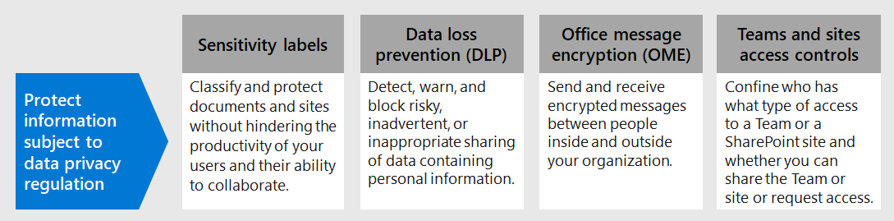

# Proteger informações sujeitas à regulamentação de privacidade de dadosProtect information subject to data privacy regulation

Vários controles de proteção de informações podem ser empregados em sua assinatura para ajudar a lidar com as necessidades e regulamentos de conformidade de privacidade de dados.A number of information protection controls can be employed in your subscription to help address data privacy compliance needs and regulations. Eles incluem o RGPD (Regulamento Geral de Proteção de Dados), HIPAA-HITECH (a lei de privacidade de cuidados de saúde dos Estados Unidos), a Lei de Proteção do Consumidor da Califórnia (CCPA) e a LGPD (Lei de Proteção de Dados do Brasil).These include General Data Protection Regulation (GDPR), HIPAA-HITECH (the United States health care privacy act), California Consumer Protection Act (CCPA), and the Brazil Data Protection Act (LGPD).

Esses controles estão nas seguintes áreas de solução:These controls are within following solution areas:

- Rótulos de confidencialidadeSensitivity labels
- Prevenção de perda de dados (DLP)Data loss prevention (DLP)
- Criptografia de Mensagem do Office (OME)Office message encryption (OME)
- Teams e controles de acesso a sitesTeams and sites access controls

> [!NOTE]
> Esta solução descreve recursos de segurança e conformidade para proteger informações sujeitas a regulamentos de privacidade de dados.This solution describes security and compliance features to protect information subject to data privacy regulations. Para ver uma lista completa de recursos de segurança Microsoft 365, [consulte Microsoft 365 documentação de segurança.](../security/index.yml)For a complete list of security features in Microsoft 365, see [Microsoft 365 security documentation](../security/index.yml). Para ver uma lista completa de recursos de conformidade Microsoft 365, [consulte Microsoft 365 documentação de conformidade.](../compliance/index.yml)For a complete list of compliance features in Microsoft 365, see [Microsoft 365 compliance documentation](../compliance/index.yml).

## Regulamentos de privacidade de dados que impactam controles de proteção de informaçõesData privacy regulations that impact information protection controls

Aqui está uma lista de exemplos de regulamentos de privacidade de dados que podem estar relacionados aos controles de proteção de informações:Here is a sample list of data privacy regulations that may relate to information protection controls:

- Artigo 5(1)(f)) do RGPD)GDPR Article 5(1)(f))
- Artigo RGPD (32)(1)(a)GDPR Article (32)(1)(a)
- Artigo 46 do LGPDLGPD Article 46
- HIPAA-HITECH (45 CFR 164.312(e)(1))HIPAA-HITECH (45 CFR 164.312(e)(1))
- HIPAA-HITECH (45 C.F.R.HIPAA-HITECH (45 C.F.R. 164.312(e)(2)(ii))164.312(e)(2)(ii))

Consulte o [artigo avaliar riscos de privacidade de dados](information-protection-deploy-assess.md) e identificar itens confidenciais para obter mais informações sobre cada um dos itens acima.See the [assess data privacy risks and identify sensitive items article](information-protection-deploy-assess.md) for more information on each of the above.

Os regulamentos de privacidade de dados para proteção de informações recomendam:Data privacy regulations for information protection recommend:

- Proteção contra perda ou acesso não autorizado, uso e/ou transmissão.Protection against loss or unauthorized access, usage and/or transmission.
- Aplicação baseada em risco de mecanismos de proteção.Risk-based application of protective mechanisms.
- Uso da criptografia quando apropriado.Use of encryption where appropriate.

Sua organização também pode querer proteger Microsoft 365 conteúdo para outras finalidades, como outras necessidades de conformidade ou por motivos comerciais.Your organization may also want to protect Microsoft 365 content for other purposes, such as other compliance needs or for business reasons. O estabelecimento do seu esquema de proteção de informações para privacidade de dados deve ser feito como parte do planejamento geral da proteção de informações, implementação e gerenciamento.Establishing your information protection scheme for data privacy should be done as part of overall information protection planning, implementation, and management.

Para ajudá-lo a começar com um esquema de proteção de informações no Microsoft 365, a seção a seguir inclui uma breve lista de recursos relacionados e ações de melhoria para Microsoft 365.To help you get started with an information protection scheme in Microsoft 365, the following section includes a short list of related capabilities and improvement actions for Microsoft 365. A lista inclui recursos e ações de aperfeiçoamento aplicáveis aos regulamentos de privacidade de dados.The list includes capabilities and improvement actions that are applicable to data privacy regulations. No entanto, a lista não inclui tecnologias mais antigas se houver um recurso mais novo que sobressalte amplamente o mais antigo.However, the list doesn't include older technologies if there's a newer capability that largely supersedes the older one. Por exemplo, o IRM (Gerenciamento de Direitos de Informação) para SharePoint e OneDrive não está incluído na lista, mas os rótulos de sensibilidade são incluídos.For example, Information Rights Management (IRM) for SharePoint and OneDrive is not included in the list but sensitivity labels are included.

## Gerenciando a proteção de informações Microsoft 365Managing information protection in Microsoft 365

As [soluções de proteção](../compliance/information-protection.md) de informações da Microsoft incluem vários recursos integrados entre Microsoft 365, Microsoft Azure e Microsoft Windows.Microsoft [information protection solutions](../compliance/information-protection.md) include a number of integrated capabilities across Microsoft 365, Microsoft Azure, and Microsoft Windows. Em Microsoft 365, as soluções de proteção de informações incluem:In Microsoft 365, information protection solutions include:

- [Tipos de informações confidenciais](../compliance/sensitive-information-type-entity-definitions.md) (descritos no artigo avaliar riscos de privacidade [de dados e identificar itens confidenciais](information-protection-deploy-assess.md))[Sensitive information types](../compliance/sensitive-information-type-entity-definitions.md) (described in the [assess data privacy risks and identify sensitive items article](information-protection-deploy-assess.md))
- [Rótulos de confidencialidadeSensitivity labels](../compliance/sensitivity-labels.md)
  - Nível de serviço/contêinerService/container-level
  - Lado do cliente/nível de conteúdoClient-side/content-level
  - Automatizado para dados em repouso em SharePoint e OneDriveAutomated for data-at-rest in SharePoint and OneDrive
- Prevenção de Perda de Dados (DLP)Data Loss Prevention (DLP)
- [Microsoft 365 Prevenção contra perda de dados do ponto de extremidadeMicrosoft 365 Endpoint data loss prevention](../compliance/endpoint-dlp-learn-about.md)
- [Criptografia de Mensagens do Office 365 novos recursos (OME)](../compliance/ome.md) e Criptografia Avançada [de Mensagens](../compliance/ome-advanced-message-encryption.md) OME[Office 365 Message Encryption new capabilities (OME)](../compliance/ome.md) and OME [Advanced Message Encryption](../compliance/ome-advanced-message-encryption.md)

Além disso, a proteção de nível de site e biblioteca são mecanismos importantes para incluir em qualquer esquema de proteção.In addition, site and library level protection are important mechanisms to include in any protection scheme.

Para obter informações sobre outros recursos de proteção de informações fora Microsoft 365, consulte:For information on other information protection capabilities outside of Microsoft 365, see:

- [Microsoft Cloud Application Security (MCAS)Microsoft Cloud Application Security (MCAS)](/cloud-app-security/)
- [Proteção de Informações do AzureAzure Information Protection](/azure/information-protection/what-is-information-protection)
- [Microsoft Endpoint ManagerMicrosoft Endpoint Manager](https://www.microsoft.com/microsoft-365/microsoft-endpoint-manager)
- [Proteção de Informações do WindowsWindows Information Protection](/windows/security/information-protection/windows-information-protection/protect-enterprise-data-using-wip)

## Rótulos de confidencialidadeSensitivity labels

Os rótulos de sensibilidade da estrutura Proteção de Informações da Microsoft permitem que você classifique e proteja os dados da sua organização sem prejudicar a produtividade dos usuários e sua capacidade de colaborar.Sensitivity labels from the Microsoft Information Protection framework let you classify and protect your organization's data without hindering the productivity of users and their ability to collaborate.

> [!div class="mx-imgBorder"]
> 

### Pré-requisitos para rótulos de sensibilidadePrerequisites for sensitivity labels

Conclua essas atividades antes de implementar qualquer um dos recursos baseados em rótulos de sensibilidade destacados abaixo:Complete these activities prior to implementing any of the sensitivity label-based capabilities highlighted below:

1. Entenda o seguinte:Understand the following:
   - **Requisitos de negócios.****Business requirements.** Estabeleça os motivos de negócios para aplicar rótulos de sensibilidade em sua empresa.Establish the business reasons for applying sensitivity labels in your enterprise. Por exemplo, seus requisitos de privacidade de dados para proteção de informações.For example, your data privacy requirements for information protection.
   - **Recursos de rótulo de sensibilidade.****Sensitivity label capabilities.** A rotulagem de sensibilidade pode ficar complexa, portanto, leia a [documentação](../compliance/sensitivity-labels.md) dos rótulos de sensibilidade antes de começar.Sensitivity labeling can get complex, so make sure to read the [sensitivity labels documentation](../compliance/sensitivity-labels.md) before getting started.
   - **Principais coisas a lembrar** Os rótulos de sensibilidade são gerenciados no Centro de administração de Conformidade da Microsoft, mas as opções de direcionamento e aplicativo variam significativamente.**Key things to remember** Sensitivity labels are managed in the Microsoft Compliance admin center but the targeting and application options vary significantly.
      - Há rótulos de sensibilidade para sites, grupos e Teams no nível do contêiner (as configurações não se aplicam ao conteúdo dentro do contêiner).There are sensitivity labels for sites, groups, and Teams at the container level (the settings do not apply to content inside the container). Eles são publicados para usuários e grupos que os aplicam quando um site, grupo ou Equipe é provisionado.These are published to users and groups who apply them when a site, group or Team is provisioned.
      - Há rótulos de sensibilidade para conteúdo ativo.There are sensitivity labels for active content. Eles também são publicados para usuários ou grupos, que os aplicam manualmente ou são aplicados automaticamente quando:These are also published to user or groups, who either manually apply them, or they get applied automatically when:
        - O arquivo é aberto/editado/salvo, na área de trabalho do usuário ou SharePoint site.The file is opened/edited/saved, either to the user’s desktop or a SharePoint site.
        - Um email é redigido e enviado.An email is drafted and sent.
      - Há rótulos de sensibilidade para aplicativo automático para arquivos em repouso no SharePoint e OneDrive além de emails em trânsito por Exchange.There are sensitivity labels for automatic application to files at rest in SharePoint and OneDrive in addition to emails in transit through Exchange. Eles são direcionados para todos os sites ou específicos e se aplicam automaticamente aos arquivos em repouso nesses ambientes.These are targeted to either all sites or specific ones and automatically apply to the files at rest in these environments.

2. Racionalizar a rotulagem de sensibilidade atual com métodos anteriores ou alternativosRationalize current sensitivity labeling with past or alternative methods

   - Proteção de Informações do AzureAzure Information Protection

      O esquema de rotulagem de sensibilidade atual pode precisar ser reconciliado com qualquer implementação de rotulagem existente da Proteção de Informações do [Azure.](../compliance/sensitivity-labels.md#sensitivity-labels-and-azure-information-protection)The current sensitivity labeling scheme may need to be reconciled with any existing [Azure Information Protection](../compliance/sensitivity-labels.md#sensitivity-labels-and-azure-information-protection) labeling implementation.
   - OMEOME

      Se você estiver planejando usar a rotulagem de sensibilidade moderna para proteção de email e métodos de criptografia de email existentes, como o OME, eles podem existir em co-existir, mas você deve entender os cenários nos quais ambos devem ser aplicados.If you are planning to use modern sensitivity labeling for email protection and existing email encryption methods like OME are in place, they can co-exist, but you should understand the scenarios in which either should be applied. Consulte [Criptografia de Mensagens do Office 365 novos recursos (OME),](#office-365-message-encryption-ome-new-capabilities)que inclui uma tabela comparando a proteção moderna do tipo de rótulo de sensibilidade com a proteção baseada em OME.See [Office 365 Message Encryption new capabilities (OME)](#office-365-message-encryption-ome-new-capabilities), which includes a table comparing modern sensitivity label-type protection with OME-based protection.

3. Planeje a integração em um esquema mais amplo de proteção de informações.Plan for integration into a broader information protection scheme. Além da coexistência com o OME, os rótulos de sensibilidade podem ser usados junto com recursos como Microsoft 365 prevenção contra perda de dados (DLP) e Microsoft Cloud App Security.On top of coexistence with OME, sensitivity labels can be used along-side capabilities like Microsoft 365 data loss prevention (DLP) and Microsoft Cloud App Security. Consulte [Proteção de Informações da Microsoft em Microsoft 365](../compliance/information-protection.md) para atingir suas metas de proteção de informações relacionadas à privacidade de dados.See [Microsoft Information Protection in Microsoft 365](../compliance/information-protection.md) to achieve your data privacy-related information protection goals.

4. Desenvolva um esquema de classificação e controle de rótulo de sensibilidade.Develop a sensitivity label classification and control scheme. Consulte [Classificação de Dados e Taxonomia do Rótulo de](https://aka.ms/dataclassificationwhitepaper)Sensibilidade.See [Data Classification and Sensitivity Label Taxonomy](https://aka.ms/dataclassificationwhitepaper).

### Diretrizes geraisGeneral guidance

1. **Definição de esquema.****Schema definition.** Antes de usar recursos técnicos para aplicar rótulos e proteção, trabalhe em toda a sua organização para definir um esquema de classificação.Before using technical capabilities to apply labels and protection, work across your organization to define a classification schema. Você pode já ter um esquema de classificação, o que facilita a adoção de dados pessoais.You might already have a classification schema, which makes it easier to add personal data.
2. **Iniciando.****Getting started.** Comece decidindo o número e os nomes dos rótulos a implementar.Begin by deciding on the number and names of labels to implement. Faça essa atividade sem se preocupar com qual tecnologia usar e como os rótulos serão aplicados.Do this activity without worrying about which technology to use and how labels will be applied. Aplique esse esquema universalmente em toda a sua organização, incluindo dados que residem no local e em outros serviços de nuvem.Apply this schema universally throughout your organization, including data that resides on premises and in other cloud services.
3. **Recomendações adicionais** Ao projetar e implementar políticas, rótulos e condições, considere seguir estas recomendações:**Additional recommendations** When designing and implementing policies, labels, and conditions, consider following these recommendations:

   - **Use o esquema de classificação existente (se for o caso).****Use existing classification schema (if any).** Muitas organizações já estão usando a classificação de dados em algum formulário.Many organizations already are using data classification in some form. Avalie cuidadosamente o esquema de rótulo existente e, se possível, use-o como está.Carefully evaluate the existing label schema and if possible, use it as is. O uso de rótulos familiares reconhecíveis para seus usuários finais impulsiona a adoção.Using familiar labels that are recognizable to your end-users will drive adoption.
   - **Inicie pequeno.****Start small.** Praticamente não há limite para o número de rótulos que você pode criar.There is virtually no limit to the number of labels that you can create. No entanto, um grande número de rótulos e sub-rótulos pode retardar a adoção.However, large numbers of labels and sub-labels can slow adoption.
   - **Use cenários e casos de uso.****Use scenarios and use cases.** Identifique casos comuns de uso em sua organização e use cenários derivados dos regulamentos de privacidade de dados aos quais você está sujeito.Identify common use cases within your organization and use scenarios derived from the data privacy regulations to which you are subject. Verifique se o rótulo previsto e a configuração de classificação funcionarão na prática.Verify if the envisioned label and classification configuration will work in practice.
   - **Questione cada solicitação para um novo rótulo.****Question every request for a new label.** Cada cenário ou caso de uso realmente precisa de um novo rótulo ou você pode usar o que já tem?Does every scenario or use case really need a new label or can you use what you already have? Manter o número mínimo de rótulos melhora a adoção.Keeping the number of labels to a minimum improves adoption.
   - **Use sub-rótulos para departamentos-chave.****Use sub-labels for key departments.** Alguns departamentos terão necessidades específicas que exigem rótulos específicos.Some departments will have specific needs that require specific labels. Defina esses rótulos como sub-rótulos para um rótulo existente e considere usar políticas com escopo atribuídas a grupos de usuários em vez de globalmente.Define these labels as sub-labels to an existing label and consider using scoped policies that are assigned to user groups instead of globally.
   - **Considere políticas com escopo.****Consider scoped policies.** Políticas direcionadas a subconjunto de usuários evitarão sobrecarga de rótulos.Policies targeted at subsets of users will prevent label overload. Uma política com escopo permite atribuir rótulos ou sub-rótulos específicos de função ou departamento a apenas funcionários que trabalham para esse departamento específico.A scoped policy enables assigning role or department specific labels or sub-labels to just employees that work for that specific department.
   - **Use nomes de rótulo significativos.****Use meaningful label names.** Tente não usar jargões, padrões ou acrônimos como nomes de rótulos.Try not to use jargon, standards, or acronyms as label names. Tente usar nomes que ressoam com o usuário final para melhorar a adoção.Try to use names that resonate with the end user to improve adoption. Em vez de usar rótulos como PII, PCI, HIPAA, LBI, MBI e HBI, considere nomes como Não Comercial, Público, Geral, Confidencial e Altamente Confidencial.Instead of using labels like PII, PCI, HIPAA, LBI, MBI and HBI, consider names like Non-Business, Public, General, Confidential and Highly Confidential.

### Criar e implantar rótulos de sensibilidade para sites, grupos e equipesCreate and deploy sensitivity labels for sites, groups, and teams

Ao criar [rótulos de](../compliance/sensitivity-labels-teams-groups-sites.md) sensibilidade no Centro de conformidade do Microsoft 365, agora você pode aplicá-los a esses contêineres:When you create [sensitivity labels](../compliance/sensitivity-labels-teams-groups-sites.md) in the Microsoft 365 compliance center, you can now apply them to these containers:

- Microsoft Teams sitesMicrosoft Teams sites
- Microsoft 365 grupos (anteriormente Office 365 grupos)Microsoft 365 groups (formerly Office 365 groups)
- Sites do SharePointSharePoint sites

Use as configurações de rótulo a seguir para ajudar a proteger o conteúdo desses contêineres:Use the following label settings to help protect the content in those containers:

- Privacidade (pública ou privada) de Microsoft 365 sites conectados Teams gruposPrivacy (public or private) of Microsoft 365 group-connected Teams sites
- Acesso de usuários externosExternal user access
- Acesso de dispositivos não gerenciadosAccess from unmanaged devices

Para privacidade de dados, para impedir o compartilhamento externo para contêineres que serão usados para armazenar conteúdo com dados pessoais confidenciais, marque os arquivos que contêm os dados como privados e exigir dispositivos gerenciados.For data privacy, to prevent external sharing for containers that will be used for storing content with sensitive personal data, mark the files containing the data as private, and require managed devices.

### Criar e implantar rótulos de sensibilidade para conteúdoCreate and deploy sensitivity labels for content

Os rótulos de sensibilidade aplicados a arquivos permitem que você criptografe seu conteúdo, a marca d'água o conteúdo e defina outros controles para o conteúdo de aplicativos Office, incluindo Outlook e Office na Web.Sensitivity labels applied to files allow you to encrypt their content, watermark the content, and define other controls for Office applications content, including Outlook and Office on the web.

Quando você estiver pronto para começar a proteger os dados da sua organização com rótulos de sensibilidade:When you're ready to start protecting your organization's data with sensitivity labels:

1. **Crie os rótulos.****Create the labels.** Crie e nomeie seus rótulos de confidencialidade de acordo com a taxonomia de classificação da sua organização para diferentes níveis de confidencialidade de conteúdo.Create and name your sensitivity labels according to your organization's classification taxonomy for different sensitivity levels of content. Para obter mais informações sobre o desenvolvimento de uma taxonomia de classificação, consulte o white [paper taxonomia](https://aka.ms/dataclassificationwhitepaper)de rótulo de classificação e sensibilidade de classificação de dados .For more information on developing a classification taxonomy, see the [Data Classification and Sensitivity Label Taxonomy white paper](https://aka.ms/dataclassificationwhitepaper).
2. **Defina o que cada rótulo pode fazer.****Define what each label can do.** Defina as configurações de proteção desejadas associadas a cada rótulo.Configure the protection settings you want associated with each label. Por exemplo, você pode querer que o conteúdo de confidencialidade mais baixo (como um rótulo "Geral" tenha apenas um header ou rodapé aplicado, enquanto o conteúdo de confidencialidade mais alto (como um rótulo "Confidencial") deve ter uma marca d'água e ter criptografia habilitada.For example, you might want lower sensitivity content (such as a "General" label) to have just a header or footer applied, while higher sensitivity content (such as a "Confidential" label) should have a watermark and have encryption enabled.
3. **Publique os rótulos.****Publish the labels.** Quando os rótulos de confidencialidade estiverem configurados, publique-os usando uma política de rótulo.After your sensitivity labels are configured, publish them by using a label policy. Decida quais usuários e grupos devem ter os rótulos e quais configurações de política utilizar.Decide which users and groups should have the labels and what policy settings to use. Um único rótulo é reutilizável.A single label is reusable. Você o define uma vez e, em seguida, pode incluí-lo em várias políticas de rótulo atribuídas a usuários diferentes.You define it once and then you can include it in several label policies assigned to different users.

Depois que você publica rótulos de Centro de conformidade do Microsoft 365, eles começam [a](../compliance/sensitivity-labels-office-apps.md) aparecer em aplicativos Office para que os usuários classifiquem e protejam o conteúdo à medida que ele é criado ou editado.Once you publish sensitivity labels from the Microsoft 365 compliance center, they start to appear in [Office apps](../compliance/sensitivity-labels-office-apps.md) for users to classify and protect content as it's created or edited.

Para privacidade de dados, você aplica manualmente um rótulo de sensibilidade com criptografia e outras regras a emails ou conteúdo que contenha informações pessoais confidenciais.For data privacy, you manually apply a sensitivity label with encryption and other rules to email or content containing sensitive personal information.

> [!NOTE]
> Rótulos de sensibilidade com criptografia habilitada aplicada ao email têm algumas funcionalidades sobrepostas com o OME.Sensitivity labels with encryption enabled applied to email have some overlapping functionality with OME. Consulte [Secure email scenarios comparison with OME and sensitivity labels](#secure-email-scenarios-comparison-with-ome-and-sensitivity-labels).See [Secure email scenarios comparison with OME and sensitivity labels](#secure-email-scenarios-comparison-with-ome-and-sensitivity-labels).

### Rotulagem automática do lado do cliente quando os usuários editam documentos ou redação de emailsClient-side auto-labeling when users edit documents or compose emails

Ao criar um rótulo de  sensibilidade, você pode atribuir esse rótulo automaticamente ao conteúdo, incluindo email, quando ele corresponde às condições especificadas.When you create a sensitivity label, you can [automatically assign that label](../compliance/apply-sensitivity-label-automatically.md) to content including email when it matches conditions that you specify.

A capacidade de aplicar rótulos de confidencialidade automaticamente ao conteúdo é importante porque:The ability to apply sensitivity labels to content automatically is important because:

- Você não precisa treinar seus usuários quando usar cada uma de suas classificações.You don't need to train your users when to use each of your classifications.
- Você não precisa depender dos usuários para classificar corretamente o conteúdo.You don't need to rely on users to classify all content correctly.
- Os usuários não precisam mais conhecer as suas políticas. Em vez disso, eles podem se concentrar no próprio trabalho.Users no longer need to know about your policies—they can instead focus on their work.

A rotulagem automática dá suporte à recomendação de um rótulo aos usuários, bem como à aplicação automática de um rótulo.Auto-labeling supports recommending a label to users, as well as automatically applying a label. Mas em ambos os casos, o usuário decide se aceita ou rejeita o rótulo, para ajudar a garantir a rotulagem correta do conteúdo.But in both cases, the user decides whether to accept or reject the label, to help ensure the correct labeling of content.

Essa rotulagem do lado do cliente possui um atraso mínimo para os documentos, pois o rótulo pode ser aplicado mesmo antes de o documento ser salvo.This client-side labeling has minimal delay for documents because the label can be applied even before the document is saved. No entanto, nem todos os aplicativos cliente oferecem suporte à rotulagem automática.However, not all client apps support auto-labeling. Esse recurso é suportado pelo cliente de rotulagem unificada da Proteção de Informações do Azure e algumas versões de Office [aplicativos](../compliance/sensitivity-labels-office-apps.md#support-for-sensitivity-label-capabilities-in-apps).This capability is supported by the Azure Information Protection unified labeling client, and [some versions of Office apps](../compliance/sensitivity-labels-office-apps.md#support-for-sensitivity-label-capabilities-in-apps).

Para obter instruções de configuração, [consulte How to configure auto-labeling for Office apps](../compliance/sensitivity-labels-office-apps.md#support-for-sensitivity-label-capabilities-in-apps).For configuration instructions, see [How to configure auto-labeling for Office apps](../compliance/sensitivity-labels-office-apps.md#support-for-sensitivity-label-capabilities-in-apps).

Para privacidade de dados, você aplica automaticamente rótulos de sensibilidade para conteúdo que contém informações pessoais confidenciais.For data privacy, you auto-apply sensitivity labels for content containing sensitive personal information.

### Rotulagem automática do lado do serviço quando o conteúdo já está salvoService-side auto-labeling when content is already saved

Esse método é chamado de classificação automática com rótulos de confidencialidade.This method is referred to as auto classification with sensitivity labels. Você também pode ouvi-lo chamado de rotulagem automática para dados em repouso (para documentos em SharePoint e OneDrive) e dados em trânsito (para emails enviados ou recebidos por Exchange).You might also hear it referred to as auto-labeling for data at rest (for documents in SharePoint and OneDrive) and data in transit (for email that is sent or received by Exchange). Para Exchange, ele não inclui emails em caixas de correio em repouso.For Exchange, it doesn't include emails in mailboxes at rest.

Como essa rotulagem é aplicada pelo serviço em si e não pelo aplicativo de usuário, você não precisa se preocupar com quais aplicativos os usuários têm e qual versão.Because this labeling is applied by the service itself rather than by user application, you don't need to worry about what apps users have and what version. Como resultado, esse recurso está imediatamente disponível em toda a organização e apropriado para rotular em escala.As a result, this capability is immediately available throughout your organization and suitable for labeling at scale. As políticas de rotulagem automática não oferecem suporte à rotulagem recomendada porque o usuário não interage com o processo de rotulagem.Auto-labeling policies don't support recommended labeling because the user doesn't interact with the labeling process. Em vez disso, o administrador executa as políticas no modo de simulação para ajudar a garantir a rotulagem correta do conteúdo antes de aplicar o rótulo.Instead, the administrator runs the policies in simulation mode to help ensure the correct labeling of content before actually applying the label.

Para obter instruções de configuração, consulte Como configurar políticas de rotulagem automática para [SharePoint, OneDrive e Exchange](../compliance/apply-sensitivity-label-automatically.md#how-to-configure-auto-labeling-policies-for-sharepoint-onedrive-and-exchange).For configuration instructions, see [How to configure auto-labeling policies for SharePoint, OneDrive, and Exchange](../compliance/apply-sensitivity-label-automatically.md#how-to-configure-auto-labeling-policies-for-sharepoint-onedrive-and-exchange).

Para privacidade de dados em sites de preocupação, pressione rótulos de sensibilidade para criptografia automática de conteúdo contendo informações pessoais confidenciais.For data privacy within sites of concern, push sensitivity labels for automatic encryption of content containing sensitive personal information.

## Prevenção contra a perda de dadosData loss prevention

Você pode usar a prevenção contra perda de dados [(DLP)](../compliance/dlp-learn-about-dlp.md) no Microsoft 365 para detectar, avisar e bloquear compartilhamentos arriscados, inadvertentes ou inadequados, como o compartilhamento de dados contendo informações pessoais, interna e externamente.You can use [data loss prevention (DLP)](../compliance/dlp-learn-about-dlp.md) in Microsoft 365 to detect, warn, and block risky, inadvertent, or inappropriate sharing, such as sharing of data containing personal information, both internally and externally.

DLP permite que você:DLP allows you to:

- Identificar e monitorar atividades de compartilhamento de risco.Identify and monitor risky sharing activities.
- Instruir os usuários com orientações no contexto para tomar as decisões corretas.Educate users with in-context guidance to make the right decisions.
- Impor políticas de uso de dados ao conteúdo sem inibir a produtividade.Enforce data use policies upon content without inhibiting productivity.
- Integre-se à classificação e rotulagem para detectar e proteger dados quando compartilhados.Integrate with classification and labeling to detect and protect data when it is shared.

### Cargas de trabalho com suporte para DLPSupported workloads for DLP

Com uma política de DLP no Centro de conformidade do Microsoft 365, você pode identificar, monitorar e proteger automaticamente itens confidenciais em vários locais do Microsoft 365, como Exchange Online, SharePoint, OneDrive e Microsoft Teams.With a DLP policy in the Microsoft 365 compliance center, you can identify, monitor, and automatically protect sensitive items across many locations in Microsoft 365, such as Exchange Online, SharePoint, OneDrive, and Microsoft Teams.

Por exemplo, você pode identificar qualquer documento que contenha um número de cartão de crédito armazenado em qualquer site OneDrive, ou pode monitorar apenas os sites OneDrive de pessoas específicas.For example, you can identify any document containing a credit card number that's stored in any OneDrive site, or you can monitor just the OneDrive sites of specific people.

Você também pode monitorar e proteger itens confidenciais nas versões instaladas localmente do Excel, PowerPoint e Word, que incluem a capacidade de identificar itens confidenciais e aplicar políticas de DLP.You can also monitor and protect sensitive items in the locally-installed versions of Excel, PowerPoint, and Word, which include the ability to identify sensitive items and apply DLP policies. A DLP fornece monitoramento contínuo quando as pessoas compartilham conteúdo desses Office aplicativos.DLP provides continuous monitoring when people share content from these Office apps.

> [!div class="mx-imgBorder"]
> 

Esta figura mostra um exemplo de DLP protegendo dados pessoais.This figure shows an example of DLP protecting personal data.

> [!div class="mx-imgBorder"]
> 

A DLP é usada para identificar um documento ou email que contém um registro de saúde e bloqueia automaticamente o acesso a esse documento ou impede que o email seja enviado.DLP is used to identify a document or email containing a health record and then automatically blocks access to that document or blocks the email from being sent. Em seguida, a DLP notifica o destinatário com uma dica de política e envia um alerta para o usuário final e o administrador.DLP then notifies the recipient with a policy tip and sends an alert to the end-user and admin.

### Planejamento para DLPPlanning for DLP

Planeje suas políticas de DLP para:Plan your DLP policies for:

- Seus requisitos de negócios.Your business requirements.

- Uma avaliação baseada em risco da organização, conforme descrito no artigo avaliar riscos de privacidade de dados e [identificar itens confidenciais.](information-protection-deploy-assess.md)A risk-based assessment of the organization as described in the [assess data privacy risks and identify sensitive items article](information-protection-deploy-assess.md).

- Outros mecanismos de proteção e governança de informações no local ou no planejamento da privacidade de dados.Other information protection and governance mechanisms in place or in planning for data privacy.

- Os tipos de informações confidenciais que você identificou para dados pessoais com base em sua avaliação funcionam conforme descrito no artigo avaliar riscos de privacidade de dados e identificar [itens confidenciais.](information-protection-deploy-assess.md)The sensitive information types that you’ve identified for personal data based on your assessment work as described in the [assess data privacy risks and identify sensitive items article](information-protection-deploy-assess.md). As condições de política de DLP podem ser baseadas em tipos de informações confidenciais e rótulos de retenção.DLP policy conditions can be based on both sensitive information types and retention labels.

- Os rótulos de retenção que você precisará especificar condições de DLP.The retention labels you'll need to specify DLP conditions. Consulte o [artigo govern information subject to data privacy regulation in your organization](information-protection-deploy-govern.md) article para obter mais informações.See the [govern information subject to data privacy regulation in your organization](information-protection-deploy-govern.md) article for more information.

- Gerenciamento de política DLP em andamento, que exige que alguém na organização opere e ajuste políticas para alterações em tipos de informações confidenciais, rótulos de retenção, regulamentos e políticas de conformidade.Ongoing DLP policy management, which requires someone in the organization to operate and tune policies for changes in sensitive information types, retention labels, regulations, and compliance policies.

Embora os rótulos de sensibilidade não possam ser usados em condições de política de DLP, determinados cenários de proteção para impedir o acesso podem ser alcançados apenas com rótulos de sensibilidade que podem ser aplicados automaticamente com base em tipos de informações confidenciais.Although sensitivity labels can’t be used in DLP policy conditions, certain protection scenarios to prevent access may be achievable with just sensitivity labels that can be auto-applied based on sensitive information types. Se a rotulagem robusta de sensibilidade estiver em vigor, considere se a DLP deve ser usada para aumentar a proteção porque:If robust sensitivity labeling is in place, consider whether DLP should be used to augment protection because:

  - A DLP pode impedir o compartilhamento de arquivos.DLP can prevent sharing of files. Rótulos de sensibilidade podem impedir o acesso.Sensitivity labels can just prevent access.

  - A DLP tem níveis de controle mais granulares em termos de regras, condições e ações.DLP has more granular levels of control in terms of rules, conditions, and actions.

  - As políticas de DLP podem ser aplicadas Teams mensagens de chat e canal.DLP policies can be applied to Teams chat and channel messages. Os rótulos de sensibilidade só podem ser aplicados a documentos e emails.Sensitivity labels can only be applied to documents and email.

### Políticas DLPDLP policies

As políticas de DLP são configuradas no Centro de administração de Conformidade da Microsoft e especificam o nível de proteção, o tipo de informação sensível que a política está procurando e as cargas de trabalho de destino.DLP policies are configured in the Microsoft Compliance admin center and specify the level of protection, the sensitive information type the policy is looking for, and the target workloads. Seus componentes básicos consistem em identificar a proteção e os tipos de dados.Their basic components consist of identifying the protection and the types of data.

> [!div class="mx-imgBorder"]
> 

Aqui está um exemplo de política de DLP para reconhecimento do RGPD.Here is an example DLP policy for awareness of GDPR.

Consulte [este artigo para](../compliance/create-test-tune-dlp-policy.md) obter mais informações sobre como criar e aplicar políticas DLP.See [this article](../compliance/create-test-tune-dlp-policy.md) for more information about creating and applying DLP policies.

### Níveis de proteção para privacidade de dadosProtection levels for data privacy

A tabela a seguir lista três configurações de aumento da proteção usando DLP.The following table lists three configurations of increasing protection using DLP.

A primeira configuração, Reconhecimento, pode ser usada como ponto de partida e nível mínimo de proteção para atender às necessidades de conformidade para regulamentos de privacidade de dados.The first configuration, Awareness, can be used as a starting point and minimum level of protection to address compliance needs for data privacy regulations.

> [!NOTE]
> À medida que os níveis de proteção aumentam, a capacidade dos usuários de compartilhar e acessar informações diminuirá em alguns casos e poderá afetar sua produtividade ou capacidade de concluir tarefas diárias.As the levels of protection increase, the ability of users to share and access information will decrease in some cases and could potentially impact their productivity or ability to complete daily tasks.

Para ajudar seus funcionários a continuarem a ser produtivos em um ambiente mais seguro ao aumentar os níveis de proteção, aproveite o tempo para treiná-los e educá-los sobre novas políticas e procedimentos de segurança.To help your employees continue to be productive in a more secure environment when increasing protection levels, take the time to train and educate them on new security policies and procedures.

### Exemplo de uso de rótulos de sensibilidade com DLPExample of using sensitivity labels with DLP

Os rótulos de sensibilidade podem trabalhar em conjunto com a DLP para fornecer privacidade de dados em um ambiente altamente regulamentado.Sensitivity labels can work together with DLP to provide data privacy in a highly regulated environment. Aqui estão as principais etapas da implantação integrada:Here are the key steps of the integrated deployment:

1. Os requisitos regulatórios e comerciais para privacidade de dados são documentados.Regulatory and otherwise business requirements for data privacy are documented.
2. Fontes de dados de destino, tipos e propriedade são caracterizados em relação a preocupações de privacidade de dados.Target data sources, types, and ownership are characterized relative to data privacy concerns.
3. Uma estratégia geral para atender aos requisitos e proteger e reger hotspots de privacidade de dados é estabelecida.An overall strategy to address requirements and protect and govern data privacy hotspots is established.
4. Um plano de ação em fases para resolver a estratégia de controle de privacidade de dados é colocado em prática.A phased action plan to address the data privacy control strategy is put into place.

Depois que esses elementos são determinados, você pode usar tipos de informações confidenciais, sua taxonomia de rotulagem de sensibilidade e políticas de DLP em conjunto.Once these elements are determined, you can use sensitive information types, your sensitivity labeling taxonomy, and DLP policies together. Esta figura mostra um exemplo.This figure shows an example.

> [!div class="mx-imgBorder"]
> 

[Consulte uma versão maior dessa imagemSee a larger version of this image](https://github.com/MicrosoftDocs/microsoft-365-docs/raw/public/microsoft-365/media/information-protection-deploy-protect-information/information-protection-deploy-protect-information-sensitivity-lables-dlp.png)

Aqui estão alguns cenários de proteção de dados usando DLP e rótulos de sensibilidade juntos, conforme mostrado na figura.Here are some data protection scenarios using DLP and sensitivity labels together as shown in the figure.

| CenárioScenario | ProcessoProcess |
|:-------|:-----|
| AA | <ol><li>Os rótulos de sensibilidade para conteúdo são publicados por um administrador para usuários e grupos para aplicativos manuais ou automáticos para conteúdo e email.Sensitivity labels for content are published by an administrator to users and groups for manual or automatic application to content and email. </li><li>O Usuário A aplica os rótulos manualmente ou automaticamente ao interagir com o conteúdo, com criptografia ou outras configurações aplicadas.User A applies the labels manually or automatically when interacting with content, with encryption or other settings applied. </li><li>O Usuário A envia um email ou arquivo protegido para o Usuário B, um usuário convidado.User A sends a protected email or file to User B, a guest user. </li></ol> |
| BB | A política de DLP publicada por um administrador para Usuário A impede que o Usuário A envie o email e/ou o arquivo para o Usuário B.DLP policy published by an administrator to User A blocks User A from sending the email and/or file to User B. |
| CC |  O rótulo de sensibilidade com a configuração "proprietário não pode convidar convidados" é publicado no Usuário A, que provisiona uma equipe Teams ou SharePoint site.Sensitivity label with “owner can’t invite guests” setting is published to User A, who provisions a Teams team or SharePoint site. Outro usuário do site tenta seletivamente compartilhar um arquivo com o Usuário B, mas a DLP o bloqueia.Another user of the site selectively tries sharing a file with User B, but DLP blocks it. |
| DD | O rótulo de sensibilidade para o aplicativo automático para o conteúdo do site é publicado em um ou mais sites, fornecendo outra camada de proteção, resultando em um site protegido.Sensitivity label for auto-application to site content is published to one or more sites, providing another layer of protection, resulting in a protected site. |
|||

## Criptografia de Mensagens do Office 365 novos recursos (OME)Office 365 Message Encryption (OME) new capabilities

As pessoas geralmente usam email para trocar itens confidenciais, como informações de saúde do paciente ou informações de clientes e funcionários.People often use email to exchange sensitive items, such as patient health information or customer and employee information. A criptografia de mensagem de email ajuda a garantir que somente os destinatários pretendido possam exibir o conteúdo da mensagem.Email message encryption helps ensure that only intended recipients can view message content.

Com [o OME,](../compliance/ome.md)você pode enviar e receber mensagens criptografadas entre pessoas dentro e fora da sua organização.With [OME](../compliance/ome.md), you can send and receive encrypted messages between people inside and outside your organization. O OME funciona com Outlook.com, Yahoo!, Gmail e outros serviços de email.OME works with Outlook.com, Yahoo!, Gmail, and other email services. O OME ajuda a garantir que somente destinatários pretendido possam exibir o conteúdo da mensagem.OME helps ensure that only intended recipients can view message content.

Para privacidade de dados, você usa o OME para proteger mensagens internas que contêm itens confidenciais.For data privacy, you use OME to protect internal messages containing sensitive items. Criptografia de Mensagens do Office 365 é um serviço online criado Microsoft Azure Gerenciamento de Direitos (Azure RMS) que faz parte da Proteção de Informações do Azure.Office 365 Message Encryption is an online service that's built on Microsoft Azure Rights Management (Azure RMS) which is part of Azure Information Protection. Isso inclui políticas de criptografia, identidade e autorização para ajudar a proteger seu email.This includes encryption, identity, and authorization policies to help secure your email. Você pode criptografar mensagens usando modelos de gerenciamento de direitos, a opção Não Encaminhar e a opção somente criptografar.You can encrypt messages by using rights management templates, the Do Not Forward option, and the encrypt-only option.

Você também pode definir regras de fluxo de emails para aplicar essa proteção.You can also define mail flow rules to apply this protection. Por exemplo, você pode criar uma regra que exija a criptografia de todas as mensagens endereçadas a um destinatário específico ou que contenha palavras-chave específicas na linha de assunto e também especifique que os destinatários não podem copiar ou imprimir o conteúdo da mensagem.For example, you can create a rule that requires the encryption of all messages addressed to a specific recipient, or that contains specific keywords words in the subject line, and also specify that recipients can't copy or print the contents of the message.

Além disso, a Criptografia [Avançada](../compliance/ome-advanced-message-encryption.md) de Mensagens OME ajuda você a cumprir obrigações de conformidade que exigem controles mais flexíveis sobre destinatários externos e seu acesso a emails criptografados.In addition, OME [Advanced Message Encryption](../compliance/ome-advanced-message-encryption.md) helps you meet compliance obligations that require more flexible controls over external recipients and their access to encrypted emails. Com a Criptografia Avançada de Mensagens do OME Microsoft 365, você pode controlar emails confidenciais compartilhados fora da organização com políticas automáticas que detectam tipos de informações confidenciais.With OME Advanced Message Encryption in Microsoft 365, you can control sensitive emails shared outside the organization with automatic policies that detect sensitive information types.

Para privacidade de dados, se você precisar compartilhar emails com uma parte externa, poderá especificar uma data de expiração e revogar mensagens.For data privacy, if you need to share email with an external party, you can specify an expiration date and revoke messages. Você só pode revogar e definir uma data de expiração para mensagens enviadas para destinatários externos.You can only revoke and set an expiration date for messages sent to external recipients.

### Comparação de cenários de email seguro com OME e rótulos de sensibilidadeSecure email scenarios comparison with OME and sensitivity labels

Os rótulos de OME e de sensibilidade aplicados ao email com criptografia têm alguma sobreposição, portanto, é importante entender quais cenários podem ser aplicados, conforme mostrado nesta tabela.OME and sensitivity labels applied to email with encryption have some overlap, so it’s important to understand which scenarios that either might apply to, as shown in this table.

| CenárioScenario | Rótulos de sensibilidadeSensitivity Labels | OMEOME |
|:-------|:-----|:-------|
| Internos + parceirosInternal + partners   Comunicar e colaborar com segurança entre usuários internos e parceiros confiáveisSecurely communicate and collaborate between internal users and trusted partners | Recomendação – rótulos com classificação e proteção totalmente personalizadasRecommend – labels with fully customized classification and protection | Sim – Criptografar somente ou Não Encaminhar proteção sem classificaçãoYes – Encrypt only or Do Not Forward protection with no classification |
| Partes externasExternal parties   Comunicar e colaborar com segurança com qualquer usuário externo/consumidorSecurely communicate and collaborate with any external/consumer users | Sim – predefina destinatários no rótuloYes – predefine recipients in label | Recomendação – proteção just-in-time com base em destinatáriosRecommend – just-in-time protection based on recipients |
| Internos + parceiros, com expiração/revogaçãoInternal + partners, with expiration/revocation   Controlar o acesso de email e conteúdo com usuários internos e parceiros confiáveis com expiração e revogaçãoControl access of mail and content with internal users and trusted partners with expiration and revocation | Recomendação - proteção totalmente personalizada com duração de acesso, o usuário pode rastrear e revogar arquivos manualmenteRecommend - fully customized protection with access duration, user can manually track and revoke files | Não – nenhuma revogação ou expiração para email internoNo – no revocation or expiration for internal mail |
| Partes externas com expiração/revogaçãoExternal parties with expiration/revocation   Controlar o acesso de email e conteúdo com usuários externos/consumidores com expiração e revogaçãoControl access of mail and content with external/consumer users with expiration and revocation | Sim – o usuário pode rastrear arquivos manualmenteYes – user can manually track files | Recomendação (E5) – o administrador pode revogar emails do Centro de Conformidade & SegurançaRecommend (E5) – admin can revoke mail from Security & Compliance Center |
| Rotulagem automáticaAuto-labeling   A organização deseja proteger automaticamente emails/anexos com conteúdos confidenciais específicos e/ou destinatários específicosOrganization wants to automatically protect mail/attachments with specific sensitive content and/or specific recipients | Recomendação (E5) - Rotulagem automática em clientes Exchange e Outlook, aumenta as regras de fluxo de emails e a política de DLPRecommend (E5) - Auto-labeling in Exchange and Outlook clients, augments mail flow rules and DLP policy | Sim - regras de fluxo de emails e política de DLP somente com Criptografia ou Não Encaminhar proteçãoYes - mail flow rules and DLP policy with Encrypt only or Do Not Forward protection |
||||

Também haverá diferenças nas experiências de administrador e usuário final entre esses dois métodos.There will also be differences in end-user and admin experiences between these two methods.

## Teams proteção para dados altamente confidenciaisTeams with protection for highly sensitive data

Para organizações que planejam armazenar dados pessoais sujeitos a regulamentos de privacidade de dados no Teams, consulte [Configure a team](secure-teams-security-isolation.md)with security isolation , which provides detailed guidance and configuration steps for:For organizations that plan to store personal data subject to data privacy regulations in Teams, see [Configure a team with security isolation](secure-teams-security-isolation.md), which provides detailed guidance and configuration steps for:

- Identidade e acesso ao dispositivoIdentity and device access
- Criação de uma equipe privadaCreation of a private team
- Bloqueio de permissões de site de equipe subjacentesLockdown of underlying team site permissions
- Um rótulo de sensibilidade baseada em grupo com criptografiaA group-based sensitivity label with encryption