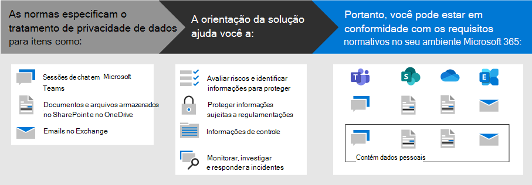

# Implantar a proteção de informações para regulamentações de privacidade de dados com o Microsoft 365Deploy information protection for data privacy regulations with Microsoft 365

Sua organização pode estar sujeita às normas de privacidade de dados regionais que exigem que você proteja, gerencie e forneça direitos e controle sobre as informações pessoais armazenadas na sua infraestrutura de ti, incluindo tanto no local quanto na nuvem.Your organization may be subject to regional data privacy regulations that require you to protect, manage, and provide rights and control over personal information stored in your IT infrastructure, including both on-premises and in the cloud. O melhor exemplo de uma regulamentação de privacidade de dados é o RGPD (regulamentação geral de proteção de dados) da União Européia.The best example of a data privacy regulation is the European Union's General Data Protection Regulation (GDPR). A falha na conformidade com as regulamentações de privacidade de dados pode resultar em multas substanciais.Failure to comply with data privacy regulations can result in substantial fines.

Exemplos de tipos de dados no Microsoft 365 incluem sessões de chat no Microsoft Teams, emails no Exchange e arquivos no SharePoint e no OneDrive.Examples of the types of data in Microsoft 365 include chat sessions in Microsoft Teams, emails in Exchange, and files in SharePoint and OneDrive. Esta solução fornece orientações sobre como avaliar riscos e identificar informações, proteger, controlar e responder a incidentes de privacidade de dados para dados pessoais armazenados nos serviços do Microsoft 365 que estão sujeitos às regulamentações de privacidade de dados.This solution provides guidance on how to assess risks and identify information, protect, govern, and respond to data privacy incidents for personal data stored in Microsoft 365 services that is subject to data privacy regulations.

Também são fornecidas informações adicionais sobre o uso dos controles de proteção de identidade, dispositivo e ameaça da Microsoft 365 para suas necessidades de privacidade de dados.Additional information is also provided on the use of Microsoft 365 identity, device, and threat protection controls for your data privacy needs. 

Para atender aos critérios de proteção de informações para conformidade com as regulamentações de privacidade de dados, use estes recursos e recursos do Microsoft 365.To meet the criteria for protecting information for compliance with data privacy regulations, use these Microsoft 365 capabilities and features.

| Capcidade ou recursoCapability or feature | DescriçãoDescription | LicençasLicensing |
|:-------|:-----|:-------|
| Gerente de ConformidadeCompliance Manager | Gerenciar atividades de conformidade normativa, obter uma pontuação geral da configuração atual de conformidade e encontrar recomendações para melhorias nessa ferramenta de avaliação de riscos baseada em fluxo de trabalho no centro de conformidade da Microsoft 365.Manage regulatory compliance activities, get an overall score of your current compliance configuration, and find recommendations for improvement in this workflow-based risk assessment tool in the Microsoft 365 compliance center. | Microsoft 365 E3 e E5Microsoft 365 E3 and E5 |
| Proteção Avançada contra Ameaças do Office (ATP)Office Advanced Threat Protection (ATP) | Proteja seus aplicativos e dados da Microsoft 365— como mensagens de email, documentos do Office e ferramentas de colaboração—de um ataque.Protect your Microsoft 365 apps and data—such as email messages, Office documents, and collaboration tools—from attack. | Microsoft 365 E3 e E5Microsoft 365 E3 and E5 | 
| Rótulos de confidencialidadeSensitivity labels | Classifique e proteja os dados da organização sem atrapalhar a produtividade e a capacidade de colaboração dos usuários, colocando rótulos com vários níveis de proteção em emails, arquivos ou sites.Classify and protect your organization's data without hindering the productivity of users and their ability to collaborate by placing labels with various levels of protection on email, files, or sites. | Microsoft 365 E3 e E5Microsoft 365 E3 and E5 |
| Proteção contra Perda de Dados (DLP) Data Loss Protection (DLP) | Detectar, avisar e bloquear compartilhamento arriscado, inadvertido ou impróprio, como o compartilhamento de dados com informações pessoais, interna e externamente.Detect, warn, and block risky, inadvertent, or inappropriate sharing, such as sharing of data containing personal information, both internally and externally. | Microsoft 365 E3 e E5Microsoft 365 E3 and E5 | 
| Rótulos e políticas de retenção de dadosData retention labels and policies | Implemente controles de governança de informações, como por quanto tempo manter os dados e os requisitos sobre o armazenamento de dados pessoais dos clientes, para estar em conformidade com as políticas da sua organização ou com as regulamentações de dados.Implement information governance controls, such as how long to keep data and requirements on the storage of personal data on customers, to comply with your organization's policies or data regulations. | Microsoft 365 E3 e E5Microsoft 365 E3 and E5 |
| Criptografia de emailEmail encryption | Envie e receba mensagens de email criptografadas entre as pessoas dentro e fora da sua organização que contenham dados regulados, como dados pessoais de clientes.Send and receive encrypted email messages between people inside and outside your organization that contains regulated data, such as personal data on customers. | Microsoft 365 E3 e E5Microsoft 365 E3 and E5 |
||||

## Organização das orientações desta soluçãoOrganization of the guidance in this solution

Para ajudá-lo a entender as ferramentas do Microsoft 365 disponíveis para identificar, gerenciar, controlar e monitorar dados pessoais sujeitos a uma ou mais normas relacionadas à privacidade, esta orientação é organizada em seções.To help you understand the Microsoft 365 tools available to identify, manage, control, and monitor personal data subject to one or more privacy-related regulations, this guidance is organized into sections.
 

Cada uma dessas seções corresponde a um artigo separado nesta solução.Each of these sections correspond to a separate article in this solution.

>[!Note]
>Se você já estiver familiarizado com suas obrigações de privacidade de dados e estiver em execução em um plano existente, convém se concentrar nas diretrizes de prevenção, proteção, retenção e investigação.If you are already familiar with your data privacy obligations and are executing against an existing plan, you may want to focus on the Prevent, Protect, Retain, and Investigate guidance.

>[!Important]
>Seguir estas orientações não o fará necessariamente em conformidade com qualquer regulamentação de privacidade de dados, especialmente considerando o número de etapas necessárias que estão fora do contexto dos recursos.Following this guidance will not necessarily make you compliant with any data privacy regulation, especially considering the number of steps required that are outside the context of the features. Você é responsável por garantir sua conformidade e consultar suas equipes jurídicas e de conformidade ou para buscar orientações e conselhos de terceiros especializados em conformidade.You are responsible for ensuring your compliance and to consult your legal and compliance teams or to seek guidance and advice from third parties that specialize in compliance.
>

## Plano: avaliar os riscos de privacidade de dados e identificar itens confidenciaisPlan: Assess data privacy risks and identify sensitive items

Avaliar as normas e os riscos de privacidade de dados em que sua organização está sujeita é uma primeira etapa a ser executada antes de começar a implementar melhorias, incluindo as obtidas por meio da configuração do Microsoft 365.Assessing data privacy regulations and risks that your organization is subject to is a key first step to take before starting to implement improvements, including those achievable through Microsoft 365 configuration. Isso pode incluir uma avaliação geral da prontidão ou identificação de tipos de informações confidenciais particulares que estão sujeitos aos controles normativos de que sua organização precisa estar em conformidade, bem como a ocorrência deles no seu ambiente Microsoft 365.This may include an overall readiness assessment or identification of particular sensitive information types that are subject to regulatory controls your organization needs to comply with, as well as the occurrence of them in your Microsoft 365 environment.

Para obter mais informações, consulte [avaliar riscos de privacidade de dados e identificar itens confidenciais](information-protection-deploy-assess.md).For more information, see [Assess data privacy risks and identify sensitive items](information-protection-deploy-assess.md).

## Track: executar avaliações de risco e verificar sua pontuação de conformidadeTrack: Run risk assessments and check your compliance score

O Gerenciador de conformidade, disponível no centro de conformidade da Microsoft 365, fornece uma capacidade interna de rastrear e gerenciar ações de melhorias gerais, bem como aquelas relacionadas a várias leis de privacidade de dados que se aplicam a você.Compliance Manager, available in the Microsoft 365 compliance center, provides you with a built-in ability to track and manage improvement actions overall as well as those related to multiple data privacy regulations that apply to you.

Aproveite os modelos de avaliação internos específicos para cada regulamentação, onde você pode rastrear itens de ação para cada modelo de avaliação selecionado, bem como para exibir controles regulatórios específicos e relacioná-los a ações específicas.Leverage built in assessment templates specific to each regulation, where you can track action items for each assessment template selected, as well as view specific regulatory controls, and relate them to specific actions.

Para obter mais informações, consulte [usar o Gerenciador de conformidade para gerenciar ações de melhoria](information-protection-deploy-compliance.md).For more information, see [Use Compliance Manager to manage improvement actions](information-protection-deploy-compliance.md).

## Impedir: proteger dados pessoaisPrevent: Protect personal data

A Microsoft 365 fornece vários recursos de proteção de identidade, dispositivo e ameaça que você pode usar para ajudar a cumprir a conformidade normativa da privacidade dos dados.Microsoft 365 provides a number of identity, device, and threat protection capabilities that you can use to help comply with data privacy regulatory compliance. 

Para obter mais informações, consulte [usar identidade, dispositivo e proteção contra ameaças para regulamentação de privacidade de dados](information-protection-deploy-identity-device-threat.md).For more information, see [Use identity, device, and threat protection for data privacy regulation](information-protection-deploy-identity-device-threat.md).

Este artigo descreve brevemente o que os regulamentos de privacidade de dados geralmente chamam nessas áreas e fornece uma lista de soluções do Microsoft 365 relacionadas, com links para mais informações para ajudá-lo a lidar com os requisitos de implementação.This article briefly describes what the data privacy regulations generally call for in these areas and provides a listing of related Microsoft 365 solutions, with links to more information to help you address any implementation requirements. 

## Proteger informações sujeitas à regulamentação de privacidade de dadosProtect information subject to data privacy regulation

As regulamentações de privacidade de dados ditam vários controles de proteção de informações pessoais que podem ser empregados em seu ambiente, incluindo mais de 40 proteger os controles de informações entre apenas as quatro regulamentações de privacidade de dados em nosso conjunto de amostra de RGPD, lei de proteção para consumidores da Califórnia (CCPA), HIPAA-alta (lei de privacidade de assistência médica Estados Unidos) e o decreto de proteçãoData privacy regulations dictate a number of personal information protection controls that can be employed in your environment, including more than forty Protect Information controls across just the four data privacy regulations in our sample set of GDPR, California Consumer Protection Act (CCPA), HIPAA-HITECH (United States health care privacy act), and the Brazil Data Protection Act (LGPD).

Para obter mais informações, consulte [proteger informações sujeitas à regulamentação de privacidade de dados em sua organização](information-protection-deploy-protect-information.md).For more information, see [Protect information subject to data privacy regulation in your organization](information-protection-deploy-protect-information.md).

Este artigo apresenta os principais esquemas de controle que podem ser usados para atender às necessidades de proteção de informações para privacidade de dados em sua organização.This article lays out the main control schemes that can be used for addressing information protection needs for data privacy in your organization.

## Reter: controlar informações sujeitas à regulamentação de privacidade de dadosRetain: Govern information subject to data privacy regulation

Os regulamentos de privacidade de dados chamam os controles de governança de informações pessoais que podem ser empregados no seu ambiente, incluindo mais de vinte e quatro controles nas quatro regulamentações de privacidade de dados em nosso conjunto de exemplos de RGPD, CCPA, HIPAA-alta e LGPD.Data privacy regulations call for personal information governance controls that can be employed in your environment, including more than twenty-four controls across the four data privacy regulations in our sample set of GDPR, CCPA, HIPAA-HITECH, and LGPD.

Para obter mais informações, consulte [governar informações sujeitas à regulamentação de privacidade de dados em sua organização](information-protection-deploy-govern.md).For more information, see [Govern information subject to data privacy regulation in your organization](information-protection-deploy-govern.md).

Embora as regulamentações de privacidade de dados possam ser vagas em relação à governança de informações, &mdash; como retenção proposital, exclusão e arquivamento &mdash; Este artigo apresenta os esquemas de controle principal que você pode usar para a privacidade de dados da sua organização.While the data privacy regulations can be vague regarding information governance&mdash;such as purposeful retention, deletion and archiving&mdash;this article lays out the primary control schemes that you can use address information governance needs for data privacy in your organization.

## Investigar: monitorar, investigar e responder a incidentes de privacidade de dadosInvestigate: Monitor, investigate, and respond to data privacy incidents

Há recursos do Microsoft 365 disponíveis para ajudá-lo a monitorar, investigar e responder a incidentes de privacidade de dados em sua organização à medida que você opera recursos relacionados.There are Microsoft 365 features available to help you monitor, investigate, and respond to data privacy incidents in your organization as you operationalize related capabilities. 

Ter processos, procedimentos e outras documentações para cada um deles pode ser importante para demonstrar a conformidade com órgãos regulamentares.Having processes, procedures, and other documentation for each of these can be important to demonstrate compliance to regulatory bodies.

Para obter mais informações, consulte [monitorar e responder a incidentes de privacidade de dados em sua organização](information-protection-deploy-monitor-respond.md).For more information, see [Monitor and respond to data privacy incidents in your organization](information-protection-deploy-monitor-respond.md).
