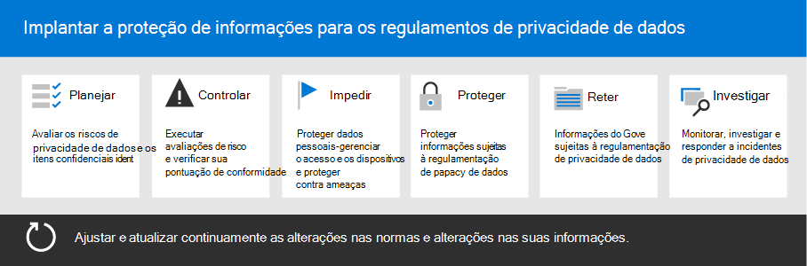

# Implantar a proteção de informações para regulamentos de privacidade de dados com Microsoft 365

Sua organização pode estar sujeita a regulamentos regionais de privacidade de dados que exigem que você proteja, gerencie e forneça direitos e controle sobre informações pessoais armazenadas em sua infraestrutura de TI, incluindo no local e na nuvem. O melhor exemplo de uma regulamentação de privacidade de dados é o RGPD (Regulamento Geral de Proteção de Dados) da União Europeia. A não conformidade com os regulamentos de privacidade de dados pode resultar em multas substanciais.

Exemplos dos tipos de dados no Microsoft 365 incluem sessões de chat em Microsoft Teams, emails no Exchange e arquivos em SharePoint e OneDrive. Essa solução fornece orientações sobre como avaliar riscos e tomar as medidas apropriadas para proteger dados pessoais em Microsoft 365. Isso inclui a identificação de informações pessoais para que você possa proteger, governar e responder a incidentes de privacidade de dados.

Informações adicionais também são fornecidas sobre o uso de Microsoft 365 de identidade, dispositivo e proteção contra ameaças para suas necessidades de privacidade de dados. 

Esses Microsoft 365 recursos ajudam você a atender aos critérios de proteção de informações.

| Capcidade ou recurso | Descrição | Licenças |
|:-------|:-----|:-------|
| Gerente de Conformidade | Gerenciar atividades de conformidade regulamentar, obter uma pontuação geral da configuração de conformidade atual e encontrar recomendações de melhoria. Esta é uma ferramenta de avaliação de risco baseada em fluxo de trabalho no centro Microsoft 365 conformidade. | Microsoft 365 E3 e E5 |
| Microsoft Defender para Office 365 | Proteja seus aplicativos e dados da Microsoft 365— como mensagens de email, documentos do Office e ferramentas de colaboração—de um ataque. | Microsoft 365 E3 e E5 | 
| Rótulos de confidencialidade | Classifique e proteja os dados da sua organização sem prejudicar a produtividade dos usuários e sua capacidade de colaborar. Coloque rótulos com vários níveis de proteção em emails, arquivos ou sites. | Microsoft 365 E3 e E5 |
| Proteção contra Perda de Dados (DLP)  | Detectar, avisar e bloquear o compartilhamento arriscado, inadvertido ou inadequado de dados que contenham informações pessoais, internas e externamente. | Microsoft 365 E3 e E5 | 
| Rótulos e políticas de retenção de dados | Implementar controles de governança de informações. Isso pode incluir a determinação de quanto tempo os dados (como dados pessoais relacionados aos clientes) devem estar em conformidade com as políticas ou regulamentos de dados da sua organização. | Microsoft 365 E3 e E5 |
| Criptografia de email | Proteja dados pessoais enviando e recebendo mensagens de email criptografadas entre pessoas dentro e fora da sua organização. | Microsoft 365 E3 e E5 |
||||

## Organização das diretrizes nesta solução

Para ajudá-lo a entender as Microsoft 365 disponíveis para ajudá-lo a atender a um ou mais regulamentos relacionados à privacidade, essas diretrizes são organizadas em seções.
 

Cada uma dessas seções corresponde a um artigo separado nesta solução.

>[!Note]
>Se você já estiver familiarizado com suas obrigações de privacidade de dados e estiver executando em um plano existente, talvez você queira se concentrar nas diretrizes Impedir, Proteger, Reter e Investigar.

>[!Important]
>Seguir essas diretrizes não necessariamente fará com que você seja compatível com qualquer regulamentação de privacidade de dados, especialmente considerando o número de etapas necessárias que estão fora do contexto dos recursos. Você é responsável por garantir sua conformidade e consultar suas equipes legais e de conformidade ou buscar orientação e orientação de terceiros especializados em conformidade.
>

## Plano: Avaliar riscos de privacidade de dados e identificar itens confidenciais

Avaliar os regulamentos e os riscos de privacidade de dados aos quais sua organização está sujeita é um primeiro passo importante a ser dado antes de começar a implementar melhorias, incluindo a configuração de recursos no Microsoft 365. Esse trabalho pode incluir uma avaliação geral de preparação ou identificação de tipos de informações confidenciais específicos que estão sujeitos a controles regulatórios que sua organização precisa cumprir.

Para obter mais informações, consulte [Avaliar riscos de privacidade de dados e identificar itens confidenciais.](information-protection-deploy-assess.md)

## Acompanhar: executar avaliações de risco e verificar sua pontuação de conformidade

O Gerenciador de Conformidade, disponível no centro de conformidade do Microsoft 365, oferece uma capacidade integrada de controlar e gerenciar ações de melhoria em geral, bem como as relacionadas a vários regulamentos de privacidade de dados que se aplicam a você.

Você pode usar modelos de avaliação internos específicos de cada regulamentação, onde você pode acompanhar itens de ação para cada modelo de avaliação selecionado, bem como exibir controles regulatórios específicos e relacioná-los a ações específicas.

Para obter mais informações, [consulte Use Compliance Manager to manage improvement actions](information-protection-deploy-compliance.md).

## Impedir: proteger dados pessoais

Microsoft 365 fornece recursos de proteção contra ameaças, dispositivos e identidades que você pode usar para ajudar a cumprir a conformidade regulamentar de privacidade de dados. 

Para obter mais informações, [consulte Use identity, device, and threat protection for data privacy regulation](information-protection-deploy-identity-device-threat.md).

Este artigo descreve brevemente o que os regulamentos de privacidade de dados geralmente chamam nessas áreas e fornece uma listagem de soluções Microsoft 365 relacionadas, com links para mais informações para ajudá-lo a atender a quaisquer requisitos de implementação. 

## Proteger informações sujeitas à regulamentação de privacidade de dados

Os regulamentos de privacidade de dados determinam uma série de controles de proteção de informações pessoais que podem ser empregados em seu ambiente, incluindo mais de 40 controles para proteger informações em apenas quatro regulamentos de privacidade de dados em nosso conjunto de exemplos de RGPD, Lei de Proteção do Consumidor da Califórnia (CCPA), HIPAA-HITECH (Lei de privacidade de assistência à saúde dos Estados Unidos) e a Lei de Proteção de Dados do Brasil (LGPD).

Para obter mais informações, [consulte Protect information subject to data privacy regulation in your organization](information-protection-deploy-protect-information.md).

Este artigo estabelece os principais esquemas de controle que podem ser usados para lidar com as necessidades de proteção de informações para privacidade de dados em sua organização.

## Reter: Governe informações sujeitas à regulamentação de privacidade de dados

Os regulamentos de privacidade de dados chamam controles de governança de informações pessoais que podem ser empregados em seu ambiente, incluindo mais de 24 controles nos quatro regulamentos de privacidade de dados em nosso conjunto de exemplos de RGPD, CCPA, HIPAA-HITECH e LGPD.

Para obter mais informações, consulte [Govern information subject to data privacy regulation in your organization](information-protection-deploy-govern.md).

Embora os regulamentos de privacidade de dados possam ser vagas em relação à governança de informações, como retenção, exclusão e arquivamento proposital, este artigo estabelece os principais esquemas de controle que você pode usar para atender às necessidades de governança de informações para privacidade de dados em sua &mdash; &mdash; organização.

## Investigar: monitorar, investigar e responder a incidentes de privacidade de dados

Há Microsoft 365 recursos disponíveis para ajudá-lo a monitorar, investigar e responder a incidentes de privacidade de dados em sua organização à medida que você operacionaliza os recursos relacionados. 

Ter processos, procedimentos e outras documentações para usar esses recursos pode ser importante para demonstrar a conformidade com os órgãos regulatórios.

Para obter mais informações, [consulte Monitor and respond to data privacy incidents in your organization](information-protection-deploy-monitor-respond.md).
