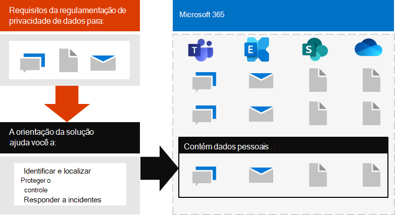

# Implantar a proteção de informações para regulamentações de privacidade de dados com o Microsoft 365

Sua organização pode estar sujeita às normas de privacidade de dados regionais que exigem que você proteja, gerencie e forneça direitos e controle sobre as informações pessoais armazenadas na sua infraestrutura de ti, incluindo tanto no local quanto na nuvem. O melhor exemplo de uma regulamentação de privacidade de dados é o RGPD (regulamentação geral de proteção de dados) da União Européia. A falha na conformidade com as regulamentações de privacidade de dados pode resultar em multas substanciais.

Exemplos de tipos de dados no Microsoft 365 incluem sessões de chat no Microsoft Teams, emails no Exchange e arquivos no SharePoint e no OneDrive. Esta solução fornece orientações sobre como identificar, localizar, proteger, controlar e responder a incidentes de privacidade de dados para dados pessoais armazenados nos serviços do Microsoft 365 que estão sujeitos às regulamentações de privacidade de dados.

Também são fornecidas informações adicionais sobre o uso dos controles de proteção de identidade, dispositivo e ameaça da Microsoft 365 para suas necessidades de privacidade de dados. 

Para atender aos critérios de proteção de informações para conformidade com as regulamentações de privacidade de dados, use estes recursos e recursos do Microsoft 365.

| Capcidade ou recurso | Descrição | Licenças |
|:-------|:-----|:-------|
| Gerenciador de Conformidade | Gerenciar atividades de conformidade regulatória relacionadas aos serviços de nuvem da Microsoft com esta ferramenta de avaliação de risco baseada em fluxo de trabalho no portal de confiança do serviço Microsoft. | Microsoft 365 E3 e e5 |
| Pontuação de Conformidade (visualização) | Veja uma pontuação geral da configuração atual de conformidade e recomendações para melhorá-lo no centro de conformidade da Microsoft 365. | Microsoft 365 E3 e e5 |
| Proteção avançada contra ameaças do Office (ATP) | Proteja seus aplicativos e dados do Microsoft 365, como mensagens de email, documentos do Office e ferramentas de colaboração — contra ataques. | Microsoft 365 E3 e e5 | 
| Rótulos de confidencialidade | Classifique e proteja os dados da sua organização sem prejudicar a produtividade dos usuários e sua capacidade de colaborar colocando rótulos com vários níveis de proteção em emails, arquivos ou sites. | Microsoft 365 E3 e e5 |
| Proteção contra perda de dados (DLP) | Detectar, avisar e bloquear compartilhamento arriscado, inadvertido ou inadequado, como compartilhamento de dados contendo informações pessoais, interna e externamente. | Microsoft 365 E3 e e5 | 
| Rótulos e políticas de retenção de dados | Implemente controles de governança de informações, como por quanto tempo manter os dados e os requisitos no armazenamento de dados pessoais nos clientes, para estar em conformidade com as políticas ou regulamentações de dados da sua organização. | Microsoft 365 E3 e e5 |
| Criptografia de email | Enviar e receber mensagens de email criptografadas entre pessoas dentro e fora da sua organização que contenha dados regulamentados, como dados pessoais em clientes. | Microsoft 365 E3 e e5 |
||||

## Organização das orientações desta solução

Para ajudá-lo a entender as ferramentas do Microsoft 365 disponíveis para identificar, gerenciar, controlar e monitorar dados pessoais sujeitos a uma ou mais normas relacionadas à privacidade, esta orientação é organizada em seções.
 

Cada uma dessas seções corresponde a um artigo separado nesta solução.

>[!Note]
>Se você já estiver familiarizado com suas obrigações de privacidade de dados e estiver em execução em um plano existente, convém se concentrar nas diretrizes de prevenção, proteção, retenção e investigação.

>[!Important]
>Seguir estas orientações não o fará necessariamente em conformidade com qualquer regulamentação de privacidade de dados, especialmente considerando o número de etapas necessárias que estão fora do contexto dos recursos. Você é responsável por garantir sua conformidade e consultar suas equipes jurídicas e de conformidade ou para buscar orientações e conselhos de terceiros especializados em conformidade.
>

## Plano: avaliar os riscos de privacidade de dados e identificar itens confidenciais 

Avaliar as normas e os riscos de privacidade de dados em que sua organização está sujeita é uma primeira etapa a ser executada antes de começar a implementar melhorias, incluindo as obtidas por meio da configuração do Microsoft 365. Isso pode incluir uma avaliação geral da prontidão ou identificação de tipos de informações confidenciais particulares que estão sujeitos aos controles normativos de que sua organização precisa estar em conformidade, bem como a ocorrência deles no seu ambiente Microsoft 365.

Para obter mais informações, consulte [avaliar riscos de privacidade de dados e identificar itens confidenciais](information-protection-deploy-assess.md).

## Track: usar a pontuação de conformidade e o gerente de conformidade 

A pontuação de conformidade e o gerente de conformidade oferecem um conjunto integrado de ferramentas disponíveis no portal de confiança do centro de administração de conformidade e serviços do Microsoft 365. Juntas, essas ferramentas oferecem uma capacidade interna de rastrear e gerenciar ações de melhorias gerais, bem como aquelas relacionadas a diversas regulamentações de privacidade de dados às quais você está sujeito.

As ferramentas também permitem que você utilize modelos de avaliação internos específicos para cada regulamentação, onde você pode rastrear itens de ação para cada modelo de avaliação selecionado, bem como exibir controles regulatórios específicos e relacioná-los a ações específicas.

Para saber mais, confira [usar o placar de conformidade e o Gerenciador de conformidade para gerenciar ações de melhoria](information-protection-deploy-compliance.md).

## Impedir: usar a proteção de identidade, dispositivo e ameaça para a regulamentação de privacidade de dados

A Microsoft 365 fornece vários recursos de proteção de identidade, dispositivo e ameaça que você pode usar para ajudar a cumprir a conformidade normativa da privacidade dos dados. 

Para obter mais informações, consulte [usar identidade, dispositivo e proteção contra ameaças para regulamentação de privacidade de dados](information-protection-deploy-identity-device-threat.md).

Este artigo descreve brevemente o que os regulamentos de privacidade de dados geralmente chamam nessas áreas e fornece uma lista de soluções do Microsoft 365 relacionadas, com links para mais informações para ajudá-lo a lidar com os requisitos de implementação. 

## Proteger informações sujeitas à regulamentação de privacidade de dados

As regulamentações de privacidade de dados ditam vários controles de proteção de informações pessoais que podem ser empregados em seu ambiente, incluindo mais de 40 proteger os controles de informações entre apenas as quatro regulamentações de privacidade de dados em nosso conjunto de amostra de RGPD, lei de proteção para consumidores da Califórnia (CCPA), HIPAA-alta (lei de privacidade de assistência médica Estados Unidos) e o decreto de proteção

Para obter mais informações, consulte [proteger informações sujeitas à regulamentação de privacidade de dados em sua organização](information-protection-deploy-protect-information.md).

Este artigo apresenta os principais esquemas de controle que podem ser usados para atender às necessidades de proteção de informações para privacidade de dados em sua organização.

## Reter: controlar informações sujeitas à regulamentação de privacidade de dados

Os regulamentos de privacidade de dados chamam os controles de governança de informações pessoais que podem ser empregados no seu ambiente, incluindo mais de vinte e quatro controles nas quatro regulamentações de privacidade de dados em nosso conjunto de exemplos de RGPD, CCPA, HIPAA-alta e LGPD.

Para obter mais informações, consulte [governar informações sujeitas à regulamentação de privacidade de dados em sua organização](information-protection-deploy-govern.md).

Embora as regulamentações de privacidade de dados possam ser vagas em relação à governança de informações, &mdash; como retenção proposital, exclusão e arquivamento &mdash; Este artigo apresenta os esquemas de controle principal que você pode usar para a privacidade de dados da sua organização.

## Investigue: monitorar e responder ao assunto para a regulamentação de privacidade de dados

Há recursos do Microsoft 365 disponíveis para ajudá-lo a monitorar, investigar e responder a incidentes de privacidade de dados em sua organização à medida que você opera recursos relacionados. 

Ter processos, procedimentos e outras documentações para cada um deles pode ser importante para demonstrar a conformidade com órgãos regulamentares.

Para obter mais informações, consulte [monitorar e responder a incidentes de privacidade de dados em sua organização](information-protection-deploy-monitor-respond.md).
