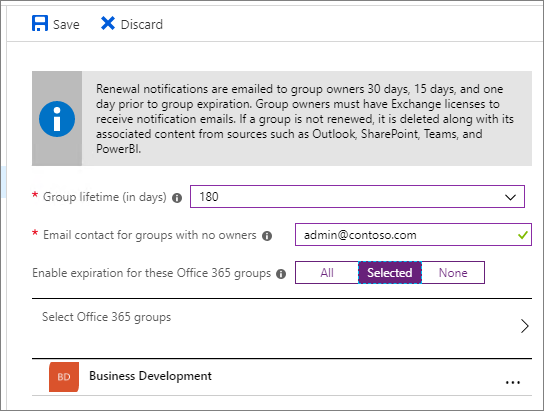

# Política de expiração de grupo do Microsoft 365Microsoft 365 group expiration policy

Com o aumento do uso de grupos do Microsoft 365 e do Microsoft Teams, os administradores e usuários precisam de uma maneira de limpar grupos e equipes nãousados.With the increase in usage of Microsoft 365 groups and Microsoft Teams, administrators and users need a way to clean up unused groups and teams. Uma política de expiração de grupos do Microsoft 365 pode ajudar a remover grupos inativos do sistema e tornar as coisas mais limpas.A Microsoft 365 groups expiration policy can help remove inactive groups from the system and make things cleaner.

Quando um grupo expira, todos os seus serviços associados (caixa de correio, Planner, site do SharePoint, equipe etc.) também são excluídos.When a group expires, all of its associated services (the mailbox, Planner, SharePoint site, team, etc.) are also deleted.

Quando um grupo expira, ele é "excluído suavemente" o que significa que ele ainda pode ser recuperado por até 30 dias.When a group expires it is "soft-deleted" which means it can still be recovered for up to 30 days.

Os administradores podem especificar um período de expiração e qualquer grupo inativo que atingir o final desse período e não for renovado, será excluído.Administrators can specify an expiration period and any inactive group that reaches the end of that period, and is not renewed, will be deleted. (Isso inclui equipes arquivadas.) O período de expiração começa quando o grupo é criado ou na data em que foi renovado pela última vez.(This includes archived teams.) The expiration period begins when the group is created, or on the date it was last renewed. Os proprietários do grupo serão enviados automaticamente um email antes da expiração que permite que eles renovem o grupo para outro intervalo de expiração.Group owners will automatically be sent an email before the expiration that allows them to renew the group for another expiration interval. Os usuários do Teams verão notificações persistentes no Teams.Teams users will see persistent notifications in Teams.

Os grupos que estão em uso ativamente são renovados automaticamente.Groups that are actively in use are renewed automatically. Qualquer uma das seguintes ações renovará automaticamente um grupo:Any of the following actions will auto-renew a group:
- SharePoint - exibir, editar, baixar, mover, compartilhar ou carregar arquivos.SharePoint - view, edit, download, move, share, or upload files. (A exibição de uma página do SharePoint não conta como uma ação para renovação automática.)(Viewing a SharePoint page does not count as an action for automatic renewal.)
- Outlook - ingressar em grupo, ler ou gravar mensagem de grupo do grupo e como uma mensagem (Outlook na Web).Outlook - join group, read or write group message from the group, and like a message (Outlook on the web).
- Teams - visitando um canal do Teams.Teams - visiting a teams channel.

Observe que a única atividade do Yammer que disparará uma renovação automática de grupo é o carregamento de um documento no SharePoint dentro da comunidade.Note that the only Yammer activity which will trigger an automatic group renewal is the upload of a document to SharePoint within the community.

> [!IMPORTANT]
> Quando você altera a política de expiração, o serviço recalcula a data de expiração para cada grupo.When you change the expiration policy, the service recalculates the expiration date for each group. Ele sempre começa a contar a partir da data em que o grupo foi criado e aplica a nova política de expiração.It always starts counting from the date when the group was created, and then applies the new expiration policy.

É importante saber que a expiração está desligada por padrão.It's important to know that expiration is turned off by default. Os administradores devem habilita-lo para sua organização se quiserem usá-lo.Administrators have to enable it for their organization if they want to use it.

> [!NOTE]
> Configurar e usar a política de expiração para grupos do Microsoft 365 exige que você possua, mas não necessariamente atribua licenças do Azure AD Premium para os membros de todos os grupos aos quais a política de expiração é aplicada.Configuring and using the expiration policy for Microsoft 365 groups requires you to possess but not necessarily assign Azure AD Premium licenses for the members of all groups to which the expiration policy is applied. Para obter mais informações, [consulte Getting started with Azure Active Directory Premium](/azure/active-directory/active-directory-get-started-premium).For more information see [Getting started with Azure Active Directory Premium](/azure/active-directory/active-directory-get-started-premium).

## Quem pode configurar e usar a política de expiração de grupos do Microsoft 365?Who can configure and use the Microsoft 365 groups expiration policy?

|RoleRole|O que eles podem fazerWhat they can do|
|---------|---------|
|Administrador global do Office 365 (no Azure, o administrador da empresa), Administrador do usuárioOffice 365 global admin (in Azure, the Company administrator), User administrator|Crie, leia, atualize ou exclua as configurações de política de expiração de grupos do Microsoft 365.Create, read, update, or delete the Microsoft 365 groups expiration policy settings.|
|UsuárioUser|Renovar ou [restaurar](/azure/active-directory/users-groups-roles/groups-restore-deleted) um grupo do Microsoft 365 que eles própriosRenew or [restore](/azure/active-directory/users-groups-roles/groups-restore-deleted) a Microsoft 365 group that they own|

## Como definir a política de expiraçãoHow to set the expiration policy

Conforme mencionado acima, a expiração é desligada por padrão.As noted above, expiry is turned off by default. Um administrador terá que habilitar a política de expiração e definir as propriedades para que ela entre em vigor.An administrator will have to enable the expiration policy and set the properties for it to take effect. Para habilita-lo, vá para Expiração de Grupos do **Azure Active Directory**  >    >  .To enable it, go to **Azure Active Directory** > **Groups** > **Expiration**. Aqui, você pode definir o tempo de vida do grupo padrão e especificar com que antecedência deseja que as primeiras e segunda notificações de expiração vão para o proprietário do grupo.Here you can set the default group lifetime and specify how far in advance you want the first and second expiration notifications to go to the group owner.

O tempo de vida do grupo é especificado em dias e pode ser definido como 180, 365 ou como um valor personalizado especificado.The group lifetime is specified in days and can be set to 180, 365 or to a custom value that you specify. O valor personalizado deve ser pelo menos 30 dias.The custom value has to be at least 30 days.

Se o grupo não tiver um proprietário, os emails de expiração serão para o administrador especificado.If the group does not have an owner, the expiration emails will go to the specified administrator.

Você pode definir a política para todos os seus grupos, somente grupos selecionados (até 500) ou a desativar completamente selecionando **Nenhum**.You can set the policy for all of your groups, only selected groups (up to 500), or turn it off completely by selecting **None**. Observe que atualmente você não pode ter políticas diferentes para grupos diferentes.Note that currently you can't have different policies for different groups.

## Como a expiração funciona com a política de retençãoHow expiry works with the retention policy

Se você tiver criado uma política de retenção para grupos no Centro de Segurança e Conformidade, a política de expiração funcionará perfeitamente com a política de retenção.If you have set up a retention policy for groups in the Security and Compliance center, the expiration policy works seamlessly with retention policy. Quando um grupo expira, as conversas e arquivos de caixa de correio do grupo no site do grupo são mantidos no contêiner de retenção para o número específico de dias definido na política de retenção.When a group expires, the group's mailbox conversations and files in the group site are retained in the retention container for the specific number of days defined in the retention policy. No entanto, os usuários não verão o grupo ou seu conteúdo após a expiração.Users will not see the group, or its content, after expiration however.

## Como e quando um proprietário de grupo aprenderá se seus grupos vão expirarHow and when a group owner learns if their groups are going to expire

Os proprietários do grupo só serão notificados por email.Group owners will only be notified via email. Se o grupo foi criado por meio do Planner, do SharePoint ou de qualquer outro aplicativo, as notificações de expiração sempre virão por email.If the group was created via Planner, SharePoint, or any other app, the expiration notifications will always come via email. Se o grupo foi criado por meio do Teams, o proprietário do grupo receberá uma notificação para renovar por meio da seção atividade.If the group was created via Teams, the group owner will receive a notification to renew through the activity section. Não é recomendável que você habilita a expiração em um grupo se o proprietário do grupo não tiver um endereço de email válido.It's not recommended that you enable expiration on a group if your group owner doesn't have a valid email address.

Trinta dias antes do grupo expirar, os proprietários do grupo (ou os endereços de email especificados para grupos que não têm um proprietário) receberão um email permitindo que eles renovem facilmente o grupo.Thirty days before the group expires, the group owners (or the email addresses that you specified for groups that don't have an owner) will receive an email allowing them to easily renew the group. Se eles não o renovarem, receberão outro email de renovação 15 dias antes da expiração.If they don't renew it, they'll receive another renewal email 15 days before expiration. Se ainda não a renovarem, receberão mais uma notificação de email no dia anterior à expiração.If they still haven't renewed it, they will receive one more email notification the day before expiration.

Se, por algum motivo, nenhum dos proprietários ou administradores renovar o grupo antes de expirar, o administrador ainda poderá restaurar o grupo por até 30 dias após a expiração.If for some reason none of the owners or admins renew the group before it expires, the admin can still restore the group for up to 30 days after expiration. Para obter detalhes, consulte: Restaurar um grupo excluído do [Microsoft 365](https://support.office.com/article/restore-a-deleted-office-365-group-b7c66b59-657a-4e1a-8aa0-8163b1f4eb54).For details see: [Restore a deleted Microsoft 365 group](https://support.office.com/article/restore-a-deleted-office-365-group-b7c66b59-657a-4e1a-8aa0-8163b1f4eb54).

## Conteúdo do grupo de arquivamentoArchiving group contents

Se você tiver um grupo que não planeja mais usar, mas deseja manter seu conteúdo, consulte [Arquivar grupos,](end-life-cycle-groups-teams-sites-yammer.md) equipes e Yammer para obter informações sobre como exportar informações dos diferentes serviços de grupos.If you have a group that you no longer plan to use, but you want to retain its content, see [Archive groups, teams, and Yammer](end-life-cycle-groups-teams-sites-yammer.md) for information about how to export information from the different groups services.

## Tópicos relacionadosRelated topics

[Planejamento de governança de colaboração passo a passoCollaboration governance planning step-by-step](collaboration-governance-overview.md#collaboration-governance-planning-step-by-step)

[Criar seu plano de governança de colaboraçãoCreate your collaboration governance plan](collaboration-governance-first.md)

[Visão geral de políticas de retençãoOverview of retention policies](https://support.office.com/article/5e377752-700d-4870-9b6d-12bfc12d2423)

[Atribuir um novo proprietário a um grupo órfãoAssign a new owner to an orphaned group](https://support.office.com/article/86bb3db6-8857-45d1-95c8-f6d540e45732)

[Configurar a expiração de grupos do Microsoft 365Configure Microsoft 365 groups expiration](/azure/active-directory/active-directory-groups-lifecycle-azure-portal)
