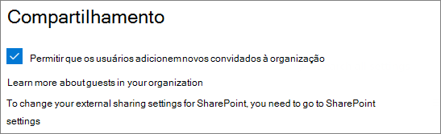
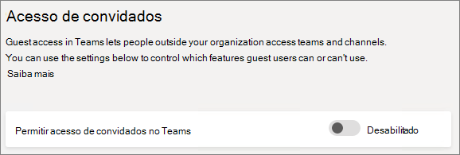
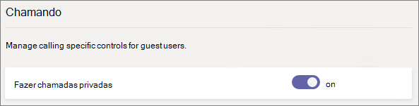
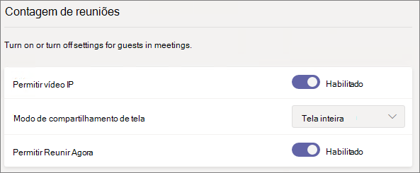
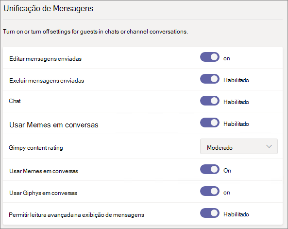
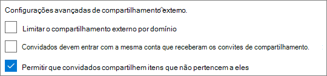
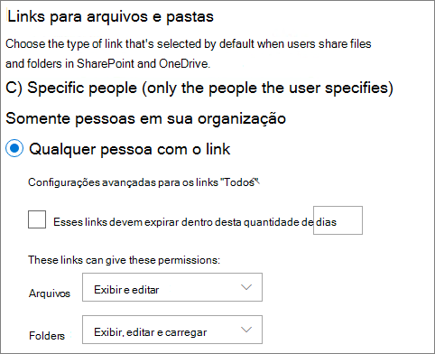
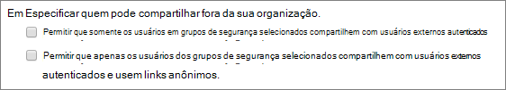
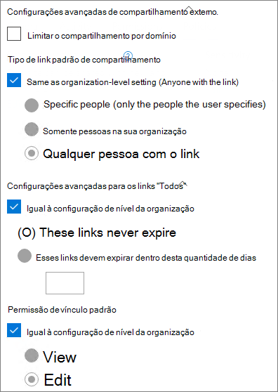

# Referência de configurações de compartilhamento de convidados do Microsoft 365

Este artigo é uma referência para as diversas configurações que podem afetar o compartilhamento, com pessoas de fora da sua organização, das cargas de trabalho do Microsoft 365: Teams, Grupos do Microsoft 365, SharePoint e OneDrive. Essas configurações estão localizadas nos centros de administração do Azure Active Directory, Microsoft 365, Teams e SharePoint.

## Azure Active Directory

**Função de administrador:** Administrador global

O Azure Active Directory é o serviço de diretório usado pelo Microsoft 365. As configurações de relações organizacionais do Azure Active Directory afetam diretamente o compartilhamento no Teams, Grupos do Microsoft 365, SharePoint e OneDrive.

> [!NOTE]
> Essas configurações afetam apenas o SharePoint quando a [integração do SharePoint e OneDrive com o Azure AD B2B (versão prévia)](https://docs.microsoft.com/sharepoint/sharepoint-azureb2b-integration-preview) tiver sido configurada. A tabela a seguir supõe que ela tenha sido configurada.

### Configurações das relações organizacionais

**Navegação:** [Centro de Administração do Azure Active Directory](https://aad.portal.azure.com) > Azure Active Directory > Identidades Externas > Configurações de Colaboração Externas

|**Configuração**|**Padrão**|**Descrição**|
|:-----|:-----|:-----|
|As permissões de usuários convidados são limitadas|Sim|Essa configuração afeta as tarefas de diretório que um convidado pode executar.|
|Somente administradores e usuários na função emissor do convite convidado podem convidar|Sim|Quando definido como **Sim**, os administradores podem convidar convidados por meio do Azure AD e por experiências de compartilhamento da Microsoft 365, como o Teams e SharePoint. Quando definido como **Não**, não podem.|
|Membros podem convidar|Sim|Quando definido como **Sim**, os membros do Azure AD podem convidar convidados por meio do Azure AD. Quando definido como **Não**, não podem. Quando definido como **Sim**, os membros do Grupo do Microsoft 365 podem convidar convidados com a aprovação do proprietário. Quando definido como **Não**, os membros do Grupo do Microsoft 365 podem convidar convidados com a aprovação do proprietário, mas os proprietários devem ser administradores globais para aprovar.   Observe que a frase **Membros podem convidar** se refere aos membros no Azure AD (em vez de convidados) e não aos membros do site ou do grupo no Microsoft 365.   Isso é idêntico à configuração **Permitir que usuários adicionem novos convidados à organização** na Segurança e Privacidade no Microsoft 365.|
|Os convidados podem convidar|Sim|Quando definido como **Sim**, os convidados no diretório podem convidar outros convidados para colaborar em recursos do Azure AD e em arquivos e pastas no SharePoint e no OneDrive. Quando definido como **Não**, não podem.   Observe que**Permitir que usuários externos encontrem contas de usuários no diretório digitando o endereço de email em correspondência exata** deve ser habilitada no centro de administração do SharePoint para convidados compartilharem arquivos e pastas com outros convidados.|
|Habilitar senha de uso único por email para convidados (versão prévia)|Não|Quando definido como **Sim**, os convidados sem um MSA ou uma conta corporativa ou de estudante podem [autenticar com o Azure ad usando uma senha de uso único](https://docs.microsoft.com/azure/active-directory/b2b/one-time-passcode). Quando definido como **Não**, os usuários precisam criar uma Conta Microsoft para autenticação. Essa configuração deve ser definida como **Sim** na [integração do SharePoint e OneDrive com o Azure AD B2B (versão prévia)](https://docs.microsoft.com/sharepoint/sharepoint-azureb2b-integration-preview) para funcionar.|
|Restrições de colaboração|Permitir o envio de convites para qualquer domínio|Essa configuração permite especificar uma lista de domínios permitidos ou bloqueados para compartilhamento. Quando domínios permitidos são especificados, convites de compartilhamento só poderão ser enviados para esses domínios. Quando domínios negados são especificados, convites de compartilhamento não poderão ser enviados para esses domínios.   Essa configuração afeta as experiências de compartilhamento da Microsoft 365, como o Teams e SharePoint. Você pode permitir ou bloquear domínios em um nível mais granular usando a filtragem de domínios no SharePoint ou Teams.|

Essas configurações afetam como os usuários são convidados ao diretório. Elas não afetam o compartilhamento com convidados que já estão no diretório.

## Microsoft 365

**Função de administrador:** Administrador global

O Centro de administração do Microsoft 365 tem configurações no nível da organização para compartilhamento e Grupos do Microsoft 365.

### Compartilhamento

**Navegação:**[Centro de administração do Microsoft 365](https://admin.microsoft.com) > Configurações > Configurações da Organização > Segurança e Privacidade > Compartilhamento

|**Configuração**|**Padrão**|**Descrição**|
|:-----|:-----|:-----|
|Permitir que os usuários adicionem novos convidados à organização|Habilitado|Quando definido como **Sim**, os membros do Azure AD podem convidar convidados por meio do Azure AD. Quando definido como **Não**, não podem. Quando definido como **Sim**, os membros do Grupo do Microsoft 365 podem convidar convidados com a aprovação do proprietário. Quando definido como **Não**, os membros do Grupo do Microsoft 365 podem convidar convidados com a aprovação do proprietário, mas os proprietários devem ser administradores globais para aprovar.   Observe que a frase **Membros podem convidar** se refere aos membros no Azure AD (em vez de convidados) e não aos membros do site ou do grupo no Microsoft 365.   Isso é idêntico à configuração **Membros podem convidar** nas configurações das relações organizacionais do Azure Active Directory.|

### Grupos do Microsoft 365

**Navegação:**[Centro de administração do Microsoft 365](https://admin.microsoft.com) > Configurações > Configurações> Grupos do Microsoft 365

|**Configuração**|**Padrão**|**Descrição**|
|:-----|:-----|:-----|
|Permitir que os membros do grupo fora da organização acessem o conteúdo do grupo|Habilitado|Quando definida como **Habilitado**, convidados podem acessar o conteúdo de grupos. Quando definido como **Desabilitado**, eles não podem. Essa configuração deve estar **Habilitada** para qualquer cenário em que os usuários convidados estejam interagindo com o Teams ou grupos do Microsoft 365.|
|Permitir que os proprietários do grupo adicionem pessoas fora da organização aos grupos|Ativado|Quando está **Habilitado**, proprietários dos grupos do Microsoft 365 ou do Teams podem convidar novos convidados ao grupo. Quando está **Desabilitado**, os proprietários só poderão convidar convidados que já estejam no diretório.|

Essas configurações estão no nível da organização. Confira o artigo [Criar configurações de um grupo específico](https://docs.microsoft.com/azure/active-directory/users-groups-roles/groups-settings-cmdlets#create-settings-for-a-specific-group) para obter informações sobre como alterar essas configurações no nível de grupo usando o PowerShell.

## Teams

A chave de acesso principal de convidado do Teams, **Permitir o acesso de convidado no Teams**, deve estar **Habilitada** para que as outras configurações de convidado estejam disponíveis.

**Função do Administrador:** Administrador de Serviços do Teams

### Acesso de convidados

**Navegação:** [Centro de administração do Teams](https://admin.teams.microsoft.com) > Configurações em toda a organização > Acesso de convidados

|**Configuração**|**Padrão**|**Descrição**|
|:-----|:-----|:-----|
|Permitir acesso de convidados no Teams|Desabilitado|Habilita ou desabilita o acesso geral de convidados para o Teams. Essa configuração pode entrar em vigor em até 24 horas após a alteração.|

### Chamadas de convidado

**Navegação:** [Centro de administração do Teams](https://admin.teams.microsoft.com) > Configurações em toda a organização > Acesso de convidados

|**Configuração**|**Padrão**|**Descrição**|
|:-----|:-----|:-----|
|Fazer chamadas privadas|Habilitado|Quando está **Habilitado**, os convidados podem fazer chamadas de ponto a ponto no Teams. Quando está **Desabilitado**, não podem.|

### Reunião de convidados

**Navegação:** [Centro de administração do Teams](https://admin.teams.microsoft.com) > Configurações em toda a organização > Acesso de convidados

|**Configuração**|**Padrão**|**Descrição**|
|:-----|:-----|:-----|
|Permitir vídeo IP|Habilitado|Quando está **Habilitado**, os convidados podem usar vídeos em suas chamadas e reuniões. Quando está **Desabilitado**, não podem.|
|Modo de compartilhamento de tela|Tela inteira|Quando está **Desabilitado**, os convidados não podem compartilhar suas telas no Teams. Quando definido como **Aplicativo único**, os convidados só podem compartilhar um único aplicativo na tela. Quando estiver definido como **Tela inteira**, os convidados podem optar por compartilhar um aplicativo ou sua tela inteira.|
|Permitir Reunir Agora|Habilitado|Quando está **Habilitado**, os convidados podem usar o recurso Reunir Agora no Teams. Quando está **Desabilitado**, não podem.|

### Sistema de mensagens de convidado

**Navegação:** [Centro de administração do Teams](https://admin.teams.microsoft.com) > Configurações em toda a organização > Acesso de convidados

|**Configuração**|**Padrão**|**Descrição**|
|:-----|:-----|:-----|
|Editar mensagens enviadas|Habilitado|Quando está **Habilitado**, os convidados podem editar mensagens que já foram enviadas. Quando está **Desabilitado**, não podem.|
|Excluir mensagens enviadas|Habilitado|Quando está **Habilitado**, os convidados podem excluir mensagens que já foram enviadas. Quando está **Desabilitado**, não podem.|
|Chat|Habilitado|Quando está **Habilitado**, os convidados podem usar o chat no Teams. Quando está **Desabilitado**, não podem.|
|Usar Giphys em conversas|Habilitado|Quando está **Habilitado**, os convidados podem usar o Giphys nas conversas. Quando está **Desabilitado**, não podem.|
|Classificação de conteúdo Giphy|Moderado|Quando definido como **Permitir todo o conteúdo**, os convidados podem inserir todos os Giphys em chats, independentemente da classificação de conteúdo. Quando estiver definido como **Moderado**, os convidados podem inserir Giphys nos chats, mas o conteúdo adulto será restringido de forma moderada. Quando definido como **Estrito**, os convidados podem inserir Giphys em chats, mas o conteúdo adulto não poderá ser inserido.|
|Usar Memes em conversas|Habilitado|Quando está **Habilitado**, os convidados podem usar memes nas conversas. Quando está **Desabilitado**, não podem.|
|Figurinha do usuário em conversas|Habilitado|Quando está **Habilitado**, os convidados podem usar figurinhas nas conversas. Quando está **Desabilitada**, não podem.|
|Permitir leitura avançada na exibição de mensagens|Habilitado|Quando está **Habilitado**, os convidados podem exibir mensagens na leitura avançada. Quando está **Desabilitada**, não podem.|

## SharePoint e OneDrive (nível da organização)

**Função do Administrador:** administrador do SharePoint

Essas configurações afetam todos os sites da organização. Elas não afetam o Teams ou os Grupos do Microsoft365 diretamente, no entanto, recomendamos que você alinhe essas configurações com as configurações dos Grupos do Microsoft 365 e do Teams para evitar problemas de experiência do usuário. (Por exemplo, se o compartilhamento de convidados for permitido no Teams, mas não no SharePoint, então os convidados no Teams não terão acesso à guia Arquivos porque os arquivos do Teams estão armazenados no SharePoint.)

### Configurações de compartilhamento no SharePoint e no OneDrive

Como o OneDrive é uma hierarquia de sites no SharePoint, as configurações de compartilhamento no nível da organização afetam diretamente o OneDrive assim como em outros sites do SharePoint.

**Navegação:** Centro de Administração do SharePoint > Compartilhamento

|**Configuração**|**Padrão**|**Descrição**|
|:-----|:-----|:-----|
|SharePoint|Qualquer pessoa|Especifica as permissões de compartilhamento mais permissivas permitidas para sites do SharePoint.|
|OneDrive|Qualquer pessoa|Especifica as permissões de compartilhamento mais permissivas permitidas para sites do OneDrive. Essa configuração não pode ser mais permissiva que a configuração do SharePoint.|

### Configurações de compartilhamento avançado no SharePoint e no OneDrive

**Navegação:** Centro de Administração do SharePoint > Compartilhamento

|**Configuração**|**Padrão**|**Descrição**|
|:-----|:-----|:-----|
|Limitar o compartilhamento externo por domínio|Desabilitado|Essa configuração permite especificar uma lista de domínios permitidos ou bloqueados para compartilhamento. Quando domínios permitidos são especificados, convites de compartilhamento só poderão ser enviados para esses domínios. Quando domínios negados são especificados, convites de compartilhamento não poderão ser enviados para esses domínios.   Essa configuração afeta todos os sites do SharePoint e do OneDrive na organização.|
|Convidados devem entrar com a mesma conta que receberam os convites de compartilhamento.|Desabilitado|Impede que os convidados resgatem os convites de compartilhamento de sites usando um endereço de email diferente do envio do convite.  [A integração do SharePoint e do OneDrive com o Azure AD B2B (versão prévia)](https://docs.microsoft.com/sharepoint/sharepoint-azureb2b-integration-preview) não usa essa configuração porque todos os convidados são adicionados ao diretório com base no endereço de email do envio do convite. Endereços de email alternativos não podem ser usados para acessar o site.|
|Permitir que convidados compartilhem itens que não pertencem a eles|Habilitado|Quando está **Habilitado**, os convidados podem compartilhar itens que eles não possuem com outros usuários ou convidados. Quando está **Desabilitado**, não podem. Os convidados sempre poderão compartilhar itens que têm controle completo.|

### Configurações de link para o arquivo e pasta do SharePoint e do OneDrive

Quando arquivos e pastas são compartilhados no SharePoint e no OneDrive, os destinatários de compartilhamento recebem um link com permissões para o arquivo ou pasta, em vez de receberem acesso direto à pasta ou ao arquivo. Vários tipos de links estão disponíveis e você pode escolher o tipo de link padrão apresentado aos usuários quando eles compartilham um arquivo ou pasta. Você também pode definir opções de expiração e permissões em links para *Qualquer pessoa*.

**Navegação:** Centro de Administração do SharePoint > Compartilhamento

|**Configuração**|**Padrão**|**Descrição**|
|:-----|:-----|:-----|
|Links para arquivos e pastas|Qualquer pessoa com o link|Especifica o link de compartilhamento exibido por padrão quando um usuário compartilha um arquivo ou uma pasta. Os usuários podem alterar a opção antes de compartilhar, se desejarem. Se o padrão estiver definido como **Qualquer pessoa com o link** e *Qualquer pessoa* que compartilha não tem permissão para um determinado site, então **Somente as pessoas da sua organização** serão exibidas como padrão para esse site.|
|Esses links devem expirar dentro desta quantidade de dias|Desabilitado (sem prazo de expiração).|Especifica o número de dias em que um link para *Qualquer pessoa* criado deve expirar. Os links expirados não podem ser renovados. Crie um novo link se precisar continuar compartilhar além do prazo de expiração.|
|Permissões de arquivo|Exibir e editar|Especifica os níveis de permissão de arquivo disponíveis para os usuários na criação de um link para *Qualquer pessoa*. Se **Visualização** estiver selecionada, os usuários só poderão criar links de arquivo para *Qualquer pessoa* com permissões de visualização. Se **Exibir e editar** estiver selecionado, os usuários poderão escolher entre as permissões de visualização e de visualização e edição quando criarem o link.|
|Permissões de pastas|Exibir, editar e carregar|Especifica os níveis de permissão de pastas disponíveis para os usuários na criação de um link para *Qualquer pessoa*. Se **Visualização** estiver selecionada, os usuários só poderão criar links de pasta para *Qualquer pessoa* com permissões de visualização. Se **Exibir, editar e carregar** estiver selecionado, os usuários poderão escolher entre as permissões de visualização e de visualização, edição e carregamento quando criarem o link.|

### Configurações de grupo de segurança no SharePoint e no OneDrive

Se quer limitar quem pode compartilhar com os convidados no SharePoint e no OneDrive, é possível fazer isso limitando o compartilhamento a pessoas em grupos de segurança especificados. Essas configurações não afetam o compartilhamento por meio dos Grupos do Microsoft 365 ou do Teams. Os convidados que foram convidados por meio de um grupo ou equipe também têm acesso ao site associado, embora o compartilhamento de documentos e pastas só pode ser feito por pessoas nos grupos de segurança especificados.

**Navegação:** Centro de administração do SharePoint > Compartilhamento > Limitar o compartilhamento externo a grupos de segurança específicos

|**Configuração**|**Padrão**|**Descrição**|
|:-----|:-----|:-----|
|Permitir que somente os usuários em grupos de segurança selecionados compartilhem com usuários externos autenticados|Desabilitado|Quando está **Habilitado**, somente as pessoas dos grupos de segurança especificados podem compartilhar com usuários externos. Somente links de *Pessoas específicas* estão disponíveis. *Qualquer pessoa* compartilhando está efetivamente desabilito a não ser que **Permitir que apenas usuários dos grupos de segurança selecionados compartilhem com usuários externos autenticados e usem links anônimos** também esteja **Habilitado**.|
|Permitir que apenas os usuários dos grupos de segurança selecionados compartilhem com usuários externos autenticados e usem links anônimos.|Desabilitado|Quando está **Habilitado**, somente as pessoas dos grupos de segurança especificados podem compartilhar com convidados. Os links *Qualquer pessoa* e *Pessoas específicas* estão disponíveis.|

Essas duas configurações podem ser usadas ao mesmo tempo. Se um usuário tiver um grupo de segurança especificado para as duas configurações, o nível de permissão maior prevalecerá (*Qualquer pessoa* mais *Usuário específico*). Os grupos de segurança aninhados têm suporte.

## SharePoint (nível do site)

**Função do Administrador:** administrador do SharePoint

Como essas configurações estão sujeitas às configurações de toda a organização do SharePoint, a configuração de compartilhamento efetiva do site poderá mudar se a configuração no nível da organização mudar. Se escolher uma configuração aqui e o nível da organização for definido posteriormente como um valor mais restritivo, esse site funcionará nesse valor mais restritivo. Por exemplo, se escolher **Qualquer pessoa** e a configuração no nível da organização for configurada posteriormente como **Convidados novos e existentes**, então esse site permitirá convidados novos e existentes. Se a configuração no nível da organização for definida novamente como **Qualquer pessoa**, esse site permitirá novamente os links para *Qualquer pessoa*.

### Compartilhamento do site

Você pode definir as permissões de compartilhamento de convidado para cada site do SharePoint. Essa configuração se aplica ao compartilhamento do site e ao compartilhamento de arquivo e pasta. (O compartilhamento de *Qualquer pessoa* não está disponível no compartilhamento do site. Se escolher **Qualquer pessoa**, os usuários poderão compartilhar arquivos e pastas usando os links para *Qualquer pessoa* e o site em si com convidados novos e existentes.

**Navegação:** Centro de administração do SharePoint > sites ativos > selecione site > guia políticas > Editar compartilhamento externo

|**Configuração**|**Padrão**|**Descrição**|
|:-----|:-----|:-----|
|O conteúdo do site pode ser compartilhado com|Varia por tipo de site (veja a tabela abaixo)|Indica o tipo de compartilhamento externo permitido para esse site. As opções disponíveis aqui estão sujeitas às configurações de compartilhamento no nível da organização para o SharePoint.|

### Configurações de link de pasta e arquivo do site

Você pode definir padrões para o tipo de link e permissões e configurações de expiração para os links *Qualquer* pessoa para cada site. Quando definidas no nível do site, essas configurações substituem as configurações no nível da organização. Observe que, se os links de *Qualquer pessoa* estiverem desabilitados no nível da organização, *Qualquer pessoa* não será um tipo de link disponível no nível do site.

**Navegação:** Centro de administração do SharePoint > sites ativos > selecione site > guia políticas > Editar compartilhamento externo

|**Configuração**|**Padrão**|**Descrição**|
|:-----|:-----|:-----|
|Limitar o compartilhamento por domínio|Desabilitado|Essa configuração permite especificar uma lista de domínios permitidos ou bloqueados para compartilhamento. Quando domínios permitidos são especificados, convites de compartilhamento só poderão ser enviados para esses domínios. Quando domínios negados são especificados, convites de compartilhamento não poderão ser enviados para esses domínios.   Essa configuração não pode ser usada para substituir restrições de domínio definidas na organização ou no nível do Azure AD.|
|Tipo de link padrão de compartilhamento|Igual à configuração de nível da organização|Essa configuração permite especificar o link de compartilhamento padrão apresentado aos usuários neste site. A opção *Igual à configuração no nível da organização* é definida por uma combinação do nível de settings.te da organização e do compartilhamento do site.|
|Configurações avançadas para os links "Qualquer pessoa"|Igual à configuração de nível da organização|Especifica o número de dias em que um link para *Qualquer pessoa* criado para um arquivo deste site que deve expirar. Os links expirados não podem ser renovados. Crie um novo link se precisar continuar compartilhar além do prazo de expiração.|
|Permissão de vínculo padrão|Igual à configuração de nível da organização|Essa configuração permite especificar a permissão padrão (exibir ou editar) para links de compartilhamento criados para arquivos neste site.|

### Configurações de compartilhamento de site padrão

A tabela a seguir exibe a configuração de compartilhamento padrão para cada tipo de site.

|**Tipo de site**|**Configuração de compartilhamento padrão**|
|:-----|:-----|
|Clássico|**Somente pessoas em sua organização**|
|OneDrive|**Qualquer pessoa**|
|Sites conectados ao grupo (inclusive no Teams)|**Convidados novos e existentes** se a configuração de Grupos do Microsoft 365 **Permitir que os proprietários de grupos adicionem pessoas de fora da organização aos grupos** estiver **Habilitada**. Caso contrário, **Somente convidados existentes**|
|Comunicação|**Somente pessoas em sua organização**|
|Sites modernos sem grupo (site de equipe #STS3)|**Somente pessoas em sua organização**|

> [!NOTE]
> O site de comunicação raiz (tenant-name.sharepoint.com) possui uma configuração de compartilhamento padrão **Qualquer pessoa**.

## Confira também

[Visão geral de compartilhamento externo do SharePoint e do OneDrive](https://docs.microsoft.com/sharepoint/external-sharing-overview)

[Acesso para convidado no Microsoft Teams](https://docs.microsoft.com/MicrosoftTeams/guest-access)

[Adicionar convidados a grupos do Microsoft 365](https://support.office.com/article/bfc7a840-868f-4fd6-a390-f347bf51aff6)
