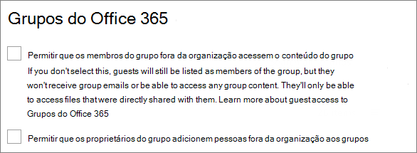
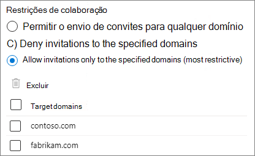
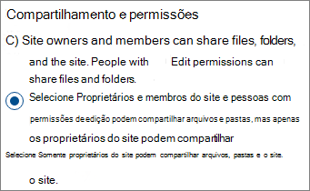
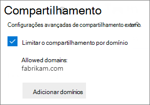
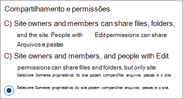
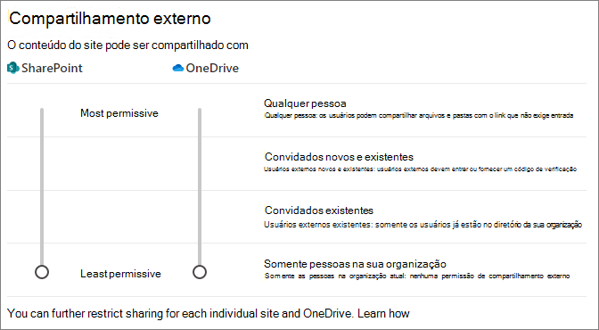
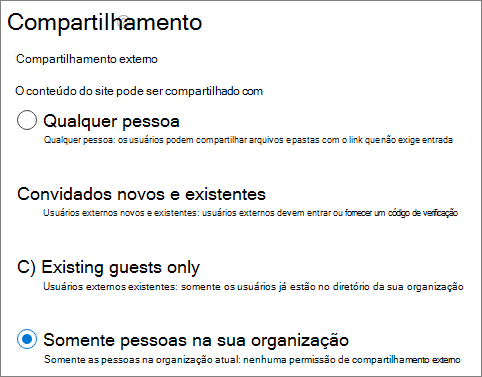
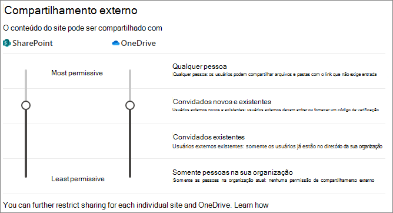
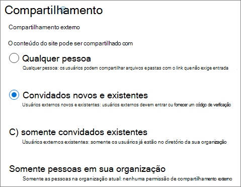

# <a name="limit-sharing-in-microsoft-365"></a><span data-ttu-id="6bfac-103">Limitar o compartilhamento no Microsoft 365</span><span class="sxs-lookup"><span data-stu-id="6bfac-103">Limit sharing in Microsoft 365</span></span>

<span data-ttu-id="6bfac-104">Embora não seja possível desabilitar o compartilhamento interno inteiramente ou remover o botão compartilhar de sites, há várias maneiras de limitar o compartilhamento no Microsoft 365 para atender às necessidades da sua organização.</span><span class="sxs-lookup"><span data-stu-id="6bfac-104">While you can't disable internal sharing entirely or remove the Share button from sites, there are a variety of ways that you can limit sharing in Microsoft 365 to meet the needs of your organization.</span></span>

<span data-ttu-id="6bfac-105">Os métodos de compartilhamento de arquivos são listados na tabela a seguir.</span><span class="sxs-lookup"><span data-stu-id="6bfac-105">The methods of sharing files are listed in the table below.</span></span> <span data-ttu-id="6bfac-106">Clique no link na coluna **método de compartilhamento** para obter informações detalhadas.</span><span class="sxs-lookup"><span data-stu-id="6bfac-106">Click the link in the **Sharing method** column for detailed information.</span></span>

|<span data-ttu-id="6bfac-107">Método de compartilhamento</span><span class="sxs-lookup"><span data-stu-id="6bfac-107">Sharing method</span></span>|<span data-ttu-id="6bfac-108">Descrição</span><span class="sxs-lookup"><span data-stu-id="6bfac-108">Description</span></span>|<span data-ttu-id="6bfac-109">Limitando opções</span><span class="sxs-lookup"><span data-stu-id="6bfac-109">Limiting options</span></span>|
|:-------------|:----------|:-------------|
|[<span data-ttu-id="6bfac-110">Grupo ou equipe do Microsoft 365</span><span class="sxs-lookup"><span data-stu-id="6bfac-110">Microsoft 365 group or team</span></span>](#microsoft-365-group-or-team)|<span data-ttu-id="6bfac-111">As pessoas com acesso a uma equipe do Microsoft Teams ou ao grupo do Microsoft 365 têm acesso à edição de arquivos no site associado do SharePoint.</span><span class="sxs-lookup"><span data-stu-id="6bfac-111">People granted access to a Microsoft Teams team or Microsoft 365 group have edit access to files in the associated SharePoint site.</span></span>|<span data-ttu-id="6bfac-112">Se o grupo ou a equipe for privada, o compartilhamento de convites para se juntar à equipe vai para o proprietário para aprovação.</span><span class="sxs-lookup"><span data-stu-id="6bfac-112">If the group or team is private, sharing invitations to join the team go to the owner for approval.</span></span> <span data-ttu-id="6bfac-113">Os administradores podem desabilitar o acesso de convidados ou usar rótulos de confidencialidade para impedir o acesso de pessoas de fora da organização.</span><span class="sxs-lookup"><span data-stu-id="6bfac-113">Admins can disable guest access or use sensitivity labels to prevent access by people from outside the organization.</span></span>|
|[<span data-ttu-id="6bfac-114">Site do Microsoft Office SharePoint Online</span><span class="sxs-lookup"><span data-stu-id="6bfac-114">SharePoint site</span></span>](#sharepoint-site)|<span data-ttu-id="6bfac-115">Os usuários podem ter acesso de proprietário, membro ou visitante em um site do SharePoint e terão esse nível de acesso a arquivos no site.</span><span class="sxs-lookup"><span data-stu-id="6bfac-115">People can be granted Owner, Member, or Visitor access to a SharePoint site and will have that level of access to files in the site.</span></span>|<span data-ttu-id="6bfac-116">As permissões de site podem ser restringidas para que somente proprietários de site possam compartilhar o site.</span><span class="sxs-lookup"><span data-stu-id="6bfac-116">Site permissions can be restricted so that only site owners can share the site.</span></span> <span data-ttu-id="6bfac-117">Os administradores podem configurar um site para somente leitura ou bloquear o acesso inteiramente.</span><span class="sxs-lookup"><span data-stu-id="6bfac-117">Admins can set a site to read-only or block access entirely.</span></span>|
|[<span data-ttu-id="6bfac-118">Compartilhar com pessoas específicas</span><span class="sxs-lookup"><span data-stu-id="6bfac-118">Sharing with specific people</span></span>](#sharing-with-specific-people)|<span data-ttu-id="6bfac-119">Os membros do site e as pessoas com permissões de edição podem conceder permissões diretas a arquivos e pastas ou compartilhá-los usando links de *pessoas específicas*.</span><span class="sxs-lookup"><span data-stu-id="6bfac-119">Site members and people with edit permissions can give direct permissions to files and folders or share them by using *Specific people* links.</span></span>|<span data-ttu-id="6bfac-120">As permissões de site podem ser restringidas para que somente proprietários de sites possam compartilhar arquivos e pastas.</span><span class="sxs-lookup"><span data-stu-id="6bfac-120">Site permissions can be restricted so that only site owners can share files and folders.</span></span> <span data-ttu-id="6bfac-121">Nesse caso, o acesso direto e o compartilhamento de link *pessoas específicas* por membros do site vai para o proprietário do site para aprovação.</span><span class="sxs-lookup"><span data-stu-id="6bfac-121">In this case, direct access and *Specific people* link sharing by site members goes to site owner for approval.</span></span>|
|[<span data-ttu-id="6bfac-122">Compartilhamento de convidados do Microsoft Office SharePoint Online e OneDrive</span><span class="sxs-lookup"><span data-stu-id="6bfac-122">SharePoint and OneDrive guest sharing</span></span>](#sharepoint-guest-sharing)|<span data-ttu-id="6bfac-123">Os proprietários e membros do site do Microsoft Office SharePoint Online e os proprietários do Microsoft OneDrive podem compartilhar arquivos e pastas com pessoas fora da organização.</span><span class="sxs-lookup"><span data-stu-id="6bfac-123">SharePoint site owners and members and OneDrive owners can share files and folders with people outside the organization.</span></span>|<span data-ttu-id="6bfac-124">O compartilhamento de convidados pode ser desabilitado para toda a organização ou para sites individuais.</span><span class="sxs-lookup"><span data-stu-id="6bfac-124">Guest sharing can be disabled for the entire organization or for individual sites.</span></span>|
|[<span data-ttu-id="6bfac-125">*Pessoas na sua organização* links de compartilhamento</span><span class="sxs-lookup"><span data-stu-id="6bfac-125">*People in your organization* sharing links</span></span>](#people-in-your-organization-sharing-links)|<span data-ttu-id="6bfac-126">Os proprietários e membros do site do SharePoint podem compartilhar arquivos usando links *pessoas em sua organização*, que funcionam para todos dentro da organização.</span><span class="sxs-lookup"><span data-stu-id="6bfac-126">SharePoint site owners and members can share files using *People in your organization* links, which will work for anyone inside the organization.</span></span>|<span data-ttu-id="6bfac-127">Os links *Pessoas da sua organização* podem ser desabilitados no nível do site.</span><span class="sxs-lookup"><span data-stu-id="6bfac-127">*People in your organization* links can be disabled at the site level.</span></span>|
|[<span data-ttu-id="6bfac-128">Criar sites, grupos e equipes</span><span class="sxs-lookup"><span data-stu-id="6bfac-128">Create sites, groups, and teams</span></span>](#create-sites-groups-and-teams)|<span data-ttu-id="6bfac-129">Por padrão, os usuários podem criar novos sites, grupos e equipes a partir dos quais podem compartilhar conteúdo.</span><span class="sxs-lookup"><span data-stu-id="6bfac-129">By default, users can create new sites, groups, and teams from which they can share content.</span></span>|<span data-ttu-id="6bfac-130">Os administradores podem restringir as pessoas que podem criar sites, grupos e equipes.</span><span class="sxs-lookup"><span data-stu-id="6bfac-130">Admins can restrict who can create sites, groups, and teams.</span></span>|
|[<span data-ttu-id="6bfac-131">Email</span><span class="sxs-lookup"><span data-stu-id="6bfac-131">Email</span></span>](#email)|<span data-ttu-id="6bfac-132">As pessoas que têm acesso a um arquivo podem enviá-lo para outras pessoas por e-mail.</span><span class="sxs-lookup"><span data-stu-id="6bfac-132">People with access to a file can send it to others via email.</span></span>|<span data-ttu-id="6bfac-133">Os administradores podem criptografar arquivos usando rótulos de confidencialidade para impedi-los de compartilhar com pessoas não autorizadas.</span><span class="sxs-lookup"><span data-stu-id="6bfac-133">Admins can encrypt files by using sensitivity labels to prevent them being shared with unauthorized people.</span></span>|
|[<span data-ttu-id="6bfac-134">Baixar ou copiar arquivo</span><span class="sxs-lookup"><span data-stu-id="6bfac-134">Download or file copy</span></span>](#download-or-file-copy)|<span data-ttu-id="6bfac-135">As pessoas que têm acesso a um arquivo podem baixá-lo ou copiá-lo e compartilhá-lo com outras pessoas fora do escopo do Microsoft 365.</span><span class="sxs-lookup"><span data-stu-id="6bfac-135">People with access to a file can download or copy it and share it with others outside the scope of Microsoft 365.</span></span>|<span data-ttu-id="6bfac-136">Os administradores podem criptografar arquivos usando rótulos de confidencialidade para impedi-los de compartilhar com pessoas não autorizadas.</span><span class="sxs-lookup"><span data-stu-id="6bfac-136">Admins can encrypt files by using sensitivity labels to prevent them being shared with unauthorized people.</span></span>|

<span data-ttu-id="6bfac-137">Você também pode restringir as condições em que as pessoas acessam o conteúdo compartilhado.</span><span class="sxs-lookup"><span data-stu-id="6bfac-137">You can also restrict the conditions under which people access shared content.</span></span> <span data-ttu-id="6bfac-138">Confira [acesso condicional](#conditional-access) mais adiante neste artigo para saber mais.</span><span class="sxs-lookup"><span data-stu-id="6bfac-138">See [conditional access](#conditional-access) later in this article for more information.</span></span>

<span data-ttu-id="6bfac-139">Embora você possa usar os controles de administração descritos neste artigo para limitar o compartilhamento em sua organização, é altamente recomendável que você considere o uso dos recursos de segurança e conformidade disponíveis no Microsoft 365 para criar um ambiente de compartilhamento seguro.</span><span class="sxs-lookup"><span data-stu-id="6bfac-139">While you can use the admin controls described in this article to limit sharing in your organization, we highly recommend that you consider using the security and compliance features available in Microsoft 365 to create a secure sharing environment.</span></span> <span data-ttu-id="6bfac-140">Confira [Colaboração de arquivos no SharePoint com o Microsoft 365](/sharepoint/deploy-file-collaboration) e [Configurar uma equipe com isolamento de segurança](secure-teams-security-isolation.md) para obter informações.</span><span class="sxs-lookup"><span data-stu-id="6bfac-140">See [File collaboration in SharePoint with Microsoft 365](/sharepoint/deploy-file-collaboration) and [Configure a team with security isolation](secure-teams-security-isolation.md) for information.</span></span>

<span data-ttu-id="6bfac-141">Para entender como o compartilhamento está sendo usado em sua organização, [execute um relatório de compartilhamento de arquivos e pastas](/sharepoint/sharing-reports).</span><span class="sxs-lookup"><span data-stu-id="6bfac-141">To understand how sharing is being used in your organization, [run a report on file and folder sharing](/sharepoint/sharing-reports).</span></span>

## <a name="microsoft-365-group-or-team"></a><span data-ttu-id="6bfac-142">Grupo ou equipe do Microsoft 365</span><span class="sxs-lookup"><span data-stu-id="6bfac-142">Microsoft 365 group or team</span></span>

<span data-ttu-id="6bfac-143">Se você deseja limitar o compartilhamento em um grupo do Microsoft 365 ou equipe do Microsoft Teams, é importante tornar o grupo ou a equipe particular.</span><span class="sxs-lookup"><span data-stu-id="6bfac-143">If you want to limit sharing in a Microsoft 365 group or Microsoft Teams team, it's important to make the group or team private.</span></span> <span data-ttu-id="6bfac-144">As pessoas da sua organização podem se juntar a um grupo público ou a uma equipe a qualquer momento.</span><span class="sxs-lookup"><span data-stu-id="6bfac-144">People inside your organization can join a public group or team anytime.</span></span> <span data-ttu-id="6bfac-145">A menos que o grupo ou a equipe seja particular, não há nenhuma maneira de limitar o compartilhamento da equipe ou de seus arquivos dentro da organização.</span><span class="sxs-lookup"><span data-stu-id="6bfac-145">Unless the group or team is private, there's no way to limit sharing of the team or its files within the organization.</span></span>

### <a name="guest-sharing"></a><span data-ttu-id="6bfac-146">Compartilhamento de convidados</span><span class="sxs-lookup"><span data-stu-id="6bfac-146">Guest sharing</span></span>

<span data-ttu-id="6bfac-147">Se você quiser impedir o acesso de convidados nas equipes, é possível desativar o compartilhamento de convidados no centro de administração do Teams.</span><span class="sxs-lookup"><span data-stu-id="6bfac-147">If you want to prevent guest access in Teams, you can turn off guest sharing in the Teams admin center.</span></span>

<span data-ttu-id="6bfac-148">Para desativar o compartilhamento de convidados para o Teams</span><span class="sxs-lookup"><span data-stu-id="6bfac-148">To turn off guest sharing for Teams</span></span>
1. <span data-ttu-id="6bfac-149">No centro de administração do Teams, expanda **Configurações para toda a organização**, em seguida, clique em **Acesso de convidado**.</span><span class="sxs-lookup"><span data-stu-id="6bfac-149">In the Teams admin center, expand **Org-wide settings**, and then click **Guest access**.</span></span>
2. <span data-ttu-id="6bfac-150">Desabilite **Permitir acesso de convidados no Teams**.</span><span class="sxs-lookup"><span data-stu-id="6bfac-150">Turn off **Allow guest access in Teams**.</span></span>
3. <span data-ttu-id="6bfac-151">Clique em **Salvar**.</span><span class="sxs-lookup"><span data-stu-id="6bfac-151">Click **Save**.</span></span>

<span data-ttu-id="6bfac-152">Se você quiser impedir o acesso de convidado em grupos do Microsoft 365, é possível desativar as configurações de acesso de convidado do grupo no Centro de administração do Microsoft 365.</span><span class="sxs-lookup"><span data-stu-id="6bfac-152">If you want to prevent guest access in Microsoft 365 Groups, you can turn off the groups guest access settings in the Microsoft 365 admin center.</span></span>

<span data-ttu-id="6bfac-153">Para desativar o compartilhamento de convidados no Microsoft 365 Groups</span><span class="sxs-lookup"><span data-stu-id="6bfac-153">To turn off guest sharing in Microsoft 365 Groups</span></span>
1. <span data-ttu-id="6bfac-154">No Centro de administração do Microsoft 365, clique em **Configurações** e depois clique em **Configurações da Organização**.</span><span class="sxs-lookup"><span data-stu-id="6bfac-154">In the Microsoft 365 admin center, click **Settings**, and then click **Org Settings**.</span></span>
2. <span data-ttu-id="6bfac-155">Na guia **Serviços**, clique em **Microsoft 365 Groups**.</span><span class="sxs-lookup"><span data-stu-id="6bfac-155">On the **Services** tab, click **Microsoft 365 Groups**.</span></span>
3. <span data-ttu-id="6bfac-156">Desmarque as caixas de seleções **Permitir que os membros do grupo fora da organização acessem o conteúdo do grupo** e **Permita que os proprietários de grupos adicionem pessoas de fora da sua organização a grupos**.</span><span class="sxs-lookup"><span data-stu-id="6bfac-156">Clear the **Let group members outside your organization access group content** and **Let group owners add people outside your organization to groups** check boxes.</span></span>
4. <span data-ttu-id="6bfac-157">Clique em **Salvar alterações**.</span><span class="sxs-lookup"><span data-stu-id="6bfac-157">Click **Save changes**.</span></span>

    

> [!NOTE]
> <span data-ttu-id="6bfac-159">Se você quiser impedir o compartilhamento de convidados para um determinado grupo ou equipe, poderá fazê-lo usando o [Microsoft PowerShell](per-group-guest-access.md) ou[rótulos de confidencialidade](../compliance/sensitivity-labels-teams-groups-sites.md).</span><span class="sxs-lookup"><span data-stu-id="6bfac-159">If you want to prevent guest sharing for a particular group or team, you can do so by using [Microsoft PowerShell](per-group-guest-access.md) or [sensitivity labels](../compliance/sensitivity-labels-teams-groups-sites.md).</span></span>

<span data-ttu-id="6bfac-160">Você pode limitar o compartilhamento de convidados a usuários de domínios específicos permitindo ou bloqueando domínios no Azure Active Directory.</span><span class="sxs-lookup"><span data-stu-id="6bfac-160">You can limit guest sharing to users from specific domains by allowing or blocking domains in Azure Active Directory.</span></span> <span data-ttu-id="6bfac-161">Isso também afetará o compartilhamento de convidados no SharePoint se você tiver habilitado a [integração do SharePoint e do OneDrive com o B2B do Azure AD](/sharepoint/sharepoint-azureb2b-integration-preview).</span><span class="sxs-lookup"><span data-stu-id="6bfac-161">This will also affect guest sharing in SharePoint if you have enabled [SharePoint and OneDrive integration with Azure AD B2B](/sharepoint/sharepoint-azureb2b-integration-preview).</span></span>

<span data-ttu-id="6bfac-162">Para permitir o compartilhamento de convites apenas de domínios especificados</span><span class="sxs-lookup"><span data-stu-id="6bfac-162">To allow sharing invitations only from specified domains</span></span>
1. <span data-ttu-id="6bfac-163">Na página Visão geral do Azure Active Directory, clique em **relações organizacionais**.</span><span class="sxs-lookup"><span data-stu-id="6bfac-163">In Azure Active Directory, on the Overview page, click **Organizational relationships**.</span></span>
2. <span data-ttu-id="6bfac-164">Clique em **Configurações**.</span><span class="sxs-lookup"><span data-stu-id="6bfac-164">Click **Settings**.</span></span>
3. <span data-ttu-id="6bfac-165">Em **restrições de colaboração**, marque **negar convites aos domínios especificados** ou **permitir convites apenas para os domínios especificados**, e digite os domínios que você deseja usar.</span><span class="sxs-lookup"><span data-stu-id="6bfac-165">Under **Collaboration restrictions**, select **Deny invitations to the specified domains** or **Allow invitations only to the specified domains**, and then type the domains that you want to use.</span></span>
4. <span data-ttu-id="6bfac-166">Clique em **Salvar**.</span><span class="sxs-lookup"><span data-stu-id="6bfac-166">Click **Save**.</span></span>

    

## <a name="sharepoint-site"></a><span data-ttu-id="6bfac-168">Site do SharePoint</span><span class="sxs-lookup"><span data-stu-id="6bfac-168">SharePoint site</span></span>

<span data-ttu-id="6bfac-169">Só é possível limitar o compartilhamento de sites do SharePoint aos proprietários de site.</span><span class="sxs-lookup"><span data-stu-id="6bfac-169">You can limit SharePoint site sharing to site owners only.</span></span> <span data-ttu-id="6bfac-170">Isso impede que os membros do site compartilhem o site.</span><span class="sxs-lookup"><span data-stu-id="6bfac-170">This prevents site members from sharing the site.</span></span> <span data-ttu-id="6bfac-171">Lembre-se de que, se o site estiver conectado a um grupo do Microsoft 365, os membros do grupo poderão convidar outras pessoas para o grupo e esses usuários terão acesso ao site.</span><span class="sxs-lookup"><span data-stu-id="6bfac-171">Keep in mind that if the site is connected to a Microsoft 365 group, group members can invite others to the group and those users will have site access.</span></span>

<span data-ttu-id="6bfac-172">Para limitar o compartilhamento de sites aos proprietários</span><span class="sxs-lookup"><span data-stu-id="6bfac-172">To limit site sharing to owners</span></span>
1. <span data-ttu-id="6bfac-173">No site, clique no ícone de engrenagem e, em seguida, clique em **permissões de site**.</span><span class="sxs-lookup"><span data-stu-id="6bfac-173">In the site, click the gear icon, and then click **Site permissions**.</span></span>
2. <span data-ttu-id="6bfac-174">Em **Configurações de Compartilhamento**, clique em **Alterar configurações de compartilhamento**.</span><span class="sxs-lookup"><span data-stu-id="6bfac-174">Under **Sharing settings**, click **Change sharing settings**.</span></span>
3. <span data-ttu-id="6bfac-175">Selecione **Proprietários e membros do site e pessoas com permissões de edição podem compartilhar arquivos e pastas, mas apenas os proprietários do site podem compartilhar o site**.</span><span class="sxs-lookup"><span data-stu-id="6bfac-175">Select **Site owners and members, and people with Edit permissions can share files and folders, but only site owners can share the site**.</span></span>
4. <span data-ttu-id="6bfac-176">Clique em **Salvar**.</span><span class="sxs-lookup"><span data-stu-id="6bfac-176">Click **Save**.</span></span>

    

<span data-ttu-id="6bfac-178">Você pode impedir que os usuários que não são membros do site solicitem acesso desativando as solicitações de acesso.</span><span class="sxs-lookup"><span data-stu-id="6bfac-178">You can prevent users who are not members of the site from requesting access by turning off access requests.</span></span>

<span data-ttu-id="6bfac-179">Para desativar as solicitações de acesso</span><span class="sxs-lookup"><span data-stu-id="6bfac-179">To turn off access requests</span></span>
1. <span data-ttu-id="6bfac-180">No site, clique no ícone de engrenagem e, em seguida, clique em **permissões de site**.</span><span class="sxs-lookup"><span data-stu-id="6bfac-180">In the site, click the gear icon, and then click **Site permissions**.</span></span>
2. <span data-ttu-id="6bfac-181">Em **Configurações de Compartilhamento**, clique em **Alterar configurações de compartilhamento**.</span><span class="sxs-lookup"><span data-stu-id="6bfac-181">Under **Sharing settings**, click **Change sharing settings**.</span></span>
3. <span data-ttu-id="6bfac-182">Desabilite **Permitir solicitações de acesso** e clique em **Salvar**.</span><span class="sxs-lookup"><span data-stu-id="6bfac-182">Turn off **Allow access requests**, and then click **Save**.</span></span>

<span data-ttu-id="6bfac-183">Para limitar o compartilhamento de sites a domínios específicos, permita ou bloqueie domínios para o site.</span><span class="sxs-lookup"><span data-stu-id="6bfac-183">You can limit site sharing to specific domains by allowing or blocking domains for the site.</span></span>

<span data-ttu-id="6bfac-184">Para limitar o compartilhamento do site por domínio</span><span class="sxs-lookup"><span data-stu-id="6bfac-184">To limit site sharing by domain</span></span>
1. <span data-ttu-id="6bfac-185">No centro de administração do SharePoint, em **sites**, clique **sites ativos**.</span><span class="sxs-lookup"><span data-stu-id="6bfac-185">In the SharePoint admin center, under **Sites**, click **Active sites**.</span></span>
2. <span data-ttu-id="6bfac-186">Clique no site que você deseja configurar.</span><span class="sxs-lookup"><span data-stu-id="6bfac-186">Click the site that you want to configure.</span></span>
3. <span data-ttu-id="6bfac-187">Na guia **Políticas**, em **Compartilhamento externo** clique **Editar**.</span><span class="sxs-lookup"><span data-stu-id="6bfac-187">On the **Policies** tab, under **External sharing** click **Edit**.</span></span>
4. <span data-ttu-id="6bfac-188">Em **Configurações avançadas para compartilhamento externo**, marque **Limitar compartilhamento por domínio**.</span><span class="sxs-lookup"><span data-stu-id="6bfac-188">Under **Advanced settings for external sharing**, select the **Limit sharing by domain**.</span></span>
5. <span data-ttu-id="6bfac-189">Adicione os domínios que deseja permitir ou bloquear e, em seguida, clique em **Salvar**.</span><span class="sxs-lookup"><span data-stu-id="6bfac-189">Add the domains that you want to allow or block, and then click **Save**.</span></span>
6. <span data-ttu-id="6bfac-190">Clique em **Salvar**.</span><span class="sxs-lookup"><span data-stu-id="6bfac-190">Click **Save**.</span></span>

    

### <a name="block-access-to-a-site"></a><span data-ttu-id="6bfac-192">Bloquear o acesso a um site</span><span class="sxs-lookup"><span data-stu-id="6bfac-192">Block access to a site</span></span>

<span data-ttu-id="6bfac-193">Você pode bloquear o acesso a um site ou torná-lo somente leitura, alterando o estado de bloqueio do site.</span><span class="sxs-lookup"><span data-stu-id="6bfac-193">You can block access to a site or make a site read-only by changing the lock state of the site.</span></span> <span data-ttu-id="6bfac-194">Para obter detalhes, confira [Bloquear e desbloquear sites](/sharepoint/manage-lock-status).</span><span class="sxs-lookup"><span data-stu-id="6bfac-194">For details, see [Lock and unlock sites](/sharepoint/manage-lock-status).</span></span>

### <a name="permissions-inheritance"></a><span data-ttu-id="6bfac-195">Herança de permissões</span><span class="sxs-lookup"><span data-stu-id="6bfac-195">Permissions inheritance</span></span>

<span data-ttu-id="6bfac-196">Embora não seja recomendável, você pode usar a [herança de permissões do SharePoint](/sharepoint/what-is-permissions-inheritance) para personalizar os níveis de acesso aos sites e subsites.</span><span class="sxs-lookup"><span data-stu-id="6bfac-196">While not recommended, you can use [SharePoint permissions inheritance](/sharepoint/what-is-permissions-inheritance) to customize access levels to sites and subsites.</span></span>

## <a name="sharing-with-specific-people"></a><span data-ttu-id="6bfac-197">Compartilhar com pessoas específicas</span><span class="sxs-lookup"><span data-stu-id="6bfac-197">Sharing with specific people</span></span>

<span data-ttu-id="6bfac-198">Se desejar limitar o compartilhamento de um site ou de seu conteúdo, você poderá configurar o site para permitir que somente os proprietários de sites compartilhem arquivos, pastas e site.</span><span class="sxs-lookup"><span data-stu-id="6bfac-198">if you want to limit the sharing of a site or its contents, you can configure the site to only allow site owners to share files, folders, and the site.</span></span> <span data-ttu-id="6bfac-199">Quando isso é configurado, os membros do site tentam compartilhar arquivos ou pastas usando links de *pessoas específicas* vão para o proprietário do site para aprovação.</span><span class="sxs-lookup"><span data-stu-id="6bfac-199">When this is configured, site members' attempts to share files or folders by using *Specific people* links will go to the site owner for approval.</span></span>

<span data-ttu-id="6bfac-200">Para limitar o compartilhamento de sites, arquivos e pastas aos proprietários</span><span class="sxs-lookup"><span data-stu-id="6bfac-200">To limit site, file, and folder sharing to owners</span></span>
1. <span data-ttu-id="6bfac-201">No site, clique no ícone de engrenagem e, em seguida, clique em **permissões de site**.</span><span class="sxs-lookup"><span data-stu-id="6bfac-201">In the site, click the gear icon, and then click **Site permissions**.</span></span>
2. <span data-ttu-id="6bfac-202">Em **Configurações de Compartilhamento**, clique em **Alterar configurações de compartilhamento**.</span><span class="sxs-lookup"><span data-stu-id="6bfac-202">Under **Sharing settings**, click **Change sharing settings**.</span></span>
3. <span data-ttu-id="6bfac-203">Selecione **Somente proprietários do site podem compartilhar arquivos, pastas e o site**.</span><span class="sxs-lookup"><span data-stu-id="6bfac-203">Select **Only site owners can share files, folders, and the site**.</span></span>
4. <span data-ttu-id="6bfac-204">Clique em **Salvar**.</span><span class="sxs-lookup"><span data-stu-id="6bfac-204">Click **Save**.</span></span>

    

## <a name="sharepoint-guest-sharing"></a><span data-ttu-id="6bfac-206">Compartilhamento de convidados do SharePoint</span><span class="sxs-lookup"><span data-stu-id="6bfac-206">SharePoint guest sharing</span></span>

<span data-ttu-id="6bfac-207">Se você quiser impedir o compartilhamento de pastas e arquivos do SharePoint ou do OneDrive com pessoas de fora da sua organização, é possível desativar o compartilhamento de convidados para toda a organização ou para um site individual.</span><span class="sxs-lookup"><span data-stu-id="6bfac-207">If you want to prevent sharing SharePoint or OneDrive files and folders with people outside your organization, you can turn off guest sharing for the entire organization or for an individual site.</span></span>

<span data-ttu-id="6bfac-208">Para desativar o compartilhamento de convidados do SharePoint para a sua organização</span><span class="sxs-lookup"><span data-stu-id="6bfac-208">To turn off SharePoint guest sharing for your organization</span></span>
1. <span data-ttu-id="6bfac-209">No centro de administração do SharePoint, em **Políticas**, clique em **Compartilhamento**.</span><span class="sxs-lookup"><span data-stu-id="6bfac-209">In the SharePoint admin center, under **Policies**, click **Sharing**.</span></span>
2. <span data-ttu-id="6bfac-210">Em **Compartilhamento externo**, arraste o controle deslizante do SharePoint para baixo para **Somente as pessoas da sua organização**.</span><span class="sxs-lookup"><span data-stu-id="6bfac-210">Under **External sharing**, drag the SharePoint slider down to **Only people in your organization**.</span></span>
3. <span data-ttu-id="6bfac-211">Clique em **Salvar**.</span><span class="sxs-lookup"><span data-stu-id="6bfac-211">Click **Save**.</span></span>

    


<span data-ttu-id="6bfac-213">Para desativar o compartilhamento de convidados para um site</span><span class="sxs-lookup"><span data-stu-id="6bfac-213">To turn off guest sharing for a site</span></span>
1. <span data-ttu-id="6bfac-214">No centro de administração do SharePoint, em **sites**, clique **sites ativos**.</span><span class="sxs-lookup"><span data-stu-id="6bfac-214">In the SharePoint admin center, under **Sites**, click **Active sites**.</span></span>
2. <span data-ttu-id="6bfac-215">Clique no site que você deseja configurar.</span><span class="sxs-lookup"><span data-stu-id="6bfac-215">Click the site that you want to configure.</span></span>
3. <span data-ttu-id="6bfac-216">Na guia **Políticas**, em **Compartilhamento externo** clique **Editar**.</span><span class="sxs-lookup"><span data-stu-id="6bfac-216">On the **Policies** tab, under **External sharing** click **Edit**.</span></span>
4. <span data-ttu-id="6bfac-217">Em **Compartilhamento externo**, escolha **Somente as pessoas da sua organização** e, em seguida, clique em **Salvar**.</span><span class="sxs-lookup"><span data-stu-id="6bfac-217">Under **External sharing**, choose **Only people in your organization**, and then click **Save**.</span></span>

    

<span data-ttu-id="6bfac-219">Você pode desabilitar o compartilhamento de convidados para um Microsoft OneDrive individual clicando no usuário no Centro de administração do Microsoft 365 e selecionando **Gerenciar compartilhamento externo** na guia **Microsoft OneDrive**.</span><span class="sxs-lookup"><span data-stu-id="6bfac-219">You can turn off guest sharing for an individual OneDrive by clicking the user in the Microsoft 365 admin center and selecting **Manage external sharing** on the **OneDrive** tab.</span></span>

<span data-ttu-id="6bfac-220">Se você deseja permitir o compartilhamento com pessoas de fora da sua organização, mas deseja garantir que todos sejam autenticados, é possível desativar os links *Todos* (compartilhamento anônimo) para toda a organização ou para um site individual.</span><span class="sxs-lookup"><span data-stu-id="6bfac-220">If you would like to allow sharing with people outside your organization but you want to make sure that everyone authenticates, you can disable *Anyone* (anonymous sharing) links for the entire organization or for an individual site.</span></span>

<span data-ttu-id="6bfac-221">Para desativar os links *Todos* no nível da organização</span><span class="sxs-lookup"><span data-stu-id="6bfac-221">To turn off *Anyone* links at the organization level</span></span>
1. <span data-ttu-id="6bfac-222">No centro de administração do SharePoint, em **Políticas**, clique em **Compartilhamento**.</span><span class="sxs-lookup"><span data-stu-id="6bfac-222">In the SharePoint admin center, under **Policies**, click **Sharing**.</span></span>
2. <span data-ttu-id="6bfac-223">Em **Compartilhamento externo**, arraste o controle deslizante do SharePoint para baixo para **Convidados novos e existentes**.</span><span class="sxs-lookup"><span data-stu-id="6bfac-223">Under **External sharing**, drag the SharePoint slider down to **New and existing guests**.</span></span>
3. <span data-ttu-id="6bfac-224">Clique em **Salvar**.</span><span class="sxs-lookup"><span data-stu-id="6bfac-224">Click **Save**.</span></span>

    

<span data-ttu-id="6bfac-226">Para desativar os links para *Qualquer pessoa* de um site</span><span class="sxs-lookup"><span data-stu-id="6bfac-226">To turn off *Anyone* links for a site</span></span>
1. <span data-ttu-id="6bfac-227">No centro de administração do SharePoint, em **sites**, clique **sites ativos**.</span><span class="sxs-lookup"><span data-stu-id="6bfac-227">In the SharePoint admin center, under **Sites**, click **Active sites**.</span></span>
2. <span data-ttu-id="6bfac-228">Clique no site que você deseja configurar.</span><span class="sxs-lookup"><span data-stu-id="6bfac-228">Click the site that you want to configure.</span></span>
3. <span data-ttu-id="6bfac-229">Na guia **Políticas**, em **Compartilhamento externo** clique **Editar**.</span><span class="sxs-lookup"><span data-stu-id="6bfac-229">On the **Policies** tab, under **External sharing** click **Edit**.</span></span>
4. <span data-ttu-id="6bfac-230">Em **Compartilhamento externo**, escolha **Convidados novos e existentes** e, em seguida, clique em **Salvar**.</span><span class="sxs-lookup"><span data-stu-id="6bfac-230">Under **External sharing**, choose **New and existing guests**, and then click **Save**.</span></span>

    

## <a name="people-in-your-organization-sharing-links"></a><span data-ttu-id="6bfac-232">Links de compartilhamento *Pessoas na sua organização*</span><span class="sxs-lookup"><span data-stu-id="6bfac-232">*People in your organization* sharing links</span></span>

<span data-ttu-id="6bfac-233">Por padrão, os membros de um site podem compartilhar arquivos e pastas com outras pessoas da sua organização, usando o link *pessoas na sua organização*.</span><span class="sxs-lookup"><span data-stu-id="6bfac-233">By default, members of a site can share files and folders with other people in your organization by using a *People in your organization* link.</span></span> <span data-ttu-id="6bfac-234">Você pode desabilitar os links *Pessoas em sua organização* usando o PowerShell:</span><span class="sxs-lookup"><span data-stu-id="6bfac-234">You can disable *People in your organization* links by using PowerShell:</span></span>

```powershell
Set-SPOSite -Identity <site> -DisableCompanyWideSharingLinks
```

<span data-ttu-id="6bfac-235">Por exemplo:</span><span class="sxs-lookup"><span data-stu-id="6bfac-235">For example:</span></span>

```powershell
Set-SPOSite -Identity https://contoso.sharepoint.com -DisableCompanyWideSharingLinks
```

## <a name="create-sites-groups-and-teams"></a><span data-ttu-id="6bfac-236">Compartilhar sites, grupos e equipes</span><span class="sxs-lookup"><span data-stu-id="6bfac-236">Create sites, groups, and teams</span></span>

<span data-ttu-id="6bfac-237">Por padrão, os usuários podem criar novos sites, grupos e equipes a partir dos quais podem compartilhar conteúdo (dependendo das suas configurações de compartilhamento).</span><span class="sxs-lookup"><span data-stu-id="6bfac-237">By default, users can create new sites, groups, and teams from which they may be able to share content (depending on your sharing settings).</span></span> <span data-ttu-id="6bfac-238">Você pode restringir as pessoas que podem criar sites, grupos e equipes.</span><span class="sxs-lookup"><span data-stu-id="6bfac-238">You can restrict who can create sites, groups, and teams.</span></span> <span data-ttu-id="6bfac-239">Confira as seguintes referências:</span><span class="sxs-lookup"><span data-stu-id="6bfac-239">See the following references:</span></span>

- [<span data-ttu-id="6bfac-240">Gerenciar a criação de sites no SharePoint</span><span class="sxs-lookup"><span data-stu-id="6bfac-240">Manage site creation in SharePoint</span></span>](/sharepoint/manage-site-creation)
- [<span data-ttu-id="6bfac-241">Gerenciar quem pode criar grupos do Microsoft 365</span><span class="sxs-lookup"><span data-stu-id="6bfac-241">Manage who can create Microsoft 365 Groups</span></span>](./manage-creation-of-groups.md)

> [!NOTE]
> <span data-ttu-id="6bfac-242">Restringir a criação do grupo restringe a criação da equipe.</span><span class="sxs-lookup"><span data-stu-id="6bfac-242">Restricting group creation restricts team creation.</span></span>

## <a name="email"></a><span data-ttu-id="6bfac-243">Email</span><span class="sxs-lookup"><span data-stu-id="6bfac-243">Email</span></span>

<span data-ttu-id="6bfac-244">Você pode impedir o compartilhamento indesejado de e-mails usando criptografia.</span><span class="sxs-lookup"><span data-stu-id="6bfac-244">You can prevent unwanted sharing of emails by using encryption.</span></span> <span data-ttu-id="6bfac-245">Isso impede que os e-mails sejam enviados ou compartilhados com usuários não autorizados.</span><span class="sxs-lookup"><span data-stu-id="6bfac-245">This prevents emails being forwarded or otherwise shared with unauthorized users.</span></span> <span data-ttu-id="6bfac-246">A criptografia de e-mail pode ser habilitada usando rótulos de confidencialidade.</span><span class="sxs-lookup"><span data-stu-id="6bfac-246">Email encryption can be enabled by using sensitivity labels.</span></span> <span data-ttu-id="6bfac-247">Confira [Restringir o acesso ao conteúdo usando criptografia nos rótulos de confidencialidade](../compliance/encryption-sensitivity-labels.md) para obter detalhes.</span><span class="sxs-lookup"><span data-stu-id="6bfac-247">See [Restrict access to content by using encryption in sensitivity labels](../compliance/encryption-sensitivity-labels.md) for details.</span></span>

## <a name="download-or-file-copy"></a><span data-ttu-id="6bfac-248">Baixar ou copiar arquivo</span><span class="sxs-lookup"><span data-stu-id="6bfac-248">Download or file copy</span></span>

<span data-ttu-id="6bfac-249">Os usuários que têm acesso a arquivos e pastas no Microsoft 365 podem baixar e copiar arquivos para uma mídia externa.</span><span class="sxs-lookup"><span data-stu-id="6bfac-249">Users who have access to files and folders in Microsoft 365 can download files and copy them to external media.</span></span> <span data-ttu-id="6bfac-250">Para reduzir o risco de compartilhamento indesejado de arquivos, você pode criptografar o conteúdo usando rótulos de confidencialidade.</span><span class="sxs-lookup"><span data-stu-id="6bfac-250">To reduce the risk of unwanted file sharing, you can encrypt the content by using sensitivity labels.</span></span>

## <a name="conditional-access"></a><span data-ttu-id="6bfac-251">Acesso condicional</span><span class="sxs-lookup"><span data-stu-id="6bfac-251">Conditional access</span></span>

<span data-ttu-id="6bfac-252">O acesso condicional do Azure Active Directory fornece opções para limitar ou impedir o compartilhamento com pessoas com base no local de rede, integridade do dispositivo, riscos de entrada e outros fatores.</span><span class="sxs-lookup"><span data-stu-id="6bfac-252">Azure Active Directory conditional access provides options to limit or prevent sharing with people based on network location, device health, sign-in risk, and other factors.</span></span> <span data-ttu-id="6bfac-253">[O que é o Acesso Condicional?](/azure/active-directory/conditional-access/overview)</span><span class="sxs-lookup"><span data-stu-id="6bfac-253">See [What is Conditional Access?](/azure/active-directory/conditional-access/overview).</span></span>

<span data-ttu-id="6bfac-254">O SharePoint fornece integração direta com o acesso condicional do Azure AD para o local de rede e os dispositivos não gerenciados.</span><span class="sxs-lookup"><span data-stu-id="6bfac-254">SharePoint provides direct integration with Azure AD conditional access for both unmanaged devices and network location.</span></span> <span data-ttu-id="6bfac-255">Confira os detalhes a seguir:</span><span class="sxs-lookup"><span data-stu-id="6bfac-255">See the following references for details:</span></span>

- [<span data-ttu-id="6bfac-256">Controlar o acesso de dispositivos não gerenciados</span><span class="sxs-lookup"><span data-stu-id="6bfac-256">Control access from unmanaged devices</span></span>](/sharepoint/control-access-from-unmanaged-devices)
- [<span data-ttu-id="6bfac-257">Controlar o acesso aos dados do SharePoint Online e do OneDrive com base no local de rede</span><span class="sxs-lookup"><span data-stu-id="6bfac-257">Control access to SharePoint and OneDrive data based on network location</span></span>](/sharepoint/control-access-based-on-network-location)

## <a name="see-also"></a><span data-ttu-id="6bfac-258">Confira também</span><span class="sxs-lookup"><span data-stu-id="6bfac-258">See also</span></span>

[<span data-ttu-id="6bfac-259">Referência das configurações de compartilhamento de convidados do Microsoft 365</span><span class="sxs-lookup"><span data-stu-id="6bfac-259">Microsoft 365 guest sharing settings reference</span></span>](microsoft-365-guest-settings.md)