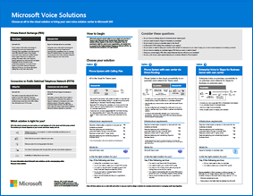

# Ilustrações de produtividade do Microsoft 365

A série de soluções do Microsoft 365 Enterprise fornece orientações para implementar os recursos do Microsoft 365, especialmente onde os recursos são tecnologias cruzadas, incluindo diagramas de arquitetura do Teams.

### Microsoft Teams e serviços de produtividade relacionados no Microsoft 365 para arquitetos de TI
A arquitetura lógica dos serviços de produtividade no Microsoft 365, liderada pelo Microsoft Teams.

| Item | Descrição |
|:-----|:-----|
|   [PDF](https://github.com/MicrosoftDocs/microsoft-365-docs/raw/public/microsoft-365/downloads/msft-m365-teams-logical-architecture.pdf) \| [Visio](https://github.com/MicrosoftDocs/microsoft-365-docs/raw/public/microsoft-365/downloads/msft-m365-teams-logical-architecture.vsdx)   Atualizado em janeiro de 2021   |A Microsoft fornece um conjunto de serviços de produtividade que trabalham juntos para fornecer experiências de colaboração com recursos de governança de dados, segurança e conformidade.    Esta série de ilustrações oferece uma visão da arquitetura lógica dos serviços de produtividade para arquitetos empresariais, liderada pelo Microsoft Teams.|

### Grupos no Microsoft 365 para arquitetos de TI
O que os arquitetos de TI precisam saber sobre os grupos no Microsoft 365

| Item | Descrição |
|:-----|:-----|
|   [PDF](https://github.com/MicrosoftDocs/microsoft-365-docs/raw/public/microsoft-365/downloads/msft-m365-groups.pdf) \| [Visio](https://github.com/MicrosoftDocs/OfficeDocs-Enterprise/raw/live/Enterprise/downloads/msft-m365-groups.vsdx)   Atualizado em maio de 2020|Essas ilustrações detalham os diferentes tipos de grupos, como eles são criados e gerenciados e algumas recomendações de governança.|

### Recursos de conformidade e proteção de informações do Microsoft 365

O Microsoft 365 inclui um amplo conjunto de recursos de conformidade e proteção de informações. Juntamente com as ferramentas de produtividade da Microsoft, esses recursos foram projetados para ajudar as organizações a colaborarem em tempo real enquanto aderem a estruturas de conformidade regulatória rigorosas. 

Esse conjunto de ilustrações usa um dos setores mais regulamentados, serviços financeiros, para demonstrar como esses recursos podem ser aplicados para atender aos requisitos regulatórios comuns. Sinta-se à vontade para adaptar essas ilustrações para seu próprio uso. 

| Item | Descrição |
|:-----|:-----|
|   Inglês: [Baixar como PDF](https://download.microsoft.com/download/3/a/6/3a6ab1a3-feb0-4ee2-8e77-62415a772e53/m365-compliance-illustrations.pdf)  \| [Baixar como Visio](https://download.microsoft.com/download/3/a/6/3a6ab1a3-feb0-4ee2-8e77-62415a772e53/m365-compliance-illustrations.vsdx)   Japonês: [Baixar como PDF](https://download.microsoft.com/download/6/f/1/6f1a7d0e-dd8e-442e-b073-8e94327ae4f8/m365-compliance-illustrations.pdf)  \| [Baixar como Visio](https://download.microsoft.com/download/6/f/1/6f1a7d0e-dd8e-442e-b073-8e94327ae4f8/m365-compliance-illustrations.vsdx)   Atualizado em novembro de 2020|Contém: <ul><li>  Proteção de informações e prevenção contra perda de dados da Microsoft</li><li>Políticas de retenção e rótulos de retenção </li><li>Barreiras de informações</li><li>Conformidade em comunicações</li><li>Gerenciamento de riscos internos.</li><li>Inclusão de dados de terceiros</li>|

### Segurança e proteção de informações para organizações de várias regiões
Segurança e proteção de informações para organizações de várias regiões com um único locatário do Microsoft 365

| Item | Descrição |
|:-----|:-----|
|   [PDF](https://github.com/MicrosoftDocs/microsoft-365-docs/raw/public/microsoft-365/downloads/msft-security-info-protect-multi-region.pdf) \| [Visio](https://github.com/MicrosoftDocs/microsoft-365-docs/raw/public/microsoft-365/downloads/msft-security-info-protect-multi-region.vsdx) Atualizado em março de 2020 |Usar um único locatário do Microsoft 365 para sua organização global é a melhor escolha e experiência por vários motivos. No entanto, muitos arquitetos têm dificuldades para encontrar a melhor forma de atender aos objetivos de segurança e proteção de informações em diferentes regiões. Este conjunto de tópicos fornece recomendações. |

### Estratégia de implantação do Microsoft Defender for Endpoint

Dependendo do ambiente, algumas ferramentas são mais adequadas para determinadas arquiteturas.

| Item | Descrição |
|:-----|:-----|
|  [PDF](https://github.com/MicrosoftDocs/windows-itpro-docs/raw/public/windows/security/threat-protection/microsoft-defender-atp/downloads/mdatp-deployment-strategy.pdf)  \| [Visio](https://github.com/MicrosoftDocs/windows-itpro-docs/raw/public/windows/security/threat-protection/microsoft-defender-atp/downloads/mdatp-deployment-strategy.vsdx)  Atualizado em fevereiro de 2020| O material arquitetônico ajuda a planejar a implantação para as seguintes arquiteturas: <ul><li> Nuvem nativa </li><li> Cogerenciamento </li><li> No local</li><li>Avaliação e integração local</li>

### Proteção de identidade e dispositivo para o Microsoft 365

Recursos recomendados para proteger identidades e dispositivos que acessam o Microsoft 365, outros serviços SaaS e aplicativos locais publicados com o Proxy de Aplicativo do Azure AD.

| Item | Descrição |
|:-----|:-----|
|    [Exibir como um PDF](../downloads/MSFT_cloud_architecture_identity&device_protection.pdf) \| [Baixar como pdf](https://github.com/MicrosoftDocs/microsoft-365-docs/raw/public/microsoft-365/downloads/MSFT_cloud_architecture_identity&device_protection.pdf) \| [Baixar como um Visio](https://github.com/MicrosoftDocs/microsoft-365-docs/raw/public/microsoft-365/downloads/MSFT_cloud_architecture_identity&device_protection.vsdx)     Atualizado em setembro de 2020|É importante usar níveis consistentes de proteção para dados, identidades e dispositivos. Esse modelo mostra quais recursos são comparáveis com mais informações sobre recursos para proteger identidades e dispositivos.    |
 

### Advanced eDiscovery architecture in Microsoft 365

Fluxo de trabalho de ponta a ponta e fluxo de dados da Descoberta Avançada, incluindo em ambientes do Microsoft 365 Multi-Geo. 

| Item | Descrição |
|:-----|:-----|
|   [Exibir como uma imagem](../media/solutions-architecture-center/m365-advanced-ediscovery-architecture.png) \| [Baixar como pdf](https://download.microsoft.com/download/d/1/c/d1ce536d-9bcf-4d31-b75b-fcf0dc560665/m365-advanced-ediscovery-architecture.pdf) \| [Baixar como um Visio](https://download.microsoft.com/download/d/1/c/d1ce536d-9bcf-4d31-b75b-fcf0dc560665/m365-advanced-ediscovery-architecture.vsdx)     Atualizado em outubro de 2020|Contém: <ul><li>  Fluxo de trabalho de ponta a ponta em um único ambiente</li><li>Fluxo de trabalho de ponta a ponta em um ambiente do Microsoft 365 Multi-Geo </li><li>Fluxo de dados de ponta a ponta que suporta o fluxo de trabalho EDRM</li> |
  
<!--

### File protection solutions in Office 365

Recommended capabilities for protecting files in Office 365 based on three different sensitivity levels.
  
| Item | Description |
|:-----|:-----|
|[          ](https://www.microsoft.com/download/details.aspx?id=55523)   [PDF](https://go.microsoft.com/fwlink/?linkid=2004320)  \| [Visio](https://download.microsoft.com/download/7/8/9/789645A5-BD10-4541-BC33-F8D1EFF5E911/MSFT_cloud_architecture_O365%20file%20protection.vsdx)   |It's important to use consistent levels of protection across your data, identities, and devices. This document shows you which capabilities are comparable with more information on capabilities to protect files in Office 365.    |
   

### Office 365 Information Protection for GDPR

Prescriptive recommendations for discovering, classifying, protecting, and monitoring personal data. This solution uses General Data Protection Regulation (GDPR) as an example, but you can apply the same process to achieve compliance with many other regulations.

| Item | Description |
|:-----|:-----|
|    [PDF](https://download.microsoft.com/download/E/C/D/ECD5A339-EF10-4420-B3A9-99098884D716/MSFT_Cloud_architecture_information%20protection%20for%20GDPR.pdf) \| [Visio](https://download.microsoft.com/download/E/C/D/ECD5A339-EF10-4420-B3A9-99098884D716/MSFT_Cloud_architecture_information%20protection%20for%20GDPR.vsdx)    |To see this content in article format, see [Office 365 Information Protection for GDPR](https://docs.microsoft.com/Office365/SecurityCompliance/office-365-information-protection-for-gdpr).      |

### Microsoft Security Guidance for Political Campaigns, Nonprofits, and Other Agile Organizations 

This guidance describes how to implement a secure cloud environment. The solution guidance can be used by any organization. It includes extra help for agile organizations with BYOD access and guest accounts. You can use this guidance as a starting-point for designing your own environment.

| Item | Description |
|:-----|:-----|
|**Microsoft Security Guidance for Political Campaigns**   [          ](https://download.microsoft.com/download/B/4/D/B4D520C3-4D0C-4B4D-BFB9-09F0651C2775/MSFT_Cloud_architecture_security%20for%20political%20campaigns.pdf)   [PDF](https://download.microsoft.com/download/B/4/D/B4D520C3-4D0C-4B4D-BFB9-09F0651C2775/MSFT_Cloud_architecture_security%20for%20political%20campaigns.pdf)  \| [Visio](https://download.microsoft.com/download/B/4/D/B4D520C3-4D0C-4B4D-BFB9-09F0651C2775/MSFT_Cloud_architecture_security%20for%20political%20campaigns.vsdx)   |This guidance uses a political campaign organization as an example. Use this guidance as a starting point for any environment.    |
|**Microsoft Security Guidance for Nonprofits**   [          ](https://download.microsoft.com/download/9/4/3/94389612-C679-4061-8DF2-D9A15D72B65F/Microsoft_Cloud%20Architecture_Security%20for%20Nonprofits.pdf)   [PDF](https://download.microsoft.com/download/9/4/3/94389612-C679-4061-8DF2-D9A15D72B65F/Microsoft_Cloud%20Architecture_Security%20for%20Nonprofits.pdf)  \| [Visio](https://download.microsoft.com/download/9/4/3/94389612-C679-4061-8DF2-D9A15D72B65F/Microsoft_Cloud%20Architecture_Security%20for%20Nonprofits.vsdx)   |This guide is slightly revised for nonprofit organizations. For example, it references Office 365 Nonprofit plans. The technical guidance is the same as the political campaign solution guide.    |

This guidance includes Test Lab Guides. For more information, see [Microsoft Security Guidance for Political Campaigns, Nonprofits, and Other Agile Organizations](https://docs.microsoft.com/Office365/SecurityCompliance/microsoft-security-guidance-for-political-campaigns-nonprofits-and-other-agile-o).

-->

### Soluções de telefonia da Microsoft

A Microsoft oferece suporte a várias opções conforme você começa sua jornada no Teams na nuvem da Microsoft. Esse cartaz ajuda você a decidir qual solução de telefonia da Microsoft (sistema de telefone na nuvem ou o Enterprise Voice local) é ideal para os usuários de sua organização e como sua organização pode se conectar à Rede pública de telefonia comutada (PSTN).

  
[PDF](https://github.com/MicrosoftDocs/OfficeDocs-SkypeForBusiness/raw/live/Teams/downloads/telephony-solutions/microsoft-telephony-solutions-12-19.pdf) | [Visio](https://github.com/MicrosoftDocs/OfficeDocs-SkypeForBusiness/raw/live/Teams/downloads/telephony-solutions/microsoft-telephony-solutions-12-18.vsdx)  
Atualizado em janeiro de 2019

Para saber mais, confira o artigo neste cartaz: [Soluções de telefonia da Microsoft](https://docs.microsoft.com/SkypeForBusiness/hybrid/msft-telephony-solutions).

### Capacitar trabalhadores remotos

Com o Microsoft 365 e outras tecnologias de nuvem da Microsoft, você pode fornecer aos seus funcionários acesso seguro às informações, ferramentas e recursos locais e baseados na nuvem da sua organização a partir de suas casas. 

  
[PDF](https://github.com/MicrosoftDocs/microsoft-365-docs/raw/public/microsoft-365/downloads/empower-remote-workers.pdf)  |  [PowerPoint](https://download.microsoft.com/download/5/1/1/511b77a9-a34c-4ea7-af2a-32b07f20b780/empower-remote-workers.pptx)  
Atualizado em julho de 2020

Para obter mais informações, consulte o artigo deste cartaz: [Capacitar funcionários remotos com o Microsoft 365.](empower-people-to-work-remotely.md)

### Microsoft Teams com isolamento de segurança

Com o Microsoft 365, você pode configurar uma equipe privada no Microsoft Teams e usar as configurações de segurança do site do SharePoint e um rótulo de sensibilidade exclusivo para criptografar arquivos para que somente os membros da equipe possam descriptografá-los.

  
[PDF](https://github.com/MicrosoftDocs/microsoft-365-docs/raw/public/microsoft-365/downloads/team-security-isolation-poster.pdf)  |  [PowerPoint](https://download.microsoft.com/download/8/0/5/8057fc16-c044-40b6-a652-7ed555ba2895/team-security-isolation-poster.pptx)   Atualizado em agosto de 2020

Para obter mais informações, consulte o artigo deste cartaz: [Configurar uma equipe com isolamento de segurança.](secure-teams-security-isolation.md)

  
## Confira também

[Modelos de arquitetura para SharePoint, Exchange, Skype for Business e Lync](https://docs.microsoft.com/microsoft-365/enterprise/architectural-models-for-sharepoint-exchange-skype-for-business-and-lync)
  
[Guias do Laboratório de Teste (TLGs) para adoção de nuvem](https://docs.microsoft.com/microsoft-365/enterprise/cloud-adoption-test-lab-guides-tlgs)
