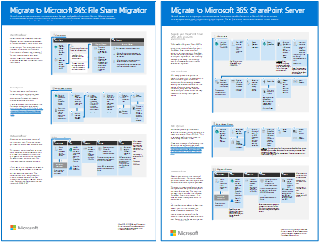

# Ilustrações de produtividade do Microsoft 365Microsoft 365 productivity illustrations

A Microsoft 365 de soluções corporativas fornece diretrizes para a implementação de recursos Microsoft 365, especialmente onde os recursos se cruzam tecnologias, incluindo Teams diagramas de arquitetura.The Microsoft 365 enterprise solution series provides guidance for implementing Microsoft 365 capabilities, especially where capabilities cross technologies, including Teams architecture diagrams.

## Microsoft Teams e serviços de produtividade relacionados no Microsoft 365 para arquitetos de TIMicrosoft Teams and related productivity services in Microsoft 365 for IT architects
A arquitetura lógica dos serviços de produtividade no Microsoft 365, liderada pelo Microsoft Teams.The logical architecture of productivity services in Microsoft 365, leading with Microsoft Teams.

| ItemItem | DescriçãoDescription |
|:-----|:-----|
|   [PDF](https://github.com/MicrosoftDocs/microsoft-365-docs/raw/public/microsoft-365/downloads/msft-m365-teams-logical-architecture.pdf) \| [Visio](https://github.com/MicrosoftDocs/microsoft-365-docs/raw/public/microsoft-365/downloads/msft-m365-teams-logical-architecture.vsdx)[PDF](https://github.com/MicrosoftDocs/microsoft-365-docs/raw/public/microsoft-365/downloads/msft-m365-teams-logical-architecture.pdf) \| [Visio](https://github.com/MicrosoftDocs/microsoft-365-docs/raw/public/microsoft-365/downloads/msft-m365-teams-logical-architecture.vsdx)   Atualizado em janeiro de 2021Updated January 2021   |A Microsoft fornece um conjunto de serviços de produtividade que trabalham juntos para fornecer experiências de colaboração com recursos de governança de dados, segurança e conformidade.Microsoft provides a suite of productivity services that work together to provide collaboration experiences with data governance, security, and compliance capabilities.    Esta série de ilustrações oferece uma visão da arquitetura lógica dos serviços de produtividade para arquitetos empresariais, liderada pelo Microsoft Teams.This series of illustrations provides a view into the logical architecture of productivity services for enterprise architects, leading with Microsoft Teams.|

## Grupos no Microsoft 365 para arquitetos de TIGroups in Microsoft 365 for IT Architects
Esta ilustração inclui informações para arquitetos de IT sobre Microsoft 365 Grupos.This illustration includes information for IT architects about Microsoft 365 Groups. Para saber mais sobre como configurar e administrar Microsoft 365 grupos e equipes para colaboração em sua organização, consulte Configure secure [collaboration with Microsoft 365](/microsoft-365/solutions/setup-secure-collaboration-with-teams) and What is collaboration [governance?](/microsoft-365/solutions/collaboration-governance-overview).To learn about configuring and administering Microsoft 365 Groups and teams for collaboration in your organization, see [Set up secure collaboration with Microsoft 365](/microsoft-365/solutions/setup-secure-collaboration-with-teams) and [What is collaboration governance?](/microsoft-365/solutions/collaboration-governance-overview).

| ItemItem | DescriçãoDescription |
|:-----|:-----|
|   [PDF](https://github.com/MicrosoftDocs/microsoft-365-docs/raw/public/microsoft-365/downloads/msft-m365-groups.pdf) \| [Visio](https://github.com/MicrosoftDocs/OfficeDocs-Enterprise/raw/live/Enterprise/downloads/msft-m365-groups.vsdx)[PDF](https://github.com/MicrosoftDocs/microsoft-365-docs/raw/public/microsoft-365/downloads/msft-m365-groups.pdf) \| [Visio](https://github.com/MicrosoftDocs/OfficeDocs-Enterprise/raw/live/Enterprise/downloads/msft-m365-groups.vsdx)   Atualizado em maio de 2020Updated May 2020|Essas ilustrações detalham os diferentes tipos de grupos, como eles são criados e gerenciados e algumas recomendações de governança.These illustrations detail the different types of groups, how these are created and managed, and a few governance recommendations.|

## Migrar para o Microsoft 365Migrate to Microsoft 365

A Microsoft fornece ferramentas para migrar seus compartilhamentos de arquivos de rede locais e sites do SharePoint Server para Microsoft 365 com ênfase na proteção e garantia da segurança do conteúdo durante a migração.Microsoft provides tools to migrate your on-premises network file shares and SharePoint Server sites to Microsoft 365 with an emphasis on protecting and ensuring your content's security during migration. Este conjunto de ilustrações demonstra os vários métodos disponíveis para mover seu conteúdo para SharePoint, Teams e OneDrive e como seus dados fluem pelo processo.This set of illustrations demonstrates the various methods available to move your content to SharePoint, Teams, and OneDrive and how your data flows through the process. 

| ItemItem | DescriçãoDescription |
|:-----|:-----|
|  [PDF](https://download.microsoft.com/download/0/5/b/05b7fb7c-1557-4ebb-9036-c5fc3a4cd94c/m365-migration-posters-mm-spmt.pdf)\|[Visio](https://download.microsoft.com/download/0/5/b/05b7fb7c-1557-4ebb-9036-c5fc3a4cd94c/m-365-migration-posters-mm-spmt.vsdx)[PDF](https://download.microsoft.com/download/0/5/b/05b7fb7c-1557-4ebb-9036-c5fc3a4cd94c/m365-migration-posters-mm-spmt.pdf)\|[Visio](https://download.microsoft.com/download/0/5/b/05b7fb7c-1557-4ebb-9036-c5fc3a4cd94c/m-365-migration-posters-mm-spmt.vsdx)   Atualizado em março de 2021Updated March 2021 |Contém:Includes: <ul><li>  Migração de compartilhamento de arquivosFile share migration</li><li>Migração do Servidor do Microsoft Office SharePoint OnlineSharePoint Server migration </li> </ul>  Para obter mais informações, [consulte Migrar seu conteúdo para Microsoft 365](/sharepointmigration/migrate-to-sharepoint-online).For more information, see [Migrate your content to Microsoft 365](/sharepointmigration/migrate-to-sharepoint-online).|

## Microsoft 365 proteção de informações e recursos de conformidadeMicrosoft 365 information protection and compliance capabilities

Microsoft 365 inclui um amplo conjunto de recursos de proteção e conformidade de informações.Microsoft 365 includes a broad set of information protection and compliance capabilities. Juntamente com as ferramentas de produtividade da Microsoft, esses recursos foram projetados para ajudar as organizações a colaborarem em tempo real enquanto aderem a estruturas de conformidade regulamentar rigorosas.Together with Microsoft’s productivity tools, these capabilities are designed to help organizations collaborate in real time while adhering to stringent regulatory compliance frameworks. 

Esse conjunto de ilustrações usa um dos setores mais regulamentados, serviços financeiros, para demonstrar como esses recursos podem ser aplicados para atender aos requisitos regulatórios comuns.This set of illustrations uses one of the most regulated industries, financial services, to demonstrate how these capabilities can be applied to address common regulatory requirements. Sinta-se à vontade para adaptar essas ilustrações para seu próprio uso.Feel free to adapt these illustrations for your own use. 

| ItemItem | DescriçãoDescription |
|:-----|:-----|
|   Inglês: [Baixar como PDF](https://download.microsoft.com/download/3/a/6/3a6ab1a3-feb0-4ee2-8e77-62415a772e53/m365-compliance-illustrations.pdf)  \| [Baixar como Visio](https://download.microsoft.com/download/3/a/6/3a6ab1a3-feb0-4ee2-8e77-62415a772e53/m365-compliance-illustrations.vsdx)English: [Download as a PDF](https://download.microsoft.com/download/3/a/6/3a6ab1a3-feb0-4ee2-8e77-62415a772e53/m365-compliance-illustrations.pdf)  \| [Download as a Visio](https://download.microsoft.com/download/3/a/6/3a6ab1a3-feb0-4ee2-8e77-62415a772e53/m365-compliance-illustrations.vsdx)   Japonês: [Baixar como PDF](https://download.microsoft.com/download/6/f/1/6f1a7d0e-dd8e-442e-b073-8e94327ae4f8/m365-compliance-illustrations.pdf)  \| [Baixar como Visio](https://download.microsoft.com/download/6/f/1/6f1a7d0e-dd8e-442e-b073-8e94327ae4f8/m365-compliance-illustrations.vsdx)Japanese: [Download as a PDF](https://download.microsoft.com/download/6/f/1/6f1a7d0e-dd8e-442e-b073-8e94327ae4f8/m365-compliance-illustrations.pdf)  \| [Download as a Visio](https://download.microsoft.com/download/6/f/1/6f1a7d0e-dd8e-442e-b073-8e94327ae4f8/m365-compliance-illustrations.vsdx)   Atualizado em novembro de 2020Updated November 2020|Contém:Includes: <ul><li>  Proteção de informações e prevenção contra perda de dados da MicrosoftMicrosoft information protection and data loss prevention</li><li>Políticas de retenção e rótulos de retençãoRetention policies and retention labels </li><li>Barreiras de informaçõesInformation barriers</li><li>Conformidade em comunicaçõesCommunication compliance</li><li>Gerenciamento de riscos internos.Insider risk</li><li>Inclusão de dados de terceirosThird-party data ingestion</li>|

## Segurança e proteção de informações para organizações de várias regiõesSecurity and Information Protection for Multi-Region Organizations
Proteção de informações e segurança para organizações de várias regiões com um único Microsoft 365 locatárioSecurity and information protection for multi-region organizations with a single Microsoft 365 tenant

| ItemItem | DescriçãoDescription |
|:-----|:-----|
|   [PDF](https://github.com/MicrosoftDocs/microsoft-365-docs/raw/public/microsoft-365/downloads/msft-security-info-protect-multi-region.pdf) \| [Visio](https://github.com/MicrosoftDocs/microsoft-365-docs/raw/public/microsoft-365/downloads/msft-security-info-protect-multi-region.vsdx)[PDF](https://github.com/MicrosoftDocs/microsoft-365-docs/raw/public/microsoft-365/downloads/msft-security-info-protect-multi-region.pdf) \| [Visio](https://github.com/MicrosoftDocs/microsoft-365-docs/raw/public/microsoft-365/downloads/msft-security-info-protect-multi-region.vsdx) Atualizado em março de 2020Updated March 2020 |Usar um único locatário do Microsoft 365 para sua organização global é a melhor escolha e experiência por vários motivos.Using a single Microsoft 365 tenant for your global organization is the best choice and experience for many reasons. No entanto, muitos arquitetos têm dificuldades para encontrar a melhor forma de atender aos objetivos de segurança e proteção de informações em diferentes regiões.However, many architects wrestle with how to meet security and information protection objectives across different regions. Este conjunto de tópicos fornece recomendações.This set of topics provides recommendations. |

## Estratégia de implantação do Microsoft Defender para Ponto de ExtremidadeMicrosoft Defender for Endpoint deployment strategy

Dependendo do ambiente, algumas ferramentas são mais adequadas para determinadas arquiteturas.Depending on your environment, some tools are better suited for certain architectures.

| ItemItem | DescriçãoDescription |
|:-----|:-----|
|  [PDF](https://github.com/MicrosoftDocs/microsoft-365-docs/raw/public/microsoft-365/security/defender-endpoint/downloads/mdatp-deployment-strategy.pdf)  \| [Visio](https://github.com/MicrosoftDocs/microsoft-365-docs/raw/public/microsoft-365/security/defender-endpoint/downloads/mdatp-deployment-strategy.vsdx)[PDF](https://github.com/MicrosoftDocs/microsoft-365-docs/raw/public/microsoft-365/security/defender-endpoint/downloads/mdatp-deployment-strategy.pdf)  \| [Visio](https://github.com/MicrosoftDocs/microsoft-365-docs/raw/public/microsoft-365/security/defender-endpoint/downloads/mdatp-deployment-strategy.vsdx)  Atualizado em fevereiro de 2020Updated February 2020| O material arquitetônico ajuda a planejar a implantação para as seguintes arquiteturas:The architectural material helps you plan your deployment for the following architectures: <ul><li> Nuvem nativaCloud-native </li><li> CogerenciamentoCo-management </li><li> No localOn-premise</li><li>Avaliação e integração localEvaluation and local onboarding</li>

## Proteção de identidade e dispositivo para Microsoft 365Identity and device protection for Microsoft 365

Recursos recomendados para proteger identidades e dispositivos que acessam Microsoft 365, outros serviços SaaS e aplicativos locais publicados com o Proxy de Aplicativo do Azure AD.Recommended capabilities for protecting identities and devices that access Microsoft 365, other SaaS services, and on-premises applications published with Azure AD Application Proxy.

| ItemItem | DescriçãoDescription |
|:-----|:-----|
|    [Exibir como um PDF](../downloads/MSFT_cloud_architecture_identity&device_protection.pdf) \| [Baixar como um PDF](https://github.com/MicrosoftDocs/microsoft-365-docs/raw/public/microsoft-365/downloads/MSFT_cloud_architecture_identity&device_protection.pdf) \| [Baixar como um Visio](https://github.com/MicrosoftDocs/microsoft-365-docs/raw/public/microsoft-365/downloads/MSFT_cloud_architecture_identity&device_protection.vsdx)  [View as a PDF](../downloads/MSFT_cloud_architecture_identity&device_protection.pdf) \| [Download as a PDF](https://github.com/MicrosoftDocs/microsoft-365-docs/raw/public/microsoft-365/downloads/MSFT_cloud_architecture_identity&device_protection.pdf)  \| [Download as a Visio](https://github.com/MicrosoftDocs/microsoft-365-docs/raw/public/microsoft-365/downloads/MSFT_cloud_architecture_identity&device_protection.vsdx)   Atualizado em setembro de 2020Updated September 2020|É importante usar níveis consistentes de proteção para dados, identidades e dispositivos.It's important to use consistent levels of protection across your data, identities, and devices. Este modelo mostra quais recursos são comparáveis com mais informações sobre recursos para proteger identidades e dispositivos.This model shows you which capabilities are comparable with more information on capabilities to protect identities and devices.    |
 

## Advanced eDiscovery arquitetura no Microsoft 365Advanced eDiscovery architecture in Microsoft 365

Advanced eDiscovery fluxo de dados e fluxo de dados de ponta a ponta, incluindo em Microsoft 365 ambientes Multi-Geo.Advanced eDiscovery end-to-end workflow and data flow, including within Microsoft 365 Multi-Geo environments. 

| ItemItem | DescriçãoDescription |
|:-----|:-----|
|   [Exibir como uma imagem](../media/solutions-architecture-center/m365-advanced-ediscovery-architecture.png) \| [Baixar como um PDF](https://download.microsoft.com/download/d/1/c/d1ce536d-9bcf-4d31-b75b-fcf0dc560665/m365-advanced-ediscovery-architecture.pdf) \| [Baixar como um Visio](https://download.microsoft.com/download/d/1/c/d1ce536d-9bcf-4d31-b75b-fcf0dc560665/m365-advanced-ediscovery-architecture.vsdx)  [View as an image](../media/solutions-architecture-center/m365-advanced-ediscovery-architecture.png) \| [Download as a PDF](https://download.microsoft.com/download/d/1/c/d1ce536d-9bcf-4d31-b75b-fcf0dc560665/m365-advanced-ediscovery-architecture.pdf)  \| [Download as a Visio](https://download.microsoft.com/download/d/1/c/d1ce536d-9bcf-4d31-b75b-fcf0dc560665/m365-advanced-ediscovery-architecture.vsdx)   Atualizado em outubro de 2020Updated October 2020|Contém:Includes: <ul><li>  Fluxo de trabalho de ponta a ponta em um único ambienteEnd-to-end workflow in a single environment</li><li>Fluxo de trabalho de ponta a ponta em um ambiente Microsoft 365 multi-geoEnd-to-end workflow in a Microsoft 365 Multi-Geo environment </li><li>Fluxo de dados de ponta a ponta que suporta o fluxo de trabalho EDRMEnd-to-end data flow supporting the EDRM workflow</li> |
  

## Soluções de telefonia da MicrosoftMicrosoft Telephony Solutions

A Microsoft oferece suporte a várias opções conforme você começa sua jornada no Teams na nuvem da Microsoft. Esse cartaz ajuda você a decidir qual solução de telefonia da Microsoft (sistema de telefone na nuvem ou o Enterprise Voice local) é ideal para os usuários de sua organização e como sua organização pode se conectar à Rede pública de telefonia comutada (PSTN).Microsoft supports several options as you begin your journey to Teams in the Microsoft cloud. This poster helps you decide which Microsoft telephony solution (Phone System in the cloud or Enterprise Voice on-premises) is right for users in your organization, and how your organization can connect to the Public Switched Telephone Network (PSTN).

| ItemItem | DescriçãoDescription |
|:-----|:-----|
|   [PDF](https://download.microsoft.com/download/4/3/5/435cd4e9-ca56-4fd1-acb6-d1fda7952320/microsoft-voice-solutions.pdf) \| [Visio](https://download.microsoft.com/download/7/5/c/75c13012-e20c-48bd-a6dd-ea49d1a3420d/microsoft-voice-solutions.vsdx)[PDF](https://download.microsoft.com/download/4/3/5/435cd4e9-ca56-4fd1-acb6-d1fda7952320/microsoft-voice-solutions.pdf) \| [Visio](https://download.microsoft.com/download/7/5/c/75c13012-e20c-48bd-a6dd-ea49d1a3420d/microsoft-voice-solutions.vsdx)  Atualizado em março de 2021Updated March 2021 | Para obter mais informações, consulte [Plan your Teams voice solution](/microsoftteams/cloud-voice-landing-page).For more information, see [Plan your Teams voice solution](/microsoftteams/cloud-voice-landing-page).|

## Configurar sua infraestrutura para trabalho híbridoSet up your infrastructure for hybrid work

Com Microsoft 365 e outras tecnologias de nuvem da Microsoft, você pode fornecer aos seus funcionários acesso seguro às informações, ferramentas e recursos locais e baseados em nuvem da sua organização em suas casas.With Microsoft 365 and other Microsoft cloud technologies, you can provide your workers with secure access to your organization's on-premises and cloud-based information, tools, and resources from their homes. 

  
[PDF](https://download.microsoft.com/download/9/b/b/9bb5fa79-74e9-497b-87c5-4021e53d9fc2/hybrid-worker-infrastructure.pdf)  |  [PowerPoint](https://download.microsoft.com/download/9/b/b/9bb5fa79-74e9-497b-87c5-4021e53d9fc2/hybrid-worker-infrastructure.pptx)[PDF](https://download.microsoft.com/download/9/b/b/9bb5fa79-74e9-497b-87c5-4021e53d9fc2/hybrid-worker-infrastructure.pdf) | [PowerPoint](https://download.microsoft.com/download/9/b/b/9bb5fa79-74e9-497b-87c5-4021e53d9fc2/hybrid-worker-infrastructure.pptx)  
Atualizado em junho de 2021Updated June 2021

Para obter mais informações, consulte o artigo para este cartaz: Configurar sua infraestrutura para o trabalho híbrido [com Microsoft 365](empower-people-to-work-remotely.md).For more information, see the article for this poster: [Set up your infrastructure for hybrid work with Microsoft 365](empower-people-to-work-remotely.md).

## Microsoft Teams isolamento de segurançaMicrosoft Teams with security isolation

Com Microsoft 365, você pode configurar uma equipe privada no Microsoft Teams e usar SharePoint configurações de segurança de site e um rótulo de sensibilidade exclusivo para criptografar arquivos para que apenas os membros da equipe possam descriptografá-los.With Microsoft 365, you can configure a private team in Microsoft Teams and use SharePoint site security settings and a unique sensitivity label to encrypt files so that only team members can decrypt them.

  
[PDF](https://github.com/MicrosoftDocs/microsoft-365-docs/raw/public/microsoft-365/downloads/team-security-isolation-poster.pdf)  |  [PowerPoint](https://download.microsoft.com/download/8/0/5/8057fc16-c044-40b6-a652-7ed555ba2895/team-security-isolation-poster.pptx)[PDF](https://github.com/MicrosoftDocs/microsoft-365-docs/raw/public/microsoft-365/downloads/team-security-isolation-poster.pdf) | [PowerPoint](https://download.microsoft.com/download/8/0/5/8057fc16-c044-40b6-a652-7ed555ba2895/team-security-isolation-poster.pptx)   Atualizado em agosto de 2020Updated August 2020

Para obter mais informações, consulte o artigo para este cartaz: [Configurar uma equipe com isolamento de segurança](secure-teams-security-isolation.md).For more information, see the article for this poster: [Configure a team with security isolation](secure-teams-security-isolation.md).

  
## Confira tambémSee Also

[Modelos de arquitetura para SharePoint, Exchange, Skype for Business e LyncArchitectural models for SharePoint, Exchange, Skype for Business, and Lync](../enterprise/architectural-models-for-sharepoint-exchange-skype-for-business-and-lync.md)
  
[Guias do Laboratório de Teste (TLGs) para adoção de nuvemCloud adoption Test Lab Guides (TLGs)](../enterprise/cloud-adoption-test-lab-guides-tlgs.md)
