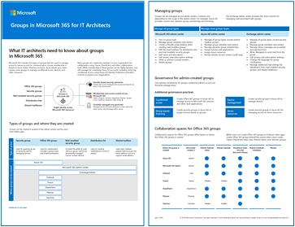

# Configurar a colaboração segura com Microsoft 365 e Microsoft Teams

Ser capaz de compartilhar facilmente informações com as pessoas certas ao evitar o excesso de compartilhamento é fundamental para o sucesso de uma organização. Isso inclui poder compartilhar dados confidenciais com segurança apenas com aqueles que devem ter acesso a eles. Dependendo do projeto, isso pode incluir o compartilhamento de dados confidenciais com pessoas de fora da sua organização.

Esta orientação de solução de colaboração inclui dois componentes para ajudá-lo:
- Implantar Microsoft Teams com o nível de proteção certo para cada projeto
- Configurar o compartilhamento externo com as configurações de segurança apropriadas para cada projeto

Se ferramentas de colaboração de conteúdo versáteis e fáceis de usar não estão disponíveis, os usuários geralmente colaboram enviando documentos por email. Esse é um método de colaboração tedioso e propenso a erros e pode aumentar o risco de compartilhamento inadequado de informações. Se as pessoas acharem muito difícil compartilhar informações, poderão reverter o uso de produtos de consumo que não são governados por IT. Isso pode representar um risco ainda maior.

> [!VIDEO https://www.microsoft.com/videoplayer/embed/RWxMmL?autoplay=false]

Com Microsoft 365, você pode implantar Teams com uma variedade de configurações que ajudam:

- Proteger sua propriedade intelectual
- Habilitar colaboração fácil
- Criar um equilíbrio entre segurança e usabilidade que aumenta a satisfação do usuário e reduz o risco de sombra de IT

A maioria das organizações tem uma variedade de informações, com graus variáveis de sensibilidade e graus variáveis de impacto nos negócios se as informações são compartilhadas inadequadamente. Dependendo da sensibilidade de uma determinada informação, talvez você queira permitir o compartilhamento com:

- Qualquer pessoa (não autenticada)
- Pessoas dentro da organização
- Pessoas específicas dentro da organização
- Pessoas específicas dentro e fora da organização

Informações como folhetos de marketing são destinadas a compartilhar amplamente fora da organização. Informações como menus de cafeteria não são destinadas ao compartilhamento externo, mas não teriam impacto comercial se fossem compartilhadas externamente. Esses tipos de informações precisam de pouca ou nenhuma proteção.

Esses mesmos folhetos de marketing, enquanto estão em desenvolvimento, só podem ser compartilhados dentro da organização. Nesse caso, as configurações de compartilhamento padrão no Teams podem ser suficientes.

As informações sobre um novo produto que está em desenvolvimento podem ser consideradas confidenciais, mesmo dentro da organização. Um grau maior de proteção pode ser apropriado nesse caso. Você pode restringir o acesso a essas informações a membros de uma equipe específica, por exemplo. Dependendo do projeto, talvez seja necessário colaborar com pessoas de fora da sua organização, como um fornecedor ou uma organização parceira.

Informações essenciais para o sucesso da sua organização ou que têm requisitos rigorosos de segurança ou conformidade podem exigir níveis ainda maiores de proteção.

Para todos os cenários mencionados acima, você pode usar as equipes no Microsoft Teams para armazenar, compartilhar e colaborar nas informações. 

Para configurar a colaboração segura, use esses recursos Microsoft 365 e recursos.

| Produto ou componente | Capcidade ou recurso | Licenciamento |
|:-------|:-----|:-------|
| Microsoft Defender para Office 365 | Cofre Anexos para SPO, OneDrive e Teams; Cofre Documentos; Cofre Links para Teams    | Microsoft 365 E1, E3 e E5 |
| SharePoint    | Políticas de compartilhamento de arquivos e sites, permissões de compartilhamento de sites, links de compartilhamento, solicitações do Access, configurações de compartilhamento de convidados do site | Microsoft 365 E1, E3 e E5 |
| Microsoft Teams   | Acesso de convidados, equipes privadas, canais privados | Microsoft 365 E1, E3 e E5 |
| Conformidade com o Microsoft 365  | Rótulos de confidencialidade    | Microsoft 365 E3 e E5 |

### Governança de colaboração

Microsoft 365 oferece muitas opções para governar sua solução de colaboração. Recomendamos que você use esse conteúdo de implantação juntamente com o conteúdo de [governança de colaboração](collaboration-governance-overview.md) para criar a melhor solução de colaboração para sua organização.

### Usando Teams para todos os tipos de dados

Para gerenciar o acesso a informações com diferentes sensibilidades, desenvolvemos três [camadas](configure-teams-three-tiers-protection.md)diferentes de proteção para Teams . Você pode personalizar qualquer uma dessas camadas para melhor atender às necessidades ou à sua empresa. 

Essas camadas - *linha* de base *,* sensível e altamente sensível *-* aumentam gradualmente as proteções que ajudam a evitar o excesso de compartilhamento e o possível vazamento de informações, conforme mostrado na tabela a seguir.

|-|**Camada de linha de base**|**Camada sensível**|**Camada altamente sensível**|
|:--|:-----------|:------------|:-------------------|
|Equipe pública ou privada|Ambos|Private|Private|
|Compartilhamento não autenticado|Blocked|Blocked|Blocked|
|Compartilhamento de arquivos|Permitido|Permitido|Somente os proprietários de equipe podem compartilhar.|
|Associação de equipe|Qualquer pessoa pode ingressar em equipes públicas. Aprovação do proprietário da equipe necessária para ingressar em equipes privadas.|Aprovação do proprietário da equipe necessária para ingressar.|Aprovação do proprietário da equipe necessária para ingressar.|
|Criptografia de documento|||Disponível com rótulo de sensibilidade|
|Compartilhamento de convidados|Permitido|Pode ser permitido ou bloqueado|Pode ser permitido ou bloqueado|
|Dispositivos não gerenciados|Nenhuma restrição|Acesso somente web|Blocked|

A configuração dessas camadas envolve:

- Configurando configurações em Teams para acesso de convidados e canais privados
- Configurando configurações no site associado de uma equipe SharePoint compartilhamento interno e de convidados, solicitações de acesso e links de compartilhamento
- Para as  *camadas confidenciais* e altamente confidenciais, configurar rótulos de sensibilidade para classificar as equipes e controlar o compartilhamento de convidados e o acesso de dispositivos não controlados
- Para a *camada altamente* sensível, configurar um rótulo de sensibilidade para criptografar os documentos aos quais ele é aplicado

Comece com a camada de linha de  base  e adicione equipes que usam as camadas confidenciais e altamente confidenciais conforme necessário para ajudar a proteger as informações em sua organização. Consulte esses recursos para começar:

- [Configurar equipes com proteção de linha de base](configure-teams-baseline-protection.md)
- [Configurar equipes com proteção para dados altamente confidenciais](configure-teams-sensitive-protection.md)
- [Configurar equipes com proteção para dados altamente confidenciais](configure-teams-highly-sensitive-protection.md)

Se você tiver um projeto altamente sensível que exija proteção adicional contra o compartilhamento mesmo dentro da sua organização, você pode configurar uma equipe que usa seu próprio rótulo de sensibilidade para criptografar arquivos para que somente os membros da equipe possam lê-los. Confira [Configurar uma equipe com isolamento de segurança](secure-teams-security-isolation.md) para obter detalhes.

### Compartilhamento com pessoas de fora da sua organização

Talvez seja necessário [compartilhar informações de qualquer sensibilidade com pessoas de fora da sua organização.](collaborate-with-people-outside-your-organization.md) Isso pode variar de compartilhar um único documento com uma única pessoa até colaborar em um projeto importante com uma grande organização de parceiros ou autônomos de todo o mundo. Em Microsoft 365, esse intervalo de compartilhamento externo pode ser feito facilmente e com as proteções apropriadas para ajudar a proteger suas informações confidenciais.

Esses recursos ajudarão você a começar a configurar seu ambiente para colaborar com pessoas de fora da sua organização:

- [Colabore em documentos](collaborate-on-documents.md) para compartilhar arquivos individuais de pastas.
- [Colabore em um site](collaborate-in-site.md) para colaborar com convidados em um SharePoint site.
- [Colabore como uma equipe](collaborate-as-team.md) para colaborar com convidados em uma equipe.

Dependendo da sensibilidade das informações que estão sendo compartilhadas, você pode adicionar proteções para ajudar a evitar o excesso de compartilhamento. Esses recursos ajudarão você a configurar as proteções que você precisa para sua organização:

- [Práticas recomendadas para compartilhar arquivos e pastas com usuários não autenticados](best-practices-anonymous-sharing.md)
- [Limitar a exposição acidental a arquivos ao compartilhar arquivos com pessoas de fora da sua organização](share-limit-accidental-exposure.md)
- [Criar um ambiente de compartilhamento de convidados seguro](create-secure-guest-sharing-environment.md)

Se você tiver um projeto importante com uma organização parceira, poderá usar o Azure Entitlement Management para gerenciar os convidados dessa organização em uma equipe que você definiu para o projeto. Confira [Criar uma extranet B2B com convidados gerenciados](b2b-extranet.md) para obter detalhes.

## Treinamento para administradores

Esses módulos de treinamento do Microsoft Learn podem ajudá-lo a aprender os recursos de colaboração, governança e identidade no Teams e SharePoint.

#### Teams

|Treinamento:|Gerenciar a colaboração em equipe com o Microsoft Teams|
|:---|:---|
||Gerenciar a colaboração em equipe com o Microsoft Teams apresenta os recursos e funções do Microsoft Teams, o ponto central para colaboração em equipe no Microsoft 365. Você aprenderá como usar o Teams para facilitar o trabalho em equipe e a comunicação em sua organização, tanto localmente quanto remoto, em uma ampla variedade de dispositivos — de desktops a tablets e telefones, aproveitando as vantagens de todas as funcionalidades avançadas dos aplicativos do Office 365. Você compreenderá como o Teams oferece um ambiente abrangente e flexível para colaboração entre aplicativos e dispositivos. Este caminho de aprendizagem ajuda você a se preparar para a certificação  Microsoft 365 Certified: Administrador Associado do Teams.  2 hr 17 min - Caminho de Aprendizagem - 5 Módulos|

> [!div class="nextstepaction"]
> [Iniciar >](/learn/modules/m365-teams-collab-prepare-deployment/introduction/)

#### SharePoint

|Treinamento:|Colaborar com o SharePoint no Microsoft 365|
|:---|:---|
||O gerenciamento de conteúdo compartilhado com o Microsoft SharePoint apresenta os recursos e funcionalidades do SharePoint e como ele funciona com o Microsoft 365. Você aprenderá sobre os diferentes tipos de sites do SharePoint, inclusive sites agrupadores, além de proteção de informações, relatórios e monitoramento. Você também aprenderá a usar o compartilhamento de pastas e arquivos do SharePoint para otimizar a colaboração, como compartilhar arquivos externamente e como gerenciar sites do SharePoint no centro de administração do SharePoint. Este caminho de aprendizagem pode ajudar você a se preparar para a certificação Microsoft 365 Certified: Administrador de Trabalho em Equipe.  1 hr 14 min - Caminho de Aprendizagem - 4 Módulos|

> [!div class="nextstepaction"]
> [Iniciar >](/learn/modules/m365-teams-sharepoint-plan-sharepoint/introduction/)

#### Proteção de informações

|Treinamento:|Proteja as informações da empresa com o Microsoft 365|
|:---|:---|
||Garantir a proteção e a segurança das informações da sua organização está mais difícil que nunca. O caminho de aprendizagem Proteger informações corporativas com o Microsoft 365 descreve como proteger as informações confidenciais contra compartilhamento excessivo acidental ou uso impróprio, como descobrir e classificar dados, como protegê-los com rótulos de confidencialidade e como monitorar e analisar suas informações confidenciais para proteger contra a perda. Esse caminho de aprendizado pode ajudá-lo a se preparar para o Microsoft 365 Certificado: Associado do Administrador de Segurança e certificado Microsoft 365 Certificado: Enterprise Certificações de Especialista em Administração..  1 hr - Caminho de Aprendizagem - 5 Módulos|

> [!div class="nextstepaction"]
> [Iniciar >](/learn/modules/m365-security-info-overview/introduction/)

#### Identidade e acesso

|Treinamento:|Proteger a identidade e o acesso com o Azure Active Directory|
|:---|:---|
||O caminho de aprendizagem de Identidade e Acesso abrange as últimas tecnologias de identidade e acesso, ferramentas para reforçar a autenticação e diretrizes de proteção de identidade dentro da sua organização. As tecnologias de identidade e acesso da Microsoft permitem proteger a identidade da sua organização, seja no local ou na nuvem, e capacita os usuários a trabalhar com segurança em qualquer local. Este caminho de aprendizagem pode ajudar você a se preparar para a certificação Microsoft 365 Certified: Administrador de Segurança Associado e Microsoft 365 Certified: Especialista em Administração Corporativa.  2 hr 52 min - Caminho de Aprendizagem - 6 Módulos|

> [!div class="nextstepaction"]
> [Iniciar >](/learn/modules/m365-identity-overview/introduction/)

## Treinamento para usuários finais

Esses módulos de treinamento podem ajudar os usuários a usarem Teams, grupos e SharePoint para colaboração Microsoft 365.

|Teams|SharePoint|
|:---|:---|
| **[Configurar e personalizar sua equipe](https://support.microsoft.com/office/702a2977-e662-4038-bef5-bdf8ee47b17b)**| **[Compartilhar e sincronizar](https://support.microsoft.com/office/98cb2ff2-c27e-42ea-b055-c2d895f8a5de)**|
| **[Upload e encontrar arquivos](https://support.microsoft.com/office/57b669db-678e-424e-b0a0-15d19215cb12)**||
| **[Colaborar em equipes e canais](https://support.microsoft.com/office/c3d63c10-77d5-4204-a566-53ddcf723b46)**|||

## Ilustrações

Essas ilustrações ajudarão você a entender como grupos e equipes interagem com outros serviços no Microsoft 365 e quais recursos de governança e conformidade estão disponíveis para ajudá-lo a gerenciar esses serviços em sua organização.

### Grupos no Microsoft 365 para arquitetos de TI
O que os arquitetos de TI precisam saber sobre os grupos no Microsoft 365

|**Item**|**Descrição**|
|:-----|:-----|
|   [PDF](https://github.com/MicrosoftDocs/microsoft-365-docs/raw/public/microsoft-365/downloads/msft-m365-groups.pdf) \| [Visio](https://github.com/MicrosoftDocs/OfficeDocs-Enterprise/raw/live/Enterprise/downloads/msft-m365-groups.vsdx)   Atualizado em junho de 2019|Essas ilustrações detalham os diferentes tipos de grupos, como eles são criados e gerenciados e algumas recomendações de governança.|

### Microsoft Teams e serviços de produtividade relacionados no Microsoft 365 para arquitetos de TI
A arquitetura lógica dos serviços de produtividade no Microsoft 365, liderada pelo Microsoft Teams.

|**Item**|**Descrição**|
|:-----|:-----|
|   [PDF](https://github.com/MicrosoftDocs/microsoft-365-docs/raw/public/microsoft-365/downloads/msft-m365-teams-logical-architecture.pdf) \| [Visio](https://github.com/MicrosoftDocs/OfficeDocs-Enterprise/raw/live/Enterprise/downloads/msft-m365-teams-logical-architecture.vsdx)   Atualizado em abril de 2019   |A Microsoft fornece um conjunto de serviços de produtividade que trabalham juntos para fornecer experiências de colaboração com recursos de governança de dados, segurança e conformidade.    Esta série de ilustrações oferece uma visão da arquitetura lógica dos serviços de produtividade para arquitetos empresariais, liderada pelo Microsoft Teams.|

## Implantar a solução de colaboração segura

Quando você estiver pronto para implantar essa solução, continue com estas etapas:
1. Configure as [três camadas diferentes de proteção para Teams](configure-teams-three-tiers-protection.md).
2. Configure configurações para [compartilhar informações de qualquer sensibilidade com pessoas de fora da sua organização.](collaborate-with-people-outside-your-organization.md)

## Confira também

[Documentação do Centro de segurança do Microsoft 365](../security/index.yml)

[Documentação de conformidade do Microsoft 365](../compliance/index.yml)

[Bem-vindo ao Microsoft Teams](/MicrosoftTeams/Teams-overview)
