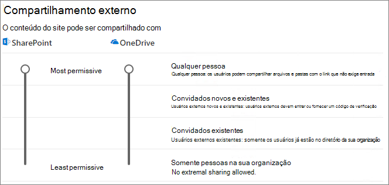
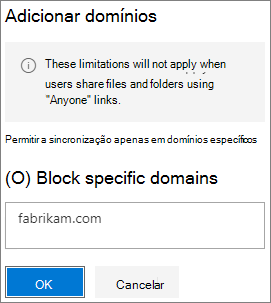

# Limitar a exposição acidental de arquivos ao compartilhar com pessoas de fora da sua organizaçãoLimit accidental exposure to files when sharing with people outside your organization

Ao compartilhar arquivos e pastas com pessoas de fora da sua organização, há uma variedade de opções para reduzir as chances de compartilhar acidentalmente informações confidenciais.When sharing files and folders with people outside your organization, there are a variety of options to reduce the chances of accidentally sharing sensitive information. Você pode escolher a opção apresentada neste artigo que atenda melhor às necessidades da sua organização.You can choose from the options in this article to best meet the needs of your organization.

## Usar as práticas recomendadas para links para Qualquer pessoaUse best practices for Anyone links

Se as pessoas em sua organização precisarem fazer compartilhamentos não autenticados, mas você está preocupado que pessoas não autenticadas façam modificações no conteúdo, leia [Práticas recomendadas para compartilhamento não autenticado](best-practices-anonymous-sharing.md) para obter diretrizes sobre como trabalhar com o compartilhamento não autenticado em sua organização.If people in your organization need to do unauthenticated sharing, but you're concerned about unauthenticated people modifying content, read [Best practices for unauthenticated sharing](best-practices-anonymous-sharing.md) for guidance on how to work with unauthenticated sharing in your organization.

## Desativar links para Qualquer pessoaTurn off Anyone links

Recomenda-se deixar os links para *Qualquer pessoa* habilitados para o conteúdo apropriado porque essa é a maneira mais fácil de compartilhar, além de poder ajudar a reduzir o risco de usuários que buscam soluções diferentes e fora do controle do departamento de TI.We recommend leaving *Anyone* links enabled for appropriate content because it's the easiest way to share and can help reduce the risk of users seeking other solutions that are outside the control of your IT department. Os links para *Qualquer pessoa* podem ser encaminhados a outras pessoas, mas o acesso aos arquivos só estará disponível para os usuários que tiverem o link.*Anyone* links can be forwarded to others, but file access is only available to those who have the link.

Caso você queira que as pessoas de fora da sua organização sempre façam a autenticação ao acessar o conteúdo no SharePoint, Grupos ou no Teams, você pode desativar o compartilhamento a *Qualquer pessoa*.If you always want people outside your organization to authenticate when accessing content in SharePoint, Groups, or Teams, you can turn off *Anyone* sharing. Isso impedirá usuários de compartilharem conteúdo não autenticado.This will prevent users from unauthenticated sharing of content.

Mesmo desabilitando os links para *Qualquer pessoa*, os usuários continuarão podendo fazer compartilhamentos facilmente com convidados usando links para *Pessoas específicas*.If you disable *Anyone* links, users can still easily share with guests using *Specific people* links. Nesse caso, todas as pessoas de fora da sua organização precisarão se autenticar para poder acessar o conteúdo compartilhado.In this case, all people outside your organization will be required to authenticate before they can access the shared content.

Dependendo das suas necessidades, você pode desabilitar links para *Qualquer pessoa* para sites específicos ou para toda a organização.Depending on your needs, you can disable *Anyone* links for specific sites, or for your whole organization.

Para desativar os links para *Qualquer pessoa* da sua organizaçãoTo turn off *Anyone* links for your organization
1. No centro de administração do SharePoint, na navegação à esquerda, clique em **Compartilhamento**.In the SharePoint admin center, in the left navigation, click **Sharing**.
2. Defina as configurações de compartilhamento externo do SharePoint para **Convidados novos e existentes**.Set the SharePoint external sharing settings to **New and existing guests**. 
   
3. Clique em **Salvar**.Click **Save**.

Para desativar os links para *Qualquer pessoa* de um siteTo turn off *Anyone* links for a site
1. No centro de administração do SharePoint, na navegação à esquerda, expanda a opção **Sites** e clique em **Sites ativos**.In the SharePoint admin center, in the left navigation, expand **Sites** and click **Active sites**.
2. Selecione o site da equipe que você acabou de criar.Select the site for the team that you just created.
3. Na faixa de opções, clique em **Compartilhamento**.In the ribbon, click **Sharing**.
4. Verifique se o compartilhamento está definido como **Convidados novos e existentes**.Ensure that sharing is set to **New and existing guests**. 
   
5. Caso tenha feito alterações, clique em **Salvar**.If you made changes, click **Save**.

## Filtragem de domíniosDomain filtering

Você pode usar as listas permitir ou negar domínio para determinar os domínios que seus usuários podem compartilhar com pessoas de fora da sua organização.You can use domain allow or deny lists to determine domains your users can share with people outside your organization.

Com uma lista de permissões, você pode especificar uma lista de domínios que os usuários de sua organização podem compartilhar com pessoas de fora da sua organização.With an allow list, you can specify a list of domains where users in your organization can share with people outside your organization. O compartilhamento com outros domínios está bloqueado.Sharing with to other domains is blocked. Se sua organização só colabora com as pessoas presentes em uma lista de domínios específicos, você pode usar esse recurso para impedir o compartilhamento com outros domínios.If your organization only collaborates with people from a list of specific domains, you can use this feature to prevent sharing with other domains.

Com uma lista de negações, você pode especificar uma lista de domínios que os usuários da organização não podem compartilhar com pessoas de fora da sua organização.With a deny list, you can specify a list of domains from which users in your organization cannot share with people outside your organization. O compartilhamento com os domínios listados está bloqueado.Sharing with the listed domains is blocked. Isso poderá ser útil se você tiver concorrentes, por exemplo, que deseja impedir de acessar o conteúdo da sua organização.This can be useful if you have competitors, for example, who you want to prevent from accessing content in your organization.

As listas de permissão e negação afetam apenas o compartilhamento com convidados.The allow and deny lists only affect sharing with guests. Os usuários continuarão podendo fazer compartilhamentos com pessoas de domínios proibidos usando links para *Qualquer pessoa* caso você ainda não os tenha desabilitado.Users can still share with people from prohibited domains by using *Anyone* links if you haven't disabled them. Para obter os melhores resultados com listas de permissão e negação de domínio, cogite desabilitar os links para *Qualquer pessoa* conforme descrito acima.For best results with domain allow and deny lists, consider disabling *Anyone* links as described above.

Configurar uma lista de permissão ou negação de domínio para pessoas de fora da sua organizaçãoTo set up a domain allow or deny list for people outside your organization
1. No centro de administração do SharePoint, na navegação à esquerda, clique em **Compartilhamento**.In the SharePoint admin center, in the left navigation, click **Sharing**.
2. Em **Configurações avançadas para compartilhamento externo**, marque a caixa de seleção **Limitar compartilhamento externo por domínio**.Under **Advanced settings for external sharing**, select the **Limit external sharing by domain** check box.
3. Clique em **Adicionar domínios**.Click **Add domains**.
4. Selecione se deseja bloquear domínios, digite os domínios e clique em **OK.**Select whether you want to block domains, type the domains, and click **OK**. 
   
5. Clique em **Salvar**.Click **Save**.

Caso deseje limitar o compartilhamento por domínio em um nível superior ao SharePoint e ao OneDrive, você pode [permitir ou bloquear convites para usuários B2B de organizações específicas](https://docs.microsoft.com/azure/active-directory/b2b/allow-deny-list) no Azure Active Directory.If you want to limit sharing by domain at a higher level than SharePoint and OneDrive, you can [allow or block invitations to B2B users from specific organizations](https://docs.microsoft.com/azure/active-directory/b2b/allow-deny-list) in Azure Active Directory. (Você deve configurar a [integração do SharePoint e do OneDrive com a versão prévia do B2B do Azure AD](https://docs.microsoft.com/sharepoint/sharepoint-azureb2b-integration-preview) para que essas configurações se apliquem ao SharePoint e ao OneDrive).(You must configure the [SharePoint and OneDrive integration with Azure AD B2B Preview](https://docs.microsoft.com/sharepoint/sharepoint-azureb2b-integration-preview) for these settings to affect SharePoint and OneDrive.)

## Limitar o compartilhamento de arquivos, pastas e sites com pessoas de fora da sua organização com grupos de segurança especificadosLimit sharing of files, folders, and sites with people outside your organization to specified security groups

Você pode restringir o compartilhamento de arquivos, pastas e sites com pessoas de fora da sua organização com os membros de um grupo de segurança específico.You can restrict sharing of files, folders, and sites with people outside your organization to members of a specific security group. Isso será útil caso você queira habilitar o compartilhamento externo, mas com um fluxo de trabalho de aprovação ou processo de solicitação.This is useful if you want to enable external sharing, but with an approval workflow or request process.

Limitar o compartilhamento externo com membros de um grupo de segurançaTo limit external sharing to members of a security group
1. No centro de administração do SharePoint, na navegação à esquerda, clique em **Compartilhamento**.In the SharePoint admin center, in the left navigation, click **Sharing**.
2. Em **Outras configurações**Under **Other settings**. siga o link **Limitar o compartilhamento externo a específicos grupos de segurança**.follow the **Limit external sharing to specific security groups** link.
3. Em **Quem pode compartilhar fora da sua organização**, marque uma ou ambas as caixas de seleção: a.Under **Who can share outside your organization**, select one or both of the check boxes: a. **Permitir que apenas os usuários dos grupos de segurança selecionados compartilhem com usuários externos autenticados** para especificar um grupo de segurança que pode fazer o compartilhamento com usuários autenticados; b.**Let only users in selected security groups share with authenticated external users** to specify a security group that can share with authenticated users b. **Permitir que apenas os usuários dos grupos de segurança selecionados compartilhem com usuários externos autenticados e usando links anônimos** para especificar um grupo de segurança que pode fazer o compartilhamento com usuários autenticados e usando links para Qualquer pessoa.**Let only users in selected security groups share with authenticated external users and using anonymous links** to specify a security group that can share with authenticated users and by using Anyone links
4. Clique em **OK**.Click **OK**.

Observe que isso afeta arquivos, pastas e sites, mas não os grupos do Microsoft 365 ou Teams.Note that this affects files, folders, and sites, but not Microsoft 365 groups or Teams. Quando os membros convidarem pessoas para um grupo privado do Microsoft 365 ou uma equipe privada no Microsoft Teams, o convite é enviado ao proprietário do grupo ou equipe para aprovação.When members invite guests to a private Microsoft 365 group or a private team in Microsoft Teams, the invitation is sent to the group or team owner for approval.

## Confira tambémSee Also

[Criar um ambiente seguro de compartilhamento de convidadosCreate a secure guest sharing environment](create-secure-guest-sharing-environment.md)

[Práticas recomendadas para compartilhar arquivos e pastas com usuários anônimosBest practices for sharing files and folders with anonymous users](best-practices-anonymous-sharing.md)