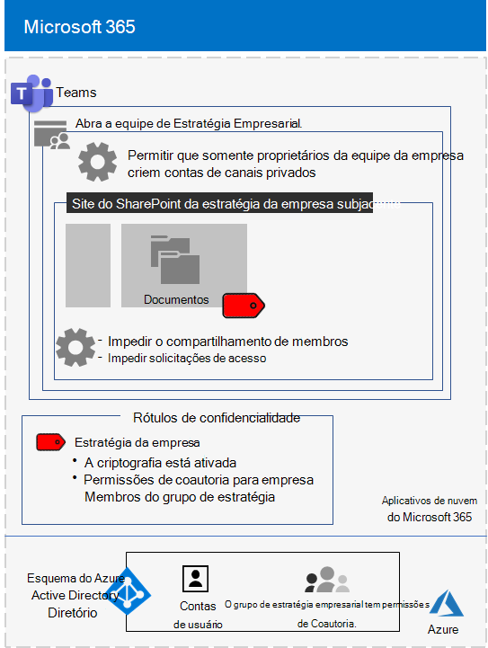

# <a name="configure-a-team-with-security-isolation-in-a-devtest-environment"></a>Configurar uma equipe com isolamento de segurança em um ambiente de desenvolvimento/teste

Este artigo fornece instruções detalhadas para criar uma [equipe com isolamento de segurança](secure-teams-security-isolation.md) em um ambiente de desenvolvimento/teste.



Use esse ambiente de desenvolvimento/teste para experimentar e ajustar as configurações de acordo com as suas necessidades específicas antes de implantar esse tipo de equipe em produção.
  
## <a name="phase-1-build-out-your-microsoft-365-enterprise-test-environment"></a>Fase 1: criar o ambiente de teste do Microsoft 365 Enterprise

Se você quiser apenas testar equipes confidenciais e altamente confidenciais de uma maneira simples com os requisitos mínimos, siga as instruções em [Configuração de base leve](../enterprise/lightweight-base-configuration-microsoft-365-enterprise.md).

Caso pretenda testar equipes confidenciais e altamente confidenciais em uma empresa simulada, siga as instruções em [Sincronização de hash de senha](../enterprise/password-hash-sync-m365-ent-test-environment.md).

>[!Note]
>O teste de uma equipe com isolamento de segurança não exige o ambiente de teste corporativo simulado, que inclui uma intranet simulada conectada à Internet e a sincronização de diretórios para uma floresta do AD DS (Active Directory Domain Services). Ele é fornecido aqui como uma opção, para que você possa testar uma equipe com isolamento de segurança e fazer experimentos com ela em um ambiente que representa uma organização típica.
>
    
## <a name="phase-2-create-and-configure-your-azure-active-directory-azure-ad-group-and-users"></a>Fase 2: criar e configurar seu grupo e usuários do Azure AD (Azure Active Directory)

Nesta fase, você cria e configura um grupo e usuários do Azure AD para sua organização fictícia.
  
Primeiro, crie um grupo de segurança com o portal do Azure.
  
1. Crie uma guia separada no navegador e vá para o Portal do Azure[https://portal.azure.com](https://portal.azure.com). Se necessário, entre com as credenciais da conta de administrador global da sua assinatura paga ou de avaliação do Microsoft 365 E5.
    
2. No Portal do Azure, clique em **Azure Active Directory > Grupos**.
    
3. Na folha **Grupos – Todos os grupos**, clique em **+ Novo grupo**.
    
4. Na folha **Grupo**:
    
  - Selecione **Segurança** em **Tipo de grupo**.
    
  - Digite **Pacote C** em **Nome**.
    
  - Escolha **Atribuído** em **Tipo de Associação**.
      
5. Clique em **Criar** e, em seguida, feche a folha **Grupo**.
    
Em seguida, configure o licenciamento automático, de modo que os membros do novo grupo **C-Suite** recebam automaticamente uma licença do Microsoft 365 E5.
  
1. No Portal do Azure, clique em **Azure Active Directory > Licenças > Todos os produtos**.
    
2. Na lista, selecione **Microsoft 365 Enterprise E5**e, em seguida, clique em **atribuir**.
    
3. Na folha **Atribuir licença**, clique em **Usuários e grupos**.
    
4. Na lista de grupos, selecione **C-Suite**.
    
5. Clique em **Selecionar** e clique em **Atribuir**.
    
6. Feche a guia do Portal do Azure no navegador.
    
Em seguida, [conecte-se ao módulo PowerShell do Azure Active Directory para Graph](../enterprise/connect-to-microsoft-365-powershell.md#connect-with-the-azure-active-directory-powershell-for-graph-module).
  
Preencha o nome da organização, seu local e uma senha comum. Execute esses comandos no prompt de comando do PowerShell ou no ISE (Ambiente de Script Integrado) para criar contas de usuário e adicioná-las ao grupo C-Suite:
  
```powershell
$orgName="<organization name, such as contoso-test for the contoso-test.onmicrosoft.com trial subscription domain name>"
$location="<the ISO ALPHA2 country code, such as US for the United States>"
$commonPassword="<common password for all the new accounts>"

$PasswordProfile=New-Object -TypeName Microsoft.Open.AzureAD.Model.PasswordProfile
$PasswordProfile.Password=$commonPassword

$groupName="C-Suite"
$userNames=@("CEO","CFO","CIO") 
$groupID=(Get-AzureADGroup | Where { $_.DisplayName -eq $groupName }).ObjectID
ForEach ($element in $userNames){ 
New-AzureADUser -DisplayName $element -PasswordProfile $PasswordProfile -UserPrincipalName ($element + "@" + $orgName + ".onmicrosoft.com") -AccountEnabled $true -MailNickName $element -UsageLocation $location 
Add-AzureADGroupMember -RefObjectId (Get-AzureADUser | Where { $_.DisplayName -eq $element }).ObjectID -ObjectId $groupID
}
```

> [!NOTE]
> O uso de uma senha comum aqui é para a automação e facilidade de configuração para um ambiente de desenvolvimento/teste. Obviamente, isso é recomendado para assinaturas de produção. 
  
Use essas etapas para verificar se o licenciamento baseado em grupo está funcionando corretamente.
  
1. Entre no [Centro de administração do Microsoft 365](https://admin.microsoft.com).
    
2. Na nova guia **Centro de administração do Microsoft 365** do seu navegador, clique em **Usuários**.
    
3. Na lista de usuários, clique em **CEO**.
    
4. No painel que lista as propriedades da conta de usuário **CEO**, verifique se ela recebeu a licença do **Microsoft 365 Enterprise E5** em **Licenças de produto**.
    
## <a name="phase-3-create-your-team"></a>Fase 3: criar sua equipe

Nesta fase, você criará e configurará uma equipe com isolamento de segurança para que os membros da equipe de liderança sênior colaborem com a estratégia da empresa.

Primeiro, habilite os rótulos de confidencialidade para proteger o conteúdo em sites do Microsoft Teams, Office 365 e SharePoint antes de prosseguir com as etapas [deste artigo](../compliance/sensitivity-labels-teams-groups-sites.md).

Em seguida, crie a equipe:

1. No Teams, clique em **Equipes** no lado esquerdo do aplicativo e clique em **Criar equipe ou ingressar em uma** na parte inferior da lista de equipes.
2. Clique em **Criar equipe** (primeiro cartão, canto superior esquerdo).
3. Escolha **Criar uma equipe do zero**.
4. Na lista **Confidencialidade**, mantenha o padrão.
5. Em **Privacidade**, clique em **Privado**.
6. Digite **Estratégia da Empresa** e clique em **Criar** > **Fechar**.

Em seguida, restrinja a criação de canais privados aos proprietários do grupo de Estratégia Empresarial.

1. Na equipe, clique em **Mais opções** e em **Gerenciar equipe**.
2. Na guia **Configurações**, expanda **Permissões de membro**.
3. Desmarque a caixa de seleção **Permitir que os membros criem canais privados**.

Use estas instruções para configurar um rótulo de confidencialidade com as seguintes configurações:

- O nome é Estratégia Empresarial
- A criptografia está ativada
- O grupo de estratégia empresarial tem permissões de Coautoria.

Execute estas etapas:

1. Abra o [Centro de conformidade do Microsoft 365](https://compliance.microsoft.com).
2. Em **Soluções**, clique em **Proteção de informações**.
3. Clique em **Criar um rótulo**.
4. Digite **Estratégia da Empresa** para o nome do rótulo.
5. Digite **Documentos de estratégia de empresa da liderança sênior** como a dica de ferramenta e clique em **Avançar**.
6. Na página **Criptografia**, no menu suspenso **Criptografia**, escolha **Aplicar**.
7. Para adicionar as permissões da equipe:<br>
  a. Clique em **Atribuir permissões**.<br>
  b. Clique em **Adicionar usuários ou grupos**, selecione a **Estratégia da Empresa** e clique em **Adicionar**.<br>
  c. Clique em **Selecionar permissões**.<br>
  d. Escolha **Coautoria** na lista suspensa e clique em **Salvar**.<br>
8. Clique em **Avançar**.
9. Na página **Marcação de conteúdo**, clique **Avançar**.
10. Na página **Configurações de site e grupo**, defina **Configurações de site e grupo** como **Ativado**.
11. No menu suspenso **Privacidade de sites de equipe conectados a grupos do Office 365**, escolha **Privado – somente membros podem acessar o site**.
12. Em **Dispositivos não gerenciados**, escolha **Bloquear acesso**.
13. Clique em **Avançar**.
14. Na página **Rotulação automática para aplicativos do Office**, clique em **Avançar**.
15. Clique em **Enviar** e, em seguida, clique em **Concluído**.

Em seguida, publique o novo rótulo usando estas etapas: 

1. No Centro de conformidade do Microsoft 365, na página **Proteção de informações**, escolha a guia **Políticas de rótulo**.
2. Clique em **Publicar rótulos**.
3. Na página **Escolher rótulos de confidencialidade para publicar**, clique em **Escolher rótulos de confidencialidade para publicar**.
4. Selecione **Estratégia da Empresa** e clique em **Adicionar**.
5. Clique em **Avançar**.
6. Na página **Publicar para usuários e grupos**, clique em **Escolher usuários e grupos**.
7. Clique em **Adicionar** e, em seguida, selecione **Estratégia da Empresa**.
8. Clique em **Adicionar** e, em seguida, clique em **Concluído**.
9. Clique em **Avançar**.
10. Na página Configurações de política, marque a caixa de seleção **Os usuários devem fornecer uma justificativa para remover um rótulo ou um rótulo de classificação inferior** e clique em **Avançar**.
11. Digite **Estratégia da Empresa** para o nome da política e, em seguida, clique em **Avançar**.
12. Clique em **Enviar** e clique em **Concluído**.

Talvez demore um pouco para que o rótulo **Estratégia da Empresa** fique disponível após a publicação.

Em seguida, aplique seu novo rótulo à equipe **Estratégia da Empresa** e atualize o tipo de link de compartilhamento padrão para reduzir o risco de compartilhamento acidental de arquivos e pastas para um público maior do que o pretendido. 

1. Abra o [Centro de administração do SharePoint](https://admin.microsoft.com/sharepoint).
2. Em **Sites**, clique em **Sites ativos**.
3. Clique no site **Estratégia da Empresa**.
4. Na guia **Políticas**, em **Confidencialidade**, clique em **Editar**.
5. Selecione o rótulo **Estratégia da Empresa** e clique em **Salvar**.
6. Na guia **Políticas**, em **Compartilhamento externo**, clique em **Editar**.
5. Escolha **Somente pessoas da sua organização**.
6. No tipo de link **Compartilhamento padrão**, limpe a caixa de seleção **Igual à configuração de nível da organização** e selecione **Pessoas com acesso existente**.
7. Clique em **Salvar**.

Em seguida, configure o compartilhamento de sites somente para proprietários da equipe **Estratégia da Empresa**.

1. No Teams, navegue até a guia **Geral** da equipe **Estratégia da Empresa**.
2. Na barra de ferramentas da equipe, clique em **Arquivos**.
3. Clique nas reticências e em **Abrir no SharePoint**.
4. Na barra de ferramentas do site do SharePoint subjacente, clique no ícone de configurações e, em seguida, clique em **Permissões do site**.
5. No painel Permissões de site, em **Compartilhamento de Site**, clique em **Alterar como os membros podem compartilhar**.
6. Em **Permissões de compartilhamento**, selecione **Somente proprietários do site podem compartilhar arquivos, pastas e o site** e clique em **Salvar**.
7. Feche os painéis **Permissões** e **Configurações**.

Se entrar como membro do grupo Estratégia da Empresa, você verá **Estratégia da Empresa** na opção **Confidencialidade** na barra de ferramentas Página Inicial do Word, Excel e PowerPoint. Selecione o rótulo **Estratégia da Empresa** na opção **Confidencialidade** para atribuir o rótulo a um arquivo.

Esta é a configuração resultante da equipe de estratégia empresarial.


## <a name="next-step"></a>Próxima etapa

Quando estiver pronto para a implantação da produção, confira estas [instruções de configuração](secure-teams-security-isolation.md).
