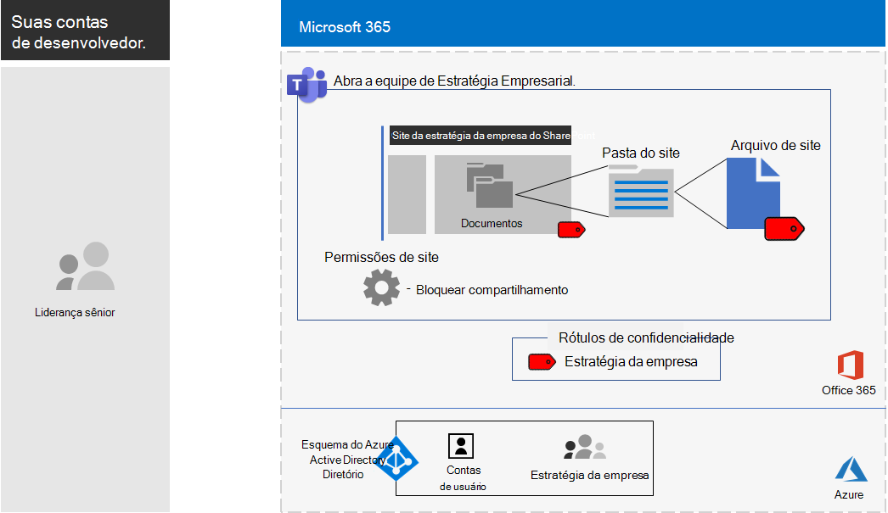

# <a name="configure-a-team-with-security-isolation-in-a-devtest-environment"></a><span data-ttu-id="38b72-103">Configurar uma equipe com isolamento de segurança em um ambiente de desenvolvimento/teste</span><span class="sxs-lookup"><span data-stu-id="38b72-103">Configure a team with security isolation in a dev/test environment</span></span>

<span data-ttu-id="38b72-104">Este artigo fornece instruções detalhadas para criar uma [equipe com isolamento de segurança](secure-teams-security-isolation.md) em um ambiente de desenvolvimento/teste.</span><span class="sxs-lookup"><span data-stu-id="38b72-104">This article provides step-by-step instructions to create a [team with security isolation](secure-teams-security-isolation.md) in a dev/test environment.</span></span>


<span data-ttu-id="38b72-106">Use esse ambiente de desenvolvimento/teste para experimentar e ajustar as configurações de acordo com as suas necessidades específicas antes de implantar esse tipo de equipe em produção.</span><span class="sxs-lookup"><span data-stu-id="38b72-106">Use this dev/test environment to experiment and fine-tune settings for your specific needs before deploying this type of team in production.</span></span>
  
## <a name="phase-1-build-out-your-microsoft-365-enterprise-test-environment"></a><span data-ttu-id="38b72-107">Fase 1: criar o ambiente de teste do Microsoft 365 Enterprise</span><span class="sxs-lookup"><span data-stu-id="38b72-107">Phase 1: Build out your Microsoft 365 Enterprise test environment</span></span>

<span data-ttu-id="38b72-108">Se você quiser apenas testar equipes confidenciais e altamente confidenciais de uma maneira simples com os requisitos mínimos, siga as instruções em [Configuração de base leve](https://docs.microsoft.com/microsoft-365/enterprise/lightweight-base-configuration-microsoft-365-enterprise).</span><span class="sxs-lookup"><span data-stu-id="38b72-108">If you just want to test sensitive and highly sensitive teams in a lightweight way with the minimum requirements, follow the instructions in [Lightweight base configuration](https://docs.microsoft.com/microsoft-365/enterprise/lightweight-base-configuration-microsoft-365-enterprise).</span></span>

<span data-ttu-id="38b72-109">Caso pretenda testar equipes confidenciais e altamente confidenciais em uma empresa simulada, siga as instruções em [Sincronização de hash de senha](https://docs.microsoft.com/microsoft-365/enterprise/password-hash-sync-m365-ent-test-environment).</span><span class="sxs-lookup"><span data-stu-id="38b72-109">If you want to test sensitive and highly sensitive teams in a simulated enterprise, follow the instructions in [Password hash synchronization](https://docs.microsoft.com/microsoft-365/enterprise/password-hash-sync-m365-ent-test-environment).</span></span>

>[!Note]
><span data-ttu-id="38b72-110">O teste de uma equipe com isolamento de segurança não exige o ambiente de teste corporativo simulado, que inclui uma intranet simulada conectada à Internet e a sincronização de diretórios para uma floresta do AD DS (Active Directory Domain Services).</span><span class="sxs-lookup"><span data-stu-id="38b72-110">Testing an team with security isolation does not require the simulated enterprise test environment, which includes a simulated intranet connected to the Internet and directory synchronization for an Active Directory Domain Services (AD DS) forest.</span></span> <span data-ttu-id="38b72-111">Ele é fornecido aqui como uma opção, para que você possa testar uma equipe com isolamento de segurança e fazer experimentos com ela em um ambiente que representa uma organização típica.</span><span class="sxs-lookup"><span data-stu-id="38b72-111">It is provided here as an option so that you can test a team with security isolation and experiment with it in an environment that represents a typical organization.</span></span>
>
    
## <a name="phase-2-create-and-configure-your-azure-active-directory-ad-group-and-users"></a><span data-ttu-id="38b72-112">Fase 2: criar e configurar seu grupo e usuários do Azure AD (Azure Active Directory)</span><span class="sxs-lookup"><span data-stu-id="38b72-112">Phase 2: Create and configure your Azure Active Directory (AD) group and users</span></span>

<span data-ttu-id="38b72-113">Nesta fase, você cria e configura um grupo e usuários do Azure AD para sua organização fictícia.</span><span class="sxs-lookup"><span data-stu-id="38b72-113">In this phase, you create and configure an Azure AD group and users for your fictional organization.</span></span>
  
<span data-ttu-id="38b72-114">Primeiro, crie um grupo de segurança com o portal do Azure.</span><span class="sxs-lookup"><span data-stu-id="38b72-114">First, create a security group with the Azure portal.</span></span>
  
1. <span data-ttu-id="38b72-115">Crie uma guia separada no navegador e vá para o Portal do Azure[https://portal.azure.com](https://portal.azure.com).</span><span class="sxs-lookup"><span data-stu-id="38b72-115">Create a separate tab in your browser, and then go to the Azure portal at [https://portal.azure.com](https://portal.azure.com).</span></span> <span data-ttu-id="38b72-116">Se necessário, entre com as credenciais da conta de administrador global da sua assinatura paga ou de avaliação do Microsoft 365 E5.</span><span class="sxs-lookup"><span data-stu-id="38b72-116">If needed, sign in with the credentials of the global administrator account for your Microsoft 365 E5 trial or paid subscription.</span></span>
    
2. <span data-ttu-id="38b72-117">No Portal do Azure, clique em **Azure Active Directory > Grupos**.</span><span class="sxs-lookup"><span data-stu-id="38b72-117">In the Azure portal, click **Azure Active Directory > Groups**.</span></span>
    
3. <span data-ttu-id="38b72-118">Na folha **Grupos – Todos os grupos**, clique em **+ Novo grupo**.</span><span class="sxs-lookup"><span data-stu-id="38b72-118">On the **Groups - All groups** blade, click **+ New group**.</span></span>
    
4. <span data-ttu-id="38b72-119">Na folha **Grupo**:</span><span class="sxs-lookup"><span data-stu-id="38b72-119">On the **Group** blade:</span></span>
    
  - <span data-ttu-id="38b72-120">Selecione **Segurança** em **Tipo de grupo**.</span><span class="sxs-lookup"><span data-stu-id="38b72-120">Select **Security** in **Group type**.</span></span>
    
  - <span data-ttu-id="38b72-121">Digite **Pacote C** em **Nome**.</span><span class="sxs-lookup"><span data-stu-id="38b72-121">Type **C-Suite** in **Name**.</span></span>
    
  - <span data-ttu-id="38b72-122">Escolha **Atribuído** em **Tipo de Associação**.</span><span class="sxs-lookup"><span data-stu-id="38b72-122">Select **Assigned** in **Membership type**.</span></span>
      
5. <span data-ttu-id="38b72-123">Clique em **Criar** e, em seguida, feche a folha **Grupo**.</span><span class="sxs-lookup"><span data-stu-id="38b72-123">Click **Create**, and then close the **Group** blade.</span></span>
    
<span data-ttu-id="38b72-124">Em seguida, configure o licenciamento automático, de modo que os membros do novo grupo **C-Suite** recebam automaticamente uma licença do Microsoft 365 E5.</span><span class="sxs-lookup"><span data-stu-id="38b72-124">Next, configure automatic licensing so that members of the new **C-Suite** group is automatically assigned a Microsoft 365 E5 license.</span></span>
  
1. <span data-ttu-id="38b72-125">No Portal do Azure, clique em **Azure Active Directory > Licenças > Todos os produtos**.</span><span class="sxs-lookup"><span data-stu-id="38b72-125">In the Azure portal, click **Azure Active Directory > Licenses > All products**.</span></span>
    
2. <span data-ttu-id="38b72-126">Na lista, selecione **Microsoft 365 Enterprise E5**e, em seguida, clique em **atribuir**.</span><span class="sxs-lookup"><span data-stu-id="38b72-126">In the list, select **Microsoft 365 Enterprise E5**, and then click **Assign**.</span></span>
    
3. <span data-ttu-id="38b72-127">Na folha **Atribuir licença**, clique em **Usuários e grupos**.</span><span class="sxs-lookup"><span data-stu-id="38b72-127">In the **Assign license** blade, click **Users and groups**.</span></span>
    
4. <span data-ttu-id="38b72-128">Na lista de grupos, selecione **C-Suite**.</span><span class="sxs-lookup"><span data-stu-id="38b72-128">In the list of groups, select the **C-Suite** group.</span></span>
    
5. <span data-ttu-id="38b72-129">Clique em **Selecionar** e clique em **Atribuir**.</span><span class="sxs-lookup"><span data-stu-id="38b72-129">Click **Select**, and then click **Assign**.</span></span>
    
6. <span data-ttu-id="38b72-130">Feche a guia do Portal do Azure no navegador.</span><span class="sxs-lookup"><span data-stu-id="38b72-130">Close the Azure portal tab in your browser.</span></span>
    
<span data-ttu-id="38b72-131">Em seguida, [conecte-se ao módulo PowerShell do Azure Active Directory para Graph](https://docs.microsoft.com/office365/enterprise/powershell/connect-to-office-365-powershell#connect-with-the-azure-active-directory-powershell-for-graph-module).</span><span class="sxs-lookup"><span data-stu-id="38b72-131">Next, [connect with the Azure Active Directory PowerShell for Graph module](https://docs.microsoft.com/office365/enterprise/powershell/connect-to-office-365-powershell#connect-with-the-azure-active-directory-powershell-for-graph-module).</span></span>
  
<span data-ttu-id="38b72-132">Preencha o nome da organização, seu local e uma senha comum. Execute esses comandos no prompt de comando do PowerShell ou no ISE (Ambiente de Script Integrado) para criar contas de usuário e adicioná-las ao grupo C-Suite:</span><span class="sxs-lookup"><span data-stu-id="38b72-132">Fill in your organization name, your location, and a common password, and then run these commands from the PowerShell command prompt or Integrated Script Environment (ISE) to create new user accounts and add them to the C-Suite group:</span></span>
  
```powershell
$orgName="<organization name, such as contoso-test for the contoso-test.onmicrosoft.com trial subscription domain name>"
$location="<the ISO ALPHA2 country code, such as US for the United States>"
$commonPassword="<common password for all the new accounts>"

$PasswordProfile=New-Object -TypeName Microsoft.Open.AzureAD.Model.PasswordProfile
$PasswordProfile.Password=$commonPassword

$groupName="C-Suite"
$userNames=@("CEO","CFO","CIO") 
$groupID=(Get-AzureADGroup | Where { $_.DisplayName -eq $groupName }).ObjectID
ForEach ($element in $userNames){ 
New-AzureADUser -DisplayName $element -PasswordProfile $PasswordProfile -UserPrincipalName ($element + "@" + $orgName + ".onmicrosoft.com") -AccountEnabled $true -MailNickName $element -UsageLocation $location 
Add-AzureADGroupMember -RefObjectId (Get-AzureADUser | Where { $_.DisplayName -eq $element }).ObjectID -ObjectId $groupID
}
```

> [!NOTE]
> <span data-ttu-id="38b72-133">O uso de uma senha comum aqui é para a automação e facilidade de configuração para um ambiente de desenvolvimento/teste.</span><span class="sxs-lookup"><span data-stu-id="38b72-133">The use of a common password here is for automation and ease of configuration for a dev/test environment.</span></span> <span data-ttu-id="38b72-134">Obviamente, isso é recomendado para assinaturas de produção.</span><span class="sxs-lookup"><span data-stu-id="38b72-134">Obviously, this is highly discouraged for production subscriptions.</span></span> 
  
<span data-ttu-id="38b72-135">Use essas etapas para verificar se o licenciamento baseado em grupo está funcionando corretamente.</span><span class="sxs-lookup"><span data-stu-id="38b72-135">Use these steps to verify that group-based licensing is working correctly.</span></span>
  
1. <span data-ttu-id="38b72-136">Entre no [Centro de administração do Microsoft 365](https://admin.microsoft.com).</span><span class="sxs-lookup"><span data-stu-id="38b72-136">Sign in to the [Microsoft 365 admin center](https://admin.microsoft.com).</span></span>
    
2. <span data-ttu-id="38b72-137">Na nova guia **Centro de administração do Microsoft 365** do seu navegador, clique em **Usuários**.</span><span class="sxs-lookup"><span data-stu-id="38b72-137">From the new **Microsoft 365 admin center** tab of your browser, click **Users**.</span></span>
    
3. <span data-ttu-id="38b72-138">Na lista de usuários, clique em **CEO**.</span><span class="sxs-lookup"><span data-stu-id="38b72-138">In the list of users, click **CEO**.</span></span>
    
4. <span data-ttu-id="38b72-139">No painel que lista as propriedades da conta de usuário **CEO**, verifique se ela recebeu a licença do **Microsoft 365 Enterprise E5** em **Licenças de produto**.</span><span class="sxs-lookup"><span data-stu-id="38b72-139">In the pane that lists the properties of the **CEO** user account, verify that it has been assigned the **Microsoft 365 Enterprise E5** license in **Product licenses**.</span></span>
    
## <a name="phase-3-create-your-team"></a><span data-ttu-id="38b72-140">Fase 3: criar sua equipe</span><span class="sxs-lookup"><span data-stu-id="38b72-140">Phase 3: Create your team</span></span>

<span data-ttu-id="38b72-141">Nesta fase, você criará e configurará uma equipe com isolamento de segurança para que os membros da equipe de liderança sênior colaborem com a estratégia da empresa.</span><span class="sxs-lookup"><span data-stu-id="38b72-141">In this phase, you create and configure a team with security isolation for members of the senior leadership team to collaborate on company strategy.</span></span>

<span data-ttu-id="38b72-142">Primeiro, habilite os rótulos de confidencialidade para proteger o conteúdo em sites do Microsoft Teams, Office 365 e SharePoint antes de prosseguir com as etapas [deste artigo](https://docs.microsoft.com/microsoft-365/compliance/sensitivity-labels-teams-groups-sites).</span><span class="sxs-lookup"><span data-stu-id="38b72-142">First, enable sensitivity labels to protect content in Microsoft Teams, Office 365 groups, and SharePoint sites before you proceed with the steps in [this article](https://docs.microsoft.com/microsoft-365/compliance/sensitivity-labels-teams-groups-sites).</span></span>

<span data-ttu-id="38b72-143">Em seguida, crie a equipe:</span><span class="sxs-lookup"><span data-stu-id="38b72-143">Next, create the team:</span></span>

1. <span data-ttu-id="38b72-144">No Teams, clique em **Equipes** no lado esquerdo do aplicativo e clique em **Criar equipe ou ingressar em uma** na parte inferior da lista de equipes.</span><span class="sxs-lookup"><span data-stu-id="38b72-144">In Teams, click **Teams** on the left side of the app, then click **Join or create a team** at the bottom of the teams list.</span></span>
2. <span data-ttu-id="38b72-145">Clique em **Criar equipe** (primeiro cartão, canto superior esquerdo).</span><span class="sxs-lookup"><span data-stu-id="38b72-145">Click **Create team** (first card, top left corner).</span></span>
3. <span data-ttu-id="38b72-146">Escolha **Criar uma equipe do zero**.</span><span class="sxs-lookup"><span data-stu-id="38b72-146">Choose **Build a team from scratch**.</span></span>
4. <span data-ttu-id="38b72-147">Na lista **Confidencialidade**, mantenha o padrão.</span><span class="sxs-lookup"><span data-stu-id="38b72-147">In the **Sensitivity** list, keep the default.</span></span>
5. <span data-ttu-id="38b72-148">Em **Privacidade**, clique em **Privado**.</span><span class="sxs-lookup"><span data-stu-id="38b72-148">Under **Privacy**, click **Private**.</span></span>
6. <span data-ttu-id="38b72-149">Digite **Estratégia da Empresa** e clique em **Criar** > **Fechar**.</span><span class="sxs-lookup"><span data-stu-id="38b72-149">Type **Company Strategy**, and then click **Create** > **Close**.</span></span>

<span data-ttu-id="38b72-150">Use estas instruções para configurar um rótulo de confidencialidade com as seguintes configurações:</span><span class="sxs-lookup"><span data-stu-id="38b72-150">Next, you need to configure a sensitivity label with the following settings:</span></span>

- <span data-ttu-id="38b72-151">O nome do rótulo é Estratégia empresarial</span><span class="sxs-lookup"><span data-stu-id="38b72-151">The name of the label is Company Strategy</span></span>
- <span data-ttu-id="38b72-152">A criptografia está ativada</span><span class="sxs-lookup"><span data-stu-id="38b72-152">Encryption is enabled</span></span>
- <span data-ttu-id="38b72-153">O grupo de estratégia empresarial tem permissões de Coautoria.</span><span class="sxs-lookup"><span data-stu-id="38b72-153">The Company Strategy group has Co-Author permissions</span></span>

<span data-ttu-id="38b72-154">Execute estas etapas:</span><span class="sxs-lookup"><span data-stu-id="38b72-154">Follow these steps:</span></span>

1. <span data-ttu-id="38b72-155">Abra o [Centro de conformidade do Microsoft 365](https://compliance.microsoft.com).</span><span class="sxs-lookup"><span data-stu-id="38b72-155">Open the [Microsoft 365 compliance center](https://compliance.microsoft.com).</span></span>
2. <span data-ttu-id="38b72-156">Em **Soluções**, clique em **Proteção de informações**.</span><span class="sxs-lookup"><span data-stu-id="38b72-156">Under **Solutions**, click **Information protection**.</span></span>
3. <span data-ttu-id="38b72-157">Clique em **Criar um rótulo**.</span><span class="sxs-lookup"><span data-stu-id="38b72-157">Click **Create a label**.</span></span>
4. <span data-ttu-id="38b72-158">Digite **Estratégia da Empresa** para o nome do rótulo.</span><span class="sxs-lookup"><span data-stu-id="38b72-158">Type **Company Strategy** for the label name.</span></span>
5. <span data-ttu-id="38b72-159">Digite **Documentos de estratégia de empresa da liderança sênior** como a dica de ferramenta e clique em **Avançar**.</span><span class="sxs-lookup"><span data-stu-id="38b72-159">Type **Senior leadership company strategy documents** as the tool tip, and then click **Next**.</span></span>
6. <span data-ttu-id="38b72-160">Na página **Criptografia**, no menu suspenso **Criptografia**, escolha **Aplicar**.</span><span class="sxs-lookup"><span data-stu-id="38b72-160">On the **Encryption** page, in the **Encryption** dropdown, choose **Apply**.</span></span>
7. <span data-ttu-id="38b72-161">Para adicionar as permissões da equipe:</span><span class="sxs-lookup"><span data-stu-id="38b72-161">To add the team permissions:</span></span><br>
  <span data-ttu-id="38b72-162">a.</span><span class="sxs-lookup"><span data-stu-id="38b72-162">a.</span></span> <span data-ttu-id="38b72-163">Clique em **Atribuir permissões**.</span><span class="sxs-lookup"><span data-stu-id="38b72-163">Click **Assign permissions**.</span></span><br>
  <span data-ttu-id="38b72-164">b.</span><span class="sxs-lookup"><span data-stu-id="38b72-164">b.</span></span> <span data-ttu-id="38b72-165">Clique em **Adicionar usuários ou grupos**, selecione a **Estratégia da Empresa** e clique em **Adicionar**.</span><span class="sxs-lookup"><span data-stu-id="38b72-165">Click **Add users or groups**, select **Company Strategy**, and then click **Add**.</span></span><br>
  <span data-ttu-id="38b72-166">c.</span><span class="sxs-lookup"><span data-stu-id="38b72-166">c.</span></span> <span data-ttu-id="38b72-167">Clique em **Selecionar permissões**.</span><span class="sxs-lookup"><span data-stu-id="38b72-167">Click **Choose permissions**.</span></span><br>
  <span data-ttu-id="38b72-168">d.</span><span class="sxs-lookup"><span data-stu-id="38b72-168">d.</span></span> <span data-ttu-id="38b72-169">Escolha **Coautoria** na lista suspensa e clique em **Salvar**.</span><span class="sxs-lookup"><span data-stu-id="38b72-169">Choose **Co-Author** from the dropdown list, and then click **Save**.</span></span><br>
8. <span data-ttu-id="38b72-170">Clique em **Avançar**.</span><span class="sxs-lookup"><span data-stu-id="38b72-170">Click **Next**.</span></span>
9. <span data-ttu-id="38b72-171">Na página **Marcação de conteúdo**, clique **Avançar**.</span><span class="sxs-lookup"><span data-stu-id="38b72-171">On the **Content marking** page, click **Next**.</span></span>
10. <span data-ttu-id="38b72-172">Na página **Configurações de site e grupo**, defina **Configurações de site e grupo** como **Ativado**.</span><span class="sxs-lookup"><span data-stu-id="38b72-172">On the **Site and group settings** page, set **Site and group settings** to **On**.</span></span>
11. <span data-ttu-id="38b72-173">No menu suspenso **Privacidade de sites de equipe conectados a grupos do Office 365**, escolha **Privado – somente membros podem acessar o site**.</span><span class="sxs-lookup"><span data-stu-id="38b72-173">In the **Privacy of Office 365 group-connected team sites** dropdown, choose **Private - only members can access the site**.</span></span>
12. <span data-ttu-id="38b72-174">Em **Dispositivos não gerenciados**, escolha **Bloquear acesso**.</span><span class="sxs-lookup"><span data-stu-id="38b72-174">Under **Unmanaged devices**, choose **Block access**.</span></span>
13. <span data-ttu-id="38b72-175">Clique em **Avançar**.</span><span class="sxs-lookup"><span data-stu-id="38b72-175">Click **Next**.</span></span>
14. <span data-ttu-id="38b72-176">Na página **Rotulação automática para aplicativos do Office**, clique em **Avançar**.</span><span class="sxs-lookup"><span data-stu-id="38b72-176">On the **Auto-labeling for Office apps** page, click **Next**.</span></span>
15. <span data-ttu-id="38b72-177">Clique em **Enviar** e, em seguida, clique em **Concluído**.</span><span class="sxs-lookup"><span data-stu-id="38b72-177">Click **Submit**, and then click **Done**.</span></span>

<span data-ttu-id="38b72-178">Em seguida, publique o novo rótulo usando estas etapas:</span><span class="sxs-lookup"><span data-stu-id="38b72-178">Next, publish the new label with these steps:</span></span> 

1. <span data-ttu-id="38b72-179">No Centro de conformidade do Microsoft 365, na página **Proteção de informações**, escolha a guia **Políticas de rótulo**.</span><span class="sxs-lookup"><span data-stu-id="38b72-179">In the Microsoft 365 compliance center, on the **Information protection** page, choose the **Label policies** tab.</span></span>
2. <span data-ttu-id="38b72-180">Clique em **Publicar rótulos**.</span><span class="sxs-lookup"><span data-stu-id="38b72-180">Click **Publish labels**.</span></span>
3. <span data-ttu-id="38b72-181">Na página **Escolher rótulos de confidencialidade para publicar**, clique em **Escolher rótulos de confidencialidade para publicar**.</span><span class="sxs-lookup"><span data-stu-id="38b72-181">On the **Choose sensitivity labels to publish** page, click **Choose sensitivity labels to publish**.</span></span>
4. <span data-ttu-id="38b72-182">Selecione **Estratégia da Empresa** e clique em **Adicionar**.</span><span class="sxs-lookup"><span data-stu-id="38b72-182">Select **Company Strategy**, and then click **Add**.</span></span>
5. <span data-ttu-id="38b72-183">Clique em **Avançar**.</span><span class="sxs-lookup"><span data-stu-id="38b72-183">Click **Next**.</span></span>
6. <span data-ttu-id="38b72-184">Na página **Publicar para usuários e grupos**, clique em **Escolher usuários e grupos**.</span><span class="sxs-lookup"><span data-stu-id="38b72-184">On the **Publish to users and groups** page, click **Choose users and groups**.</span></span>
7. <span data-ttu-id="38b72-185">Clique em **Adicionar** e, em seguida, selecione **Estratégia da Empresa**.</span><span class="sxs-lookup"><span data-stu-id="38b72-185">Click **Add**, and then select **Company Strategy**.</span></span>
8. <span data-ttu-id="38b72-186">Clique em **Adicionar** e, em seguida, clique em **Concluído**.</span><span class="sxs-lookup"><span data-stu-id="38b72-186">Click **Add**, and then click **Done**.</span></span>
9. <span data-ttu-id="38b72-187">Clique em **Avançar**.</span><span class="sxs-lookup"><span data-stu-id="38b72-187">Click **Next**.</span></span>
10. <span data-ttu-id="38b72-188">Na página Configurações de política, marque a caixa de seleção **Os usuários devem fornecer uma justificativa para remover um rótulo ou um rótulo de classificação inferior** e clique em **Avançar**.</span><span class="sxs-lookup"><span data-stu-id="38b72-188">On the Policy settings page, select the **Users must provide justification to remove a label or lower classification label** check box, and then click **Next**.</span></span>
11. <span data-ttu-id="38b72-189">Digite **Estratégia da Empresa** para o nome da política e, em seguida, clique em **Avançar**.</span><span class="sxs-lookup"><span data-stu-id="38b72-189">Type **Company Strategy** for the policy name, and then click **Next**.</span></span>
12. <span data-ttu-id="38b72-190">Clique em **Enviar** e clique em **Concluído**.</span><span class="sxs-lookup"><span data-stu-id="38b72-190">Click **Submit** and then click **Done**.</span></span>

<span data-ttu-id="38b72-191">Talvez demore um pouco para que o rótulo **Estratégia da Empresa** fique disponível após a publicação.</span><span class="sxs-lookup"><span data-stu-id="38b72-191">It may take some time for the **Company Strategy** label to become available after it's been published.</span></span>

<span data-ttu-id="38b72-192">Em seguida, aplique seu novo rótulo à equipe **Estratégia da Empresa** e atualize o tipo de link de compartilhamento padrão para reduzir o risco de compartilhamento acidental de arquivos e pastas para um público maior do que o pretendido.</span><span class="sxs-lookup"><span data-stu-id="38b72-192">Next, apply your new label to the **Company Strategy** team and update the default sharing link type to reduce the risk of accidentally sharing files and folders to a wider audience than intended.</span></span> 

1. <span data-ttu-id="38b72-193">Abra o [Centro de administração do SharePoint](https://admin.microsoft.com/sharepoint).</span><span class="sxs-lookup"><span data-stu-id="38b72-193">Open the [SharePoint admin center](https://admin.microsoft.com/sharepoint).</span></span>
2. <span data-ttu-id="38b72-194">Em **Sites**, clique em **Sites ativos**.</span><span class="sxs-lookup"><span data-stu-id="38b72-194">Under **Sites**, click **Active sites**.</span></span>
3. <span data-ttu-id="38b72-195">Clique no site **Estratégia da Empresa**.</span><span class="sxs-lookup"><span data-stu-id="38b72-195">Click the **Company Strategy** site.</span></span>
4. <span data-ttu-id="38b72-196">Na guia **Políticas**, em **Confidencialidade**, clique em **Editar**.</span><span class="sxs-lookup"><span data-stu-id="38b72-196">On the **Policies** tab, under **Sensitivity**, click **Edit**.</span></span>
5. <span data-ttu-id="38b72-197">Selecione o rótulo **Estratégia da Empresa** e clique em **Salvar**.</span><span class="sxs-lookup"><span data-stu-id="38b72-197">Select the **Company Strategy** label, and then click **Save**.</span></span>
6. <span data-ttu-id="38b72-198">Na guia **Políticas**, em **Compartilhamento externo**, clique em **Editar**.</span><span class="sxs-lookup"><span data-stu-id="38b72-198">On the **Policies** tab, under **External sharing**, click **Edit**.</span></span>
5. <span data-ttu-id="38b72-199">Escolha **Somente pessoas da sua organização**.</span><span class="sxs-lookup"><span data-stu-id="38b72-199">Choose **Only people in your organization**.</span></span>
6. <span data-ttu-id="38b72-200">No tipo de link **Compartilhamento padrão**, limpe a caixa de seleção **Igual à configuração de nível da organização** e selecione **Pessoas com acesso existente**.</span><span class="sxs-lookup"><span data-stu-id="38b72-200">Under **Default sharing** link type, clear the **Same as organization-level setting** check box, and select **People with existing access**.</span></span>
7. <span data-ttu-id="38b72-201">Clique em **Salvar**.</span><span class="sxs-lookup"><span data-stu-id="38b72-201">Click **Save**.</span></span>

<span data-ttu-id="38b72-202">Em seguida, configure o compartilhamento de sites somente para proprietários da equipe **Estratégia da Empresa**.</span><span class="sxs-lookup"><span data-stu-id="38b72-202">Next, configure owners-only site sharing for the **Company Strategy** team.</span></span>

1. <span data-ttu-id="38b72-203">No Teams, navegue até a guia **Geral** da equipe **Estratégia da Empresa**.</span><span class="sxs-lookup"><span data-stu-id="38b72-203">In Teams, navigate to the **General** tab of the **Company Strategy** team.</span></span>
2. <span data-ttu-id="38b72-204">Na barra de ferramentas da equipe, clique em **Arquivos**.</span><span class="sxs-lookup"><span data-stu-id="38b72-204">In the tool bar for the team, click **Files**.</span></span>
3. <span data-ttu-id="38b72-205">Clique nas reticências e em **Abrir no SharePoint**.</span><span class="sxs-lookup"><span data-stu-id="38b72-205">Click the ellipsis, and then click **Open in SharePoint**.</span></span>
4. <span data-ttu-id="38b72-206">Na barra de ferramentas do site do SharePoint subjacente, clique no ícone de configurações e, em seguida, clique em **Permissões do site**.</span><span class="sxs-lookup"><span data-stu-id="38b72-206">In the tool bar of the underlying SharePoint site, click the settings icon, and then click **Site permissions**.</span></span>
5. <span data-ttu-id="38b72-207">No painel Permissões de site, em **Compartilhamento de Site**, clique em **Alterar como os membros podem compartilhar**.</span><span class="sxs-lookup"><span data-stu-id="38b72-207">In the Site permissions pane, under **Site Sharing**, click **Change how members can share**.</span></span>
6. <span data-ttu-id="38b72-208">Em **Permissões de compartilhamento**, selecione **Somente proprietários do site podem compartilhar arquivos, pastas e o site** e clique em **Salvar**.</span><span class="sxs-lookup"><span data-stu-id="38b72-208">Under **Sharing permissions**, choose **Only site owners can share files, folders, and the site**, and then click **Save**.</span></span>
7. <span data-ttu-id="38b72-209">Feche os painéis **Permissões** e **Configurações**.</span><span class="sxs-lookup"><span data-stu-id="38b72-209">Close the **Permissions** and **Settings** panes.</span></span>

<span data-ttu-id="38b72-210">Se entrar como membro do grupo Estratégia da Empresa, você verá **Estratégia da Empresa** na opção **Confidencialidade** na barra de ferramentas Página Inicial do Word, Excel e PowerPoint.</span><span class="sxs-lookup"><span data-stu-id="38b72-210">If you sign in as a member of the Company Strategy group, you will see **Company Strategy** in the **Sensitivity** option in the Home toolbar of Word, Excel, and PowerPoint.</span></span> <span data-ttu-id="38b72-211">Selecione o rótulo **Estratégia da Empresa** na opção **Confidencialidade** para atribuir o rótulo a um arquivo.</span><span class="sxs-lookup"><span data-stu-id="38b72-211">Select the **Company Strategy** label from the **Sensitivity** option to assign the label to a file.</span></span>

<span data-ttu-id="38b72-212">Esta é a configuração resultante da equipe de estratégia empresarial.</span><span class="sxs-lookup"><span data-stu-id="38b72-212">Here is the resulting configuration for the Company Strategy team.</span></span>


<span data-ttu-id="38b72-214">Os arquivos na equipe podem ter o rótulo de confidencialidade Estratégia da Empresa atribuído pelos membros do grupo Estratégia da Empresa.</span><span class="sxs-lookup"><span data-stu-id="38b72-214">Files in the team can have the Company Strategy sensitivity label assigned by the members of the Company Strategy group.</span></span> <span data-ttu-id="38b72-215">Veja um exemplo.</span><span class="sxs-lookup"><span data-stu-id="38b72-215">Here is an example.</span></span>


 
## <a name="next-step"></a><span data-ttu-id="38b72-217">Próxima etapa</span><span class="sxs-lookup"><span data-stu-id="38b72-217">Next step</span></span>

<span data-ttu-id="38b72-218">Quando estiver pronto para a implantação em produção, confira [Configurar uma equipe com isolamento de segurança](secure-teams-security-isolation.md) para obter informações detalhadas sobre a configuração.</span><span class="sxs-lookup"><span data-stu-id="38b72-218">When you are ready for production deployment, see [Configure a team with security isolation](secure-teams-security-isolation.md) for detailed configuration information.</span></span>
