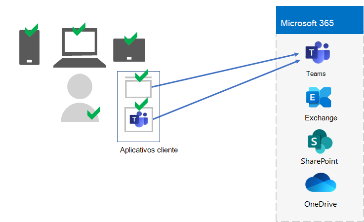
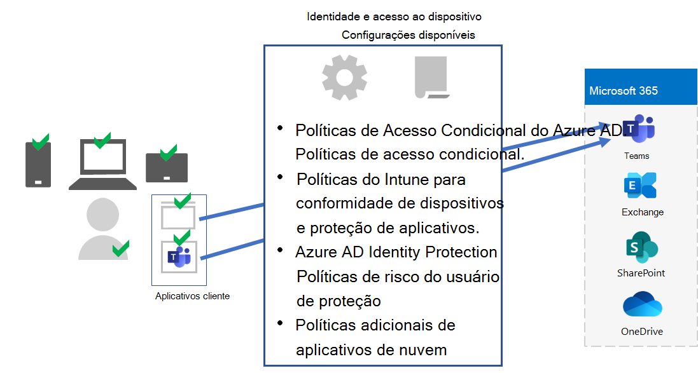
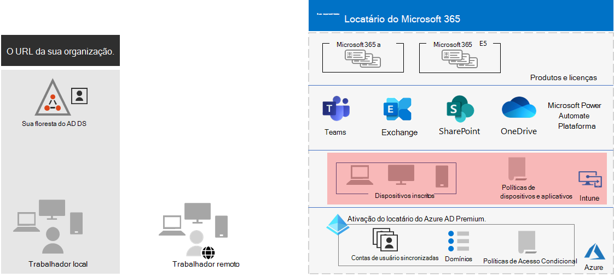

# Etapa 5. Gerenciamento de dispositivos e aplicativos para seus locatários do Microsoft 365 para empresas

O Microsoft 365 para empresas inclui recursos para ajudar a gerenciar dispositivos e o uso de aplicativos nesses dispositivos em sua organização com gerenciamento de dispositivo móvel (MDM) e gerenciamento de aplicativos móveis (MAM). Você pode gerenciar dispositivos iOS, Android, macOS e Windows para proteger o acesso aos recursos da sua organização, incluindo seus dados. Por exemplo, você pode impedir que emails são enviados para pessoas de fora da sua organização ou isolar dados da organização de dados pessoais nos dispositivos pessoais do seu funcionário.

Aqui está um exemplo de validação e gerenciamento de usuários, seus dispositivos e seu uso de aplicativos de produtividade local e na nuvem, como o Microsoft Teams.

Para ajudá-lo a proteger e proteger os recursos da sua organização, o Microsoft 365 para empresas inclui recursos para ajudar a gerenciar dispositivos e seu acesso a aplicativos. Há duas opções para gerenciamento de dispositivos:

- Microsoft Intune, que é uma solução abrangente de gerenciamento de aplicativos e dispositivos para empresas.
- Basic Mobility and Security, que é um subconjunto de serviços do Intune incluídos em todos os produtos do Microsoft 365 para gerenciar dispositivos em sua organização. Para obter mais informações, [consulte Capabilities of Basic Mobility and Security](../admin/basic-mobility-security/capabilities.md).

Se você tiver o Microsoft 365 E3 ou E5, deverá usar o Intune.

## Microsoft Intune

Você usa [o Microsoft Intune](/mem/intune/fundamentals/planning-guide) para gerenciar o acesso à sua organização usando MDM ou MAM. MDM é quando os usuários "registram" seus dispositivos no Intune. Depois que um dispositivo é inscrito, ele é um dispositivo gerenciado e pode receber as políticas, regras e configurações da sua organização. Por exemplo, você pode instalar aplicativos específicos, criar uma política de senha, instalar uma conexão VPN e muito mais.

Os usuários com seus próprios dispositivos pessoais podem não querer registrar seus dispositivos ou ser gerenciados pelo Intune e pelas políticas da sua organização. Mas você ainda precisa proteger os recursos e os dados da sua organização. Nesse cenário, você pode proteger seus aplicativos usando o MAM. Por exemplo, você pode usar uma política de MAM que exija que um usuário insira um PIN ao acessar o SharePoint no dispositivo.

Você também determinará como gerenciar dispositivos pessoais e dispositivos de propriedade da organização. Talvez você queira tratar os dispositivos de forma diferente, dependendo de seus usos.

## Identidade e configurações de acesso ao dispositivo

A Microsoft fornece um conjunto de configurações para acesso a identidades e [dispositivos](../security/defender-365-security/microsoft-365-policies-configurations.md) para garantir uma força de trabalho segura e produtiva. Essas configurações incluem o uso de:

- Políticas de Acesso Condicional do Azure AD
- Políticas de conformidade e proteção de aplicativos do Microsoft Intune
- Políticas de risco de usuário da Proteção de Identidade do Azure AD
- Políticas adicionais de aplicativos de nuvem

Aqui está um exemplo da aplicação dessas configurações e políticas para validar e restringir usuários, seus dispositivos e seu uso de aplicativos de produtividade local e na nuvem, como o Microsoft Teams.

Para acesso a dispositivos e gerenciamento de aplicativos, use as configurações nestes artigos:

- [Pré-requisitos](../security/defender-365-security/identity-access-prerequisites.md)
- [Identidade comum e políticas de acesso ao dispositivo](../security/defender-365-security/identity-access-policies.md)

## Resultados da Etapa 5

Para o gerenciamento de dispositivos e aplicativos para seu locatário do Microsoft 365, você determinou as configurações e políticas do Intune para validar e restringir usuários, seus dispositivos e seu uso de aplicativos de produtividade local e na nuvem.

Aqui está um exemplo de um locatário com o gerenciamento de aplicativos e dispositivos do Intune com os novos elementos realçados.

Nesta ilustração, o locatário tem:

- Dispositivos de propriedade da organização inscritos no Intune.
- Políticas de dispositivos e aplicativos do Intune para dispositivos pessoais e inscritos.

## Manutenção contínua para gerenciamento de dispositivos e aplicativos

Em uma base contínua, talvez seja necessário: 

- Gerenciar o registro do dispositivo.
- Revise suas configurações e políticas para aplicativos, dispositivos e requisitos de segurança adicionais.