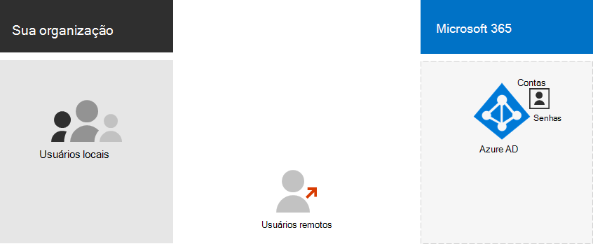
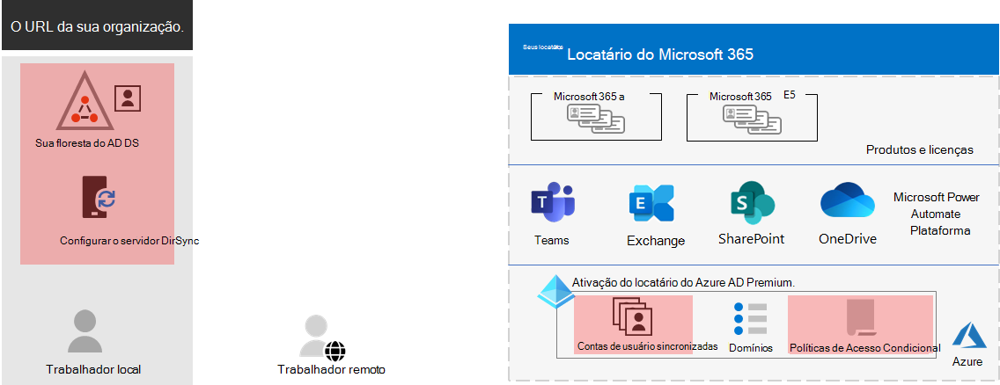
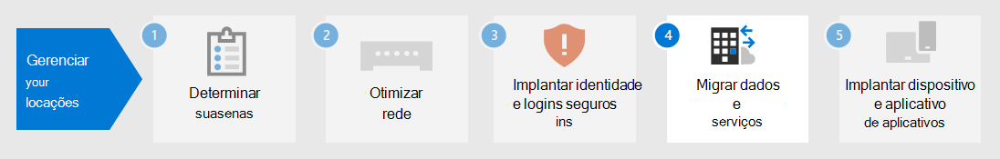

# Etapa 3.Step 3. Identidade do seu Microsoft 365 para locatários corporativosIdentity for your Microsoft 365 for enterprise tenants

Seu Microsoft 365 locatário inclui um locatário Azure Active Directory (Azure AD) para gerenciar identidades e autenticação para entrar. A configuração correta da infraestrutura de identidade é fundamental para gerenciar Microsoft 365 acesso e permissões do usuário para sua organização.Your Microsoft 365 tenant includes an Azure Active Directory (Azure AD) tenant to manage identities and authentication for sign-ins. Getting your identity infrastructure configured correctly is vital to managing Microsoft 365 user access and permissions for your organization.

## Somente nuvem vs. híbridoCloud-only vs. hybrid

Aqui estão os dois tipos de modelos de identidade e seus melhores benefícios e ajuste.Here are the two types of identity models and their best fit and benefits.

| ModeloModel | DescriçãoDescription | Como Microsoft 365 autentica credenciais de usuárioHow Microsoft 365 authenticates user credentials | Melhor paraBest for | Maior benefícioGreatest benefit |
|:-------|:-----|:-----|:-----|:-----|
| Apenas NuvemCloud-only | A conta de usuário só existe no locatário do Azure AD para seu Microsoft 365 locatário.User account only exists in the Azure AD tenant for your Microsoft 365 tenant. | O locatário do Azure AD para seu locatário Microsoft 365 executa a autenticação com a conta de identidade na nuvem.The Azure AD tenant for your Microsoft 365 tenant performs the authentication with the cloud identity account. | Organizações que não têm ou precisam de um AD DS local.Organizations that do not have or need an on-premises AD DS. | Simples de usar.Simple to use. Nenhuma ferramenta de diretório adicional ou servidores necessários.No extra directory tools or servers required. |
| HíbridoHybrid |  A conta de usuário existe em seus Serviços de Domínio do Active Directory (AD DS) local e uma cópia também está no locatário do Azure AD para seu locatário Microsoft 365 local.User account exists in your on-premises Active Directory Domain Services (AD DS) and a copy is also in the Azure AD tenant for your Microsoft 365 tenant. O Azure AD Conexão executado em um servidor local para sincronizar as alterações do AD DS no locatário do Azure AD.Azure AD Connect runs on an on-premises server to synchronize AD DS changes to your Azure AD tenant. A conta de usuário no Azure AD também pode incluir uma versão com hashed da senha de conta de usuário do AD DS já com hashed.The user account in Azure AD might also include a hashed version of the already hashed AD DS user account password. | O locatário do Azure AD para seu locatário Microsoft 365 lida com o processo de autenticação ou redireciona o usuário para outro provedor de identidade.The Azure AD tenant for your Microsoft 365 tenant either handles the authentication process or redirects the user to another identity provider. | Organizações que usam o AD DS ou outro provedor de identidade.Organizations using AD DS or another identity provider. | Os usuários podem usar as mesmas credenciais ao acessar recursos locais ou baseados em nuvem.Users can use the same credentials when accessing on-premises or cloud-based resources. |
||||||

Aqui estão os componentes básicos da identidade somente na nuvem.Here are the basic components of cloud-only identity.

Nesta ilustração, usuários locais e remotos entrarão com contas no locatário do Azure AD do locatário Microsoft 365 locatário.In this illustration, on-premises and remote users sign in with accounts in the Azure AD tenant of their Microsoft 365 tenant.

Aqui estão os componentes básicos da identidade híbrida.Here are the basic components of hybrid identity.

Nesta ilustração, usuários locais e remotos entrarão em seu locatário Microsoft 365 com contas no locatário do Azure AD que foram copiadas do AD DS local.In this illustration, on-premises and remote users sign in to their Microsoft 365 tenant with accounts in the Azure AD tenant that have been copied from their on-premises AD DS.

## Sincronizando seu AD DS localSynchronizing your on-premises AD DS

Dependendo das suas necessidades de negócios e dos requisitos técnicos, o modelo de identidade híbrida e a sincronização de diretórios é a escolha mais comum para clientes corporativos que estão adotando Microsoft 365.Depending on your business needs and technical requirements, the hybrid identity model and directory synchronization is the most common choice for enterprise customers who are adopting Microsoft 365. A sincronização de diretório permite gerenciar identidades no AD DS e todas as atualizações para contas de usuário, grupos e contatos são sincronizadas com o locatário do Azure AD do seu locatário Microsoft 365 usuário.Directory synchronization allows you to manage identities in your AD DS and all updates to user accounts, groups, and contacts are synchronized to the Azure AD tenant of your Microsoft 365 tenant.

> [!NOTE]
> Quando as contas de usuário do AD DS são sincronizadas pela primeira vez, elas não são atribuídas automaticamente a uma licença de Microsoft 365 e não podem acessar Microsoft 365 serviços, como email.When AD DS user accounts are synchronized for the first time, they are not automatically assigned a Microsoft 365 license and cannot access Microsoft 365 services, such as email. Primeiro, você deve atribuir a eles um local de uso.You must first assign them a usage location. Em seguida, atribua uma licença a essas contas de usuário, individualmente ou dinamicamente por meio da associação ao grupo.Then, assign a license to these user accounts, either individually or dynamically through group membership.

Aqui estão os dois tipos de autenticação ao usar o modelo de identidade híbrida.Here are the two types of authentication when using the hybrid identity model.

| Tipo de autenticaçãoAuthentication type | DescriçãoDescription |
|:-------|:-----|
| Autenticação gerenciadaManaged authentication | O Azure AD lida com o processo de autenticação usando uma versão com hashed armazenada localmente da senha ou envia as credenciais para um agente de software local a ser autenticado pelo AD DS local.Azure AD handles the authentication process by using a locally-stored hashed version of the password or sends the credentials to an on-premises software agent to be authenticated by the on-premises AD DS.      Há dois tipos de autenticação gerenciada: a sincronização de hash de senha (PHS) e a autenticação de passagem (PTA).There are two types of managed authentication: Password hash synchronization (PHS) and Pass-through authentication (PTA). Com o PHS, o Azure AD executa a própria autenticação.With PHS, Azure AD performs the authentication itself. Com o PTA, o Azure AD tem o AD DS para executar a autenticação.With PTA, Azure AD has AD DS perform the authentication. |
| Autenticação federadaFederated authentication | O Azure AD redireciona o computador cliente solicitando autenticação para outro provedor de identidade.Azure AD redirects the client computer requesting authentication to another identity provider. |
|  |  |

Confira [escolher o método de autenticação correto](/azure/active-directory/hybrid/choose-ad-authn) para saber mais.See [choosing the right authentication method](/azure/active-directory/hybrid/choose-ad-authn) to learn more.

## Impor fortes inscreçõesEnforcing strong sign-ins

Para aumentar a segurança de logins do usuário, use os recursos e recursos na tabela a seguir.To increase the security of user sign-ins, use the features and capabilities in the following table.

| FuncionalidadeCapability | DescriçãoDescription | Mais informaçõesMore information | Requisitos de licenciamentoLicensing requirements |
|:-------|:-----|:-----|:-----|:-----|
| Windows Hello para EmpresasWindows Hello for Business | Substitui senhas por autenticação forte de dois fatores ao entrar em um Windows dispositivo.Replaces passwords with strong two-factor authentication when signing on a Windows device. O recurso de dois fatores é um novo tipo de credencial de usuário vinculado a um dispositivo e a uma leitura biométrica ou a um PIN.The two factors are a new type of user credential that is tied to a device and a biometric or PIN. | [Visão geral do Windows Hello para EmpresasWindows Hello for Business Overview](/windows/security/identity-protection/hello-for-business/hello-overview) | Microsoft 365 E3 ou E5Microsoft 365 E3 or E5 |
| Proteção por senha do Microsoft Azure ADAzure AD Password Protection | Detecta e bloqueia senhas fracas conhecidas e suas variantes e também pode bloquear termos fracos adicionais específicos da sua organização.Detects and blocks known weak passwords and their variants and can also block additional weak terms that are specific to your organization. | [Configurar a proteção de senha do Azure ADConfigure Azure AD password protection](/azure/active-directory/authentication/concept-password-ban-bad) | Microsoft 365 E3 ou E5Microsoft 365 E3 or E5 |
| Use a autenticação multifator (MFA)Use multi-factor authentication (MFA) | A MFA exige que as insíções do usuário sejam sujeitas a uma verificação adicional além da senha da conta do usuário, como a verificação com um aplicativo de smartphone ou uma mensagem de texto enviada a um smartphone.MFA requires that user sign-ins be subject to an additional verification beyond the user account password, such as verification with a smartphone app or a text message sent to a smartphone. Consulte [este vídeo para](https://support.microsoft.com/office/set-up-multi-factor-authentication-in-microsoft-365-business-a32541df-079c-420d-9395-9d59354f7225) obter instruções sobre como os usuários configuram o MFA.See [this video](https://support.microsoft.com/office/set-up-multi-factor-authentication-in-microsoft-365-business-a32541df-079c-420d-9395-9d59354f7225) for instructions on how users set up MFA. | [MFA para Microsoft 365 para empresasMFA for Microsoft 365 for enterprise](../enterprise/microsoft-365-secure-sign-in.md#mfa) | Microsoft 365 E3 ou E5Microsoft 365 E3 or E5 |
| Identidade e configurações de acesso ao dispositivoIdentity and device access configurations | Configurações e políticas que consistem em recursos de pré-requisito recomendados e suas configurações combinadas com as políticas de Proteção de Identidade do Acesso Condicional, do Intune e do Azure AD que determinam se uma determinada solicitação de acesso deve ser concedida e em quais condições.Settings and policies that consist of recommended prerequisite features and their settings combined with Conditional Access, Intune, and Azure AD Identity Protection policies that determine whether a given access request should be granted and under what conditions.  | [Configurações de identidade e acesso a dispositivosIdentity and device access configurations](../security/office-365-security/microsoft-365-policies-configurations.md) | Microsoft 365 E3 ou E5Microsoft 365 E3 or E5 |
| Azure AD Identity ProtectionAzure AD Identity Protection | Proteja-se contra comprometimento de credenciais, onde um invasor determina o nome da conta e a senha de um usuário para obter acesso aos serviços e dados de nuvem de uma organização.Protect against credential compromise, where an attacker determines a user’s account name and password to gain access to an organization’s cloud services and data. | [Azure AD Identity ProtectionAzure AD Identity Protection](/azure/active-directory/active-directory-identityprotection) | Microsoft 365 E5 ou Microsoft 365 E3 com o complemento Identity & Threat ProtectionMicrosoft 365 E5 or Microsoft 365 E3 with the Identity & Threat Protection add-on |
|  |  |  |

## Resultados da Etapa 3Results of Step 3

Para identidade do seu Microsoft 365 locatário, você determinou:For identity for your Microsoft 365 tenant, you have determined:

- Qual modelo de identidade usar.Which identity model to use.
- Como você imporá um acesso forte a usuários e dispositivos.How you will enforce strong user and device access.

Aqui está um exemplo de locatário com os novos elementos de identidade híbrida realçados.Here is an example a tenant with the new hybrid identity elements highlighted.

Nesta ilustração, o locatário tem:In this illustration, the tenant has:

- Uma floresta do AD DS que está sendo sincronizada com o locatário do Azure AD usando um servidor DirSync e um Conexão.An AD DS forest that is being synchronized with the Azure AD tenant using a DirSync server and Azure AD Connect.
- Uma cópia das contas de usuário do AD DS e outros objetos da floresta do AD DS.A copy of the AD DS user accounts and other objects from the AD DS forest.
- Um conjunto de políticas de Acesso Condicional para impor entrada de usuário seguro e acesso com base na conta de usuário.A set of Conditional Access policies to enforce secure user sign-ins and access based on the user account.

## Manutenção contínua para identidadeOngoing maintenance for identity

Em uma base contínua, talvez seja necessário:On an ongoing basis, you might need to:

- Adicionar ou modificar contas de usuário e grupos.Add or modify user accounts and groups. Para identidade somente na nuvem, você mantém seus usuários e grupos baseados em nuvem com ferramentas do Azure AD, como o Centro de administração do Microsoft 365 ou o PowerShell.For cloud-only identity, you maintain your cloud-based users and groups with Azure AD tools such as the Microsoft 365 admin center or PowerShell. Para identidade híbrida, você mantém seus usuários e grupos locais com ferramentas do AD DS.For hybrid identity, you maintain your on-premises users and groups with AD DS tools.
- Adicione ou modifique sua configuração de acesso a dispositivos e identidade para impor os requisitos de segurança de entrada.Add or modify your identity and device access configuration to enforce sign-in security requirements.

## Próxima etapaNext step

Continue com [a migração](tenant-management-migration.md) para migrar seus servidores Office locais e seus dados para Microsoft 365.Continue with [migration](tenant-management-migration.md) to migrate your on-premises Office servers and their data to Microsoft 365.