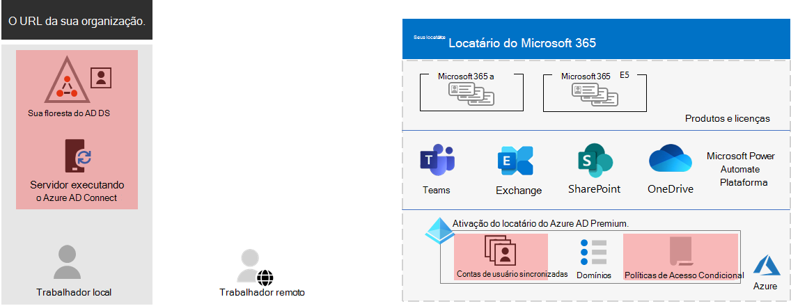

# Etapa 3. Identidade do Microsoft 365 para locatários corporativos

Seu locatário do Microsoft 365 inclui um locatário do Azure Active Directory (Azure AD) para gerenciar identidades e autenticação para entrar. Configurar corretamente sua infraestrutura de identidade é essencial para gerenciar o acesso e as permissões do usuário do Microsoft 365 para sua organização.

## Somente nuvem vs. híbrido

Aqui estão os dois tipos de modelos de identidade e seus melhores benefícios e ajuste.

| Modelo | Descrição | Como o Microsoft 365 autentica credenciais de usuário | Melhor para | Maior benefício |
|:-------|:-----|:-----|:-----|:-----|
| Apenas Nuvem | A conta de usuário só existe no locatário do Azure AD para seu locatário do Microsoft 365. | O locatário do Azure AD para seu locatário do Microsoft 365 executa a autenticação com a conta de identidade na nuvem. | Organizações que não têm ou precisam de um AD DS local. | Simples de usar. Nenhuma ferramenta de diretório adicional ou servidores necessários. |
| Híbrido |  A conta de usuário existe em seus Serviços de Domínio do Active Directory (AD DS) local e uma cópia também está no locatário do Azure AD para seu locatário do Microsoft 365. O Azure AD Connect é executado em um servidor local para sincronizar as alterações do AD DS no locatário do Azure AD. A conta de usuário no Azure AD também pode incluir uma versão com hashed da senha de conta de usuário do AD DS já com hashed. | O locatário do Azure AD para seu locatário do Microsoft 365 lida com o processo de autenticação ou redireciona o usuário para outro provedor de identidade. | Organizações que usam o AD DS ou outro provedor de identidade. | Os usuários podem usar as mesmas credenciais ao acessar recursos locais ou baseados em nuvem. |
||||||

Aqui estão os componentes básicos da identidade somente na nuvem.
 

Nesta ilustração, usuários locais e remotos entrarão com contas no locatário do Azure AD do locatário do Microsoft 365.

Aqui estão os componentes básicos da identidade híbrida.

Nesta ilustração, usuários locais e remotos entrarão no locatário do Microsoft 365 com contas no locatário do Azure AD que foram copiadas do AD DS local.

## Sincronizando seu AD DS local

Dependendo das suas necessidades de negócios e dos requisitos técnicos, o modelo de identidade híbrida e a sincronização de diretórios é a escolha mais comum para clientes corporativos que estão adotando o Microsoft 365. A sincronização de diretório permite gerenciar identidades no AD DS e todas as atualizações para contas de usuário, grupos e contatos são sincronizadas com o locatário do Azure AD do locatário do Microsoft 365.

>[!Note]
>Quando as contas de usuário do AD DS são sincronizadas pela primeira vez, elas não são atribuídas automaticamente a uma licença do Microsoft 365 e não podem acessar serviços do Microsoft 365, como email. Primeiro, você deve atribuir a eles um local de uso. Em seguida, atribua uma licença a essas contas de usuário, individualmente ou dinamicamente por meio da associação ao grupo.
>

Aqui estão os dois tipos de autenticação ao usar o modelo de identidade híbrida.

| Tipo de autenticação | Descrição |
|:-------|:-----|
| Autenticação gerenciada | O Azure AD lida com o processo de autenticação usando uma versão com hashed armazenada localmente da senha ou envia as credenciais para um agente de software local a ser autenticado pelo AD DS local.      Há dois tipos de autenticação gerenciada: a sincronização de hash de senha (PHS) e a autenticação de passagem (PTA). Com o PHS, o Azure AD executa a própria autenticação. Com o PTA, o Azure AD tem o AD DS para executar a autenticação. |
| Autenticação federada | O Azure AD redireciona o computador cliente solicitando autenticação para outro provedor de identidade. |
|  |  |

Confira [escolher o método de autenticação correto](https://docs.microsoft.com/azure/active-directory/hybrid/choose-ad-authn) para saber mais.

## Impor fortes inscreções

Para aumentar a segurança de logins do usuário, use os recursos e recursos na tabela a seguir.

| Funcionalidade | Descrição | Mais informações | Requisitos de licença |
|:-------|:-----|:-----|:-----|:-----|
| Windows Hello para Empresas | Substitui senhas por autenticação forte de dois fatores ao entrar em um dispositivo Windows. O recurso de dois fatores é um novo tipo de credencial de usuário vinculado a um dispositivo e a uma leitura biométrica ou a um PIN. | [Visão geral do Windows Hello para Empresas](https://docs.microsoft.com/windows/security/identity-protection/hello-for-business/hello-overview) | Microsoft 365 E3 ou E5 |
| Proteção por senha do Microsoft Azure AD | Detecta e bloqueia senhas fracas conhecidas e suas variantes e também pode bloquear termos fracos adicionais específicos da sua organização. | [Configurar a proteção de senha do Azure AD](https://docs.microsoft.com/azure/active-directory/authentication/concept-password-ban-bad) | Microsoft 365 E3 ou E5 |
| Use a autenticação multifator (MFA) | A MFA exige que as insíções do usuário sejam sujeitas a uma verificação adicional além da senha da conta do usuário, como a verificação com um aplicativo de smartphone ou uma mensagem de texto enviada a um smartphone. Consulte [este vídeo para](https://support.microsoft.com/office/set-up-multi-factor-authentication-in-microsoft-365-business-a32541df-079c-420d-9395-9d59354f7225) obter instruções sobre como os usuários configuram o MFA. | [MFA para Microsoft 365 para empresas](../enterprise/microsoft-365-secure-sign-in.md#mfa) | Microsoft 365 E3 ou E5 |
| Identidade e configurações de acesso ao dispositivo | Configurações e políticas que consistem em recursos de pré-requisito recomendados e suas configurações combinadas com as políticas de Acesso Condicional, Intune e Proteção de Identidade do Azure AD que determinam se uma determinada solicitação de acesso deve ser concedida e em quais condições.  | [Configurações de identidade e acesso a dispositivos](../security/office-365-security/microsoft-365-policies-configurations.md) | Microsoft 365 E3 ou E5 |
| Azure AD Identity Protection | Proteja-se contra comprometimento de credenciais, onde um invasor determina o nome da conta e a senha de um usuário para obter acesso aos serviços e dados de nuvem de uma organização. | [Azure AD Identity Protection](https://docs.microsoft.com/azure/active-directory/active-directory-identityprotection) | Microsoft 365 E5 ou Microsoft 365 E3 com o complemento Identity & Proteção contra Ameaças |
|  |  |  |

## Resultados da Etapa 3

Para identidade do locatário do Microsoft 365, você determinou:

- Qual modelo de identidade usar.
- Como você imporá um acesso forte a usuários e dispositivos.

Aqui está um exemplo de locatário com os novos elementos de identidade híbrida realçados.

Nesta ilustração, o locatário tem:

- Uma floresta do AD DS que está sendo sincronizada com o locatário do Azure AD usando um servidor DirSync e o Azure AD Connect.
- Uma cópia das contas de usuário do AD DS e outros objetos da floresta do AD DS.
- Um conjunto de políticas de Acesso Condicional para impor entrada de usuário seguro e acesso com base na conta de usuário. 

## Manutenção contínua para identidade

Em uma base contínua, talvez seja necessário:

- Adicionar ou modificar contas de usuário e grupos. Para identidade somente na nuvem, você mantém seus usuários e grupos baseados em nuvem com ferramentas do Azure AD, como o Centro de administração do Microsoft 365 ou o PowerShell. Para identidade híbrida, você mantém seus usuários e grupos locais com ferramentas do AD DS.
- Adicione ou modifique sua configuração de acesso a dispositivos e identidade para impor os requisitos de segurança de entrada.

## Próxima etapa

Continue com [a migração](tenant-management-migration.md) para migrar seus servidores do Office locais e seus dados para o Microsoft 365.
