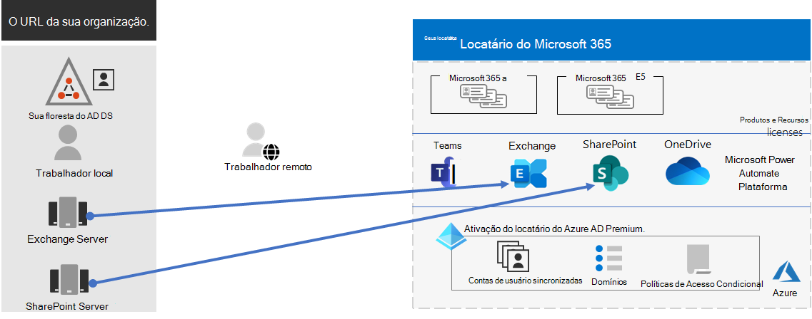
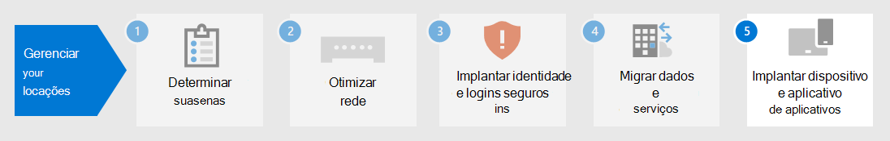

# Etapa 4.Step 4. Migração para seu Microsoft 365 para locatários corporativosMigration for your Microsoft 365 for enterprise tenants

A maioria das organizações corporativas tem um ambiente heterogêneo que inclui várias versões de sistemas operacionais, software cliente e software de servidor.Most enterprise organizations have a heterogeneous environment that includes multiple releases of operating systems, client software, and server software. O Microsoft 365 para empresas inclui as versões mais seguras dos principais componentes da infraestrutura de TI.Microsoft 365 for enterprise includes the most secure versions of the key components of your IT infrastructure. Ele também inclui recursos de produtividade projetados para tirar proveito das tecnologias de nuvem.It also includes productivity features that are designed to take advantage of cloud technologies.

Para maximizar o valor de negócios do Microsoft 365 para o pacote de produtos integrados da empresa, comece a planejar e implementar uma estratégia para migrar essas versões:To maximize the business value of the Microsoft 365 for enterprise integrated suite of products, begin planning and implementing a strategy to migrate these releases:

| DeFrom | ParaTo |
|:-------|:-----|
| Windows 7 e Windows 8.1Windows 7 and Windows 8.1 | Windows 10 EnterpriseWindows 10 Enterprise |
| Produtos do cliente do Office instalados nos dispositivos do seu funcionárioOffice client products installed on your worker's devices | Microsoft 365 Apps para empresasMicrosoft 365 Apps for enterprise |
| Produtos do servidor do Office instalados em servidores locaisOffice server products installed on on-premises servers | Seus serviços equivalentes baseados em nuvem no Microsoft 365Their equivalent cloud-based services in Microsoft 365 |
|  |  |

## Migrando para o Windows 10Migrating to Windows 10

Cada licença do Microsoft 365 para empresas inclui uma licença para o Windows 10 Enterprise.Each Microsoft 365 for enterprise license includes a license for Windows 10 Enterprise. Para migrar seus dispositivos que executem o Windows 7 ou o Windows 8.1, você pode fazer uma atualização in-locar.To migrate your devices that run Windows 7 or Windows 8.1, you can do an in-place upgrade. O suporte terminou para o Windows 7 em *14 de janeiro de 2020*.Support ended for Windows 7 on *January 14, 2020*. 

Para obter métodos adicionais de instalação do Windows 10 Enterprise além de uma atualização in-locar, consulte Cenários de implantação [do Windows 10.](https://docs.microsoft.com/windows/deployment/windows-10-deployment-scenarios)For additional methods of installing Windows 10 Enterprise beyond an in-place upgrade, see [Windows 10 deployment scenarios](https://docs.microsoft.com/windows/deployment/windows-10-deployment-scenarios). Você também pode [planejar a implantação do Windows 10](https://aka.ms/planforwin10deployment) por conta própria.You can also [plan for Windows 10 deployment](https://aka.ms/planforwin10deployment) on your own.

## Migrando para o Microsoft 365 Apps para empresasMigrating to Microsoft 365 Apps for enterprise

O Microsoft 365 para empresas inclui o Microsoft 365 Apps para empresas, uma versão dos produtos cliente do Office (Word, PowerPoint, Excel e Outlook) que é instalado e atualizado a partir da nuvem da Microsoft.Microsoft 365 for enterprise includes Microsoft 365 Apps for enterprise, a version of the Office client products (Word, PowerPoint, Excel, and Outlook) that is installed and updated from the Microsoft cloud. Para obter mais informações, consulte [About Microsoft 365 Apps for enterprise](https://docs.microsoft.com/deployoffice/about-microsoft-365-apps).For more information, see [About Microsoft 365 Apps for enterprise](https://docs.microsoft.com/deployoffice/about-microsoft-365-apps).

Em vez de manter seus computadores atualizados para o Office 2019 ou versões anteriores, tome as seguintes etapas:Rather than keeping your computers current for Office 2019 or older versions, take the following steps:

1. Obter e atribuir uma licença do Microsoft 365 para seus usuários.Get and assign a Microsoft 365 license for your users.
2. Desinstale o Office 2013 ou o Office 2016 em seus computadores.Uninstall Office 2013 or Office 2016 on their computers.
3. Instale o Microsoft 365 Apps para empresas, individualmente ou durante uma implantação de IT.Install Microsoft 365 Apps for enterprise, either individually or during an IT rollout. Para obter mais informações, consulte [Guia de implantação para Aplicativos do Microsoft 365.](https://docs.microsoft.com/deployoffice/deployment-guide-microsoft-365-apps)For more information, see [Deployment guide for Microsoft 365 Apps](https://docs.microsoft.com/deployoffice/deployment-guide-microsoft-365-apps).

O Microsoft 365 Apps for enterprise instala atualizações de segurança e novas atualizações de recursos automaticamente e pode aproveitar os serviços baseados em nuvem no Microsoft 365 para aumentar a segurança e a produtividade.Microsoft 365 Apps for enterprise installs both security updates and new feature updates automatically and can take advantage of cloud-based services in Microsoft 365 for enhanced security and productivity.

## Migrando servidores e dados locais para o Microsoft 365Migrating on-premises servers and data to Microsoft 365

O Microsoft 365 para empresas inclui versões baseadas em nuvem dos serviços de servidor do Office que usam algumas das mesmas ferramentas que as versões locais do software do servidor do Office, como navegadores da Web e o cliente do Outlook.Microsoft 365 for enterprise includes cloud-based versions of Office server services that use some of the same tools as on-premises versions of Office server software, such as web browsers and the Outlook client. Esses serviços baseados em nuvem são atualizados automaticamente para segurança e novos recursos.These cloud-based services are automatically updated for security and new features. Após a migração, seu departamento de IT pode economizar o tempo necessário para manter e atualizar servidores locais.After migration, your IT department can save the time it takes to maintain and update on-premises servers.

Use os seguintes recursos para obter informações sobre como migrar usuários e dados para cargas de trabalho específicas do Microsoft 365:Use the following resources for information about migrating users and data for specific Microsoft 365 workloads:

- [Mover caixas de correio de caixas de correio locais Exchange Server para o Exchange OnlineMove mailboxes from on-premises Exchange Server to Exchange Online](https://docs.microsoft.com/exchange/hybrid-deployment/move-mailboxes)
- [Migrar dados do SharePoint Do SharePoint Server para o SharePoint OnlineMigrate SharePoint data from SharePoint Server to SharePoint Online](https://docs.microsoft.com/sharepointmigration/migrate-to-sharepoint-online)
- [Migrar o Skype for Business Online para o Microsoft TeamsMigrate Skype for Business Online to Microsoft Teams](https://docs.microsoft.com/microsoftteams/migration-interop-guidance-for-teams-with-skype)

## Transição para toda a organizaçãoTransition your entire organization

Para obter uma imagem melhor de como mover toda a organização para os produtos e serviços no Microsoft 365 para empresas, baixe este cartaz de transição:To get a better picture of how to move your entire organization to the products and services in Microsoft 365 for enterprise, download this transition poster:

Esse pôster de duas páginas é uma maneira rápida de fazer o inventário da infraestrutura existente.This two-page poster is a quick way to inventory your existing infrastructure. Use-o para obter orientações para mover para um produto ou serviço no Microsoft 365 para empresas.Use it to get guidance for moving to a product or service in Microsoft 365 for enterprise. Ele mostra produtos do Windows e do Office e outros elementos de infraestrutura e segurança, como gerenciamento de dispositivos, proteção contra identidade e ameaças e proteção e conformidade de informações.It shows Windows and Office products and other infrastructure and security elements such as device management, identity and threat protection, and information protection and compliance.

## Resultados da Etapa 4Results of Step 4

Para migração para seu locatário do Microsoft 365, você determinou:For migration for your Microsoft 365 tenant, you have determined:

- Quais dispositivos estão executando o Windows 7 ou Windows 8.1 e o plano para atualizá-los para o Windows 10 Enterprise.Which devices are running Windows 7 or Windows 8.1 and the plan to update them to Windows 10 Enterprise.
- Quais dispositivos estão executando os aplicativos cliente do Office e o plano para atualizá-los para aplicativos do Microsoft 365 para empresas.Which devices are running the Office client apps and the plan to update them to Microsoft 365 apps for enterprise.
- Quais serviços de servidor do Office locais devem ser migrados para o equivalente do Microsoft 365 e o plano para migrar eles e seus dados.Which on-premises Office server services should be migrated to their Microsoft 365 equivalent and the plan to migrate them and their data.

Aqui está um exemplo de um locatário com uma migração concluída de servidores locais.Here is an example of a tenant with a completed migration of on-premises servers.

Nesta ilustração, a organização tem:In this illustration, the organization has:

- Migrou suas caixas de correio Exchange Server local para o Exchange Online.Migrated its on-premises Exchange Server mailboxes to Exchange Online.
- Migrou seus sites e dados locais do SharePoint Server para o SharePoint no Microsoft 365.Migrated its on-premises SharePoint Server sites and data to SharePoint in Microsoft 365.

## Manutenção contínua para migraçãoOngoing maintenance for migration

Em uma base contínua, talvez seja necessário:On an ongoing basis, you might need to:

- Dependendo do estado da migração de caixa de correio do Exchange, continue a rolar a transição para o Exchange Online para sua organização.Depending on the state of your Exchange mailbox migration, continue rolling the transition to Exchange Online out to your organization.
- Dependendo do estado da migração do site local do SharePoint, continue a rolar a transição para o SharePoint no Microsoft 365 para sua organização.Depending on the state of your on-premises SharePoint site migration, continue rolling the transition to SharePoint in Microsoft 365 out to your organization.

## Próxima etapaNext step

Continue com [o gerenciamento de dispositivos e aplicativos](tenant-management-device-management.md) para implantar o gerenciamento de dispositivos e aplicativos.Continue with [device and app management](tenant-management-device-management.md) to deploy device and app management.
