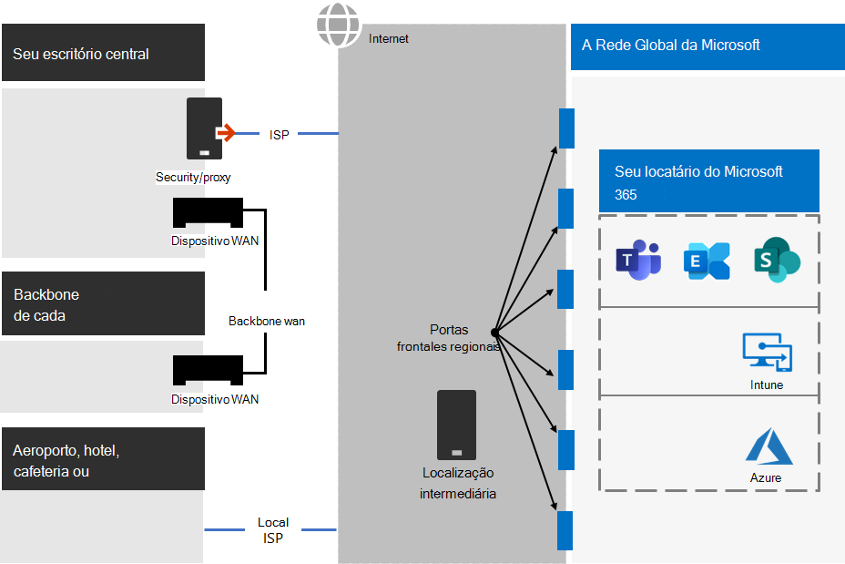
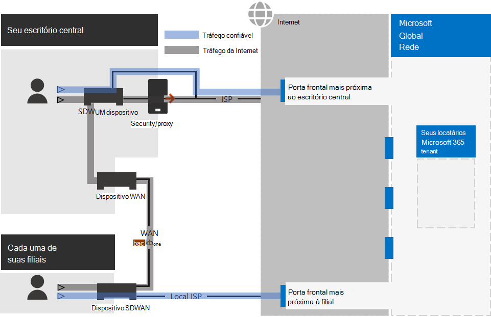
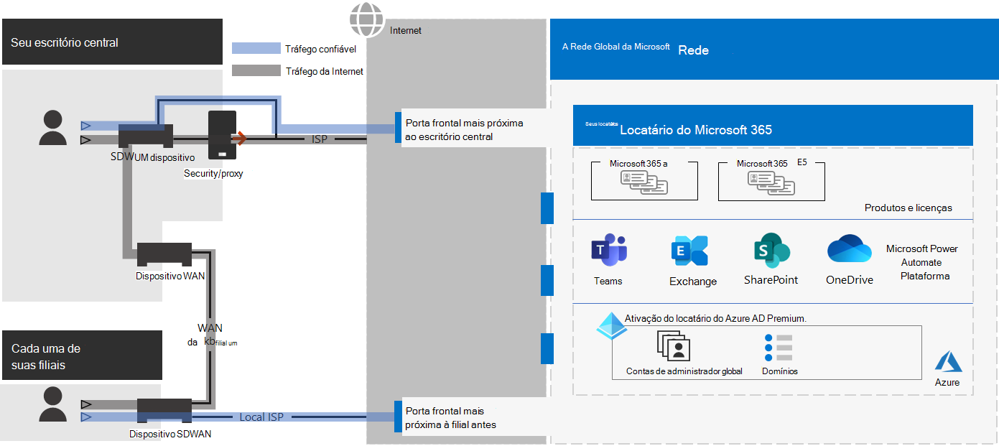

# Etapa 2.Step 2. Rede ideal para locatários do Microsoft 365 para empresasOptimal networking for your Microsoft 365 for enterprise tenants

O Microsoft 365 para empresas inclui aplicativos de produtividade na nuvem, como o Teams e o Exchange Online, e o Microsoft Intune, juntamente com muitos serviços de identidade e segurança do Microsoft Azure.Microsoft 365 for enterprise includes cloud productivity apps such as Teams and Exchange Online, and Microsoft Intune, along with many identity and security services of Microsoft Azure. Todos esses serviços baseados em nuvem dependem da segurança, do desempenho e da confiabilidade das conexões de dispositivos cliente em sua rede local ou em qualquer local na Internet.All of these cloud-based services rely on the security, performance, and reliability of connections from client devices on your on-premises network or any location on the Internet. 

Para otimizar o acesso à rede para seu locatário, você precisa:To optimize network access for your tenant, you need to:

- Otimize o caminho entre seus usuários locais e o local mais próximo da Rede Global da Microsoft.Optimize the path between your on-premises users and the closest location to the Microsoft Global Network.
- Otimize o acesso à Rede Global da Microsoft para seus usuários remotos que estão usando uma solução VPN de acesso remoto.Optimize access to the Microsoft Global Network for your remote users that are using a remote access VPN solution.
- Use o Network Insights para projetar o perímetro de rede para seus locais de escritório.Use Network Insights to design the network perimeter for your office locations.
- Otimize o acesso a ativos específicos hospedados em sites do SharePoint com a CDN do Office 365.Optimize access to specific assets hosted on SharePoint sites with the Office 365 CDN.
- Configure dispositivos de borda de rede e proxy para ignorar o processamento do tráfego confiável do Microsoft 365 com a lista de pontos de extremidade e automatizar a atualização da lista à medida que as alterações são feitas.Configure proxy and network edge devices to bypass processing for Microsoft 365 trusted traffic with the list of endpoints and automate the updating of the list as changes are made.

## Funcionários locais corporativosEnterprise on-premises workers

Para redes corporativas, você deve otimizar a experiência do usuário final habilitando o acesso de rede de melhor desempenho entre clientes e os pontos de extremidade mais próximos do Microsoft 365.For enterprise networks, you should optimize the end user experience by enabling the highest-performing network access between clients and the closest Microsoft 365 endpoints. A qualidade da experiência do usuário final está diretamente relacionada ao desempenho e à capacidade de resposta do aplicativo que o usuário está usando.The quality of end user experience is directly related to the performance and responsiveness of the application that the user is using. Por exemplo, o Microsoft Teams depende de baixa latência para que as chamadas telefônicas, conferências e colaborações de tela compartilhada do usuário não sejam falhas.For example, Microsoft Teams relies on low latency so that user phone calls, conferences and shared screen collaborations are glitch-free.

O principal objetivo no design de rede deve ser minimizar a latência reduzindo o tempo de ida e volta (RTT) dos dispositivos cliente para a Rede Global da Microsoft, o backbone de rede pública da Microsoft que interconecta todos os datacenters da Microsoft com baixa latência, pontos de entrada de aplicativos em nuvem de alta disponibilidade, conhecidos como portas frontal, espalhados pelo mundo.The primary goal in the network design should be to minimize latency by reducing the round-trip time (RTT) from client devices to the Microsoft Global Network, Microsoft's public network backbone that interconnects all of Microsoft's datacenters with low latency, high availability cloud application entry points, known as front doors, spread around the world.

Aqui está um exemplo de uma rede corporativa tradicional.Here is an example of a traditional enterprise network.

Nesta ilustração, as filiais se conectam a um escritório central por meio de dispositivos wan e backbone de WAN.In this illustration, branch offices connect to a central office through wide area network (WAN) devices and a WAN backbone. O acesso à Internet é por meio de um dispositivo proxy ou de segurança na borda de rede do escritório central e de um provedor de serviços de Internet (ISP).Internet access is through a security or proxy device at the network edge of the central office and an Internet service provider (ISP). Na Internet, a Rede Global da Microsoft tem uma série de portas frontales em regiões ao redor do mundo.On the Internet, the Microsoft Global Network has a series of front doors in regions around the world. As organizações também podem usar locais intermediários para processamento adicional de pacotes e segurança para o tráfego.Organizations can also use intermediate locations for additional packet processing and security for traffic. O locatário do Microsoft 365 de uma organização está localizado na Rede Global da Microsoft.An organization's Microsoft 365 tenant is located within the Microsoft Global Network.

Os problemas com essa configuração para os serviços de nuvem do Microsoft 365 são:The problems with this configuration for Microsoft 365 cloud services are:

- Para usuários em filiais, o tráfego é enviado para portas frontales não locais, aumentando a latência.For users in branch offices, traffic gets sent to non-local front doors, increasing latency.
- O envio de tráfego para locais intermediários cria hairpins de rede que executam processamento de pacotes duplicado em tráfego confiável, aumentando a latência.Sending traffic to intermediate locations create network hairpins that perform duplicate packet processing on trusted traffic, increasing latency.
- Os dispositivos de borda de rede executam processamento de pacotes não éneido e duplicado em tráfego confiável, aumentando a latência.Network edge devices perform unneeded and duplicate packet processing on trusted traffic, increasing latency.

Otimizar o desempenho de rede do Microsoft 365 não precisa ser complicado.Optimizing Microsoft 365 network performance doesn't need to be complicated. Você pode obter o melhor desempenho possível seguindo alguns princípios principais:You can get the best possible performance by following a few key principles:

- Identifique o tráfego de rede do Microsoft 365, que é um tráfego confiável destinado aos serviços de nuvem da Microsoft.Identify Microsoft 365 network traffic, which is trusted traffic destined to Microsoft cloud services.
- Permitir a saída de filial local do tráfego de rede do Microsoft 365 para a Internet de cada local onde os usuários se conectam ao Microsoft 365.Allow local branch egress of Microsoft 365 network traffic to the internet from each location where users connect to Microsoft 365.
- Evite hairpins de rede.Avoid network hairpins.
- Permitir que o tráfego do Microsoft 365 ignore proxies e dispositivos de inspeção de pacotes.Allow Microsoft 365 traffic to bypass proxies and packet inspection devices.

Se você implementar esses princípios, obterá uma rede corporativa otimizada para o Microsoft 365.If you implement these principles, you get an enterprise network optimized for Microsoft 365.

Nesta ilustração, as filiais têm sua própria conexão com a Internet por meio de um dispositivo WAN definido por software (SDWAN), que envia tráfego confiável do Microsoft 365 para a porta de entrada mais próxima regionalmente.In this illustration, branch offices have their own Internet connection through a software-defined WAN device (SDWAN) device, which sends trusted Microsoft 365 traffic to the regionally closest front door. No escritório central, o tráfego confiável do Microsoft 365 ignora a segurança ou o dispositivo proxy e os dispositivos intermediários não são mais usados.At the central office, trusted Microsoft 365 traffic bypasses the security or proxy device and intermediate devices are no longer used.

Veja como a configuração otimizada resolve os problemas de latência de uma rede corporativa tradicional:Here's are how the optimized configuration solves the latency issues of a traditional enterprise network:

- O tráfego confiável do Microsoft 365 ignora o backbone da WAN e é enviado para portas frontales locais para todos os escritórios, diminuindo a latência.Trusted Microsoft 365 traffic skips the WAN backbone and is sent to local front doors for all offices, decreasing latency.
- Hairpins de rede que executam processamento de pacotes duplicado são ignorados para o tráfego confiável do Microsoft 365, diminuindo a latência.Network hairpins that perform duplicate packet processing are skipped for Microsoft 365 trusted traffic, decreasing latency.
- Os dispositivos de borda de rede que executam o processamento de pacotes não éneido e duplicado são ignorados para o tráfego confiável do Microsoft 365, diminuindo a latência.Network edge devices that perform unneeded and duplicate packet processing are skipped for Microsoft 365 trusted traffic, decreasing latency.

Para saber mais, confira a visão geral da conectividade de rede do [Microsoft 365.](../enterprise/microsoft-365-networking-overview.md)For more information, see [Microsoft 365 network connectivity overview](../enterprise/microsoft-365-networking-overview.md).

## Trabalhadores remotosRemote workers

Se os seus funcionários remotos estiverem usando um cliente VPN tradicional para obter acesso remoto à rede da organização, verifique se o cliente VPN possui suporte para túnel dividido.If your remote workers are using a traditional VPN client to obtain remote access to your organization network, verify that the VPN client has split tunneling support. Sem o túnel dividido, todo o seu tráfego de trabalho remoto é enviado pela conexão VPN, onde deve ser encaminhado para os dispositivos de borda da sua organização, processado e enviado na Internet.Without split tunneling, all of your remote work traffic gets sent across the VPN connection, where it must be forwarded to your organization’s edge devices, get processed, and then sent on the Internet. Veja um exemplo.Here is an example.

Nesta ilustração, o tráfego do Microsoft 365 deve seguir uma rota indireta através de sua organização, que pode ser encaminhada para uma porta frontal da Rede Global da Microsoft distante do local físico do cliente VPN.In this illustration, Microsoft 365 traffic must take an indirect route through your organization, which could be forwarded to a Microsoft Global Network front door far away from the VPN client’s physical location. Esse caminho indireto adiciona latência ao tráfego da rede e diminui o desempenho geral.This indirect path adds latency to the network traffic and decreases overall performance. 

Com o túnel dividido, você pode configurar seu cliente VPN para impedir que tipos específicos de tráfego sejam enviados à rede da organização pela conexão VPN.With split tunneling, you can configure your VPN client to exclude specific types of traffic from being sent over the VPN connection to the organization network.

Para otimizar o acesso aos recursos de nuvem do Microsoft 365, configure seus clientes VPN de túnel dividido para excluir o tráfego nos pontos de extremidade do Microsoft 365 da categoria **Otimizar** pela conexão VPN.To optimize access to Microsoft 365 cloud resources, configure your split tunneling VPN clients to exclude traffic to the **Optimize** category Microsoft 365 endpoints over the VPN connection. Para saber mais, confira as categorias  de ponto de extremidade do [Office 365](../enterprise/microsoft-365-network-connectivity-principles.md#new-office-365-endpoint-categories) e as listas de pontos de extremidade de categoria Otimizar para túnel dividido.For more information, see [Office 365 endpoint categories](../enterprise/microsoft-365-network-connectivity-principles.md#new-office-365-endpoint-categories) and [the lists](../enterprise/microsoft-365-vpn-implement-split-tunnel.md#implement-vpn-split-tunneling) of Optimize category endpoints for split tunneling.

Este é o fluxo de tráfego resultante para o túnel dividido, no qual a maior parte do tráfego para aplicativos de nuvem do Microsoft 365 ignora a conexão VPN.Here is the resulting traffic flow for split tunneling, in which most of the traffic to Microsoft 365 cloud apps bypass the VPN connection.

Nesta ilustração, o cliente VPN envia e recebe o tráfego crucial do serviço de nuvem do Microsoft 365 diretamente pela Internet e para a porta frontal mais próxima da Rede Global da Microsoft.In this illustration, the VPN client sends and receives crucial Microsoft 365 cloud service traffic directly over the Internet and to the nearest front door into the Microsoft Global Network.

Para obter mais informações e orientações, confira [Otimizar a conectividade do Office 365 para usuários remotos usando o túnel dividido da VPN](../enterprise/microsoft-365-vpn-split-tunnel.md).For more information and guidance, see [Optimize Office 365 connectivity for remote users using VPN split tunneling](../enterprise/microsoft-365-vpn-split-tunnel.md).

## Usando o Network Insights (visualização)Using Network Insights (preview)

As informações de rede são métricas de desempenho coletadas do locatário do Microsoft 365 que ajudam você a projetar perímetros de rede para seus locais de escritório.Network insights are performance metrics collected from your Microsoft 365 tenant that help you design network perimeters for your office locations. Cada visão fornece detalhes ao vivo sobre as características de desempenho de um problema específico para cada local geográfico onde os usuários locais estão acessando seu locatário.Each insight provides live details about the performance characteristics for a specified issue for each geographic location where on-premises users are accessing your tenant.

Há duas percepções de rede no nível do locatário que podem ser mostradas para o locatário:There are two tenant level network insights that may be shown for the tenant:

- [Conexões amostradas do Exchange impactadas por problemas de conectividadeExchange sampled connections impacted by connectivity issues](../enterprise/office-365-network-mac-perf-insights.md#exchange-sampled-connections-impacted-by-connectivity-issues)
- [Conexões amostradas do SharePoint impactadas por problemas de conectividadeSharePoint sampled connections impacted by connectivity issues](../enterprise/office-365-network-mac-perf-insights.md#sharepoint-sampled-connections-impacted-by-connectivity-issues)

Estas são as informações de rede específicas para cada local de escritório:These are the specific network insights for each office location:

- [Saída de rede em backhauledBackhauled network egress](../enterprise/office-365-network-mac-perf-insights.md#backhauled-network-egress)
- [Melhor desempenho detectado para clientes próximos a vocêBetter performance detected for customers near you](../enterprise/office-365-network-mac-perf-insights.md#better-performance-detected-for-customers-near-you)
- [Uso de uma porta frontal de serviço do Exchange Online não idealUse of a non-optimal Exchange Online service front door](../enterprise/office-365-network-mac-perf-insights.md#use-of-a-non-optimal-exchange-online-service-front-door)
- [Uso de uma porta de frente de serviço do SharePoint Online não idealUse of a non-optimal SharePoint Online service front door](../enterprise/office-365-network-mac-perf-insights.md#use-of-a-non-optimal-sharepoint-online-service-front-door)
- [Baixa velocidade de download da porta frontal do SharePointLow download speed from SharePoint front door](../enterprise/office-365-network-mac-perf-insights.md#low-download-speed-from-sharepoint-front-door)
- [Saída de rede ideal do usuário da ChinaChina user optimal network egress](../enterprise/office-365-network-mac-perf-insights.md#china-user-optimal-network-egress)

>[!IMPORTANT]
>Insights de rede, recomendações de desempenho e avaliações no Centro de administração do Microsoft 365 estão atualmente no status de visualização.Network insights, performance recommendations and assessments in the Microsoft 365 Admin Center is currently in preview status. Ele só está disponível para locatários do Microsoft 365 que foram inscritos no programa de visualização de recursos.It is only available for Microsoft 365 tenants that have been enrolled in the feature preview program.

Para saber mais, confira [o Microsoft 365 Network Insights.](../enterprise/office-365-network-mac-perf-insights.md)For more information, see [Microsoft 365 Network Insights](../enterprise/office-365-network-mac-perf-insights.md).

## Desempenho do SharePoint com a CDN do Office 365SharePoint performance with the Office 365 CDN

Uma CDN (Rede de Distribuição de Conteúdo) baseada em nuvem permite reduzir o tempo de carregamento, economizar largura de banda e velocidade de resposta.A cloud-based Content Delivery Network (CDN) allows you to reduce load times, save bandwidth, and speed responsiveness. Uma CDN melhora o desempenho armazenando em cache ativos estáticos, como arquivos gráficos ou de vídeo, mais próximos dos navegadores que os solicitam, o que ajuda a acelerar os downloads e reduzir a latência.A CDN improves performance by caching static assets such as graphic or video files closer to the browsers requesting them, which helps to speed up downloads and reduce latency. Você pode usar a Rede de Distribuição de Conteúdo (CDN) interna do Office 365, incluída no SharePoint no Microsoft 365 E3 e E5, para hospedar ativos estáticos para fornecer melhor desempenho para suas páginas do SharePoint.You can use the built-in Office 365 Content Delivery Network (CDN), included with SharePoint in Microsoft 365 E3 and E5, to host static assets to provide better performance for your SharePoint pages.

A CDN do Office 365 é composta por várias CDNs que permitem que você hospede ativos estáticos em vários locais ou _origens_ e sirva-os de redes globais de alta velocidade.The Office 365 CDN is composed of multiple CDNs that allow you to host static assets in multiple locations, or _origins_, and serve them from global high-speed networks. Dependendo do tipo de conteúdo que você deseja hospedar na CDN  do Office 365, você pode adicionar origens públicas,  origens privadas ou ambas.Depending on the kind of content you want to host in the Office 365 CDN, you can add **public** origins, **private** origins, or both.

Quando implantada e configurada, a CDN do Office 365 carrega ativos de origens públicas e privadas e os disponibiliza para acesso rápido a usuários localizados na Internet.When deployed and configured, the Office 365 CDN uploads assets from public and private origins and makes them available for fast access to users located across the Internet.

Para saber mais, confira [Usar a CDN do Office 365 com o SharePoint Online.](../enterprise/use-microsoft-365-cdn-with-spo.md)For more information, see [Use the Office 365 CDN with SharePoint Online](../enterprise/use-microsoft-365-cdn-with-spo.md).

## Listagem automatizada de pontos de extremidadeAutomated endpoint listing

Para que seus clientes locais, dispositivos de borda e serviços de análise de pacotes baseados em nuvem ignorem o processamento de tráfego confiável do Microsoft 365, você deve configurá-los com o conjunto de pontos de extremidade (intervalos de endereços IP e nomes DNS) correspondentes aos serviços do Microsoft 365.To have your on-premises clients, edge devices, and cloud-based packet analysis services skip processing of trusted Microsoft 365 traffic, you must configure them with the set of endpoints (IP address ranges and DNS names) corresponding to Microsoft 365 services. Esses pontos de extremidade podem ser configurados manualmente em firewalls e outros dispositivos de segurança de borda, arquivos PAC para computadores cliente para ignorar proxies ou dispositivos SD-WAN em filiais.These endpoints can be manually configured in firewalls and other edge security devices, PAC files for client computers to bypass proxies, or SD-WAN devices at branch offices. No entanto, os pontos de extremidade mudam ao longo do tempo, exigindo manutenção manual contínua das listas de pontos de extremidade nesses locais.However, the endpoints change over time, requiring ongoing manual maintenance of the endpoint lists in these locations.

Para automatizar a listagem e o gerenciamento de alterações para os pontos de extremidade do Microsoft 365 em seus arquivos PAC do cliente e dispositivos de rede, use o endereço IP do [Office 365](../enterprise/microsoft-365-ip-web-service.md)e o serviço Web baseado em REST de URL.To automate the listing and change management for Microsoft 365 endpoints in your client PAC files and network devices, use the [Office 365 IP Address and URL REST-based web service](../enterprise/microsoft-365-ip-web-service.md). Esse serviço ajuda a identificar e diferenciar melhor o tráfego de rede do Microsoft 365, facilitando a avaliação, a configuração e a se manter atualizado com as alterações mais recentes.This service helps you better identify and differentiate Microsoft 365 network traffic, making it easier for you to evaluate, configure, and stay current with the latest changes.

Você pode usar o PowerShell, Python ou outras linguagens para determinar as alterações nos pontos de extremidade ao longo do tempo e configurar seus arquivos PAC e dispositivos de rede de borda.You can use PowerShell, Python, or other languages to determine the changes to endpoints over time and configure your PAC files and edge network devices.

O processo básico é:The basic process is:

1. Use o endereço IP do Office 365 e o serviço Web de URL e o mecanismo de configuração de sua escolha para configurar seus arquivos PAC e dispositivos de rede com o conjunto atual de pontos de extremidade do Microsoft 365.Use the Office 365 IP Address and URL web service and the configuration mechanism of your choice to configure your PAC files and network devices with the current set of Microsoft 365 endpoints.
2. Execute uma recorrente diária para verificar se há alterações nos pontos de extremidade ou use um método de notificação.Run a daily recurring to check for changes in the endpoints or use a notification method.
3. Quando as alterações são detectadas, regenere e redistribua o arquivo PAC para computadores cliente e faça as alterações em seus dispositivos de rede.When changes are detected, regenerate and redistribute the PAC file for client computers and make the changes to your network devices.

Para saber mais, confira o endereço [IP do Office 365 e o serviço Web de URL.](../enterprise/microsoft-365-ip-web-service.md)For more information, see [Office 365 IP Address and URL web service](../enterprise/microsoft-365-ip-web-service.md).

## Resultados da Etapa 2Results of Step 2

Para o locatário do Microsoft 365 com rede ideal, você determinou:For your Microsoft 365 tenant with optimal networking, you have determined:

- Como otimizar o desempenho da rede para usuários locais adicionando conexões com a Internet a todas as filiais e eliminando hairpins de rede.How to optimize network performance for on-premises users by adding Internet connections to all branch offices and eliminating network hairpins.
- Como implementar a listagem automatizada de pontos de extremidade confiáveis para seus arquivos PAC baseados no cliente e seus dispositivos e serviços de rede, incluindo atualizações contínuas (mais adequadas para redes corporativas).How to implement automated trusted endpoint listing for your client-based PAC files and your network devices and services, including ongoing updates (most suitable for enterprise networks).
- Como dar suporte ao acesso de funcionários remotos a recursos locais.How to support the access of remote workers to on-premises resources.
- Como usar o Network InsightsHow to use Network Insights
- Como implantar a CDN do Office 365.How to deploy the Office 365 CDN.

Aqui está um exemplo de uma organização corporativa e seu locatário com rede ideal.Here is an example of an enterprise organization and its tenant with optimal networking.

[Ver uma versão maior desta imagemSee a larger version of this image](https://github.com/MicrosoftDocs/microsoft-365-docs/raw/public/microsoft-365/media/tenant-management-overview/tenant-management-tenant-build-step2.png)

Nesta ilustração, o locatário dessa organização corporativa tem:In this illustration, the tenant for this enterprise organization has:

- Acesso à Internet local para cada filial com um dispositivo SDWAN que encaminha o tráfego confiável do Microsoft 365 para uma porta frontal local.Local internet access for each branch office with an SDWAN device that forwards trusted Microsoft 365 traffic to a local front door.
- Sem hairpins de rede.No network hairpins.
- Dispositivos de borda proxy e de segurança do escritório central que encaminham o tráfego confiável do Microsoft 365 para uma porta frontal local.Central office security and proxy edge devices that forward Microsoft 365 trusted traffic to a local front door.

## Manutenção contínua para rede idealOngoing maintenance for optimal networking

Em uma base contínua, talvez seja necessário:On an ongoing basis, you might need to:

- Atualize seus dispositivos de borda e implantou arquivos PAC para alterações nos pontos de extremidade ou verifique se o processo automatizado funciona corretamente.Update your edge devices and deployed PAC files for changes in endpoints or verify that your automated process works properly.
- Gerencie seus ativos na CDN do Office 365.Manage your assets in the Office 365 CDN.
- Atualize a configuração de túnel dividido em seus clientes VPN para alterações nos pontos de extremidade.Update the split tunneling configuration in your VPN clients for changes in endpoints.

## Próxima etapaNext step

Continue com [a identidade](tenant-management-identity.md) para sincronizar suas contas e grupos locais e impor logins de usuário seguros.Continue with [identity](tenant-management-identity.md) to synchronize your on-premises accounts and groups and enforce secure user sign-ins.
