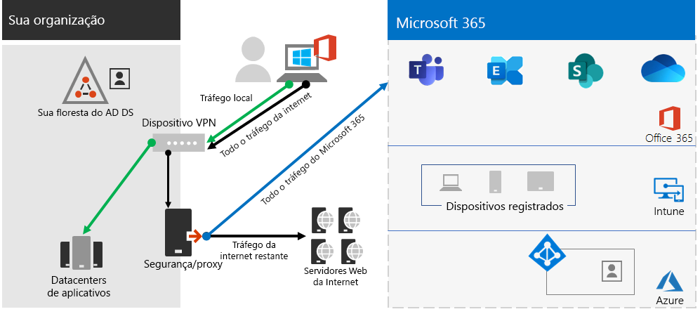

# Etapa 2. Rede ideal para sua Microsoft 365 para locatários corporativos

Microsoft 365 para empresas inclui aplicativos de produtividade na nuvem, como Teams e Exchange Online e Microsoft Intune, juntamente com muitos serviços de identidade e segurança do Microsoft Azure. Todos esses serviços baseados em nuvem dependem da segurança, desempenho e confiabilidade das conexões de dispositivos cliente em sua rede local ou em qualquer local na Internet. 

Para otimizar o acesso à rede para seu locatário, você precisa:

- Otimize o caminho entre seus usuários locais e o local mais próximo da Rede Global da Microsoft.
- Otimize o acesso à Rede Global da Microsoft para seus usuários remotos que estão usando uma solução VPN de acesso remoto.
- Use o network Insights para projetar o perímetro de rede para seus locais de escritório.
- Otimize o acesso a ativos específicos hospedados SharePoint sites com o Office 365 CDN.
- Configure dispositivos de borda de rede e proxy para ignorar o processamento para Microsoft 365 tráfego confiável com a lista de pontos de extremidade e automatizar a atualização da lista à medida que as alterações são feitas.

## Enterprise trabalhadores locais

Para redes corporativas, você deve otimizar a experiência do usuário final habilitando o acesso de rede de melhor desempenho entre clientes e os pontos de extremidade Microsoft 365 mais próximos. A qualidade da experiência do usuário final está diretamente relacionada ao desempenho e à capacidade de resposta do aplicativo que o usuário está usando. Por exemplo, Microsoft Teams conta com baixa latência para que as chamadas de telefone do usuário, conferências e colaborações de tela compartilhada sejam livres de falhas.

O objetivo principal no design de rede deve ser minimizar a latência, reduzindo o tempo de ida e volta (RTT) de dispositivos cliente para a Rede Global da Microsoft, o backbone de rede pública da Microsoft que interconecta todos os datacenters da Microsoft com baixa latência, pontos de entrada de aplicativo de nuvem de alta disponibilidade, conhecidos como portas de entrada, espalhados pelo mundo.

Aqui está um exemplo de uma rede empresarial tradicional.

Nesta ilustração, as filiais se conectam a um escritório central por meio de dispositivos WAN (rede de ampla área) e um backbone wan. O acesso à Internet é por meio de um dispositivo de segurança ou proxy na borda da rede do escritório central e de um provedor de serviços da Internet (ISP). Na Internet, a Rede Global da Microsoft tem uma série de portas da frente em regiões ao redor do mundo. As organizações também podem usar locais intermediários para processamento de pacotes adicionais e segurança para o tráfego. O locatário Microsoft 365 de uma organização está localizado dentro da Rede Global da Microsoft.

Os problemas com essa configuração para Microsoft 365 de nuvem são:

- Para usuários em filiais, o tráfego é enviado para portas não locais, aumentando a latência.
- O envio de tráfego para locais intermediários cria hairpins de rede que executam o processamento de pacotes duplicados em tráfego confiável, aumentando a latência.
- Os dispositivos de borda de rede executam o processamento de pacotes não precisa e duplicado em tráfego confiável, aumentando a latência.

A otimização Microsoft 365 desempenho de rede não precisa ser complicada. Você pode obter o melhor desempenho possível seguindo alguns princípios-chave:

- Identifique Microsoft 365 tráfego de rede, que é tráfego confiável destinado aos serviços de nuvem da Microsoft.
- Permitir saída de filial local Microsoft 365 tráfego de rede para a Internet de cada local onde os usuários se conectam Microsoft 365.
- Evite hairpins de rede.
- Permitir Microsoft 365 tráfego para ignorar proxies e dispositivos de inspeção de pacotes.

Se você implementar esses princípios, você obterá uma rede corporativa otimizada para Microsoft 365.

Nesta ilustração, as filiais têm sua própria conexão com a Internet por meio de um dispositivo WAN (SDWAN) definido por software, que envia tráfego confiável Microsoft 365 para a porta frontal regionalmente mais próxima. No escritório central, o tráfego Microsoft 365 ignora o dispositivo de segurança ou proxy e os dispositivos intermediários não são mais usados.

Veja como a configuração otimizada resolve os problemas de latência de uma rede corporativa tradicional:

- O Microsoft 365 tráfego confiável ignora o backbone wan e é enviado para portas front locais para todos os escritórios, diminuindo a latência.
- Os hairpins de rede que executam o processamento de pacotes duplicados são ignorados Microsoft 365 tráfego confiável, diminuindo a latência.
- Os dispositivos de borda de rede que executam o processamento de pacotes não precisas e duplicados são ignorados Microsoft 365 tráfego confiável, diminuindo a latência.

Para obter mais informações, [consulte Microsoft 365 de conectividade de rede.](../enterprise/microsoft-365-networking-overview.md)

## Trabalhadores remotos

Se os seus funcionários remotos estiverem usando um cliente VPN tradicional para obter acesso remoto à rede da organização, verifique se o cliente VPN possui suporte para túnel dividido. Sem o túnel dividido, todo o seu tráfego de trabalho remoto é enviado pela conexão VPN, onde deve ser encaminhado para os dispositivos de borda da sua organização, processado e enviado na Internet. Veja um exemplo.

Nesta ilustração, Microsoft 365 tráfego deve fazer uma rota indireta pela sua organização, que pode ser encaminhada para uma porta da frente da Rede Global da Microsoft muito longe da localização física do cliente VPN. Esse caminho indireto adiciona latência ao tráfego da rede e diminui o desempenho geral. 

Com o túnel dividido, você pode configurar seu cliente VPN para impedir que tipos específicos de tráfego sejam enviados à rede da organização pela conexão VPN.

Para otimizar o acesso aos recursos de nuvem do Microsoft 365, configure seus clientes VPN de túnel dividido para excluir o tráfego nos pontos de extremidade do Microsoft 365 da categoria **Otimizar** pela conexão VPN. Para obter mais informações, [consulte Office 365 categorias](../enterprise/microsoft-365-network-connectivity-principles.md#new-office-365-endpoint-categories) de ponto de extremidade e [as listas](../enterprise/microsoft-365-vpn-implement-split-tunnel.md#implement-vpn-split-tunneling) de pontos de extremidade de categoria Otimizar para tunelamento dividido.

Aqui está o fluxo de tráfego resultante para o túnel dividido, no qual a maior parte do tráfego para Microsoft 365 de nuvem ignoram a conexão VPN.

Nesta ilustração, o cliente VPN envia e recebe tráfego de serviço de nuvem Microsoft 365 diretamente pela Internet e para a porta da frente mais próxima para a Rede Global da Microsoft.

Para obter mais informações e orientações, confira [Otimizar a conectividade do Office 365 para usuários remotos usando o túnel dividido da VPN](../enterprise/microsoft-365-vpn-split-tunnel.md).

## Usando o Insights de rede (visualização)

As percepções de rede são métricas de desempenho coletadas do seu locatário Microsoft 365 que ajudam você a projetar perímetros de rede para seus locais de escritório. Cada insight fornece detalhes ao vivo sobre as características de desempenho de um problema especificado para cada local geográfico em que os usuários locais estão acessando seu locatário.

Há duas percepções de rede de nível de locatário que podem ser mostradas para o locatário:

- [Exchange conexões amostradas impactadas por problemas de conectividade](../enterprise/office-365-network-mac-perf-insights.md#exchange-sampled-connections-impacted-by-connectivity-issues)
- [SharePoint conexões amostradas impactadas por problemas de conectividade](../enterprise/office-365-network-mac-perf-insights.md#sharepoint-sampled-connections-impacted-by-connectivity-issues)

Estas são as percepções de rede específicas para cada local do office:

- [Saída de rede com backhauled](../enterprise/office-365-network-mac-perf-insights.md#backhauled-network-egress)
- [Melhor desempenho detectado para clientes próximos a você](../enterprise/office-365-network-mac-perf-insights.md#better-performance-detected-for-customers-near-you)
- [Uso de uma porta de Exchange Online de serviço não ideal](../enterprise/office-365-network-mac-perf-insights.md#use-of-a-non-optimal-exchange-online-service-front-door)
- [Uso de uma porta de entrada de serviço SharePoint Online não ideal](../enterprise/office-365-network-mac-perf-insights.md#use-of-a-non-optimal-sharepoint-online-service-front-door)
- [Baixa velocidade de download SharePoint porta da frente](../enterprise/office-365-network-mac-perf-insights.md#low-download-speed-from-sharepoint-front-door)
- [Saída de rede ideal do usuário da China](../enterprise/office-365-network-mac-perf-insights.md#china-user-optimal-network-egress)

> [!IMPORTANT]
> Percepções de rede, recomendações de desempenho e avaliações no centro Administração Microsoft 365 no momento está em status de visualização. Ele só está disponível para Microsoft 365 locatários que foram inscritos no programa de visualização de recursos.

Para obter mais informações, [consulte Microsoft 365 Network Insights](../enterprise/office-365-network-mac-perf-insights.md).

## SharePoint desempenho com a Office 365 CDN

Um sistema baseado em nuvem Rede de Distribuição de Conteúdo (CDN) permite reduzir os tempos de carga, economizar largura de banda e velocidade de resposta. Um CDN melhora o desempenho armazenando ativos estáticos, como arquivos gráficos ou de vídeo, mais próximos dos navegadores que os solicitam, o que ajuda a acelerar os downloads e reduzir a latência. Você pode usar o Office 365 Rede de Distribuição de Conteúdo (CDN) integrado, incluído no SharePoint no Microsoft 365 E3 e no E5, para hospedar ativos estáticos para fornecer melhor desempenho para suas páginas SharePoint.

A CDN do Office 365 é composta por várias CDNs que permitem que você hospede ativos estáticos em vários locais ou _origens_ e sirva-os de redes globais de alta velocidade. Dependendo do tipo de conteúdo que você deseja hospedar no  Office 365 CDN, você pode adicionar origens públicas,  origens privadas ou ambos.

Quando implantado e configurado, o Office 365 CDN carrega ativos de origens públicas e privadas e os disponibiliza para acesso rápido aos usuários localizados na Internet.

Para obter mais informações, [consulte Use the Office 365 CDN with SharePoint Online](../enterprise/use-microsoft-365-cdn-with-spo.md).

## Listagem automatizada de pontos de extremidade

Para que seus clientes locais, dispositivos de borda e serviços de análise de pacotes baseados em nuvem ignorem o processamento do tráfego de Microsoft 365 confiáveis, você deve configurá-los com o conjunto de pontos de extremidade (intervalos de endereço IP e nomes DNS) correspondentes aos serviços Microsoft 365. Esses pontos de extremidade podem ser configurados manualmente em firewalls e outros dispositivos de segurança de borda, arquivos PAC para computadores cliente para ignorar proxies ou dispositivos SD-WAN em filiais. No entanto, os pontos de extremidade mudam ao longo do tempo, exigindo manutenção manual contínua das listas de pontos de extremidade nesses locais.

Para automatizar a listagem e o gerenciamento de alterações para Microsoft 365 pontos de extremidade em seus arquivos pac cliente e dispositivos de rede, use o endereço IP Office 365 e o serviço Web baseado em [URL REST.](../enterprise/microsoft-365-ip-web-service.md) Esse serviço ajuda você a identificar e diferenciar melhor Microsoft 365 tráfego de rede, facilitando a avaliação, a configuração e a manutenção das alterações mais recentes.

Você pode usar o PowerShell, Python ou outros idiomas para determinar as alterações nos pontos de extremidade ao longo do tempo e configurar seus arquivos PAC e dispositivos de rede de borda.

O processo básico é:

1. Use o Office 365 endereço IP e o serviço Web de URL e o mecanismo de configuração de sua escolha para configurar seus arquivos PAC e dispositivos de rede com o conjunto atual de pontos de extremidade Microsoft 365.
2. Execute uma recorrente diária para verificar se há alterações nos pontos de extremidade ou usar um método de notificação.
3. Quando as alterações são detectadas, regenere e redistribua o arquivo PAC para computadores cliente e faça as alterações em seus dispositivos de rede.

Para obter mais informações, [consulte Office 365 Ip Address and URL web service](../enterprise/microsoft-365-ip-web-service.md).

## Resultados da Etapa 2

Para seu Microsoft 365 locatário com rede ideal, você determinou:

- Como otimizar o desempenho da rede para usuários locais adicionando conexões à Internet a todas as filiais e eliminando os hairpins de rede.
- Como implementar a listagem de ponto de extremidade confiável automatizada para seus arquivos PAC baseados em cliente e seus dispositivos e serviços de rede, incluindo atualizações contínuas (mais adequadas para redes corporativas).
- Como dar suporte ao acesso de funcionários remotos a recursos locais.
- Como usar a rede Insights
- Como implantar o Office 365 CDN.

Aqui está um exemplo de uma organização corporativa e seu locatário com rede ideal.

[Consulte uma versão maior dessa imagem](https://github.com/MicrosoftDocs/microsoft-365-docs/raw/public/microsoft-365/media/tenant-management-overview/tenant-management-tenant-build-step2.png)

Nesta ilustração, o locatário dessa organização corporativa tem:

- Acesso à Internet local para cada filial com um dispositivo SDWAN que encaminha o tráfego Microsoft 365 confiável para uma porta da frente local.
- Sem hairpins de rede.
- Dispositivos de borda de proxy e segurança do escritório central que encaminham Microsoft 365 tráfego confiável para uma porta da frente local.

## Manutenção contínua para rede ideal

Em uma base contínua, talvez seja necessário:

- Atualize seus dispositivos de borda e implantou arquivos PAC para alterações nos pontos de extremidade ou verifique se o processo automatizado funciona corretamente.
- Gerencie seus ativos no Office 365 CDN.
- Atualize a configuração de túnel dividido em seus clientes VPN para alterações nos pontos de extremidade.

## Próxima etapa

Continue com [a identidade](tenant-management-identity.md) para sincronizar suas contas e grupos locais e impor as logins seguras do usuário.
