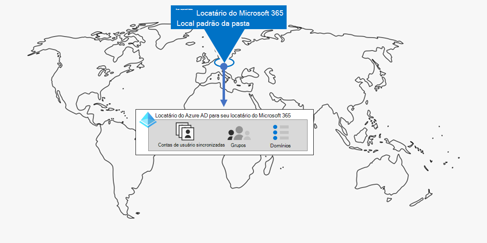
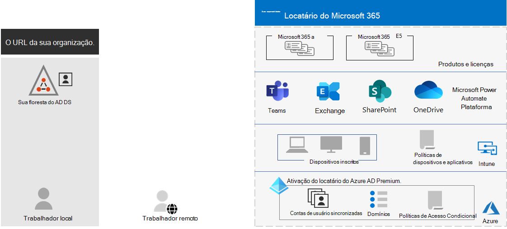

# Gerenciamento de locatários do Microsoft 365 para empresasTenant management for Microsoft 365 for enterprise

Criar um caminho para a transformação digital da sua organização com a computação em nuvem requer uma base sólida na qual seus funcionários podem confiar em produtividade, colaboração, desempenho, privacidade, conformidade e segurança.Creating a path to your organization's digital transformation with cloud computing requires a firm foundation upon which your workers can rely for productivity, collaboration, performance, privacy, compliance, and security.

A configuração correta dos locatários do Microsoft 365 fornece essa base, deixando os funcionários focados na execução do trabalho e no departamento de TI a fim de se concentrar nas soluções de ponta a ponta que fornecem valor comercial adicional.Correct configuration of your Microsoft 365 tenants provides that foundation, leaving your workers to focus on getting their work done and your IT department to focus on end-to-end solutions that provide additional business value. 

Esta solução o leva até a configuração dessa base nestas etapas:This solution takes you through the configuration of that foundation in these steps:

1. Determinar seus locatáriosDetermine your tenants
2. Otimizar sua redeOptimize your networking
3. Sincronizar suas identidades e impor logins segurosSynchronize your identities and enforce secure sign-ins
4. Migrar seus dispositivos Windows, clientes do Office e servidores e dados locais do OfficeMigrate your Windows devices, Office clients, and on-premises Office servers and data
5. Implantar o gerenciamento de dispositivos e aplicativosDeploy device and app management

Mas primeiro, vamos dar um tempo para entender o que é um locatário e a aparência de um locatário que fornece uma base sólida.But first, let's take a moment to understand what a tenant is and what a tenant that provides a firm foundation looks like.

## Um locatário do Microsoft 365 definidoA Microsoft 365 tenant defined

Um locatário do Microsoft 365 é uma instância dedicada dos serviços do Microsoft 365 e os dados da sua organização armazenados em um local padrão específico, como a Europa ou a América do Norte.A Microsoft 365 tenant is a dedicated instance of the services of Microsoft 365 and your organization data stored within a specific default location, such as Europe or North America. Esse local é especificado quando você cria o locatário para sua organização.This location is specified when you create the tenant for your organization. Cada locatário do Microsoft 365 é distinto, exclusivo e separado de todos os outros locatários do Microsoft 365.Each Microsoft 365 tenant is distinct, unique, and separate from all other Microsoft 365 tenants. Você cria um locatário do Microsoft 365 quando compra um ou mais produtos da Microsoft, como o Microsoft 365 E3 ou E5, e um conjunto de licenças para cada um.You create a Microsoft 365 tenant when you purchase one or more products from Microsoft, such as Microsoft 365 E3 or E5, and a set of licenses for each.

Seu locatário do Microsoft 365 também inclui um locatário do Azure Active Directory (Azure AD), que é uma instância dedicada do Azure AD para contas de usuário, grupos e outros objetos.Your Microsoft 365 tenant also includes an Azure Active Directory (Azure AD) tenant, which is a dedicated instance of Azure AD for user accounts, groups, and other objects. Cada locatário do Azure AD é distinto, exclusivo e separado de todos os outros locatários do Azure AD.Each Azure AD tenant is distinct, unique, and separate from all other Azure AD tenants. Embora sua organização possa ter vários locatários do Azure AD que você pode configurar com assinaturas do Azure, os locatários do Microsoft 365 só podem usar um único locatário do Azure AD, aquele que foi criado quando você criou o locatário.While your organization can have multiple Azure AD tenants that you can set up with Azure subscriptions, Microsoft 365 tenants can only use a single Azure AD tenant, the one that was created when you created the tenant. 

Veja um exemplo:Here is an example:

*O gerenciamento de* locatários é o planejamento, a implantação e a operação contínua dos locatários do Microsoft 365.*Tenant management* is the planning, deployment, and ongoing operation of your Microsoft 365 tenants. 

## Atributos de um locatário bem projetado e operacionalAttributes of a well-designed and operating tenant

Além do nome e do local corretos para seu locatário, há elementos adicionais para planejar, implantar e gerenciar para garantir que suas experiências de usuário com aplicativos de produtividade na nuvem, como o Microsoft Teams e o Exchange Online, sejam eficazes, seguras e &mdash; &mdash; eficazes.Beyond the correct name and location for your tenant, there are additional elements to plan, deploy, and manage to ensure that your user experiences with cloud productivity apps&mdash;such as Microsoft Teams and Exchange Online&mdash;are effective, secure, and performant.

Aqui estão os elementos:Here are the elements:

- Você tem o conjunto correto de produtos (assinaturas) e licenças.You have the correct set of products (subscriptions) and licenses.
  - O conjunto de produtos combina com suas necessidades comerciais, de IT e de segurança.The set of products match your business, IT, and security needs.
  - Há um número adequado de licenças para seus funcionários e alterações previstas no pessoal.There is an adequate number of licenses for your workers and anticipated changes in staffing.
- Para rede:For networking:
  - Você configurou os nomes de domínio DNS corretos.You have configured the correct DNS domain names.
  - Para redes corporativas, você otimizou o tráfego de rede para a rede da Microsoft para funcionários no local.For enterprise networks, you have optimized network traffic to the Microsoft network for onsite workers.
  - Você otimizou o tráfego de rede para funcionários remotos que estão usando um cliente VPN.You have optimized network traffic for remote workers who are using a VPN client.
- Você sincronizou suas contas, grupos e outros objetos do Active Directory Domain Services (AD DS).You have synchronized your Active Directory Domain Services (AD DS) accounts, groups, and other objects.
  - Suas contas de locatário do Azure AD são mapeadas para caixas de correio do Exchange Online com os domínios DNS corretos para endereços de email.Your Azure AD tenant accounts are mapped to Exchange Online mailboxes with the correct DNS domains for email addresses.
  - Suas contas de usuário foram atribuídas com as licenças corretas dos produtos comprados corretos (como o Microsoft 365 E3 ou E5).Your user accounts have been assigned the correct licenses from the correct purchased products (such as Microsoft 365 E3 or E5).
- Você configurou um gerenciamento forte de identidade e acesso.You have configured strong identity and access management.
  - Você está exigindo uma conexão de usuário segura com autenticação sem senha ou multifafação (MFA).You are requiring secure user sign-in with passwordless or multi-factor authentication (MFA).
  - Você tem políticas de Acesso Condicional que impõem restrições e requisitos de entrada para níveis mais altos de segurança.You have Conditional Access policies that enforce sign-in requirements and restrictions for higher levels of security.
- Os servidores locais do Office e seus dados foram migrados para aplicativos de nuvem ou estão sendo usados em uma configuração híbrida.On-premises Office servers and their data have been migrated to cloud apps or are being used in a hybrid configuration.
- Você está fazendo o gerenciamento de dispositivos com o Intune ou o Basic Mobility and Security integrados ao Microsoft 365.You are doing device management with Intune or Basic Mobility and Security built into Microsoft 365.
  - Os dispositivos de propriedade da sua organização são inscritos e gerenciados.Your organization-owned devices are enrolled and managed.
  - Os aplicativos para dispositivos pessoais são gerenciados.The apps for personal devices are managed.

Aqui está um exemplo de um locatário do Microsoft 365 com todos esses elementos no local.Here is an example of a Microsoft 365 tenant with all these elements in place.

Nesta ilustração, o locatário do Microsoft 365 inclui:In this illustration, the Microsoft 365 tenant includes:

- Produtos e licenças para o Microsoft 365 E3 e E5.Products and licenses for Microsoft 365 E3 and E5.
- Aplicativos de produtividade do Microsoft 365.Microsoft 365 productivity apps.
- Intune com dispositivos inscritos e políticas de dispositivos e aplicativos.Intune with enrolled devices and device and application policies.
- Um locatário do Azure AD que sincronizou a conta de usuário (grupos e outros objetos de diretório não são mostrados), domínios e políticas de Acesso Condicional.An Azure AD tenant that has synchronized user account (groups and other directory objects are not shown), domains, and Conditional Access policies.

## Recursos de locatário do Microsoft 365 para empresasTenant capabilities for Microsoft 365 for enterprise

As seções e tabelas a seguir listam os principais recursos e licenciamento para as etapas desta solução.The following sections and table list the key capabilities and licensing for the steps in this solution.

### TenantTenant

| Capcidade ou recursoCapability or feature | DescriçãoDescription | LicençasLicensing |
|:-------|:-----|:-------|
| Vários locatáriosMultiple tenants | Cada locatário do Microsoft 365 é distinto, exclusivo e separado de todos os outros locatários do Microsoft 365.Each Microsoft 365 tenant is distinct, unique, and separate from all other Microsoft 365 tenants. Com vários locatários, há restrições e considerações adicionais ao gerenciar e fornecer serviços aos usuários.With multiple tenants, there are restrictions and additional considerations when managing them and providing services to your users. | Microsoft 365 E3 ou E5Microsoft 365 E3 or E5 | 
| Migração de caixa de correio entre locatáriosCross-tenant mailbox migration | Os administradores de locatários podem mover caixas de correio entre locatários com dependências mínimas de infraestrutura em seus sistemas locais.Tenant administrators can move mailboxes between tenants with minimal infrastructure dependencies in their on-premises systems. Isso elimina a necessidade de remoção e integração de caixas de correio.This removes the need to off-board and onboard mailboxes. | Microsoft 365 E3 ou E5Microsoft 365 E3 or E5 | 
| Multi-GeoMulti-Geo | Seu locatário pode armazenar dados em repouso em outras localizações geográficas do datacenter que você escolheu para atender aos requisitos de residência de dados.Your tenant can store data at rest in the other datacenter geo locations that you've chosen to meet data residency requirements. | Microsoft 365 E3 ou E5Microsoft 365 E3 or E5 | 
| Mover os dados principais para um novo datacenter geoMove core data to a new datacenter geo | À medida que a Microsoft adiciona novas áreas geográficas de datacenter para capacidade adicional e recursos de computação, você pode solicitar uma movimentação geográfica de datacenter para residência de dados na área geográfica dos dados principais do cliente.As Microsoft adds new datacenter geos for additional capacity and compute resources, you can request a datacenter geo move for in-geo data residency for your core customer data. | Microsoft 365 E3 ou E5Microsoft 365 E3 or E5 | 
||||

### RedeNetworking

| Capcidade ou recursoCapability or feature | DescriçãoDescription | LicençasLicensing |
|:-------|:-----|:-------|
| Network InsightsNetwork Insights | Métricas de desempenho de rede coletadas do locatário do Microsoft 365 para ajudá-lo a projetar perímetros de rede para seus locais de escritório.Network performance metrics collected from your Microsoft 365 tenant to help you design network perimeters for your office locations. | Microsoft 365 E3 ou E5Microsoft 365 E3 or E5 | 
| Automatizar atualizações de ponto de extremidadeAutomate endpoint updates | Automatize a configuração e as atualizações contínuas dos pontos de extremidade do Microsoft 365 em seus arquivos PAC do cliente e dispositivos e serviços de rede.Automate the configuration and ongoing updates for Microsoft 365 endpoints in your client PAC files and network devices and services. | Microsoft 365 E3 ou E5Microsoft 365 E3 or E5 | 
||||

### IdentidadeIdentity

| Capcidade ou recursoCapability or feature | DescriçãoDescription | LicençasLicensing |
|:-------|:-----|:-------|
| Sincronizar os Serviços de Domínio do Active Directory (AD DS) local com seu locatário do Azure ADSynchronize on-premises Active Directory Domain Services (AD DS) with your Azure AD tenant    | Aproveite seu provedor de identidade local para contas de usuário, grupos e outros objetos.Leverage your on-premises identity provider for user accounts, groups, and other objects. | Microsoft 365 E3 ou E5Microsoft 365 E3 or E5 |
| MFA imposta com padrões de segurançaMFA enforced with security defaults   | Proteja-se contra os dispositivos e identidades comprometidos exigindo uma segunda forma de autenticação para as entradas. O padrão de segurança exige MFA para todas as contas de usuário.Protect against compromised identities and devices by requiring a second form of authentication for sign-ins. Security defaults requires MFA for all user accounts.   | Microsoft 365 E3 ou E5Microsoft 365 E3 or E5 |
| MFA imposta com Acesso CondicionalMFA enforced with Conditional Access| Exigir MFA com base nos atributos da entrada com políticas de Acesso Condicional.Require MFA based on the attributes of the sign-in with Conditional Access policies.    | Microsoft 365 E3 ou E5Microsoft 365 E3 or E5 | 
| MFA imposta com Acesso Condicional baseado em riscoMFA enforced with risk-based Conditional Access   | Exija MFA com base no risco de o usuário entrar no Microsoft Defender para Identidade.Require MFA based on the risk of the user sign-in with Microsoft Defender for Identity. | Microsoft 365 E5 ou E3 com as licenças do Azure AD Premium P2Microsoft 365 E5 or E3 with Azure AD Premium P2 licenses | 
| Redefinição de Senha por autoatendimento (SSPR)Self-Service Password Reset (SSPR)    | Permita que os usuários redefinam ou desbloqueiem suas contas ou senhas.Allow your users to reset or unlock their passwords or accounts.  | Microsoft 365 E3 ou E5Microsoft 365 E3 or E5 |
||||

### MigraçãoMigration

| Capcidade ou recursoCapability or feature | DescriçãoDescription | LicençasLicensing |
|:-------|:-----|:-------|
| Migrar para o Windows 10Migrate to Windows 10 | Migre seus dispositivos que executem o Windows 7 ou o Windows 8.1 para o Windows 10 Enterprise.Migrate your devices that run Windows 7 or Windows 8.1 to Windows 10 Enterprise. | Licenças do Windows 10 Enterprise incluídas no Microsoft 365 E3 ou E5Windows 10 Enterprise licenses included with Microsoft 365 E3 or E5 | 
| Migrar para o Microsoft 365 Apps para empresasMigrate to Microsoft 365 Apps for enterprise | Migre seus aplicativos cliente do Office, como Word e PowerPoint, para as versões instaladas da nuvem que são atualizadas com novos recursos.Migrate your Office client apps such as Word and PowerPoint to the versions installed from the cloud that are updated with new features. | Microsoft 365 E3 ou E5Microsoft 365 E3 or E5 | 
| Migrar dados e servidores locais para o Microsoft 365Migrate on-premises servers and data to Microsoft 365 | Migre suas caixas de correio do Exchange, sites do SharePoint e Skype for Business Online para os serviços de nuvem do Microsoft 365.Migrate your Exchange mailboxes, SharePoint sites, and Skype for Business Online to Microsoft 365 cloud services. | Microsoft 365 E3 ou E5Microsoft 365 E3 or E5 | 
||||

### Gerenciamento de aplicativo e dispositivoDevice and app management

| Capcidade ou recursoCapability or feature | DescriçãoDescription | LicençasLicensing |
|:-------|:-----|:-------|
| Microsoft IntuneMicrosoft Intune | Um serviço baseado em nuvem que fornece gerenciamento de dispositivo móvel (MDM) e gerenciamento de aplicativo móvel (MAM) para controlar como o aplicativo da sua organização e os dispositivos são usados, incluindo celulares, tablets e laptops.A cloud-based service that provides mobile device management (MDM) and mobile application management (MAM) to control how your organization’s application and the devices are used, including mobile phones, tablets, and laptops. | Microsoft 365 E3 ou E5Microsoft 365 E3 or E5 | 
| Mobilidade e Segurança BásicaBasic Mobility and Security | Proteja e gerencie os dispositivos móveis dos usuários, como iPhones, iPads, Androids e telefones Windows com esse serviço integrado.Secure and manage your users' mobile devices like iPhones, iPads, Androids, and Windows phones with this built-in service.  | Microsoft 365 E3 ou E5Microsoft 365 E3 or E5 | 
||||

## Próximas etapasNext steps

Use estas etapas para configurar e gerenciar seus locatários do Microsoft 365.Use these steps to set up and manage your Microsoft 365 tenants.

1. [Determinar seus locatáriosDetermine your tenants](tenant-management-tenants.md)
2. [Otimizar sua redeOptimize your networking](tenant-management-networking.md)
3. [Sincronizar suas identidades e impor logins segurosSynchronize your identities and enforce secure sign-ins](tenant-management-identity.md)
4. [Migrar seus dados e servidores do Office locaisMigrate your on-premises Office servers and data](tenant-management-migration.md)
5. [Implantar o gerenciamento de dispositivos e aplicativosDeploy device and app management](tenant-management-device-management.md)

Cada etapa descreve as opções de implantação, resume os resultados e tarefas contínuas de manutenção.Each step describes deployment options, summarizes the results, and ongoing maintenance tasks.

Para entender como uma organização multinacional fictícia, mas representativa, implantou os elementos de seu locatário do Microsoft 365, consulte o estudo de caso [da Contoso.](../enterprise/contoso-case-study.md)To understand how a fictional but representative multi-national organization deployed the elements of their Microsoft 365 tenant, see the [Contoso case study](../enterprise/contoso-case-study.md).
