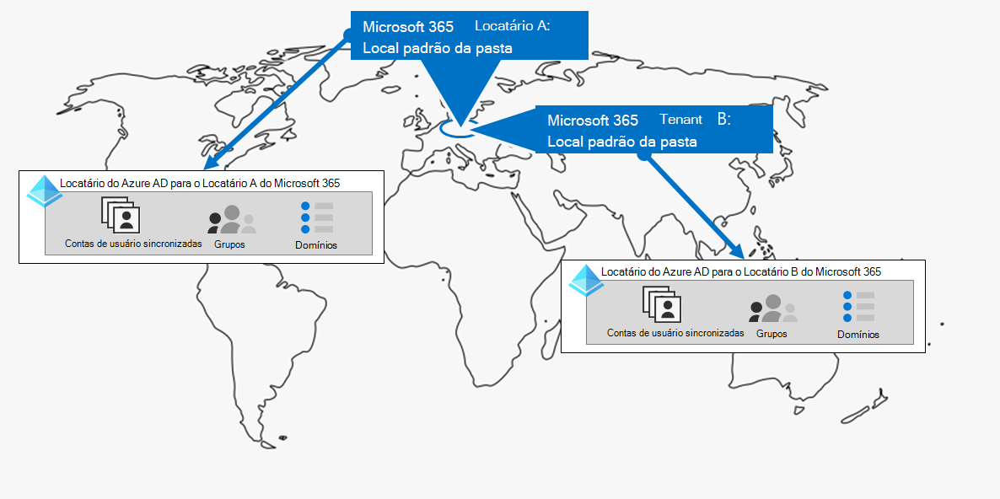
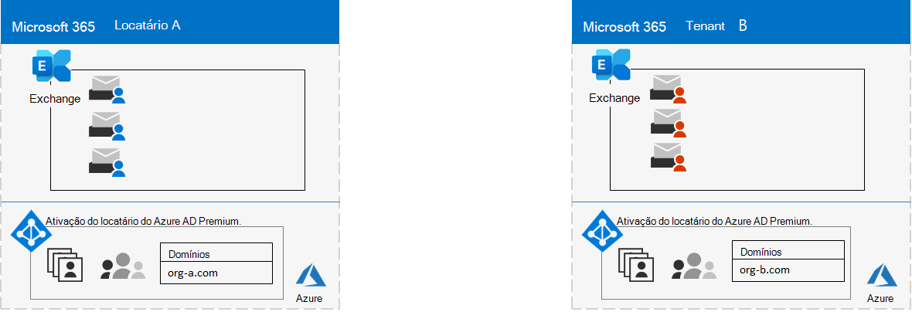
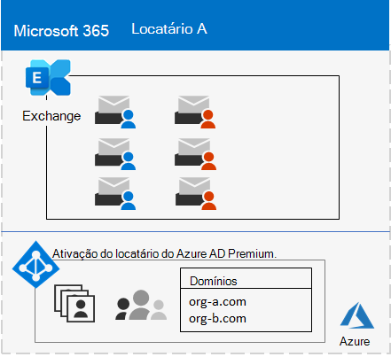
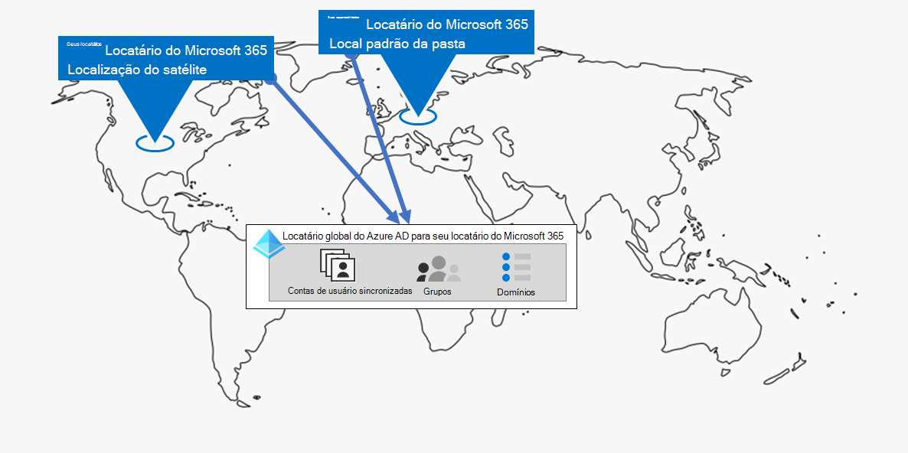
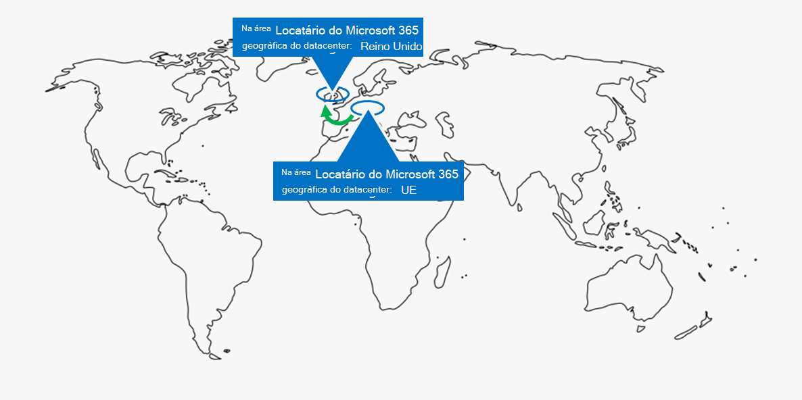
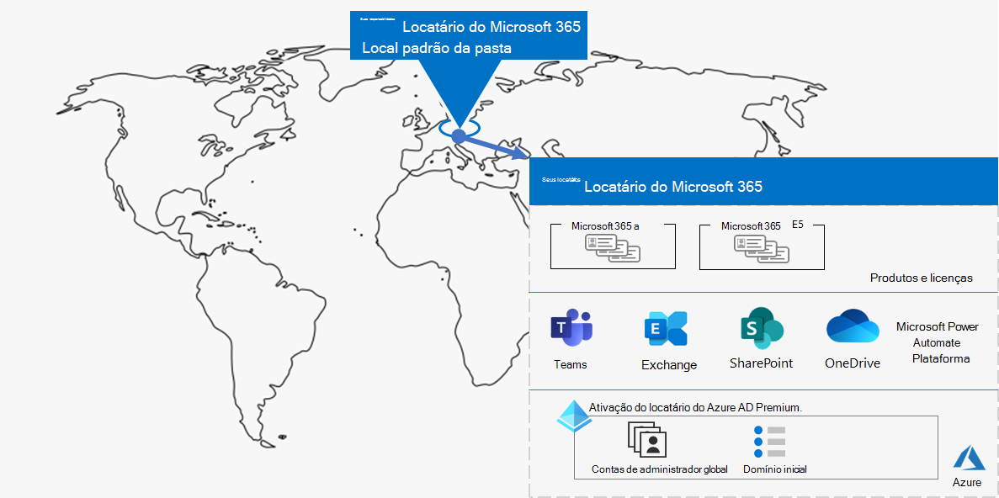

# Etapa 1.Step 1. Seus locatários do Microsoft 365 para empresasYour Microsoft 365 for enterprise tenants

Uma de suas primeiras decisões de locatário é quantas ter.One of your first tenant decisions is how many to have. Cada locatário do Microsoft 365 é distinto, exclusivo e separado de todos os outros locatários do Microsoft 365.Each Microsoft 365 tenant is distinct, unique, and separate from all other Microsoft 365 tenants. O locatário correspondente do Azure AD também é distinto, exclusivo e separado de todos os outros locatários do Microsoft 365.It’s corresponding Azure AD tenant is also distinct, unique, and separate from all other Microsoft 365 tenants.

## Locatário únicoSingle tenant
Ter um único locatário simplifica muitos aspectos do uso do Microsoft 365 pela sua organização.Having a single tenant simplifies many aspects of your organization’s use of Microsoft 365. Um único locatário significa um único locatário do Azure AD com um único conjunto de contas, grupos e políticas.A single tenant means a single Azure AD tenant with a single set of accounts, groups, and policies. Permissões e compartilhamento de recursos em toda a organização podem ser feitas por meio deste provedor de identidade central.Permissions and sharing of resources across your organization can be done through this central identity provider.

Um único locatário oferece a melhor experiência de colaboração e produtividade de recursos e simplificada para seus usuários.A single tenant provides the most feature-rich and simplified collaboration and productivity experience for your users.

Veja um exemplo mostrando o local padrão e o locatário do Azure AD de um locatário do Microsoft 365.Here is an example showing the default location and Azure AD tenant of a Microsoft 365 tenant.

## Vários locatáriosMultiple tenants

Há muitos motivos para sua organização ter vários locatários:There are many reasons why your organization could have multiple tenants:

- Isolamento administrativoAdministrative isolation
- IT descentralizadoDecentralized IT
- Decisões históricasHistorical decisions
- Fusões, aquisições ou destituresMergers, acquisitions, or divestitures
- Separação clara da identidade visual para organizações de conglomeradosClear separation of branding for conglomerate organizations
- Locatários de pré-produção, teste ou área de trabalhoPre-production, test, or sandbox tenants

Aqui está um exemplo de uma organização que tem dois locatários (Locatário A e Locatário B) na mesma área geográfica de datacenter padrão.Here is an example of an organization that has two tenants (Tenant A and Tenant B) in the same default datacenter geo. Cada locatário como um locatário separado do Azure AD.Each tenant as a separate Azure AD tenant.

Quando você tem vários locatários, há restrições e considerações adicionais ao gere-los e fornecer serviços aos seus usuários.When you have multiple tenants, there are restrictions and additional considerations when managing them and providing services to your users.

### Colaboração entre locatáriosInter-tenant collaboration

Se você quiser que os usuários colaborem com mais eficiência em diferentes locatários do Microsoft 365 de maneira segura, as opções de colaboração entre locatários incluem o uso de um local central para arquivos e conversas, o compartilhamento de calendários, o uso de mensagens de IM, chamadas de áudio/vídeo para comunicação e a segurança do acesso a recursos e aplicativos.If you want your users to collaborate more effectively across different Microsoft 365 tenants in a secure manner, inter-tenant collaboration options include using a central location for files and conversations, sharing calendars, using IM, audio/video calls for communication, and securing access to resources and applications.

Para saber mais, confira a colaboração entre locatários do [Microsoft 365.](../enterprise/microsoft-365-inter-tenant-collaboration.md)For more information, see [Microsoft 365 inter-tenant collaboration](../enterprise/microsoft-365-inter-tenant-collaboration.md).

### Migração de caixa de correio entre locatários (visualização)Cross-tenant mailbox migration (preview)

Antes da migração de caixa de correio entre locatários (na visualização), ao mover as caixas de correio do Exchange Online entre locatários, você precisa desemlocar completamente uma caixa de correio de usuário de seu locatário atual (o locatário de origem) para o local e, em seguida, abordá-las a um novo locatário (o locatário de destino).Prior to cross-tenant mailbox migration (in preview), when moving Exchange Online mailboxes between tenants, you have to completely offboard a user mailbox from their current tenant (the source tenant) to on-premises and then onboard them to a new tenant (the target tenant). Com o novo recurso de migração de caixa de correio entre locatários, os administradores de locatários nos locatários de origem e de destino podem mover caixas de correio entre os locatários com dependências mínimas de infraestrutura em seus sistemas locais.With the new cross-tenant mailbox migration feature, tenant administrators in both source and target tenants can move mailboxes between the tenants with minimal infrastructure dependencies in their on-premises systems. Isso elimina a necessidade de remoção e integração de caixas de correio.This removes the need to off-board and onboard mailboxes.

Aqui estão dois locatários de exemplo e suas caixas de correio antes da migração de caixa de correio entre locatários.Here are two example tenants and their mailboxes before cross-tenant mailbox migration.

Nesta ilustração, dois locatários separados têm seus próprios domínios e conjunto de caixas de correio do Exchange.In this illustration, two separate tenants have their own domains and set of Exchange mailboxes.

Aqui está o locatário de destino (Locatário A) após a migração de caixa de correio entre locatários.Here is the target tenant (Tenant A) after cross-tenant mailbox migration.

Nesta ilustração, um único locatário tem domínios e ambos os conjuntos de caixas de correio do Exchange.In this illustration, a single tenant has both domains and both sets of Exchange mailboxes.

Para obter mais informações, consulte [Migração de caixa de correio entre locatários.](../enterprise/cross-tenant-mailbox-migration.md)For more information, see [Cross-tenant mailbox migration](../enterprise/cross-tenant-mailbox-migration.md).

### Migrações de locatário-para-locatárioTenant-to-tenant migrations

Há várias abordagens arquitetônicas para fusões, aquisições, desaquetes e outros cenários que podem levar você a migrar um locatário existente do Microsoft 365 para um novo locatário.There are several architectural approaches for mergers, acquisitions, divestitures, and other scenarios that might lead you to migrate an existing Microsoft 365 tenant to a new tenant. 

Para obter orientações detalhadas, confira migrações de locatário para locatário do [Microsoft 365.](../enterprise/microsoft-365-tenant-to-tenant-migrations.md)For detailed guidance, see [Microsoft 365 tenant-to-tenant migrations](../enterprise/microsoft-365-tenant-to-tenant-migrations.md).

## Multi-Geo para um locatárioMulti-Geo for a tenant

Com o Microsoft 365 Multi-Geo, você pode provisionar e armazenar dados em repouso em outras localizações geográficas do datacenter que escolheu para atender aos requisitos de residência de dados e, ao mesmo tempo, desbloquear sua lançamento global de experiências modernas de produtividade para seus funcionários.With Microsoft 365 Multi-Geo, you can provision and store data at rest in the other datacenter geo locations that you've chosen to meet data residency requirements, and at the same time unlock your global rollout of modern productivity experiences to your workers.

Em um ambiente multi-geo, seu locatário do Microsoft 365 consiste em um local padrão ou central onde sua assinatura do Microsoft 365 foi originalmente criada e um ou mais locais de satélite.In a Multi-Geo environment, your Microsoft 365 tenant consists of a default or central location where your Microsoft 365 subscription was originally created and one or more satellite locations. Em um locatário multi-geo, as informações sobre localizações geográficas, grupos e informações do usuário são mestre em um locatário global do Azure AD.In a multi-geo tenant, the information about geo locations, groups, and user information is mastered in a global Azure AD tenant. Como as informações do locatário são centralmente e sincronizadas em cada localização geográfica, as experiências de colaboração envolvendo qualquer pessoa da sua empresa são compartilhadas entre os locais.Because your tenant information is mastered centrally and synchronized into each geo location, collaboration experiences involving anyone from your company are shared across the locations.

Aqui está um exemplo de uma organização que tem sua localização padrão na Europa e uma localização satélite na América do Norte.Here is an example of an organization that has its default location in Europe and a satellite location in North America. Ambos os locais compartilham o mesmo locatário global do Azure AD para o único locatário do Microsoft 365.Both locations share the same global Azure AD tenant for the single Microsoft 365 tenant.

Para mais informações, consulte [Microsoft 365 Multi-Geo](../enterprise/microsoft-365-multi-geo.md).For more information, see [Microsoft 365 Multi-Geo](../enterprise/microsoft-365-multi-geo.md).

## Movendo os dados principais para uma nova área geográfica de datacenterMoving core data to a new datacenter geo

A Microsoft continua a abrir novas áreas geográficas de datacenter para os serviços do Microsoft 365.Microsoft continues to open new datacenter geos for Microsoft 365 services. Essas novas áreas geográficas de datacenter adicionam capacidade e recursos de computação para dar suporte à demanda contínua do cliente e ao crescimento do uso.These new datacenter geos add capacity and compute resources to support our ongoing customer demand and usage growth. Além disso, as novas áreas geográficas do datacenter oferecem residência de dados na área geográfica para dados principais do cliente.Additionally, the new datacenter geos offer in-geo data residency for core customer data.

Embora abrir uma nova área geográfica de datacenter não a impacte e seus dados principais armazenados em uma área geográfica de datacenter já existente, a Microsoft permite que você solicite uma migração antecipada dos principais dados do cliente da sua organização em repouso para uma nova área geográfica de datacenter.Although opening a new datacenter geo does not impact you and your core data stored in an already existing datacenter geo, Microsoft allows you to request an early migration of your organization's core customer data at rest to a new datacenter geo.

Aqui está um exemplo em que um locatário do Microsoft 365 foi movido do datacenter da União Europeia (UE) para aquele localizado no Reino Unido (REINO UNIDO).Here is an example in which a Microsoft 365 tenant was moved from the European Union (EU) datacenter geo to the one located in the United Kingdom (UK).

Para saber mais, confira Movendo os dados principais para a nova área geográfica do [datacenter do Microsoft 365.](../enterprise/moving-data-to-new-datacenter-geos.md)For more information, see [Moving core data to new Microsoft 365 datacenter geos](../enterprise/moving-data-to-new-datacenter-geos.md).

## Produtos e licenças para um locatárioProducts and licenses for a tenant

O locatário do Microsoft 365 é criado quando você compra seu primeiro produto, como o Microsoft 365 E3.Your Microsoft 365 tenant gets created when you purchase your first product, such as Microsoft 365 E3. Junto com o produto estão licenças, que são cobradas uma taxa mensal ou anual.Along with the product are licenses, which are charged a monthly or annual fee. Em seguida, um administrador atribui uma licença disponível de um de seus produtos a uma conta de usuário, diretamente ou por meio da associação a um grupo.An administrator then assigns an available license from one of your products to a user account, either directly or through group membership. Dependendo das necessidades comerciais da sua organização, você pode ter um conjunto de produtos, cada um com seu próprio pool de licenças.Depending on your organization's business needs, you might have a set of products, each with their own pool of licenses. 

Determinar o conjunto de produtos e o número de licenças para cada um requer algum planejamento para:Determining the set of products and the number of licenses for each requires some planning to:

- Verifique se você tem licenças suficientes para as contas de usuário que precisam de recursos avançados.Ensure you have enough licenses for the user accounts that need advanced features.
- Impedir que você ficar sem licenças ou ter muitas licenças não atribuídas, com base nas alterações no pessoal da sua organização.Prevent you from running out of licenses or having too many unassigned licenses, based on changes in staffing at your organization.

## Resultados da Etapa 1Results of Step 1

Para os locatários do Microsoft 365 para empresas, você determinou:For your Microsoft 365 for enterprise tenants, you have determined:

- Quantos locatários você tem ou precisa.How many tenants you have or need.
- Para cada locatário, quais produtos e licenças devem ser comprados.For each tenant, which products and licenses must be purchased.
- Se um locatário precisa ser multi-geo para atender aos requisitos de residência de dados.Whether a tenant needs to be Multi-Geo to comply with data residency requirements.
- Se você precisa configurar a colaboração entre locatários.Whether you need to set up inter-tenant collaboration.
- Se você precisa migrar um locatário para outro.Whether you need to migrate one tenant to another.
- Se você precisa mover os dados principais de uma área geográfica de datacenter para uma nova.Whether you need to move core data from one datacenter geo to new one.

Aqui está um exemplo de um novo locatário.Here is an example of a new tenant.

Nesta ilustração, o locatário tem:In this illustration, the tenant has:

- Um local padrão correspondente a um datacenter do Microsoft 365.A default location corresponding to a Microsoft 365 datacenter geo.
- Um conjunto de produtos e licenças.A set of products and licenses.
- O conjunto de aplicativos de produtividade na nuvem, alguns dos quais são específicos de produtos.The set of cloud productivity apps, some of which are specific to products.
- Um locatário do Azure AD que contém contas de administrador global e um nome de domínio DNS inicial.An Azure AD tenant that contains global administrator accounts and an initial DNS domain name.

À medida que avançarmos pelas etapas adicionais desta solução, criaremos essa figura.As we move through the additional steps of this solution, we will build out this figure.

## Manutenção contínua para locatáriosOngoing maintenance for tenants

Em uma base contínua, talvez seja necessário:On an ongoing basis, you might need to:

- Adicione um novo locatário.Add a new tenant.
- Adicione novos produtos a um locatário com um número inicial de licenças.Add new products to a tenant with an initial number of licenses.
- Altere o conjunto de licenças de um produto em um locatário para ajustar para alterar os requisitos da equipe.Change the set of licenses for a product in a tenant to adjust for changing staff requirements.
- Mova seus dados principais de um locatário para uma nova localização geográfica do datacenter.Move your core data from a tenant to a new datacenter geo location.
- Adicione multi-geo para requisitos de residência de dados.Add Multi-Geo for data residency requirements.
- Configurar a colaboração entre locatários.Set up inter-tenant collaboration.

## Próxima etapaNext step

Continue com [a rede](tenant-management-networking.md) para fornecer rede ideal de seus funcionários para os serviços de nuvem do Microsoft 365.Continue with [networking](tenant-management-networking.md) to provide optimal networking from your workers to Microsoft 365 cloud services.
