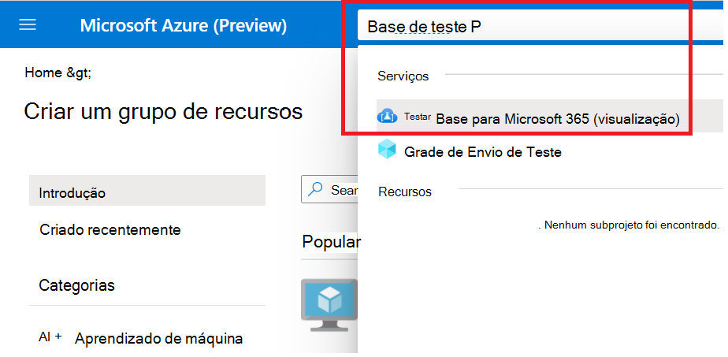
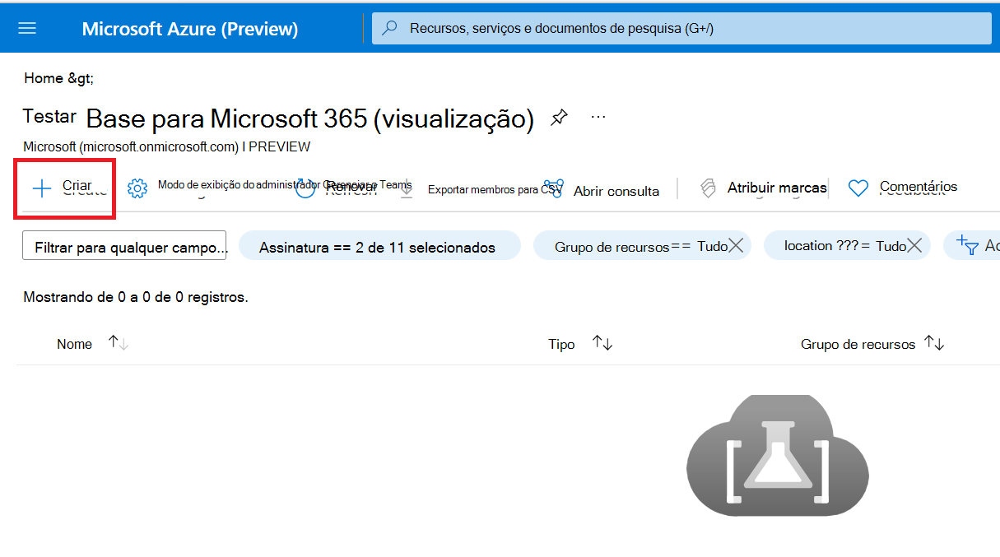
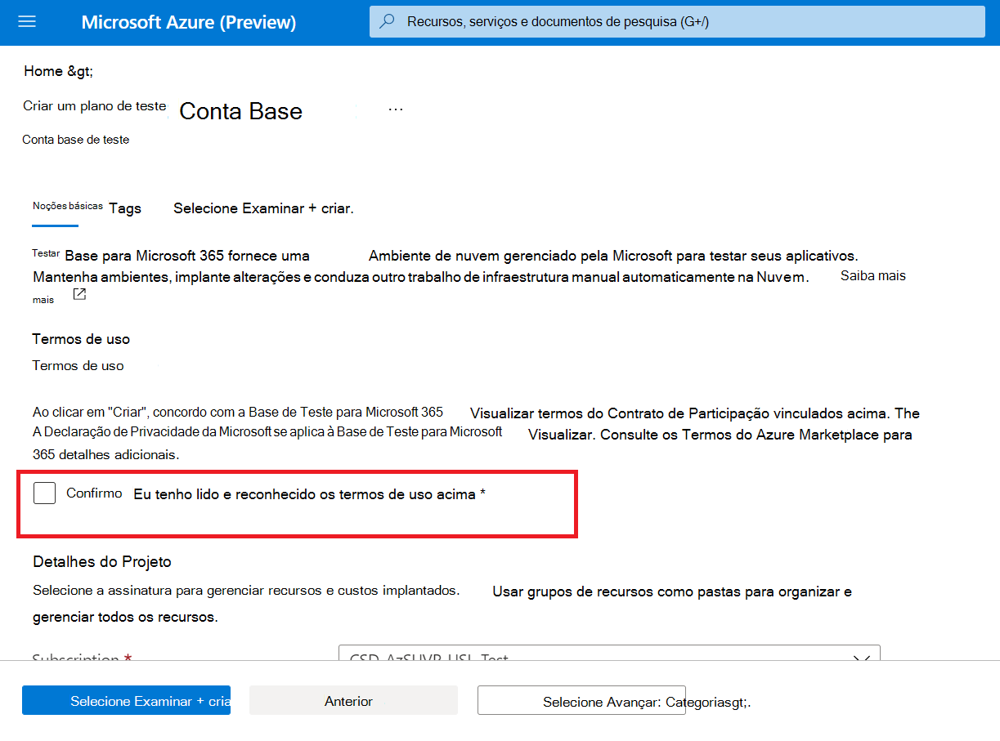
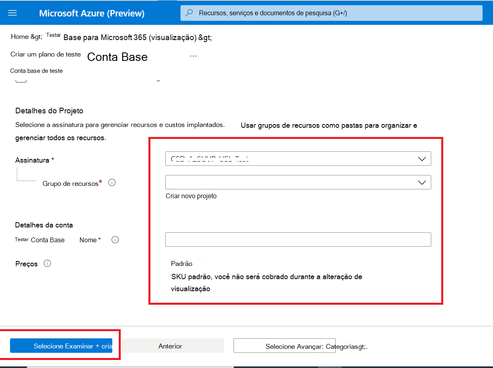

# <a name="step-1-create-a-test-base-account"></a><span data-ttu-id="b35a1-103">Etapa 1: Criar uma conta da Base de Teste</span><span class="sxs-lookup"><span data-stu-id="b35a1-103">Step 1: Create a Test Base account</span></span>

<span data-ttu-id="b35a1-104">Se você não tiver uma assinatura do Azure, crie uma [conta gratuita](https://azure.microsoft.com/en-us/free/) antes de começar.</span><span class="sxs-lookup"><span data-stu-id="b35a1-104">If you don't have an Azure subscription, create a [free account](https://azure.microsoft.com/en-us/free/) before you begin.</span></span>

## <a name="enter-details-for-test-base-account"></a><span data-ttu-id="b35a1-105">Insira detalhes da conta base de teste</span><span class="sxs-lookup"><span data-stu-id="b35a1-105">Enter details for test base account</span></span>
 
1. <span data-ttu-id="b35a1-106">Pesquise **'Base de Teste'** no portal do Azure.</span><span class="sxs-lookup"><span data-stu-id="b35a1-106">Search for **'Test Base'** in the Azure portal.</span></span>



2. <span data-ttu-id="b35a1-108">Clique **em 'Adicionar'** para criar uma conta da Base de Teste.</span><span class="sxs-lookup"><span data-stu-id="b35a1-108">Click **'Add'** to create a Test Base account.</span></span>



3.  <span data-ttu-id="b35a1-110">Leia a caixa ```Terms of Use``` de seleção em seguida, para confirmar sua satisfação com ```Terms of Use``` o .</span><span class="sxs-lookup"><span data-stu-id="b35a1-110">Read through the ```Terms of Use``` then select the checkbox to confirm your satisfaction with the ```Terms of Use```.</span></span>



4.  <span data-ttu-id="b35a1-112">Preencha as informações corretas nos seguintes requisitos:</span><span class="sxs-lookup"><span data-stu-id="b35a1-112">Fill in the correct information under the following requirements:</span></span> 
    -   <span data-ttu-id="b35a1-113">Assinatura: Grupo de Recursos</span><span class="sxs-lookup"><span data-stu-id="b35a1-113">Subscription: Resource Group</span></span>
    -   <span data-ttu-id="b35a1-114">Detalhes da Instância: Nome.</span><span class="sxs-lookup"><span data-stu-id="b35a1-114">Instance Details: Name.</span></span>

<span data-ttu-id="b35a1-115">**Atualmente, a Base de Teste oferece suporte apenas à camada Preço Padrão.**</span><span class="sxs-lookup"><span data-stu-id="b35a1-115">**Currently, Test Base only supports Standard Pricing tier.**</span></span>



5.  <span data-ttu-id="b35a1-117">Por fim, clique em ```Review + Create``` Para validar e habilitar sua conta recém-criada.</span><span class="sxs-lookup"><span data-stu-id="b35a1-117">Finally, click on ```Review + Create``` to validate and enable your newly created account.</span></span>

## <a name="next-steps"></a><span data-ttu-id="b35a1-118">Próximas etapas</span><span class="sxs-lookup"><span data-stu-id="b35a1-118">Next steps</span></span>

<span data-ttu-id="b35a1-119">Avance para o próximo artigo para começar com a Etapa 2: **Saiba como carregar seu pacote.**</span><span class="sxs-lookup"><span data-stu-id="b35a1-119">Advance to the next article to get started with Step 2: **Learn how upload your package.**</span></span>
> [!div class="nextstepaction"]
> [<span data-ttu-id="b35a1-120">Próxima etapa</span><span class="sxs-lookup"><span data-stu-id="b35a1-120">Next step</span></span>](uploadApplication.md)

<!---
Add button for next page
-->
