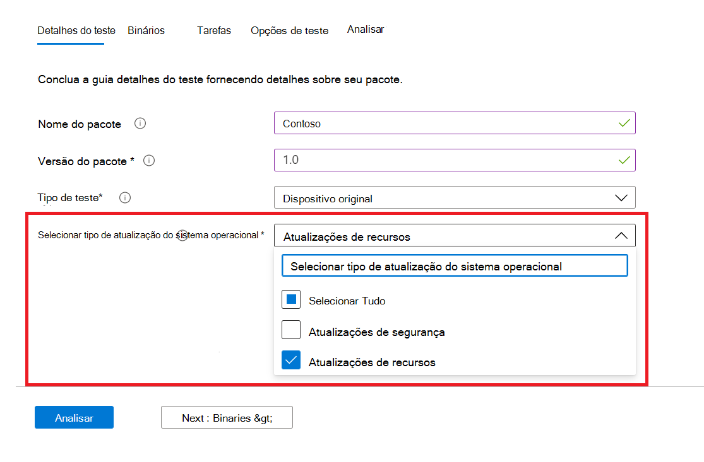
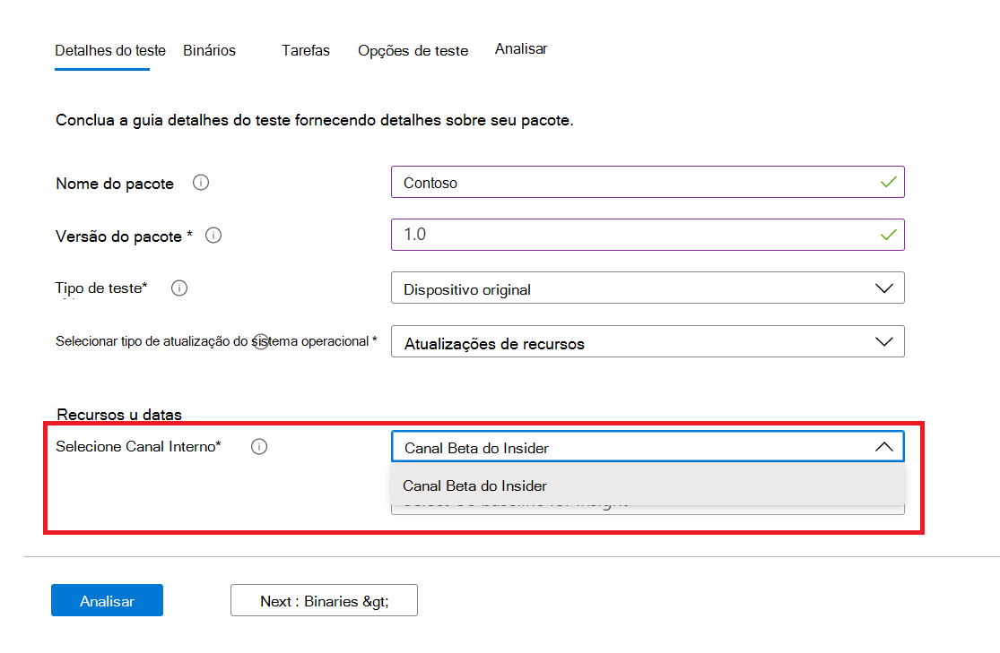
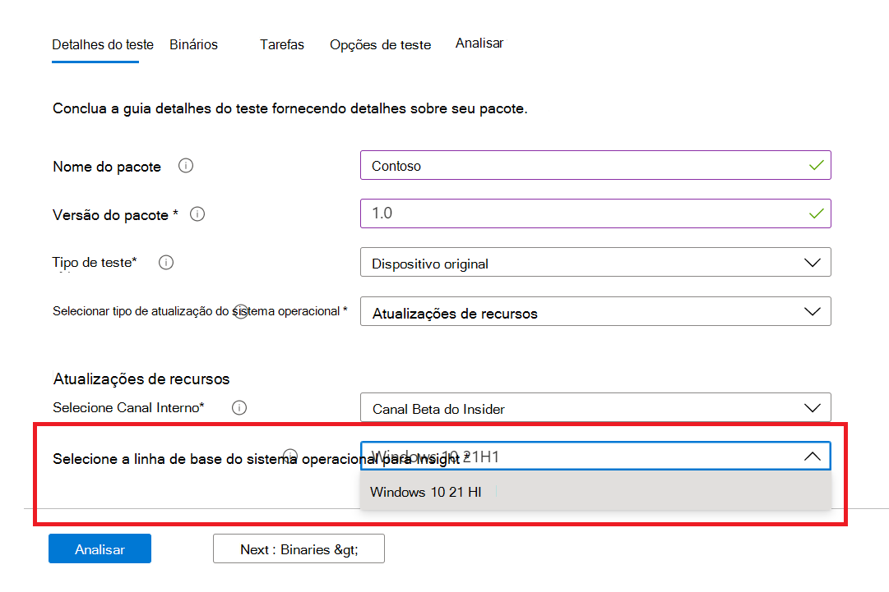

# <a name="windows-feature-update-validation"></a><span data-ttu-id="26c7a-103">Windows Validação de atualização de recursos</span><span class="sxs-lookup"><span data-stu-id="26c7a-103">Windows Feature update validation</span></span>

<span data-ttu-id="26c7a-104">Você precisa de informações sobre como seus aplicativos serão performados com a próxima versão do Windows 10 ou Windows 11 - sem você manter um ambiente para validar novos recursos Windows?</span><span class="sxs-lookup"><span data-stu-id="26c7a-104">Do you need insights on how your applications will perform with the next release of Windows 10 or Windows 11 - without you maintaining an environment to validate new Windows features?</span></span> 

<span data-ttu-id="26c7a-105">Você deseja executar seus testes de validação em Windows builds do Programa Insider em nosso ambiente do Azure?</span><span class="sxs-lookup"><span data-stu-id="26c7a-105">Do you want to run your validation tests against Windows Insider Program builds in our Azure environment?</span></span>

<span data-ttu-id="26c7a-106">**A validação** de atualização de recursos na Base de Teste do M365 pode ajudá-lo a alcançar tudo isso e muito mais!</span><span class="sxs-lookup"><span data-stu-id="26c7a-106">**Feature update** validation on Test Base for M365 can help you achieve all these and more!</span></span>

<span data-ttu-id="26c7a-107">Confira o resumo passo a passo a seguir para saber como acessar esse novo recurso na Base de Teste do serviço M365.</span><span class="sxs-lookup"><span data-stu-id="26c7a-107">Check out the step-by-step outline below to find out how to access this new capability in Test Base for M365 service.</span></span>

<span data-ttu-id="26c7a-108">Para começar a trabalhar na Base de Teste do M365, carregue seus aplicativos (e arquivos relacionados) por meio do portal de integração de ```Feature update validation``` autoatendados.</span><span class="sxs-lookup"><span data-stu-id="26c7a-108">To get started with ```Feature update validation``` in Test Base for M365, upload your applications (and related files) through the self-service onboarding portal.</span></span> 

<span data-ttu-id="26c7a-109">Realçadas abaixo estão as etapas a serem seguidas ao preencher os **detalhes do teste:**</span><span class="sxs-lookup"><span data-stu-id="26c7a-109">Highlighted below are the steps to take as you fill out the **Test details**:</span></span>

1. <span data-ttu-id="26c7a-110">Selecione **Atualização de Recursos** como o tipo de atualização do sistema operacional:</span><span class="sxs-lookup"><span data-stu-id="26c7a-110">Select **Feature Update** as your OS update type:</span></span>



2. <span data-ttu-id="26c7a-112">Escolha o Windows Canal Interno no qual você deseja que seu aplicativo seja validado.</span><span class="sxs-lookup"><span data-stu-id="26c7a-112">Choose the Windows Insider Channel against which you want your application validated.</span></span>  



3. <span data-ttu-id="26c7a-115">Selecione uma versão no mercado do Windows 10 ou Windows 11 como a linha de base do seu teste (e informações resultantes!) e forneça os outros detalhes necessários para integração com êxito do pacote.</span><span class="sxs-lookup"><span data-stu-id="26c7a-115">Select an in-market release of Windows 10 or Windows 11 as the baseline for your test (and resulting insights!) and provide the other details required to onboard your package successfully.</span></span>



4. <span data-ttu-id="26c7a-117">Para exibir os resultados da validação do seu aplicativo em relação às atualizações de recursos Windows 10 pré-lançadas, visite ```Feature Updates Test Results``` o .</span><span class="sxs-lookup"><span data-stu-id="26c7a-117">To view the results from the validation of your application against pre-released Windows 10 feature updates, visit the ```Feature Updates Test Results```.</span></span>


## <a name="next-steps"></a><span data-ttu-id="26c7a-119">Próximas etapas</span><span class="sxs-lookup"><span data-stu-id="26c7a-119">Next steps</span></span>

<span data-ttu-id="26c7a-120">Avance para o próximo artigo para começar a entender a análise de regressão de memória.</span><span class="sxs-lookup"><span data-stu-id="26c7a-120">Advance to the next article to get started with understanding Memory regression analysis.</span></span>
> [!div class="nextstepaction"]
> [<span data-ttu-id="26c7a-121">Próxima etapa</span><span class="sxs-lookup"><span data-stu-id="26c7a-121">Next step</span></span>](memory.md)

<!---
Add button for next page
-->
