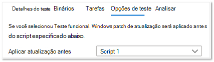

# <a name="functional-testing"></a><span data-ttu-id="67953-103">Testes funcionais</span><span class="sxs-lookup"><span data-stu-id="67953-103">Functional testing</span></span>

<span data-ttu-id="67953-104">Como fornecedor de software, agora você pode executar testes funcionais personalizados, usando a estrutura de teste de sua escolha - por meio da Base de Teste de autoatendança para portal M365.</span><span class="sxs-lookup"><span data-stu-id="67953-104">As a software vendor, you can now perform custom functional tests, using the test framework of your choice - via the self-serve Test Base for M365 portal.</span></span> 

<span data-ttu-id="67953-105">Quando iniciamos inicialmente o serviço, oferecimos os testes iniciais, que é um conjunto pré-definido de testes orientados por scripts padronizados.</span><span class="sxs-lookup"><span data-stu-id="67953-105">When we initially launched the service, we offered the Out-of-box tests, which is a pre-defined set of tests driven through standardized scripting.</span></span> <span data-ttu-id="67953-106">Isso, no entanto, não conseguiu obter cobertura completa de teste para muitos Fornecedores de Software Independentes (ISVs).</span><span class="sxs-lookup"><span data-stu-id="67953-106">This, however, could not achieve full test coverage for many Independent Software Vendors (ISVs).</span></span> 

<span data-ttu-id="67953-107">Portanto, em resposta aos seus comentários, estamos fornecendo aos nossos ISVs a capacidade de carregar testes funcionais automatizados.</span><span class="sxs-lookup"><span data-stu-id="67953-107">Hence, in response to your feedback, we are providing our ISVs with the ability to upload automated functional tests.</span></span>

<span data-ttu-id="67953-108">Para usar esse recurso, siga as etapas abaixo:</span><span class="sxs-lookup"><span data-stu-id="67953-108">To use this feature, follow the steps below:</span></span>

1. <span data-ttu-id="67953-109">Upload seus arquivos (binários, dependências e scripts) como um único .zip pacote.</span><span class="sxs-lookup"><span data-stu-id="67953-109">Upload your files (binaries, dependencies and scripts) as a single .zip package.</span></span>
2. <span data-ttu-id="67953-110">Escolha se deseja reiniciar as Máquinas Virtuais de teste (VMs) em vários pontos de execução.</span><span class="sxs-lookup"><span data-stu-id="67953-110">Choose if you want to reboot the test Virtual Machines (VMs) at various points of execution.</span></span>
3. <span data-ttu-id="67953-111">Gerencie as opções disponíveis para seus scripts.</span><span class="sxs-lookup"><span data-stu-id="67953-111">Manage available options for your scripts.</span></span>
4. <span data-ttu-id="67953-112">Escolha quando aplicar a atualização Windows na VM durante a execução.</span><span class="sxs-lookup"><span data-stu-id="67953-112">Choose when to apply the Windows update on the VM during execution.</span></span>

<span data-ttu-id="67953-113">Descrições detalhadas das etapas acima são realçadas abaixo:</span><span class="sxs-lookup"><span data-stu-id="67953-113">Detailed descriptions of the above steps are highlighted below:</span></span>

<span data-ttu-id="67953-114">**Upload um pacote de teste funcional**</span><span class="sxs-lookup"><span data-stu-id="67953-114">**Upload a functional test package**</span></span>

<span data-ttu-id="67953-115">Para começar, navegue até a página Upload, selecione Upload novo aplicativo em Catálogo de aplicativos no menu de navegação do lado esquerdo do portal base de teste do M365 no Azure.</span><span class="sxs-lookup"><span data-stu-id="67953-115">To get started, navigate to the Upload page, select Upload new application under Application catalog on the left-side navigation menu of the Test Base for M365 portal in Azure.</span></span> <span data-ttu-id="67953-116">A partir daí:</span><span class="sxs-lookup"><span data-stu-id="67953-116">From there:</span></span>

<span data-ttu-id="67953-117">Guia 1 - Insira informações básicas.</span><span class="sxs-lookup"><span data-stu-id="67953-117">Tab 1 - Enter basic information.</span></span> <span data-ttu-id="67953-118">Forneça o nome e a versão do aplicativo.</span><span class="sxs-lookup"><span data-stu-id="67953-118">Provide the name and version of your application.</span></span> <span data-ttu-id="67953-119">Na opção Tipo de teste, selecione ```Functional tests``` .</span><span class="sxs-lookup"><span data-stu-id="67953-119">In the Type of test option, select ```Functional tests```.</span></span> 

<span data-ttu-id="67953-120">*Observe que a opção OOB (Out-of-Box) é necessária por padrão.*</span><span class="sxs-lookup"><span data-stu-id="67953-120">*Note that the Out-of-Box (OOB) option is required by default.*</span></span>


<span data-ttu-id="67953-122">Guia 2 - Upload componentes do pacote carregando um arquivo zip com todo o seu teste (binários, dependências, scripts etc.).</span><span class="sxs-lookup"><span data-stu-id="67953-122">Tab 2 - Upload the components of your package by uploading a zip file with your entire test (binaries, dependencies, scripts etc).</span></span> 

<span data-ttu-id="67953-123">Consulte aka.ms/usl-package-outline para obter detalhes.</span><span class="sxs-lookup"><span data-stu-id="67953-123">See aka.ms/usl-package-outline for details.</span></span> <span data-ttu-id="67953-124">(Observação: os scripts de teste out-of-box e o conteúdo do teste funcional devem ser colocados no mesmo arquivo zip).</span><span class="sxs-lookup"><span data-stu-id="67953-124">(Note: Both the Out-of-Box test scripts and the Functional test contents should be placed into the same zip file).</span></span> <span data-ttu-id="67953-125">Atualmente, o tamanho do arquivo é limitado a 2 GB.</span><span class="sxs-lookup"><span data-stu-id="67953-125">Currently, the file size is limited to 2GB.</span></span>

<span data-ttu-id="67953-126">Guia 3 - Configure as tarefas de teste out-of-box e Funcional.</span><span class="sxs-lookup"><span data-stu-id="67953-126">Tab 3 - Configure the Out-of-Box and Functional test tasks.</span></span> <span data-ttu-id="67953-127">Aqui, escolha os caminhos para os scripts do PowerShell que instalarão, iniciarão, fecharão e desinstalarão seu aplicativo (para Out-of-Box), bem como os caminhos para todos os scripts personalizados para executar seu teste funcional.</span><span class="sxs-lookup"><span data-stu-id="67953-127">Here, choose the path(s) to the PowerShell scripts that will install, launch, close, and uninstall your application (for Out-of-Box) as well as the path(s) to all your custom scripts to perform your functional test.</span></span> <span data-ttu-id="67953-128">**(Observação: um script para desinstalar seu aplicativo é opcional).**</span><span class="sxs-lookup"><span data-stu-id="67953-128">**(Note: A script to uninstall your application is optional).**</span></span>

<span data-ttu-id="67953-129">Atualmente, você pode carregar entre 1 e 8 scripts para seus testes funcionais.</span><span class="sxs-lookup"><span data-stu-id="67953-129">Currently, you can upload between 1 and 8 scripts for your functional tests.</span></span> <span data-ttu-id="67953-130">(Comentário amavelmente nesta postagem se você precisar de mais scripts!)</span><span class="sxs-lookup"><span data-stu-id="67953-130">(Kindly comment on this post if you need more scripts!)</span></span>


<span data-ttu-id="67953-132">(Opcional) Configure uma reinicialização após a instalação.</span><span class="sxs-lookup"><span data-stu-id="67953-132">(Optional) Configure a restart after installation.</span></span> <span data-ttu-id="67953-133">Alguns aplicativos exigem uma reinicialização após a instalação.</span><span class="sxs-lookup"><span data-stu-id="67953-133">Some applications require a restart after installation.</span></span> 

<span data-ttu-id="67953-134">Selecione o Script específico na guia Tarefas se quiser que uma reinicialização seja conduzida após ```Reboot After Execution``` a execução desse script.</span><span class="sxs-lookup"><span data-stu-id="67953-134">Select ```Reboot After Execution``` for the specific Script in the Tasks tab if you would like a restart to be conducted after the execution of that script.</span></span>

<span data-ttu-id="67953-135">Guia 4 - Escolha quando a atualização de Windows for instalada: O aplicativo do patch de atualização Windows é feito antes de qualquer script de sua escolha.</span><span class="sxs-lookup"><span data-stu-id="67953-135">Tab 4 - Choose when the Windows update gets installed: The application of the Windows Update patch is done before any script of your choice.</span></span> <span data-ttu-id="67953-136">É recomendável instalar uma atualização Windows após a instalação do aplicativo para imitar de perto os cenários de uso do aplicativo no mundo real.</span><span class="sxs-lookup"><span data-stu-id="67953-136">It is recommended that you install a Windows update after the application's installation to closely mimic your real-world application use scenarios.</span></span>



<span data-ttu-id="67953-138">Guia 5 - Revisar e criar o pacote.</span><span class="sxs-lookup"><span data-stu-id="67953-138">Tab 5 - Review and create the package.</span></span> <span data-ttu-id="67953-139">Depois de concluir as etapas listadas acima, selecione ```Create``` para concluir o processo de carregamento.</span><span class="sxs-lookup"><span data-stu-id="67953-139">Once you have completed the steps listed above, select ```Create``` to finish the uploading process.</span></span>

<span data-ttu-id="67953-140">Depois que seu pacote tiver sido criado, você poderá verificar o status de verificação do pacote.</span><span class="sxs-lookup"><span data-stu-id="67953-140">Once your package has been created, you can check the verification status of your package.</span></span>

<span data-ttu-id="67953-141">Executemos um teste inicial para instalar, iniciar, fechar e desinstalar seu aplicativo.</span><span class="sxs-lookup"><span data-stu-id="67953-141">We run an initial test to install, launch, close, and uninstall your application.</span></span> <span data-ttu-id="67953-142">Isso nos permite verificar se seu pacote pode ser instalado em nosso serviço sem erros.</span><span class="sxs-lookup"><span data-stu-id="67953-142">This allows us to verify that your package can install on our service error-free.</span></span>

<span data-ttu-id="67953-143">O processo de verificação pode levar até 24 horas.</span><span class="sxs-lookup"><span data-stu-id="67953-143">The verification process could take up to 24 hours.</span></span> <span data-ttu-id="67953-144">Depois que a verificação for concluída, você poderá ver o status no menu, que seria uma ```Manage packages``` das duas entradas:</span><span class="sxs-lookup"><span data-stu-id="67953-144">Once verification is complete, you can see the status in the ```Manage packages``` menu, which would be one of two entries:</span></span>

1. <span data-ttu-id="67953-145">A verificação é bem-sucedida: o pacote será testado automaticamente em relação às atualizações de Windows de pré-lançamento para as builds do sistema operacional selecionadas.</span><span class="sxs-lookup"><span data-stu-id="67953-145">Verification succeeds: The package will be automatically tested against pre-release Windows updates for the OS builds you selected.</span></span>
<span data-ttu-id="67953-146">ou</span><span class="sxs-lookup"><span data-stu-id="67953-146">or</span></span>
2. <span data-ttu-id="67953-147">Falha na verificação: você precisará investigar os motivos da falha, corrigir o problema e carregar seu pacote de volta.</span><span class="sxs-lookup"><span data-stu-id="67953-147">Verification fails: You will need to investigate the reasons for the failure, fix the issue, and re-upload your package.</span></span>

<span data-ttu-id="67953-148">Você também será notificado de qualquer resultado por meio do ícone de notificação no portal do Azure.</span><span class="sxs-lookup"><span data-stu-id="67953-148">You will also be notified of either outcome via the notification icon in the Azure portal.</span></span>
