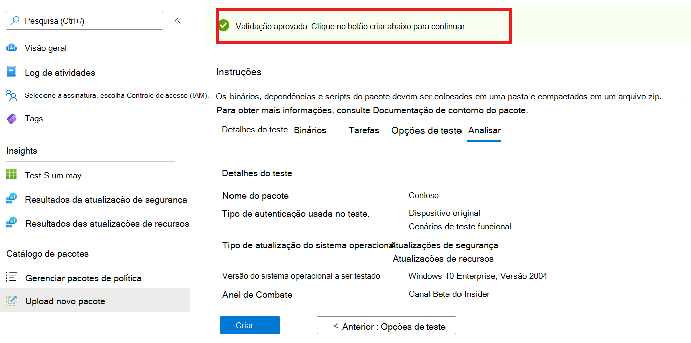
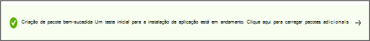

# <a name="step-6-review-your-selections-to-create-your-package"></a><span data-ttu-id="d52ef-103">Etapa 6: Revise suas seleções para criar seu pacote.</span><span class="sxs-lookup"><span data-stu-id="d52ef-103">Step 6: Review your selections to create your package.</span></span>

1.  <span data-ttu-id="d52ef-104">Nesta guia, o serviço exibe os detalhes do teste e executa uma verificação de conclusão rápida.</span><span class="sxs-lookup"><span data-stu-id="d52ef-104">On this tab, the service displays your test details and runs a quick completeness check.</span></span> 

    <span data-ttu-id="d52ef-105">Uma ```Validation passed``` mensagem ou mostra se você pode prosseguir para as ```Validation failed``` próximas etapas ou não.</span><span class="sxs-lookup"><span data-stu-id="d52ef-105">A ```Validation passed``` or ```Validation failed``` message shows whether you can proceed to next steps or not.</span></span>

2.  <span data-ttu-id="d52ef-106">Revise os detalhes do teste e, se satisfeito, clique no ```Create``` botão.</span><span class="sxs-lookup"><span data-stu-id="d52ef-106">Review your test details and if satisfied, click on the ```Create``` button.</span></span> 



3.  <span data-ttu-id="d52ef-108">Isso integra seu pacote ao ambiente base de teste.</span><span class="sxs-lookup"><span data-stu-id="d52ef-108">This will onboard your package to the Test Base environment.</span></span> <span data-ttu-id="d52ef-109">Se o pacote for criado com êxito, um teste automatizado que verificará se o pacote pode ser executado com êxito no Azure será acionado.</span><span class="sxs-lookup"><span data-stu-id="d52ef-109">If your package is successfully created, an automated test which verifys whether your package can be successfully executed on Azure will be triggered.</span></span>



> [!Note]
> <span data-ttu-id="d52ef-111">Você receberá uma notificação do portal do Azure para notificá-lo sobre o sucesso ou falha da verificação do pacote.</span><span class="sxs-lookup"><span data-stu-id="d52ef-111">You will get a notification from the Azure portal to notify you on the success or failure of the package verification.</span></span> 
>
> <span data-ttu-id="d52ef-112">Observe que o processo pode levar até 24 horas, portanto, é provável que sua página da Web tenha tempo de vida se você não estiver ativo nele e, portanto, a notificação não informará sobre a conclusão dessa execução sob demanda.</span><span class="sxs-lookup"><span data-stu-id="d52ef-112">Please note that the process can take up to 24 hours, so it is likely your webpage will timeout if you are not active on it and hence, the notification will not inform you of the completion of this on-demand run.</span></span> 

  - <span data-ttu-id="d52ef-113">Se isso acontecer, você poderá exibir o status do pacote na ```Manage packages``` guia.</span><span class="sxs-lookup"><span data-stu-id="d52ef-113">Peradventure this happens, you can view the status of your package on the ```Manage packages``` tab.</span></span>


  - <span data-ttu-id="d52ef-115">Para testes bem-feitos, seus resultados podem ser vistos por meio dos , e páginas em intervalos agendados, geralmente começando alguns dias após ```Test Summary``` ```Security Updates Results``` o ```Feature Updates Results``` carregamento.</span><span class="sxs-lookup"><span data-stu-id="d52ef-115">For succesful tests, their results can be seen via the ```Test Summary```, ```Security Updates Results``` and ```Feature Updates Results``` pages at scheduled intervals, often starting a few days after your upload.</span></span>
  
  - <span data-ttu-id="d52ef-116">Embora tenha falhado nos testes, exige que você carregue um novo pacote.</span><span class="sxs-lookup"><span data-stu-id="d52ef-116">While failed tests, require you to upload a new package.</span></span> 
  
    <span data-ttu-id="d52ef-117">Você pode baixar o ```test logs``` para análise mais detalhada das páginas ' e ```Security update results``` ```Feature updates results``` .</span><span class="sxs-lookup"><span data-stu-id="d52ef-117">You can download the ```test logs``` for further analysis from the ‘```Security update results``` and ```Feature updates results``` pages.</span></span>

  - <span data-ttu-id="d52ef-118">Se você experimentar falhas de teste repetidas, entre em contato testbasepreview@microsoft.com com detalhes do seu erro.</span><span class="sxs-lookup"><span data-stu-id="d52ef-118">If you experience repeated test failures, please reach out to testbasepreview@microsoft.com with details of your error.</span></span> 

## <a name="next-steps"></a><span data-ttu-id="d52ef-119">Próximas etapas</span><span class="sxs-lookup"><span data-stu-id="d52ef-119">Next steps</span></span>

<span data-ttu-id="d52ef-120">Descubra nossas Diretrizes de Conteúdo por meio do link abaixo.</span><span class="sxs-lookup"><span data-stu-id="d52ef-120">Discover our Content Guidelines via the link below.</span></span>
> [!div class="nextstepaction"]
> [<span data-ttu-id="d52ef-121">Próxima etapa</span><span class="sxs-lookup"><span data-stu-id="d52ef-121">Next step</span></span>](contentguideline.md)
