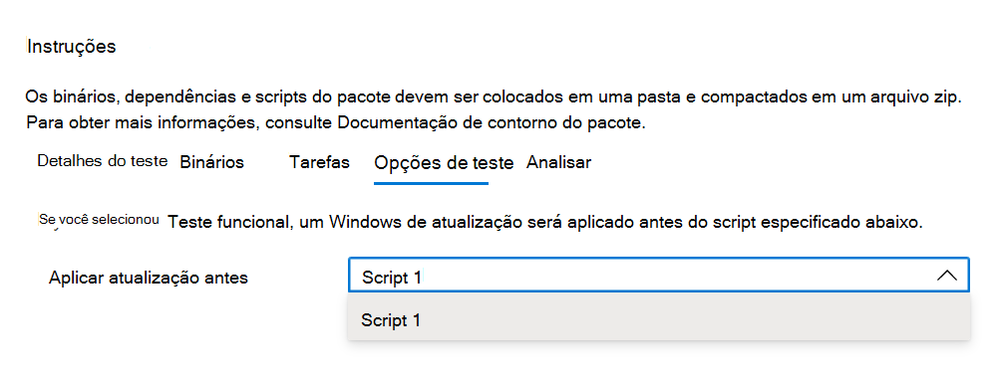

# <a name="step-5-choose-your-test-options"></a>Etapa 5: Escolha suas opções de teste. 

A guia é para usuários que desejam realizar testes funcionais para indicar quando o patch de atualização do Windows deve ser aplicado na sequência de execução de seus scripts de ```Test Options``` teste funcionais.



Selecione _**Revisar**_ para navegar até a próxima guia e revise suas opções de teste selecionadas.

## <a name="next-steps"></a>Próximas etapas

Detalhes da etapa do aninhamento podem ser vistos no próximo artigo por meio do link abaixo:
> [!div class="nextstepaction"]
> [Próxima etapa](review.md)
