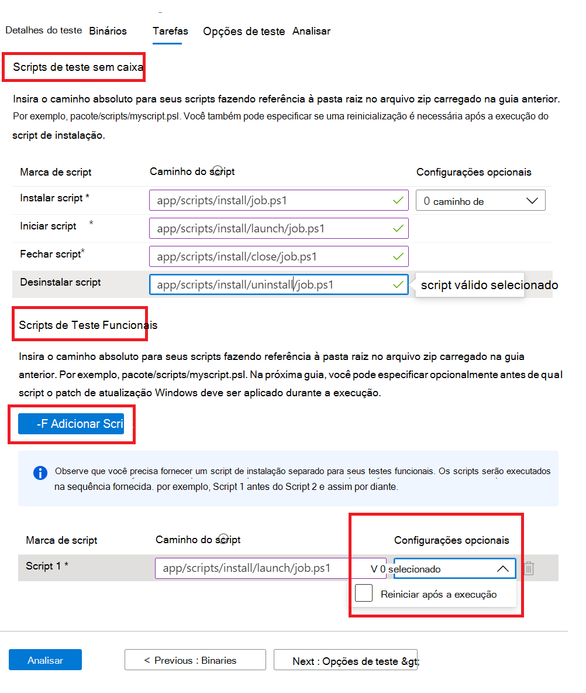

# <a name="step-4-the-tasks-tab"></a><span data-ttu-id="aba41-103">Etapa 4: a guia Tarefas</span><span class="sxs-lookup"><span data-stu-id="aba41-103">Step 4: The tasks tab</span></span>

<span data-ttu-id="aba41-104">Na guia tarefas, você deve fornecer os caminhos para seus scripts de teste que estão na pasta zip que você carregou na guia binários.</span><span class="sxs-lookup"><span data-stu-id="aba41-104">On the tasks tab, you are expected to provide the paths to your test scripts which are in the zip folder you uploaded under the binaries tab.</span></span>

  - <span data-ttu-id="aba41-105">**Scripts de teste de caixa in-locar:** Digite os caminhos relativos para a instalação, início, fechamento e desinstalação de scripts.</span><span class="sxs-lookup"><span data-stu-id="aba41-105">**Out of Box Test Scripts:** Type in the relative paths to your install, launch, close and uninstall scripts.</span></span> <span data-ttu-id="aba41-106">Você também tem a opção de selecionar configurações adicionais para o script de instalação.</span><span class="sxs-lookup"><span data-stu-id="aba41-106">You also have the option to select additional settings for the install script.</span></span>
  - <span data-ttu-id="aba41-107">**Scripts de teste funcionais:** Digite o caminho relativo para cada script de teste funcional carregado.</span><span class="sxs-lookup"><span data-stu-id="aba41-107">**Functional Test Scripts:** Type in the relative path to each functional test script uploaded.</span></span> <span data-ttu-id="aba41-108">Scripts de teste funcionais adicionais podem ser adicionados usando o ```Add Script``` botão.</span><span class="sxs-lookup"><span data-stu-id="aba41-108">Additional functional test scripts can be added using the ```Add Script``` button.</span></span> <span data-ttu-id="aba41-109">Você precisa de no mínimo um (1) script e pode adicionar até oito (8) scripts de teste funcionais.</span><span class="sxs-lookup"><span data-stu-id="aba41-109">You need a minimum of one (1) script and can add up to eight (8) functional test scripts.</span></span> 
  
    <span data-ttu-id="aba41-110">Os scripts são executados em sequência de carregamento e uma falha em um script específico impedirá a execução de scripts subsequentes.</span><span class="sxs-lookup"><span data-stu-id="aba41-110">The scripts are run in upload sequence and a failure in a particular script will stop subsequent scripts from executing.</span></span>
    <span data-ttu-id="aba41-111">Você também tem a opção de selecionar configurações adicionais para cada script fornecido.</span><span class="sxs-lookup"><span data-stu-id="aba41-111">You also have the option of selecting additional settings for each script provided.</span></span>

## <a name="set-script-path"></a><span data-ttu-id="aba41-112">Definir caminho de script</span><span class="sxs-lookup"><span data-stu-id="aba41-112">Set script path</span></span>



<span data-ttu-id="aba41-114">Exemplo de como fornecer o caminho relativo em uma estrutura de pastas está abaixo:</span><span class="sxs-lookup"><span data-stu-id="aba41-114">Sample of how to provide the relative path on a folder structure is below:</span></span>

<span data-ttu-id="aba41-115">_**Zip_file_uploaded**_</span><span class="sxs-lookup"><span data-stu-id="aba41-115">_**Zip_file_uploaded**_</span></span>
~~~
├── file1.exe

├── ScriptX.ps1

├── folder1

│   ├── file3.exe

│   ├── script.ps1
~~~
  - <span data-ttu-id="aba41-116">**ScriptX.ps1** teria.</span><span class="sxs-lookup"><span data-stu-id="aba41-116">**ScriptX.ps1** would have.</span></span> <span data-ttu-id="aba41-117">_ScriptX.ps1_ como o caminho relativo.</span><span class="sxs-lookup"><span data-stu-id="aba41-117">_ScriptX.ps1_ as the relative path.</span></span>
  - <span data-ttu-id="aba41-118">**Script.ps1** teria _folder1/script.ps1_ como o caminho relativo.</span><span class="sxs-lookup"><span data-stu-id="aba41-118">**Script.ps1** would have _folder1/script.ps1_ as the relative path.</span></span>


## <a name="next-steps"></a><span data-ttu-id="aba41-119">Próximas etapas</span><span class="sxs-lookup"><span data-stu-id="aba41-119">Next steps</span></span>

<span data-ttu-id="aba41-120">Exibir detalhes da guia Opções de Teste no próximo artigo</span><span class="sxs-lookup"><span data-stu-id="aba41-120">View details of the Test Options tab in the next article</span></span> 
> [!div class="nextstepaction"]
> [<span data-ttu-id="aba41-121">Próxima etapa</span><span class="sxs-lookup"><span data-stu-id="aba41-121">Next step</span></span>](testoptions.md)
