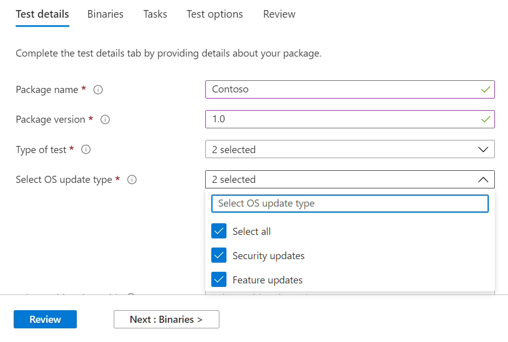
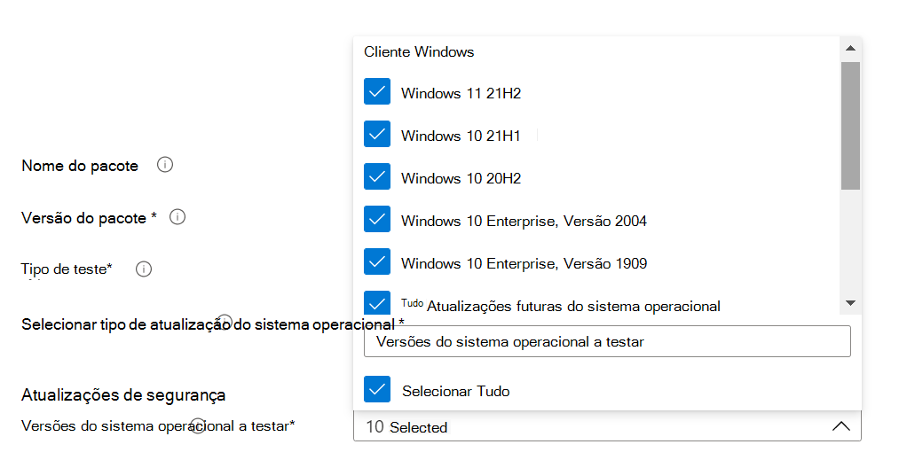
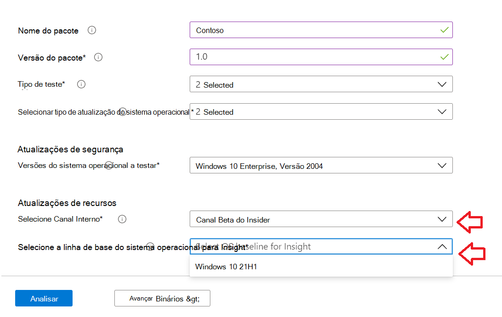
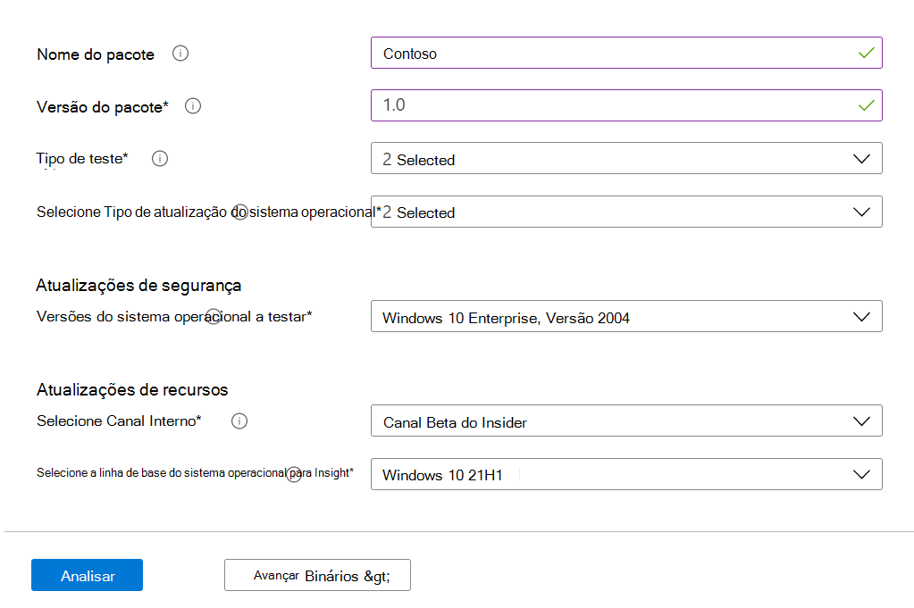

# <a name="step-2-uploading-a-package"></a><span data-ttu-id="55092-103">Etapa 2: Carregar um pacote</span><span class="sxs-lookup"><span data-stu-id="55092-103">Step 2: Uploading a Package</span></span>

<span data-ttu-id="55092-104">Na página Portal da Base de Teste, navegue até a opção 'Upload novo pacote na barra de navegação esquerda, conforme mostrado </span><span class="sxs-lookup"><span data-stu-id="55092-104">On the Test Base portal page, navigate to the ‘Upload new package option on the left navigation bar as shown below: </span></span>

<span data-ttu-id="55092-105">Depois disso, siga as etapas abaixo para carregar um novo pacote.</span><span class="sxs-lookup"><span data-stu-id="55092-105">Once there, follow the steps below to upload a new package.</span></span>

## <a name="enter-details-for-your-package"></a><span data-ttu-id="55092-106">Insira detalhes do pacote</span><span class="sxs-lookup"><span data-stu-id="55092-106">Enter details for your package</span></span>

<span data-ttu-id="55092-107">Na guia Detalhes de teste, digite o nome, a versão e outros detalhes do pacote conforme solicitado.</span><span class="sxs-lookup"><span data-stu-id="55092-107">On the Test details tab, type in your package's name, version and other details as requested.</span></span> 

<span data-ttu-id="55092-108">**Testes fora do box** e **funcional** podem ser feitos por meio deste painel.</span><span class="sxs-lookup"><span data-stu-id="55092-108">**Out-of-Box** and **Functional testing** can be done via this dashboard.</span></span>

<span data-ttu-id="55092-109">As etapas a seguir fornece um guia sobre como preencher os detalhes do pacote:</span><span class="sxs-lookup"><span data-stu-id="55092-109">The steps below provides a guide on how to fill out your package details:</span></span>

1.  <span data-ttu-id="55092-110">**Insira o nome a ser dado ao pacote no ```“Package name``` campo.**</span><span class="sxs-lookup"><span data-stu-id="55092-110">**Enter the name to be given your package in the ```“Package name``` field.**</span></span>

> [!Note]  
> <span data-ttu-id="55092-111">A combinação de nome e versão do pacote inserida deve ser exclusiva em sua organização.</span><span class="sxs-lookup"><span data-stu-id="55092-111">The package name and version combination entered must be unique within your organization.</span></span> <span data-ttu-id="55092-112">Isso é validado pela marca de seleção, conforme mostrado abaixo.</span><span class="sxs-lookup"><span data-stu-id="55092-112">This is validated by the checkmark as shown below.</span></span>
  
  - <span data-ttu-id="55092-113">Se você optar por re-usar o nome de um pacote, o número da versão deverá ser exclusivo (ou seja, nunca foi usado com um pacote com esse nome específico).</span><span class="sxs-lookup"><span data-stu-id="55092-113">If you choose to re-use an package's name, then the version number must be unique (i.e. never been used with an package bearing that particular name).</span></span>
  - <span data-ttu-id="55092-114">Se a combinação do nome do pacote + versão não passar na verificação de exclusividade, você verá uma mensagem de erro que *diz: "O* pacote com essa versão do pacote já existe" .</span><span class="sxs-lookup"><span data-stu-id="55092-114">If the combination of the package name + version does not pass the uniqueness check, you will see an error message which reads, *“Package with this package version already exists”*.</span></span> 


2. <span data-ttu-id="55092-116">**Insira uma versão no campo "Versão do pacote".**</span><span class="sxs-lookup"><span data-stu-id="55092-116">**Enter a version in the “Package version” field.**</span></span>


3.  <span data-ttu-id="55092-118">**Selecione o tipo de teste que você deseja executar neste pacote**</span><span class="sxs-lookup"><span data-stu-id="55092-118">**Select the type of test you want to run on this package**</span></span>

    <span data-ttu-id="55092-119">Um **teste OOB (Out-of-Box)** executa *uma* instalação , *iniciar,* *fechar* e *desinstalar* seu pacote.</span><span class="sxs-lookup"><span data-stu-id="55092-119">An **Out-of-Box (OOB)** test performs an *install*, *launch*, *close* and *uninstall* of your package.</span></span> <span data-ttu-id="55092-120">Após a instalação, a rotina de fechamento de início é repetida 30 vezes antes de uma única desinstalação ser executado.</span><span class="sxs-lookup"><span data-stu-id="55092-120">After the install, the launch-close routine is repeated 30 times before a single uninstall is run.</span></span> 
    
    <span data-ttu-id="55092-121">Este teste OOB fornece telemetria padronizada em seu pacote para comparação entre Windows builds.</span><span class="sxs-lookup"><span data-stu-id="55092-121">This OOB test provides you with standardized telemetry on your package to compare across Windows builds.</span></span>

    <span data-ttu-id="55092-122">Um **teste funcional** executaria seus scripts de teste carregados em seu pacote.</span><span class="sxs-lookup"><span data-stu-id="55092-122">A **Functional test** would execute your uploaded test script(s) on your package.</span></span> <span data-ttu-id="55092-123">Os scripts são executados em sequência de carregamento e uma falha em um script específico impedirá a execução de scripts subsequentes.</span><span class="sxs-lookup"><span data-stu-id="55092-123">The scripts are run in upload sequence and a failure in a particular script will stop subsequent scripts from executing.</span></span>

> [!Note]
> <span data-ttu-id="55092-124">**Todos** os scripts são executados por no máximo 80 minutos.</span><span class="sxs-lookup"><span data-stu-id="55092-124">**All** scripts run for 80 minutes at the most.</span></span> 
    
4.  <span data-ttu-id="55092-125">**Selecione o tipo de atualização do sistema operacional**</span><span class="sxs-lookup"><span data-stu-id="55092-125">**Select the OS update type**</span></span>

   - <span data-ttu-id="55092-126">As "Atualizações de segurança" permitem que seu pacote seja testado em relação a churns incrementais de Windows atualizações de segurança mensais de pré-lançamento.</span><span class="sxs-lookup"><span data-stu-id="55092-126">The ‘Security updates’ enables your package to be tested against incremental churns of Windows pre-release monthly security updates.</span></span> 
   - <span data-ttu-id="55092-127">As "Atualizações de recursos" permitem que seu pacote seja testado em relação Windows de atualizações de recursos bianuais de pré-lançamento do programa Windows Insider.</span><span class="sxs-lookup"><span data-stu-id="55092-127">The ‘Feature updates’ enables your package to be tested against Windows pre-release bi-annual feature updates builds from the Windows Insider Program.</span></span>
<!---
Change to the correct picture
-->


5.  <span data-ttu-id="55092-129">**Selecione as versões do sistema operacional para testes de atualização de segurança.**</span><span class="sxs-lookup"><span data-stu-id="55092-129">**Select the OS version(s) for Security update tests.**</span></span>

<span data-ttu-id="55092-130">Na lista de menus suspensos de seleção multisseleccionada, selecione as versões do sistema operacional Windows o pacote será instalado.</span><span class="sxs-lookup"><span data-stu-id="55092-130">In the multi-select dropdown, select the OS version(s) of Windows your package will be installed on.</span></span> 

  - <span data-ttu-id="55092-131">Para testar seu pacote somente Windows OSes de Cliente, selecione as versões Windows 11 do sistema operacional aplicáveis na lista de menus.</span><span class="sxs-lookup"><span data-stu-id="55092-131">To test your package against Windows Client OSes only, select the applicable Windows 11 OS versions from the menu list.</span></span>
  - <span data-ttu-id="55092-132">Para testar seu pacote somente Windows OSes do Servidor, selecione as versões aplicáveis Windows do sistema operacional do Servidor na lista de menus.</span><span class="sxs-lookup"><span data-stu-id="55092-132">To test your package against Windows Server OSes only, select the applicable Windows Server OS versions from the menu list.</span></span>
  - <span data-ttu-id="55092-133">Para testar seu pacote em relação Windows OSes cliente e servidor, selecione todos os OSes aplicáveis na lista de menus.</span><span class="sxs-lookup"><span data-stu-id="55092-133">To test your package against Windows Client and Server OSes, select all applicable OSes from the menu list.</span></span> 

> [!Note]
> <span data-ttu-id="55092-134">Se você selecionar para testar seu pacote em OSes de servidor e cliente, verifique se o pacote é compatível e pode ser executado em ambos os OSes</span><span class="sxs-lookup"><span data-stu-id="55092-134">If you select to test your package against both Server and Client OSes, please make sure that the package is compatible and can run on both OSes</span></span>



<!---
Change to the correct picture
-->
6.  <span data-ttu-id="55092-136">**Selecione opções para testes de atualização de recursos:**</span><span class="sxs-lookup"><span data-stu-id="55092-136">**Select options for Feature update tests:**</span></span>

  - <span data-ttu-id="55092-137">Na opção "Selecionar Canal Interno", selecione como a com build na qual seus ```Windows Insider Program Channel``` pacotes devem ser testados.</span><span class="sxs-lookup"><span data-stu-id="55092-137">On the option to “Select Insider Channel”, select the ```Windows Insider Program Channel``` as the build which your packages should be tested against.</span></span>
  
    <span data-ttu-id="55092-138">Atualmente, usamos builds lançadas no Canal Beta do Insider.</span><span class="sxs-lookup"><span data-stu-id="55092-138">We currently use builds flighted in the Insider Beta Channel.</span></span>

  - <span data-ttu-id="55092-139">Na opção "Selecionar linha de base do sistema operacional para Insight", selecione a versão Windows do sistema operacional a ser usada como uma linha de base na comparação dos resultados do teste.</span><span class="sxs-lookup"><span data-stu-id="55092-139">On the option to “Select OS baseline for Insight”, select the Windows OS version to be used as a baseline in comparing your test results.</span></span> 

> [!Note]
> <span data-ttu-id="55092-140">Não há suporte para testes de atualização de recursos para OSes de servidor no momento</span><span class="sxs-lookup"><span data-stu-id="55092-140">We DO NOT support Feature update testing for Server OSes at this time</span></span>
<!---
Note to actual note format for markdown
-->
<!---
Change to the correct picture
-->


7.  <span data-ttu-id="55092-142">Uma página de detalhes de teste concluída deve ter a seguinte aparência:</span><span class="sxs-lookup"><span data-stu-id="55092-142">A completed Test details page should look like this:</span></span> 


## <a name="next-steps"></a><span data-ttu-id="55092-144">Próximas etapas</span><span class="sxs-lookup"><span data-stu-id="55092-144">Next steps</span></span>

<span data-ttu-id="55092-145">Nosso próximo artigo aborda Carregar seus Binários em nosso serivce.</span><span class="sxs-lookup"><span data-stu-id="55092-145">Our next article covers Uploading your Binaries to our serivce.</span></span>
> [!div class="nextstepaction"]
> [<span data-ttu-id="55092-146">Próxima etapa</span><span class="sxs-lookup"><span data-stu-id="55092-146">Next step</span></span>](binaries.md)

<!---
Add button for next page
-->

