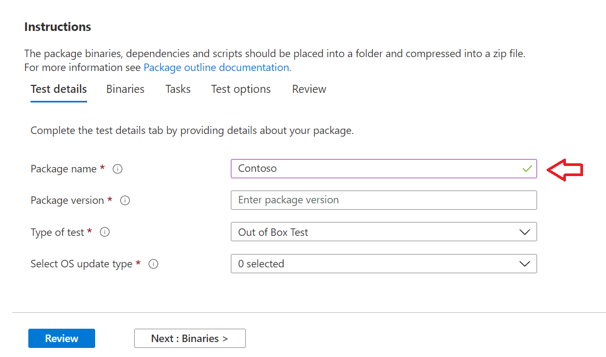

# <a name="step-2-uploading-a-package"></a>Etapa 2: Carregar um pacote

Na página Portal da Base de Teste, navegue até a opção 'Upload novo pacote na barra de navegação esquerda, conforme mostrado 

Depois disso, siga as etapas abaixo para carregar um novo pacote.

## <a name="enter-details-for-your-package"></a>Insira detalhes do pacote

Na guia Detalhes de teste, digite o nome, a versão e outros detalhes do pacote conforme solicitado. 

**Testes fora do box** e **funcional** podem ser feitos por meio deste painel.

As etapas a seguir fornece um guia sobre como preencher os detalhes do pacote:

1.  **Insira o nome a ser dado ao pacote no ```“Package name``` campo.**

> [!Note]  
> A combinação de nome e versão do pacote inserida deve ser exclusiva em sua organização. Isso é validado pela marca de seleção, conforme mostrado abaixo.
  
  - Se você optar por re-usar o nome de um pacote, o número da versão deverá ser exclusivo (ou seja, nunca foi usado com um pacote com esse nome específico).
  - Se a combinação do nome do pacote + versão não passar na verificação de exclusividade, você verá uma mensagem de erro que *diz: "O* pacote com essa versão do pacote já existe" . 



2. **Insira uma versão no campo "Versão do pacote".**


3.  **Selecione o tipo de teste que você deseja executar neste pacote**

    Um **teste OOB (Out-of-Box)** executa *uma* instalação , *iniciar,* *fechar* e *desinstalar* seu pacote. Após a instalação, a rotina de fechamento de início é repetida 30 vezes antes de uma única desinstalação ser executado. 
    
    Este teste OOB fornece telemetria padronizada em seu pacote para comparação entre Windows builds.

    Um **teste funcional** executaria seus scripts de teste carregados em seu pacote. Os scripts são executados em sequência de carregamento e uma falha em um script específico impedirá a execução de scripts subsequentes.

> [!Note]
> **Todos** os scripts são executados por no máximo 80 minutos. 
    
4.  **Selecione o tipo de atualização do sistema operacional**

   - As "Atualizações de segurança" permitem que seu pacote seja testado em relação a churns incrementais de Windows atualizações de segurança mensais de pré-lançamento. 
   - As "Atualizações de recursos" permitem que seu pacote seja testado em relação Windows de atualizações de recursos bianuais de pré-lançamento do programa Windows Insider.
<!---
Change to the correct picture
-->


5.  **Selecione as versões do sistema operacional para testes de atualização de segurança.**

Na lista de menus suspensos de seleção multisseleccionada, selecione as versões do sistema operacional Windows o pacote será instalado. 

  - Para testar seu pacote somente Windows OSes de Cliente, selecione as versões Windows 11 do sistema operacional aplicáveis na lista de menus.
  - Para testar seu pacote somente Windows OSes do Servidor, selecione as versões aplicáveis Windows do sistema operacional do Servidor na lista de menus.
  - Para testar seu pacote em relação Windows OSes cliente e servidor, selecione todos os OSes aplicáveis na lista de menus. 

> [!Note]
> Se você selecionar para testar seu pacote em OSes de servidor e cliente, verifique se o pacote é compatível e pode ser executado em ambos os OSes


<!---
Change to the correct picture
-->
6.  **Selecione opções para testes de atualização de recursos:**

  - Na opção "Selecionar Canal Interno", selecione como a com build na qual seus ```Windows Insider Program Channel``` pacotes devem ser testados.
  
    Atualmente, usamos builds lançadas no Canal Beta do Insider.

  - Na opção "Selecionar linha de base do sistema operacional para Insight", selecione a versão Windows do sistema operacional a ser usada como uma linha de base na comparação dos resultados do teste. 

> [!Note]
> Não há suporte para testes de atualização de recursos para OSes de servidor no momento
<!---
Note to actual note format for markdown
-->
<!---
Change to the correct picture
-->


7.  Uma página de detalhes de teste concluída deve ter a seguinte aparência: 


## <a name="next-steps"></a>Próximas etapas

Nosso próximo artigo aborda Carregar seus Binários em nosso serivce.
> [!div class="nextstepaction"]
> [Próxima etapa](binaries.md)

<!---
Add button for next page
-->

